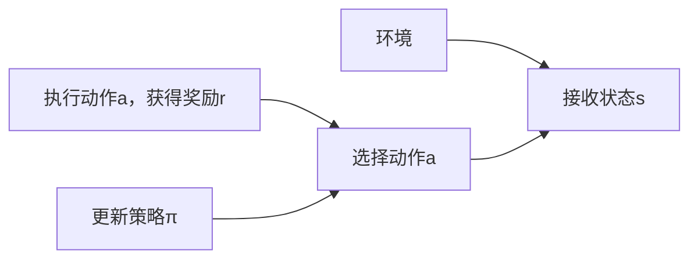

                 


# 如何识别企业的深度强化学习技术优势

## 关键词
- 深度强化学习
- 技术优势
- 企业识别
- 应用场景
- 技术评估

## 摘要
深度强化学习（Deep Reinforcement Learning, DRL）是一种结合深度学习和强化学习的技术，能够在复杂环境中实现自主决策和优化。本文将从技术基础、企业应用场景、技术评估方法、实施策略等方面，系统地介绍如何识别企业的深度强化学习技术优势。通过本文，读者将能够理解DRL的核心原理，掌握其在企业中的应用场景，学习如何评估和选择适合企业需求的DRL技术方案。

---

# 第一部分: 深度强化学习技术基础

## 第1章: 深度强化学习概述

### 1.1 深度强化学习的定义与核心概念

#### 1.1.1 强化学习的基本原理
强化学习（Reinforcement Learning, RL）是一种通过智能体与环境交互来学习策略的方法。智能体通过执行动作，观察环境反馈，逐步优化其决策策略以最大化累计奖励。

#### 1.1.2 深度强化学习的定义
深度强化学习（DRL）是将深度学习与强化学习结合的技术。深度学习用于处理复杂状态空间，强化学习用于优化决策策略。DRL能够处理高维、非线性的状态和动作空间。

#### 1.1.3 DRL与传统机器学习的区别
| 特性 | DRL | 传统机器学习 |
|------|-----|--------------|
| 数据需求 | 需要与环境交互 | 需要大量标注数据 |
| 决策方式 | 基于策略优化 | 基于模式匹配 |
| 应用场景 | 复杂动态环境 | 静态数据模式识别 |

### 1.2 深度强化学习的核心算法

#### 1.2.1 Q-learning算法
Q-learning是一种经典的强化学习算法，通过更新Q值表来记录状态-动作对的最优奖励。

#### 1.2.2 DQN算法
DQN（Deep Q-Network）是第一个将深度学习引入强化学习的算法，通过神经网络近似Q值函数。

#### 1.2.3 PPO算法
PPO（Proximal Policy Optimization）是一种基于策略梯度的强化学习算法，适用于处理高维连续动作空间。

### 1.3 深度强化学习的应用场景

#### 1.3.1 游戏AI
DRL在游戏AI中的应用非常成功，例如AlphaGo通过DRL实现围棋对弈。

#### 1.3.2 机器人控制
DRL可以用于机器人路径规划、避障等任务。

#### 1.3.3 自动驾驶
DRL在自动驾驶中的路径规划和决策控制方面具有重要应用。

## 第2章: 深度强化学习算法原理

### 2.1 DQN算法的数学模型

#### 2.1.1 状态空间S
状态空间是智能体所处环境的所有可能状态。

#### 2.1.2 动作空间A
动作空间是智能体可以执行的所有可能动作。

#### 2.1.3 策略π
策略π是智能体选择动作的规则，可以是确定性或随机性的。

#### 2.1.4 奖励函数R
奖励函数是智能体执行动作后获得的反馈，用于指导策略优化。

#### 2.1.5 损失函数L
DQN的损失函数为：
$$ L = \mathbb{E}_{(s,a,r,s')} [\mathcal{L}(\theta)] $$

### 2.2 算法流程图


### 2.3 算法实现代码
```python
import numpy as np
class DQN:
    def __init__(self, state_space, action_space):
        self.state_space = state_space
        self.action_space = action_space
        # 省略其他代码
    def perceive(self, state, action, reward, next_state):
        # 省略具体实现
    def choose_action(self, state):
        # 省略具体实现
```

## 第3章: 深度强化学习的数学模型与公式

### 3.1 Q-learning算法的数学模型
$$ Q(s,a) = Q(s,a) + \alpha (r + \max Q(s',a') - Q(s,a)) $$

### 3.2 DQN算法的数学模型
$$ \text{损失函数} = \mathbb{E}_{(s,a,r,s')} [\mathcal{L}(\theta)] $$

### 3.3 PPO算法的数学模型
$$ \text{损失函数} = \mathcal{L}_{\text{clip}} = \text{clip}( \frac{P_{\theta}(a|s)}{P_{\theta}(a|s)} ) $$

---

# 第二部分: 企业中的深度强化学习技术应用

## 第4章: 企业中的深度强化学习应用场景

### 4.1 企业资源优化

#### 4.1.1 生产调度优化
通过DRL优化生产流程，提高效率和降低成本。

#### 4.1.2 物流路径优化
利用DRL优化物流路径，降低运输成本和时间。

---

## 第5章: 深度强化学习技术优势识别

### 5.1 技术优势识别方法

#### 5.1.1 技术成熟度评估
评估DRL技术在企业中的成熟度和可靠性。

#### 5.1.2 应用场景匹配度
分析DRL技术是否适用于企业的具体业务场景。

#### 5.1.3 性能对比分析
通过对比实验，评估DRL技术在企业中的实际效果。

---

## 第6章: 企业深度强化学习技术的实施策略

### 6.1 项目管理与实施步骤

#### 6.1.1 项目规划
明确项目目标、范围和实施计划。

#### 6.1.2 技术选型
根据企业需求选择适合的DRL算法和框架。

#### 6.1.3 项目实施
从环境搭建到模型训练，逐步推进项目实施。

### 6.2 项目实施中的注意事项

#### 6.2.1 数据质量
确保训练数据的多样性和代表性。

#### 6.2.2 算法调优
优化模型超参数和架构，提高性能。

#### 6.2.3 系统集成
将DRL技术与企业现有系统集成，确保兼容性和稳定性。

---

## 第7章: 深度强化学习技术的未来发展趋势

### 7.1 技术趋势

#### 7.1.1 多智能体协作
DRL在多智能体协作中的应用将更加广泛。

#### 7.1.2 智能决策自动化
DRL将推动企业决策的自动化和智能化。

---

## 第8章: 总结与展望

### 8.1 本文总结
本文系统地介绍了深度强化学习技术在企业中的优势识别和应用策略，为企业技术决策者提供了有价值的参考。

### 8.2 未来展望
随着DRL技术的不断发展，其在企业中的应用将更加广泛和深入。

---

通过以上目录结构，您可以逐步展开每个章节的内容，深入探讨如何识别企业的深度强化学习技术优势。

