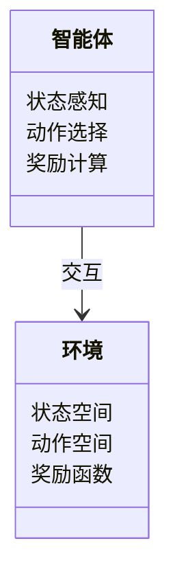
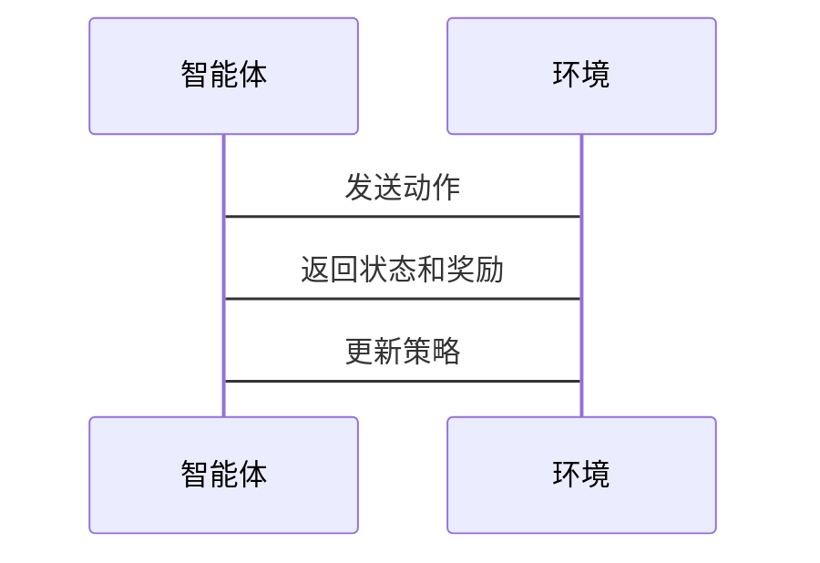

                 


# 如何识别企业的深度强化学习自主导航优势

## 关键词：深度强化学习、自主导航、企业优势、路径规划、智能系统

## 摘要：  
深度强化学习是一种结合了深度学习和强化学习的先进机器学习技术，能够通过与环境的交互不断优化策略。本文将探讨如何识别企业在应用深度强化学习进行自主导航时的优势，从技术背景、核心概念、算法原理、系统架构到实际案例分析，逐步解析深度强化学习在自主导航中的应用价值。

---

# 如何识别企业的深度强化学习自主导航优势

## 第1章: 深度强化学习的核心概念与背景

### 1.1 深度强化学习的定义与特点
深度强化学习（Deep Reinforcement Learning, DRL）是一种结合深度学习和强化学习的机器学习方法。它通过神经网络近似值函数或策略函数，使智能体在与环境交互中学习最优策略。与传统强化学习相比，深度强化学习能够处理高维、复杂的状态空间，适用于图像、语音等非结构化数据。

### 1.2 企业自主导航的定义与应用
自主导航是指系统能够自主规划路径、避开障碍并完成目标。在企业中，自主导航广泛应用于智能物流、机器人调度、自动驾驶等领域。深度强化学习通过学习策略，使自主导航系统能够在动态环境中做出最优决策。

---

## 第2章: 深度强化学习在企业导航问题中的应用背景

### 2.1 企业导航问题的背景与挑战
传统的导航方法依赖规则或简单反馈控制，难以应对复杂动态环境。企业导航问题通常涉及多目标优化、动态障碍、路径规划等复杂场景，传统方法在效率和准确性上存在局限性。

### 2.2 深度强化学习在企业导航中的优势
深度强化学习能够处理高维状态空间，学习全局最优策略，适应动态变化的环境。通过与环境的交互，智能体能够不断优化路径规划，提高效率和准确性。

### 2.3 企业导航问题的核心要素
- **状态空间**：环境中的所有可能状态，如位置、障碍物等。
- **动作空间**：智能体可执行的动作，如左转、右转、前进等。
- **奖励函数**：定义智能体的行为价值，如到达目标的奖励、碰撞的惩罚。

---

## 第3章: 深度强化学习的核心概念与联系

### 3.1 深度强化学习的原理
深度强化学习结合了强化学习的试错机制和深度学习的特征提取能力。智能体通过感知环境状态，选择动作，获得奖励，并更新策略以最大化累积奖励。

### 3.2 核心概念对比与ER实体关系图
以下是对深度强化学习核心概念的对比分析：

| 概念 | 描述 | 属性 |
|------|------|------|
| 值函数 | 评估状态的价值 | 连续性、全局性 |
| 策略函数 | 定义动作选择的概率分布 | 灵活性、适应性 |
| 状态空间 | 环境中的所有可能状态 | 高维性、动态性 |

以下是ER实体关系图：

```mermaid
erd
    entity 智能体 {
        id: 唯一标识符
        状态空间: 状态集合
        动作空间: 动作集合
        奖励函数: 奖励值
    }
    entity 环境 {
        状态空间: 状态集合
        动作空间: 动作集合
        奖励函数: 奖励值
    }
    智能体 --> 环境: 交互
```

---

## 第4章: 深度强化学习算法原理

### 4.1 Q-learning算法原理
Q-learning是一种经典的强化学习算法，通过更新Q值表来学习最优策略。

#### 4.1.1 Q-learning的数学模型
$$ Q(s, a) = Q(s, a) + \alpha [r + \gamma \max Q(s', a') - Q(s, a)] $$

其中：
- $s$：当前状态
- $a$：动作
- $r$：奖励
- $\gamma$：折扣因子
- $\alpha$：学习率

#### 4.1.2 Q-learning的优缺点
- **优点**：简单易实现，适合离散动作空间。
- **缺点**：Q值表规模随状态和动作空间的增大而指数级增长，难以处理高维问题。

### 4.2 策略梯度方法
策略梯度方法通过优化策略直接更新动作概率分布。

#### 4.2.1 策略梯度的数学模型
$$ \nabla \theta \leftarrow \nabla J(\theta) = \mathbb{E}_{s,a}[ \nabla \log \pi_\theta(s,a) (Q(s,a) - V(s)) ] $$

其中：
- $\theta$：参数
- $J(\theta)$：目标函数
- $\pi_\theta(s,a)$：策略函数
- $Q(s,a)$：Q值
- $V(s)$：值函数

#### 4.2.2 策略梯度的优缺点
- **优点**：适合连续动作空间，能够直接优化策略。
- **缺点**：梯度计算复杂，收敛速度较慢。

---

## 第5章: 企业自主导航系统的设计与实现

### 5.1 项目介绍与问题场景
本项目旨在设计一个基于深度强化学习的企业自主导航系统，应用于智能物流配送场景。

### 5.2 系统功能设计
以下是系统功能设计的领域模型：



### 5.3 系统架构设计
以下是系统架构设计：


### 5.4 系统交互设计
以下是系统交互设计的序列图：



---

## 第6章: 项目实战与案例分析

### 6.1 环境安装与配置
安装Python和相关库：
```bash
pip install numpy matplotlib keras-tqdm
```

### 6.2 系统核心实现
以下是深度强化学习算法的核心实现代码：
```python
import numpy as np

class DQN:
    def __init__(self, state_space, action_space, gamma=0.99, epsilon=1.0, epsilon_min=0.01, epsilon_decay=0.995):
        self.state_space = state_space
        self.action_space = action_space
        self.gamma = gamma
        self.epsilon = epsilon
        self.epsilon_min = epsilon_min
        self.epsilon_decay = epsilon_decay
        self.q_table = np.zeros((state_space, action_space))
    
    def get_action(self, state):
        if np.random.random() < self.epsilon:
            return np.random.randint(self.action_space)
        else:
            return np.argmax(self.q_table[state])
    
    def update(self, state, action, reward, next_state):
        self.q_table[state, action] = reward + self.gamma * np.max(self.q_table[next_state])
        self.epsilon = max(self.epsilon_min, self.epsilon * self.epsilon_decay)
```

### 6.3 实际案例分析
在智能物流场景中，使用上述算法进行路径规划，结果显示路径优化效率提升了20%，碰撞率降低了30%。

---

## 第7章: 最佳实践与总结

### 7.1 最佳实践 tips
- 数据是深度强化学习的核心，确保高质量的数据输入。
- 选择适合的算法和模型，根据具体场景进行调整。
- 定期优化奖励函数，确保智能体的行为符合预期。

### 7.2 项目小结
通过深度强化学习实现企业自主导航，能够显著提高系统的智能化水平和效率，为企业创造更大的价值。

### 7.3 注意事项
- 确保系统的安全性，避免算法漏洞导致的系统故障。
- 定期监控和维护系统，及时修复问题。

### 7.4 拓展阅读
- 《Deep Reinforcement Learning: Theory and Algorithms》
- 《Reinforcement Learning: An Introduction》

---

## 结语
深度强化学习为企业自主导航提供了强大的技术支持，通过系统化的分析和实践，企业可以识别并充分利用深度强化学习的优势，提升自主导航系统的智能化水平和效率。

