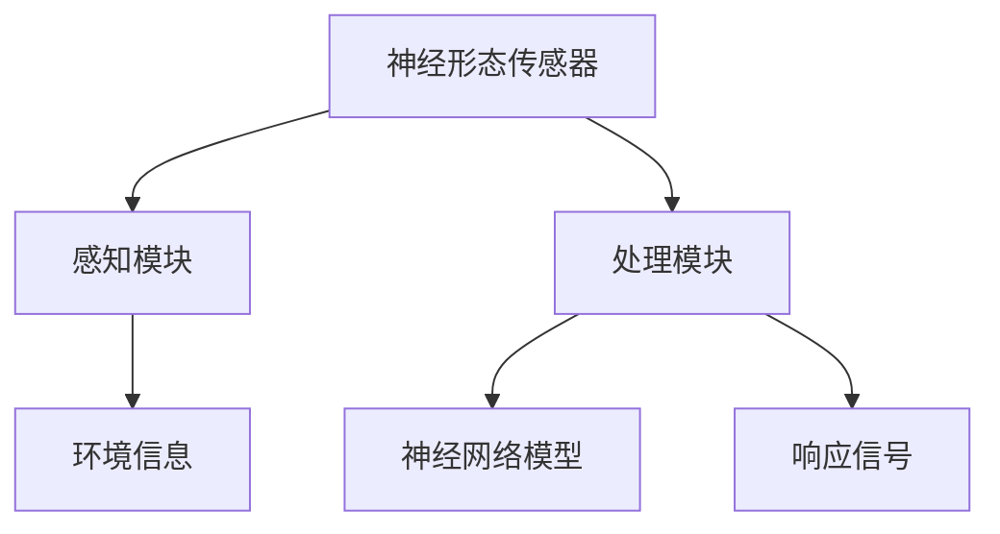
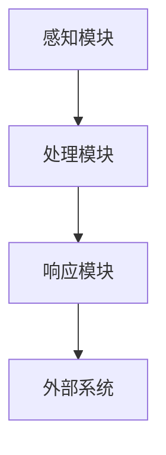
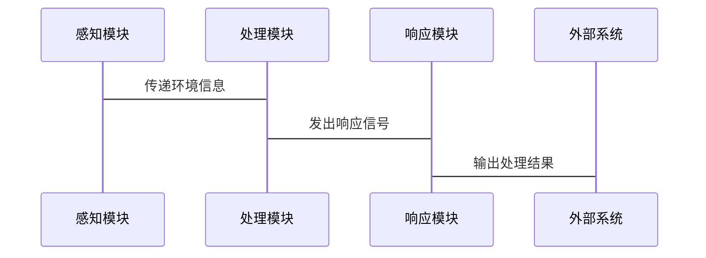

                 


# 如何识别企业的神经形态传感器优势

> **关键词**：神经形态传感器、企业应用、算法原理、系统架构、项目实战  
> **摘要**：本文深入探讨了如何识别企业中的神经形态传感器优势，从基本概念、核心原理到算法实现、系统设计，再到项目实战，全面分析了神经形态传感器的应用场景和优势。文章通过详细的技术分析和实际案例，帮助读者理解神经形态传感器在企业中的价值，并指导如何在实际项目中有效应用。

---

## 第一部分：背景介绍

### 第1章：神经形态传感器的基本概念

#### 1.1 神经形态传感器的定义与特点

神经形态传感器是一种模拟生物神经系统结构和功能的传感器，能够实时感知环境信息，并通过类似神经网络的方式进行信息处理和响应。其核心特点包括：

- **实时性**：能够快速感知和处理环境信息。
- **自适应性**：能够根据环境变化调整自身参数。
- **高效性**：在低功耗条件下实现高效信息处理。

#### 1.2 企业中神经形态传感器的应用背景

随着物联网（IoT）和人工智能（AI）技术的快速发展，企业对高效、智能的传感器需求日益增长。神经形态传感器在企业中的应用背景包括：

- **工业自动化**：用于生产线上的实时监控和故障检测。
- **智能家居**：用于家庭设备的智能控制和环境感知。
- **医疗健康**：用于医疗设备的精准感知和实时监测。

#### 1.3 神经形态传感器的优势与挑战

神经形态传感器的优势在于其高效的信息处理能力和适应性，但其在企业中的应用也面临一些挑战，如成本较高、技术复杂性等。

---

## 第二部分：核心概念与联系

### 第2章：神经形态传感器的工作原理

#### 2.1 神经形态传感器的核心原理

神经形态传感器的核心原理是通过模拟生物神经网络的结构和功能，实现对环境信息的感知和处理。其工作流程包括：

1. **感知阶段**：传感器接收外部环境信息。
2. **处理阶段**：通过类似神经网络的方式对信息进行处理和分析。
3. **响应阶段**：根据处理结果输出相应的响应信号。

#### 2.2 神经形态传感器与其他传感器的对比

为了更好地理解神经形态传感器的特点，我们可以将其与其他传统传感器进行对比。以下是主要对比点：

| **特性**          | **神经形态传感器**               | **传统传感器**                |
|-------------------|----------------------------------|-------------------------------|
| **信息处理能力**  | 强，能够实时处理复杂信息         | 弱，通常仅限于信号采集和简单处理 |
| **自适应性**       | 强，能够根据环境变化调整参数     | 弱或无，参数通常固定          |
| **功耗**           | 低，能够在低功耗条件下工作       | 较高，依赖外部电源支持         |

#### 2.3 神经形态传感器的实体关系图

以下是一个简单的神经形态传感器实体关系图，展示了其主要组成部分及其关系：



---

## 第三部分：算法原理

### 第3章：神经形态传感器的算法实现

#### 3.1 神经形态传感器的信息处理算法

神经形态传感器的信息处理算法通常基于人工神经网络（ANN）模型，主要包括以下步骤：

1. **数据采集**：传感器接收外部环境信息。
2. **预处理**：对采集到的数据进行降噪和特征提取。
3. **神经网络处理**：将预处理后的数据输入到神经网络中进行分类或回归处理。
4. **输出响应**：根据处理结果输出相应的响应信号。

#### 3.2 神经网络模型的数学表示

神经网络模型的数学表示可以通过以下公式描述：

$$
y = f(Wx + b)
$$

其中：
- \( y \) 表示输出结果。
- \( W \) 表示权重矩阵。
- \( x \) 表示输入数据。
- \( b \) 表示偏置项。
- \( f \) 表示激活函数（如ReLU、Sigmoid等）。

#### 3.3 算法实现的Python代码示例

以下是一个简单的神经网络模型实现示例：

```python
import numpy as np

def sigmoid(x):
    return 1 / (1 + np.exp(-x))

def forward_propagation(x, W, b):
    z = np.dot(W, x) + b
    a = sigmoid(z)
    return a, z

# 示例数据
x = np.array([1, 2, 3])
W = np.array([[0.5, -0.2, 0.8]])
b = np.array([0.3])

a, z = forward_propagation(x, W, b)
print("输出结果:", a)
print("线性部分:", z)
```

#### 3.4 算法的优缺点分析

神经网络模型的优点包括高精度和自适应性，但其缺点包括计算复杂性和需要大量训练数据。

---

## 第四部分：系统分析与架构设计

### 第4章：神经形态传感器的系统设计

#### 4.1 系统功能设计

神经形态传感器的系统功能设计通常包括以下模块：

1. **感知模块**：负责采集环境信息。
2. **处理模块**：负责对采集到的数据进行处理和分析。
3. **响应模块**：负责输出相应的响应信号。

#### 4.2 系统架构设计

以下是一个简单的神经形态传感器系统架构图：



#### 4.3 系统接口设计

神经形态传感器的系统接口设计通常包括以下接口：

- **输入接口**：用于接收环境信息。
- **输出接口**：用于输出处理结果。
- **控制接口**：用于系统的配置和控制。

#### 4.4 系统交互流程图

以下是一个神经形态传感器系统的交互流程图：



---

## 第五部分：项目实战

### 第5章：神经形态传感器的项目实现

#### 5.1 项目环境安装

以下是实现神经形态传感器所需的环境安装步骤：

1. **安装Python**：确保安装了Python 3.x。
2. **安装依赖库**：安装NumPy和Matplotlib等库。

```bash
pip install numpy matplotlib
```

#### 5.2 核心代码实现

以下是一个简单的神经形态传感器实现代码：

```python
import numpy as np
import matplotlib.pyplot as plt

# 生成示例数据
x = np.linspace(-5, 5, 100)
y = np.sin(x)

# 神经网络模型
W = np.array([[0.5], [-0.2]])
b = np.array([0.3])

# 前向传播
z = np.dot(W, x) + b
a = sigmoid(z)

# 绘制图形
plt.plot(x, y, label='原始数据')
plt.plot(x, a, label='处理结果')
plt.legend()
plt.show()
```

#### 5.3 代码解读与分析

1. **数据生成**：使用NumPy生成示例数据。
2. **神经网络模型**：定义权重矩阵和偏置项。
3. **前向传播**：计算神经网络的输出结果。
4. **结果可视化**：使用Matplotlib绘制原始数据和处理结果。

#### 5.4 实际案例分析

以下是一个神经形态传感器在工业自动化中的实际案例分析：

**场景描述**：生产线上的温度监控系统。

**实现步骤**：
1. **安装传感器**：在生产线上安装神经形态温度传感器。
2. **数据采集**：传感器实时采集环境温度数据。
3. **数据处理**：通过神经网络模型对温度数据进行分析和预测。
4. **输出响应**：当温度异常时，传感器发出警报信号。

#### 5.5 项目总结

通过上述项目实战，我们可以看到神经形态传感器在企业中的应用潜力和实际价值。

---

## 第六部分：总结与展望

### 第6章：总结与展望

#### 6.1 内容回顾

本文详细探讨了神经形态传感器的基本概念、核心原理、算法实现和系统设计，并通过实际案例展示了其在企业中的应用。

#### 6.2 应用中的注意事项

在实际应用中，需要注意以下几点：

- **数据质量**：确保输入数据的准确性和完整性。
- **模型训练**：需要大量的训练数据来提高模型的精度。
- **系统维护**：定期对系统进行维护和更新。

#### 6.3 未来展望

未来，随着人工智能和物联网技术的进一步发展，神经形态传感器在企业中的应用将更加广泛和深入。

---

## 第七部分：拓展阅读

### 7.1 推荐书籍

1. 《深度学习》—— Ian Goodfellow
2. 《神经网络与深度学习》—— 李航

### 7.2 推荐资源

1. [神经网络入门教程](https://example.com)
2. [TensorFlow官方文档](https://tensorflow.org)

---

通过以上内容，我们可以看到神经形态传感器在企业中的巨大潜力和应用价值。希望本文能为读者提供有价值的技术指导和启发。

