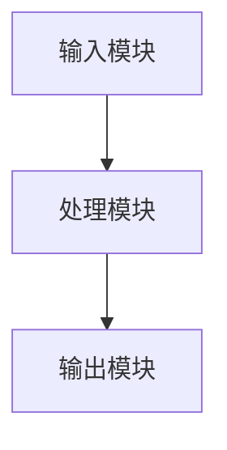
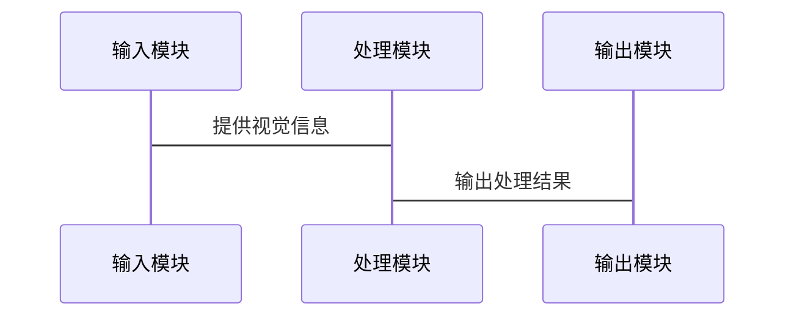

                 


# 如何识别企业的神经形态视觉处理器优势

## 关键词：神经形态视觉处理器、企业优势、算法原理、系统架构、项目实战

## 摘要：神经形态视觉处理器是一种结合神经科学与计算机视觉技术的创新处理器，具有高效性、低功耗和高并行计算能力。本文将从背景介绍、核心概念、算法原理、系统架构到项目实战，详细解析如何识别和利用神经形态视觉处理器的优势，帮助企业提升在人工智能领域的竞争力。

---

## 第一部分：神经形态视觉处理器的背景与概念

### 第1章：神经形态视觉处理器的背景与问题背景

#### 1.1 神经形态视觉处理器的定义与问题背景
- 神经形态视觉处理器（Neuromorphic Visual Processor）是一种模拟生物神经系统结构和功能的视觉处理器，旨在通过高效的信息处理方式实现类人脑的视觉感知能力。
- 传统视觉处理器在复杂场景下的计算效率低下，能耗较高，无法满足实时性和高性能的需求。
- 神经形态视觉处理器通过模拟生物视觉系统，能够在低功耗条件下实现高效的视觉信息处理，适用于智能安防、智能驾驶和智能机器人等领域。

#### 1.2 神经形态视觉处理器的核心问题背景
- 传统视觉处理器的计算模型依赖于大量数据和高能耗，难以满足实时性和高效性需求。
- 神经形态视觉处理器通过模拟生物神经系统，利用事件驱动的计算方式，能够在低功耗条件下实现高效的视觉信息处理。

#### 1.3 神经形态视觉处理器的行业应用现状
- 智能安防：广泛应用于实时监控、人脸识别和行为识别。
- 智能驾驶：用于车辆检测、道路识别和障碍物检测。
- 智能机器人：应用于物体识别、地图构建和运动控制。

### 第2章：神经形态视觉处理器的核心概念与技术特点

#### 2.1 神经形态视觉处理器的核心概念
- 神经形态计算：模拟生物神经系统的信息处理方式，利用神经网络模型和突变学习机制实现高效的信息处理。
- 突变学习机制：通过模拟神经元的突变和学习过程，实现自适应的视觉信息处理。
- 事件驱动计算：基于事件触发的信息处理方式，能够在低功耗条件下实现高效的视觉信息处理。

#### 2.2 神经形态视觉处理器的技术特点
- 高效性：通过模拟生物神经系统，实现高效的视觉信息处理。
- 低功耗：事件驱动的计算方式能够在低功耗条件下完成复杂的视觉任务。
- 并行计算能力：通过并行处理和分布式计算，提升视觉信息处理的效率。

### 第3章：神经形态视觉处理器与其他技术的对比

#### 3.1 与传统视觉处理器的对比
| 对比维度 | 传统视觉处理器 | 神经形态视觉处理器 |
|----------|-----------------|--------------------|
| 架构     | 依赖于冯·诺依曼架构 | 模拟生物神经系统架构 |
| 性能     | 高能耗，计算效率低 | 低功耗，高效能 |
| 场景     | 适用于简单视觉任务 | 适用于复杂视觉任务 |

#### 3.2 与深度学习视觉处理器的对比
- 算法差异：深度学习视觉处理器依赖于深度神经网络模型，而神经形态视觉处理器通过突变学习机制实现自适应的视觉信息处理。
- 硬件差异：深度学习视觉处理器依赖于GPU或TPU等专用硬件，而神经形态视觉处理器基于神经形态计算架构，能够在通用硬件上实现高效计算。
- 适用场景差异：深度学习视觉处理器适用于大规模数据训练，而神经形态视觉处理器适用于实时性和低功耗需求较高的场景。

### 第4章：神经形态视觉处理器的应用场景

#### 4.1 智能安防
- 实时监控：通过神经形态视觉处理器实现实时的视频监控，能够在低功耗条件下完成高效的视频分析。
- 人脸识别：利用神经形态视觉处理器的高效计算能力，实现快速准确的人脸识别。
- 行为识别：通过神经形态视觉处理器实现复杂行为的识别，提升智能安防的准确性。

#### 4.2 智能驾驶
- 车辆检测：利用神经形态视觉处理器实现高效的车辆检测，提升驾驶安全性。
- 道路识别：通过神经形态视觉处理器实现复杂道路的识别，提高驾驶的智能化水平。
- 障碍物检测：利用神经形态视觉处理器实现快速的障碍物检测，提升驾驶的安全性。

#### 4.3 智能机器人
- 物体识别：通过神经形态视觉处理器实现高效的物体识别，提升机器人的自主能力。
- 地图构建：利用神经形态视觉处理器实现高效的环境建模，提升机器人的导航能力。
- 运动控制：通过神经形态视觉处理器实现高效的运动控制，提升机器人的灵活性和适应性。

## 第二部分：神经形态视觉处理器的核心概念与技术原理

### 第5章：神经形态视觉处理器的核心概念与原理

#### 5.1 神经形态视觉处理器的原理
- 神经网络模型：神经形态视觉处理器基于生物神经网络模型，通过模拟神经元的电生理活动实现信息处理。
- 突变学习机制：突变学习机制通过模拟神经元的突变和学习过程，实现自适应的视觉信息处理。
- 事件驱动计算：事件驱动计算基于事件触发的信息处理方式，能够在低功耗条件下实现高效的视觉信息处理。

#### 5.2 神经形态视觉处理器的数学模型与公式
- 神经网络模型的数学表示：神经网络模型通常由输入层、隐藏层和输出层组成，通过权重矩阵和激活函数实现信息处理。
  $$ y = \sigma(Wx + b) $$
  其中，\( y \) 是输出，\( W \) 是权重矩阵，\( x \) 是输入，\( b \) 是偏置，\( \sigma \) 是激活函数。
  
- 突变学习机制的数学公式：突变学习机制通过调整神经元的突变概率实现自适应的视觉信息处理。
  $$ p = \frac{1}{1 + e^{-kx}} $$
  其中，\( p \) 是突变概率，\( k \) 是比例常数，\( x \) 是输入。

- 事件驱动计算的数学模型：事件驱动计算基于事件触发的信息处理方式，通过设置阈值实现事件的触发。
  $$ V(t) = \begin{cases} 
  V_{rest} & \text{当 } t < T_{threshold} \\
  V_{active} & \text{当 } t \geq T_{threshold} 
  \end{cases} $$

### 第6章：神经形态视觉处理器的核心算法与实现

#### 6.1 神经形态视觉处理器的核心算法
- 突变学习算法：突变学习算法通过调整神经元的突变概率实现自适应的视觉信息处理。
- 事件驱动视觉处理算法：事件驱动视觉处理算法基于事件触发的信息处理方式，能够在低功耗条件下实现高效的视觉信息处理。
- 神经网络训练算法：神经网络训练算法通过反向传播和梯度下降方法实现神经网络的训练和优化。

#### 6.2 算法实现的数学模型与公式
- 突变学习算法的数学公式：突变学习算法通过调整突变概率实现自适应的视觉信息处理。
  $$ p = \frac{1}{1 + e^{-kx}} $$
- 事件驱动视觉处理算法的数学模型：事件驱动视觉处理算法通过设置阈值实现事件的触发。
  $$ V(t) = \begin{cases} 
  V_{rest} & \text{当 } t < T_{threshold} \\
  V_{active} & \text{当 } t \geq T_{threshold} 
  \end{cases} $$
- 神经网络训练算法的数学表示：神经网络训练算法通过反向传播和梯度下降方法实现神经网络的训练和优化。
  $$ \theta_{t+1} = \theta_t - \eta \frac{\partial L}{\partial \theta_t} $$
  其中，\( \theta \) 是参数，\( \eta \) 是学习率，\( L \) 是损失函数。

### 第7章：神经形态视觉处理器的系统架构与设计

#### 7.1 系统架构设计
- 神经形态视觉处理器的系统架构设计包括输入模块、处理模块和输出模块。
- 输入模块负责接收视觉信息，处理模块负责对视觉信息进行处理，输出模块负责输出处理结果。

#### 7.2 系统功能设计
- 神经形态视觉处理器的系统功能设计包括事件检测、特征提取和目标识别。
- 事件检测负责检测视觉信息中的事件，特征提取负责提取事件的特征，目标识别负责识别事件的目标。

#### 7.3 系统架构图（Mermaid）


#### 7.4 系统交互图（Mermaid）


### 第8章：神经形态视觉处理器的项目实战

#### 8.1 环境安装
- 神经形态视觉处理器的项目实战需要安装Python、神经形态视觉处理器框架和相关依赖库。
- 建议使用虚拟环境进行项目开发，确保依赖库的版本兼容性。

#### 8.2 系统核心实现源代码
```python
import numpy as np

class NeuromorphicVisualProcessor:
    def __init__(self, input_size, output_size):
        self.weights = np.random.randn(input_size, output_size)
        self.bias = np.zeros(output_size)

    def activate(self, x):
        return 1 / (1 + np.exp(-x))

    def forward(self, input):
        output = np.dot(input, self.weights) + self.bias
        output = self.activate(output)
        return output

    def backward(self, error, input):
        delta = error * self.activate(input, derivative=True)
        self.weights -= np.dot(input.T, delta)
        self.bias -= np.mean(delta, axis=0)

    def train(self, input, target, epochs=100, learning_rate=0.1):
        for _ in range(epochs):
            output = self.forward(input)
            error = target - output
            self.backward(error, input)
```

#### 8.3 代码应用解读与分析
- 神经形态视觉处理器的代码实现包括初始化、激活函数、前向传播和反向传播。
- 初始化部分负责初始化权重和偏置，激活函数负责实现激活函数，前向传播负责计算输出，反向传播负责更新权重和偏置。

#### 8.4 实际案例分析和详细讲解剖析
- 案例分析：利用神经形态视觉处理器实现目标检测。
- 实现步骤：
  1. 安装必要的依赖库，包括Python、numpy和神经形态视觉处理器框架。
  2. 初始化神经形态视觉处理器，设置输入和输出的大小。
  3. 定义激活函数，实现前向传播和反向传播。
  4. 使用训练数据对神经形态视觉处理器进行训练，优化模型参数。
  5. 使用测试数据对神经形态视觉处理器进行测试，评估模型的性能。

#### 8.5 项目小结
- 通过项目实战，我们可以看到神经形态视觉处理器的优势在于其高效的计算能力和低功耗的特点。
- 神经形态视觉处理器的实现需要结合神经网络模型和突变学习机制，实现高效的视觉信息处理。

### 第9章：神经形态视觉处理器的最佳实践

#### 9.1 小结
- 神经形态视觉处理器是一种高效、低功耗的视觉处理器，适用于智能安防、智能驾驶和智能机器人等领域。
- 神经形态视觉处理器的核心优势在于其模拟生物神经系统的计算方式，能够在低功耗条件下实现高效的视觉信息处理。

#### 9.2 注意事项
- 在实际应用中，需要注意神经形态视觉处理器的硬件需求和计算效率。
- 需要结合具体的应用场景，选择合适的神经形态视觉处理器和算法。

#### 9.3 拓展阅读
- 推荐阅读相关领域的书籍和论文，深入了解神经形态视觉处理器的原理和应用。
- 参加相关的技术会议和论坛，了解最新的研究成果和技术动态。

---

通过本文的详细解析，我们希望能够帮助企业识别神经形态视觉处理器的优势，并在实际应用中充分发挥其潜力，提升企业在人工智能领域的竞争力。

