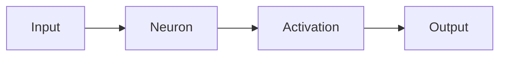

                 


# 如何识别企业的神经形态计算优势

## 第一部分: 神经形态计算的背景与基础

### 第1章: 神经形态计算的起源与概念

#### 1.1 神经形态计算的起源
- 1.1.1 生物神经网络的启发
  神经形态计算的灵感来源于生物神经网络的结构和功能。生物神经网络由神经元和突触组成，通过复杂的连接和并行计算来处理信息。
  
- 1.1.2 神经形态计算的定义
  神经形态计算是一种模拟生物神经网络结构和功能的计算范式。它强调模拟生物神经元的行为，通过并行计算和事件驱动的方式进行信息处理。

- 1.1.3 神经形态计算与传统计算的对比
  - **计算模式**：传统计算基于冯·诺依曼架构，采用串行处理；神经形态计算则采用并行处理，模拟生物神经网络。
  - **并行计算能力**：传统计算依赖于高速处理器和内存分离，而神经形态计算通过模拟生物神经元的特性，提高了并行计算能力。
  - **能效比**：神经形态计算在能效比上具有优势，更适合低功耗应用场景。

#### 1.2 神经形态计算的核心概念
- 1.2.1 生物神经元的模拟
  神经形态计算中的神经元通过数学模型（如霍奇金-赫胥黎模型）模拟生物神经元的电生理特性。
  $$ I_{\text{Na}} = g_{\text{Na}} (V - V_{\text{Na}}) $$
  $$ I_{\text{K}} = g_{\text{K}} (V - V_{\text{K}}) $$
  $$ I_{\text{leak}} = g_{\text{leak}} (V - V_{\text{leak}}) $$

- 1.2.2 神经网络的结构与功能
  神经网络由多个神经元通过突触连接形成层次结构，每个神经元通过权重和激活函数进行信息处理。
  
- 1.2.3 神经形态计算的优势与局限
  - **优势**：并行计算能力强，适用于模式识别、实时处理等任务。
  - **局限**：目前在训练和推理速度上仍不如传统计算架构。

#### 1.3 神经形态计算在企业中的应用前景
- 1.3.1 神经神经形态计算的潜在应用场景
  - 智能传感器：通过事件驱动的计算方式，降低数据处理的功耗。
  - 边缘计算：神经形态计算的低功耗特性适合边缘设备的实时处理。
  - 物联网：在物联网中，神经形态计算可以提高数据处理的效率和能效比。

- 1.3.2 企业采用神经形态计算的优势
  - 提高计算效率：通过并行计算和事件驱动的方式，减少计算资源的浪费。
  - 降低能耗：神经形态计算的低功耗特性可以帮助企业降低能源成本。
  - 提升实时性：适用于需要实时处理的应用场景，如自动驾驶、智能监控等。

- 1.3.3 神经形态计算应用的挑战与机遇
  - **挑战**：当前神经形态计算的生态系统尚未成熟，缺乏统一的标准和工具。
  - **机遇**：随着技术的不断发展，神经形态计算在企业和学术界的结合将推动更多创新。

### 第2章: 神经形态计算的核心原理

#### 2.1 神经网络的基本模型
- 2.1.1 生物神经元的数学模型
  霍奇金-赫胥黎模型是经典的生物神经元数学模型，描述了动作电位的产生机制。
  $$ I(t) = g_{\text{Na}} (V(t) - V_{\text{Na}}) \cdot \frac{dV}{dt} + g_{\text{K}} (V(t) - V_{\text{K}}) \cdot \frac{dV}{dt} + g_{\text{leak}} (V(t) - V_{\text{leak}}) \cdot \frac{dV}{dt} $$

- 2.1.2 神经网络的层次结构
  神经网络通常由输入层、隐藏层和输出层组成，通过层次结构实现信息的逐层处理。
  ```mermaid
  graph LR
  InputLayer --> HiddenLayer1
  HiddenLayer1 --> OutputLayer
  ```

- 2.1.3 神经网络的激活函数
  激活函数决定了神经网络的非线性特性，常用的激活函数包括sigmoid、ReLU和tanh。
  $$ \text{sigmoid}(x) = \frac{1}{1 + e^{-x}} $$
  $$ \text{ReLU}(x) = \max(0, x) $$
  $$ \text{tanh}(x) = \frac{e^{x} - e^{-x}}{e^{x} + e^{-x}} $$

#### 2.2 神经网络的学习机制
- 2.2.1 突触的学习过程
  突触权重通过训练算法（如反向传播）进行调整，实现神经网络的学习。
  $$ \Delta w = \eta (a - y) x $$
  其中，$\eta$为学习率，$a$为实际输出，$y$为期望输出，$x$为输入。

- 2.2.2 神经网络的训练算法
  反向传播算法通过计算损失函数的梯度，调整神经网络的权重，实现模型的训练。
  $$ L = \frac{1}{2} (y_{\text{actual}} - y_{\text{pred}})^2 $$
  $$ \frac{\partial L}{\partial w} = (y_{\text{pred}} - y_{\text{actual}}) x $$

- 2.2.3 神经网络的权重更新规则
  突触权重通过梯度下降算法进行更新，优化神经网络的性能。
  $$ w = w - \eta \frac{\partial L}{\partial w} $$

#### 2.3 神经网络的数学模型与公式
- 2.3.1 激活函数的数学表达
  激活函数决定了神经网络的非线性特性，常用的激活函数包括sigmoid、ReLU和tanh。
  $$ \text{sigmoid}(x) = \frac{1}{1 + e^{-x}} $$
  $$ \text{ReLU}(x) = \max(0, x) $$
  $$ \text{tanh}(x) = \frac{e^{x} - e^{-x}}{e^{x} + e^{-x}} $$

- 2.3.2 损失函数的定义与优化
  损失函数用于衡量预测值与实际值之间的差距，常用的损失函数包括均方误差和交叉熵损失。
  $$ L_{\text{MSE}} = \frac{1}{2n} \sum_{i=1}^{n} (y_i - \hat{y}_i)^2 $$
  $$ L_{\text{CE}} = -\frac{1}{n} \sum_{i=1}^{n} y_i \log(\hat{y}_i) + (1 - y_i) \log(1 - \hat{y}_i) $$

- 2.3.3 神经网络的正向传播与反向传播
  正向传播通过输入层到输出层进行计算，反向传播通过链式法则计算损失函数对权重的梯度，实现权重更新。
  $$ a^{(l)} = \sigma(w^{(l)} a^{(l-1)} + b^{(l)}) $$
  $$ \frac{\partial L}{\partial w^{(l)}} = (a^{(l)} - y) a^{(l-1)} $$

### 第3章: 神经形态计算的核心概念对比

#### 3.1 神经网络与传统计算的对比
- 3.1.1 计算模式的对比
  - 传统计算：串行处理，依赖高速处理器和内存分离。
  - 神经形态计算：并行处理，模拟生物神经网络的特性。

- 3.1.2 并行计算能力的对比
  - 传统计算：依赖于多核处理器和并行计算库（如MPI、OpenMP）。
  - 神经形态计算：通过模拟生物神经元的特性，实现高效的并行计算。

- 3.1.3 能效比的对比
  - 传统计算：能效比较低，尤其是在大规模数据处理中。
  - 神经形态计算：能效比较高，适合低功耗应用场景。

#### 3.2 神经网络的实体关系图
- 3.2.1 神经元与突触的关系
  神经元通过突触连接，通过权重和激活函数进行信息处理。
  ```mermaid
  graph LR
  Neuron --> Synapse
  ```

- 3.2.2 神经网络的层次结构
  神经网络由输入层、隐藏层和输出层组成，通过层次结构实现信息的逐层处理。
  ```mermaid
  graph LR
  InputLayer --> HiddenLayer1
  HiddenLayer1 --> OutputLayer
  ```

- 3.2.3 神经网络的输入输出关系
  神经网络通过输入层接收数据，通过隐藏层进行特征提取，最后通过输出层生成预测结果。
  $$ y = f(x) $$

### 第4章: 神经形态计算的算法原理

#### 4.1 神经网络的训练算法
- 4.1.1 神经网络的训练流程
  - 数据输入：将训练数据输入神经网络。
  - 正向传播：计算神经网络的输出。
  - 损失计算：计算预测值与实际值之间的损失。
  - 反向传播：计算损失函数对权重的梯度，更新权重。

- 4.1.2 神经网络的训练算法实现
  使用Python和深度学习框架（如TensorFlow、Keras）实现神经网络的训练。
  ```python
  import tensorflow as tf
  model = tf.keras.Sequential([
      tf.keras.layers.Dense(64, activation='relu'),
      tf.keras.layers.Dense(10, activation='softmax')
  ])
  model.compile(optimizer='adam', loss='sparse_categorical_crossentropy', metrics=['accuracy'])
  model.fit(x_train, y_train, epochs=10, batch_size=32)
  ```

- 4.1.3 神经网络的数学模型与公式
  神经网络的正向传播和反向传播过程可以通过数学公式描述。
  $$ a^{(l)} = \sigma(w^{(l)} a^{(l-1)} + b^{(l)}) $$
  $$ \frac{\partial L}{\partial w^{(l)}} = (a^{(l)} - y) a^{(l-1)} $$

#### 4.2 神经网络的数学模型与公式
- 4.2.1 激活函数的数学表达
  激活函数决定了神经网络的非线性特性，常用的激活函数包括sigmoid、ReLU和tanh。
  $$ \text{sigmoid}(x) = \frac{1}{1 + e^{-x}} $$
  $$ \text{ReLU}(x) = \max(0, x) $$
  $$ \text{tanh}(x) = \frac{e^{x} - e^{-x}}{e^{x} + e^{-x}} $$

- 4.2.2 损失函数的定义与优化
  损失函数用于衡量预测值与实际值之间的差距，常用的损失函数包括均方误差和交叉熵损失。
  $$ L_{\text{MSE}} = \frac{1}{2n} \sum_{i=1}^{n} (y_i - \hat{y}_i)^2 $$
  $$ L_{\text{CE}} = -\frac{1}{n} \sum_{i=1}^{n} y_i \log(\hat{y}_i) + (1 - y_i) \log(1 - \hat{y}_i) $$

- 4.2.3 神经网络的正向传播与反向传播
  正向传播通过输入层到输出层进行计算，反向传播通过链式法则计算损失函数对权重的梯度，实现权重更新。
  $$ a^{(l)} = \sigma(w^{(l)} a^{(l-1)} + b^{(l)}) $$
  $$ \frac{\partial L}{\partial w^{(l)}} = (a^{(l)} - y) a^{(l-1)} $$

### 第5章: 神经形态计算的系统架构与实现

#### 5.1 神经形态计算的系统架构
- 5.1.1 神经网络的系统功能设计
  神经网络系统通常包括输入层、隐藏层和输出层，通过层次结构实现信息的逐层处理。
  ```mermaid
  graph LR
  InputLayer --> HiddenLayer1
  HiddenLayer1 --> OutputLayer
  ```

- 5.1.2 神经网络的系统架构设计
  神经网络的系统架构设计包括数据输入、神经元计算、权重更新和输出生成四个部分。
  ```mermaid
  graph LR
  Input --> Neuron
  Neuron --> Activation
  Activation --> Output
  ```

- 5.1.3 神经网络的系统接口设计
  神经网络系统需要与外部数据源和用户提供接口，实现数据输入、模型训练和结果输出。
  ```mermaid
  graph LR
  User --> Input
  Input --> Model
  Model --> Output
  ```

#### 5.2 神经形态计算的系统实现
- 5.2.1 神经网络的实现步骤
  - 数据预处理：对输入数据进行归一化处理。
  - 模型构建：定义神经网络的结构，包括输入层、隐藏层和输出层。
  - 模型训练：使用训练数据对神经网络进行训练，调整权重和偏置。
  - 模型评估：使用测试数据对神经网络进行评估，计算准确率、召回率等指标。

- 5.2.2 神经网络的Python实现
  使用Python和深度学习框架（如TensorFlow、Keras）实现神经网络的训练和推理。
  ```python
  import tensorflow as tf
  model = tf.keras.Sequential([
      tf.keras.layers.Dense(64, activation='relu'),
      tf.keras.layers.Dense(10, activation='softmax')
  ])
  model.compile(optimizer='adam', loss='sparse_categorical_crossentropy', metrics=['accuracy'])
  model.fit(x_train, y_train, epochs=10, batch_size=32)
  ```

- 5.2.3 神经网络的系统交互流程
  神经网络的系统交互流程包括数据输入、正向传播、损失计算、反向传播和权重更新。
  ```mermaid
  graph LR
  User --> Input
  Input --> Model
  Model --> Output
  Model --> Loss
  Loss --> Backpropagation
  Backpropagation --> UpdateWeights
  ```

### 第6章: 神经形态计算的项目实战

#### 6.1 神经网络的环境安装
- 安装Python和深度学习框架（如TensorFlow、Keras）。
  ```bash
  pip install tensorflow keras
  ```

#### 6.2 神经网络的核心实现
- 实现一个简单的神经网络，用于分类任务。
  ```python
  import tensorflow as tf
  model = tf.keras.Sequential([
      tf.keras.layers.Dense(64, activation='relu'),
      tf.keras.layers.Dense(10, activation='softmax')
  ])
  model.compile(optimizer='adam', loss='sparse_categorical_crossentropy', metrics=['accuracy'])
  model.fit(x_train, y_train, epochs=10, batch_size=32)
  ```

#### 6.3 神经网络的案例分析
- 使用MNIST数据集进行训练和测试，评估神经网络的性能。
  ```python
  (x_train, y_train), (x_test, y_test) = tf.keras.datasets.mnist.load_data()
  x_train = x_train.reshape(-1, 784) / 255.0
  x_test = x_test.reshape(-1, 784) / 255.0
  model.fit(x_train, y_train, epochs=10, batch_size=32, validation_data=(x_test, y_test))
  ```

#### 6.4 神经网络的系统优化
- 通过调整神经网络的结构、学习率和训练参数，优化神经网络的性能。
  - 增加隐藏层：通过增加隐藏层的数量和神经元数量，提高神经网络的表达能力。
  - 调整学习率：通过调整学习率，找到最优的训练速度和收敛点。
  - 正则化：通过L1或L2正则化，防止神经网络的过拟合。

#### 6.5 神经网络的项目总结
- 项目总结：神经网络的实现步骤、训练过程和测试结果。
- 项目小结：神经网络的优势和局限，以及在实际应用中的注意事项。

### 第7章: 神经形态计算的最佳实践

#### 7.1 神经网络的训练技巧
- 数据预处理：对输入数据进行归一化处理，提高训练效果。
- 模型优化：通过调整神经网络的结构和参数，优化模型的性能。
- 正则化：使用L1或L2正则化，防止过拟合。

#### 7.2 神经网络的调优建议
- 学习率：选择合适的学习率，避免训练过程中的震荡和过快收敛。
- 批量大小：选择合适批量大小，平衡训练速度和模型稳定性。
- 训练轮数：选择合适的训练轮数，防止过拟合或欠拟合。

#### 7.3 神经网络的部署与应用
- 模型部署：将训练好的神经网络模型部署到实际应用场景中，实现实时推理。
- 模型优化：通过量化和剪枝等技术，优化模型的大小和推理速度。
- 模型更新：定期更新神经网络模型，保持模型的性能和适应性。

### 第8章: 神经形态计算的未来展望

#### 8.1 神经形态计算的发展趋势
- 神经形态计算的硬件支持：随着神经形态芯片的发展，神经网络的计算效率将进一步提高。
- 神经形态计算的算法创新：新的算法和模型将不断涌现，推动神经网络的性能提升。
- 神经形态计算的生态完善：神经网络的生态系统将不断完善，包括工具、库和框架的支持。

#### 8.2 神经形态计算的挑战与机遇
- 挑战：神经形态计算的生态系统尚未成熟，缺乏统一的标准和工具。
- 机遇：随着技术的发展，神经形态计算在企业和学术界的结合将推动更多创新。

#### 8.3 神经形态计算的未来应用前景
- 神经形态计算将在更多领域得到应用，包括自动驾驶、智能机器人、医疗诊断等。
- 神经形态计算将与边缘计算、物联网等技术结合，推动智能化社会的发展。

## 第三部分: 神经形态计算的系统架构与实现

### 第9章: 神经形态计算的系统架构设计

#### 9.1 神经网络的系统功能设计
- 神经网络的系统功能设计包括数据输入、神经元计算、权重更新和输出生成四个部分。
  ```mermaid
  graph LR
  Input --> Neuron
  Neuron --> Activation
  Activation --> Output
  ```

#### 9.2 神经网络的系统架构设计
- 神经网络的系统架构设计包括数据输入、神经元计算、权重更新和输出生成四个部分。
  ```mermaid
  graph LR
  Input --> Neuron
  Neuron --> Activation
  Activation --> Output
  ```

#### 9.3 神经网络的系统接口设计
- 神经网络的系统接口设计包括数据输入接口、模型训练接口和结果输出接口。
  ```mermaid
  graph LR
  User --> Input
  Input --> Model
  Model --> Output
  ```

### 第10章: 神经形态计算的系统实现

#### 10.1 神经网络的实现步骤
- 数据预处理：对输入数据进行归一化处理。
- 模型构建：定义神经网络的结构，包括输入层、隐藏层和输出层。
- 模型训练：使用训练数据对神经网络进行训练，调整权重和偏置。
- 模型评估：使用测试数据对神经网络进行评估，计算准确率、召回率等指标。

#### 10.2 神经网络的Python实现
- 使用Python和深度学习框架（如TensorFlow、Keras）实现神经网络的训练和推理。
  ```python
  import tensorflow as tf
  model = tf.keras.Sequential([
      tf.keras.layers.Dense(64, activation='relu'),
      tf.keras.layers.Dense(10, activation='softmax')
  ])
  model.compile(optimizer='adam', loss='sparse_categorical_crossentropy', metrics=['accuracy'])
  model.fit(x_train, y_train, epochs=10, batch_size=32)
  ```

#### 10.3 神经网络的系统交互流程
- 神经网络的系统交互流程包括数据输入、正向传播、损失计算、反向传播和权重更新。
  ```mermaid
  graph LR
  User --> Input
  Input --> Model
  Model --> Output
  Model --> Loss
  Loss --> Backpropagation
  Backpropagation --> UpdateWeights
  ```

### 第11章: 神经形态计算的项目实战

#### 11.1 神经网络的环境安装
- 安装Python和深度学习框架（如TensorFlow、Keras）。
  ```bash
  pip install tensorflow keras
  ```

#### 11.2 神经网络的核心实现
- 实现一个简单的神经网络，用于分类任务。
  ```python
  import tensorflow as tf
  model = tf.keras.Sequential([
      tf.keras.layers.Dense(64, activation='relu'),
      tf.keras.layers.Dense(10, activation='softmax')
  ])
  model.compile(optimizer='adam', loss='sparse_categorical_crossentropy', metrics=['accuracy'])
  model.fit(x_train, y_train, epochs=10, batch_size=32)
  ```

#### 11.3 神经网络的案例分析
- 使用MNIST数据集进行训练和测试，评估神经网络的性能。
  ```python
  (x_train, y_train), (x_test, y_test) = tf.keras.datasets.mnist.load_data()
  x_train = x_train.reshape(-1, 784) / 255.0
  x_test = x_test.reshape(-1, 784) / 255.0
  model.fit(x_train, y_train, epochs=10, batch_size=32, validation_data=(x_test, y_test))
  ```

#### 11.4 神经网络的系统优化
- 通过调整神经网络的结构、学习率和训练参数，优化神经网络的性能。
  - 增加隐藏层：通过增加隐藏层的数量和神经元数量，提高神经网络的表达能力。
  - 调整学习率：通过调整学习率，找到最优的训练速度和收敛点。
  - 正则化：通过L1或L2正则化，防止神经网络的过拟合。

#### 11.5 神经网络的项目总结
- 项目总结：神经网络的实现步骤、训练过程和测试结果。
- 项目小结：神经网络的优势和局限，以及在实际应用中的注意事项。

### 第12章: 神经形态计算的最佳实践

#### 12.1 神经网络的训练技巧
- 数据预处理：对输入数据进行归一化处理，提高训练效果。
- 模型优化：通过调整神经网络的结构和参数，优化模型的性能。
- 正则化：使用L1或L2正则化，防止过拟合。

#### 12.2 神经网络的调优建议
- 学习率：选择合适的学习率，避免训练过程中的震荡和过快收敛。
- 批量大小：选择合适批量大小，平衡训练速度和模型稳定性。
- 训练轮数：选择合适的训练轮数，防止过拟合或欠拟合。

#### 12.3 神经网络的部署与应用
- 模型部署：将训练好的神经网络模型部署到实际应用场景中，实现实时推理。
- 模型优化：通过量化和剪枝等技术，优化模型的大小和推理速度。
- 模型更新：定期更新神经网络模型，保持模型的性能和适应性。

### 第13章: 神经形态计算的未来展望

#### 13.1 神经形态计算的发展趋势
- 神经形态计算的硬件支持：随着神经形态芯片的发展，神经网络的计算效率将进一步提高。
- 神经形态计算的算法创新：新的算法和模型将不断涌现，推动神经网络的性能提升。
- 神经形态计算的生态完善：神经网络的生态系统将不断完善，包括工具、库和框架的支持。

#### 13.2 神经形态计算的挑战与机遇
- 挑战：神经形态计算的生态系统尚未成熟，缺乏统一的标准和工具。
- 机遇：随着技术的发展，神经形态计算在企业和学术界的结合将推动更多创新。

#### 13.3 神经形态计算的未来应用前景
- 神经形态计算将在更多领域得到应用，包括自动驾驶、智能机器人、医疗诊断等。
- 神经形态计算将与边缘计算、物联网等技术结合，推动智能化社会的发展。

## 第四部分: 神经形态计算的系统架构与实现

### 第14章: 神经形态计算的系统架构设计

#### 14.1 神经网络的系统功能设计
- 神经网络的系统功能设计包括数据输入、神经元计算、权重更新和输出生成四个部分。
  ```mermaid
  graph LR
  Input --> Neuron
  Neuron --> Activation
  Activation --> Output
  ```

#### 14.2 神经网络的系统架构设计
- 神经网络的系统架构设计包括数据输入、神经元计算、权重更新和输出生成四个部分。
  ```mermaid
  graph LR
  Input --> Neuron
  Neuron --> Activation
  Activation --> Output
  ```

#### 14.3 神经网络的系统接口设计
- 神经网络的系统接口设计包括数据输入接口、模型训练接口和结果输出接口。
  ```mermaid
  graph LR
  User --> Input
  Input --> Model
  Model --> Output
  ```

### 第15章: 神经形态计算的系统实现

#### 15.1 神经网络的实现步骤
- 数据预处理：对输入数据进行归一化处理。
- 模型构建：定义神经网络的结构，包括输入层、隐藏层和输出层。
- 模型训练：使用训练数据对神经网络进行训练，调整权重和偏置。
- 模型评估：使用测试数据对神经网络进行评估，计算准确率、召回率等指标。

#### 15.2 神经网络的Python实现
- 使用Python和深度学习框架（如TensorFlow、Keras）实现神经网络的训练和推理。
  ```python
  import tensorflow as tf
  model = tf.keras.Sequential([
      tf.keras.layers.Dense(64, activation='relu'),
      tf.keras.layers.Dense(10, activation='softmax')
  ])
  model.compile(optimizer='adam', loss='sparse_categorical_crossentropy', metrics=['accuracy'])
  model.fit(x_train, y_train, epochs=10, batch_size=32)
  ```

#### 15.3 神经网络的系统交互流程
- 神经网络的系统交互流程包括数据输入、正向传播、损失计算、反向传播和权重更新。
  ```mermaid
  graph LR
  User --> Input
  Input --> Model
  Model --> Output
  Model --> Loss
  Loss --> Backpropagation
  Backpropagation --> UpdateWeights
  ```

### 第16章: 神经形态计算的项目实战

#### 16.1 神经网络的环境安装
- 安装Python和深度学习框架（如TensorFlow、Keras）。
  ```bash
  pip install tensorflow keras
  ```

#### 16.2 神经网络的核心实现
- 实现一个简单的神经网络，用于分类任务。
  ```python
  import tensorflow as tf
  model = tf.keras.Sequential([
      tf.keras.layers.Dense(64, activation='relu'),
      tf.keras.layers.Dense(10, activation='softmax')
  ])
  model.compile(optimizer='adam', loss='sparse_categorical_crossentropy', metrics=['accuracy'])
  model.fit(x_train, y_train, epochs=10, batch_size=32)
  ```

#### 16.3 神经网络的案例分析
- 使用MNIST数据集进行训练和测试，评估神经网络的性能。
  ```python
  (x_train, y_train), (x_test, y_test) = tf.keras.datasets.mnist.load_data()
  x_train = x_train.reshape(-1, 784) / 255.0
  x_test = x_test.reshape(-1, 784) / 255.0
  model.fit(x_train, y_train, epochs=10, batch_size=32, validation_data=(x_test, y_test))
  ```

#### 16.4 神经网络的系统优化
- 通过调整神经网络的结构、学习率和训练参数，优化神经网络的性能。
  - 增加隐藏层：通过增加隐藏层的数量和神经元数量，提高神经网络的表达能力。
  - 调整学习率：通过调整学习率，找到最优的训练速度和收敛点。
  - 正则化：通过L1或L2正则化，防止神经网络的过拟合。

#### 16.5 神经网络的项目总结
- 项目总结：神经网络的实现步骤、训练过程和测试结果。
- 项目小结：神经网络的优势和局限，以及在实际应用中的注意事项。

### 第17章: 神经形态计算的最佳实践

#### 17.1 神经网络的训练技巧
- 数据预处理：对输入数据进行归一化处理，提高训练效果。
- 模型优化：通过调整神经网络的结构和参数，优化模型的性能。
- 正则化：使用L1或L2正则化，防止过拟合。

#### 17.2 神经网络的调优建议
- 学习率：选择合适的学习率，避免训练过程中的震荡和过快收敛。
- 批量大小：选择合适批量大小，平衡训练速度和模型稳定性。
- 训练轮数：选择合适的训练轮数，防止过拟合或欠拟合。

#### 17.3 神经网络的部署与应用
- 模型部署：将训练好的神经网络模型部署到实际应用场景中，实现实时推理。
- 模型优化：通过量化和剪枝等技术，优化模型的大小和推理速度。
- 模型更新：定期更新神经网络模型，保持模型的性能和适应性。

### 第18章: 神经形态计算的未来展望

#### 18.1 神经形态计算的发展趋势
- 神经形态计算的硬件支持：随着神经形态芯片的发展，神经网络的计算效率将进一步提高。
- 神经形态计算的算法创新：新的算法和模型将不断涌现，推动神经网络的性能提升。
- 神经形态计算的生态完善：神经网络的生态系统将不断完善，包括工具、库和框架的支持。

#### 18.2 神经形态计算的挑战与机遇
- 挑战：神经形态计算的生态系统尚未成熟，缺乏统一的标准和工具。
- 机遇：随着技术的发展，神经形态计算在企业和学术界的结合将推动更多创新。

#### 18.3 神经形态计算的未来应用前景
- 神经形态计算将在更多领域得到应用，包括自动驾驶、智能机器人、医疗诊断等。
- 神经形态计算将与边缘计算、物联网等技术结合，推动智能化社会的发展。

## 第五部分: 神经形态计算的未来展望

### 第19章: 神经形态计算的发展趋势

#### 19.1 神经形态计算的硬件支持
- 神经形态芯片的发展将推动神经网络的计算效率进一步提高。
- 新型存储技术的出现将为神经网络的存储和计算提供更高效的方式。

#### 19.2 神经形态计算的算法创新
- 新的算法和模型将不断涌现，推动神经网络的性能提升。
- 神经网络与强化学习的结合将推动更复杂的任务处理。

#### 19.3 神经形态计算的生态完善
- 神经网络的生态系统将不断完善，包括工具、库和框架的支持。
- 开源社区的贡献将加速神经形态计算的发展。

### 第20章: 神经形态计算的挑战与机遇

#### 20.1 神经形态计算的挑战
- 神经形态计算的生态系统尚未成熟，缺乏统一的标准和工具。
- 神经形态计算的硬件支持不够广泛，限制了其大规模应用。
- 神经形态计算的算法和模型仍需进一步研究和优化。

#### 20.2 神经形态计算的机遇
- 神经形态计算在企业和学术界的结合将推动更多创新。
- 神经形态计算与边缘计算、物联网等技术的结合将推动智能化社会的发展。
- 神经形态计算在医疗、教育、交通等领域的应用将带来更多的可能性。

### 第21章: 神经形态计算的未来应用前景

#### 21.1 神经形态计算的应用领域
- 神经形态计算将在自动驾驶、智能机器人、医疗诊断等领域得到广泛应用。
- 神经形态计算将与边缘计算、物联网等技术结合，推动智能化社会的发展。

#### 21.2 神经形态计算的技术融合
- 神经形态计算将与量子计算、区块链等新兴技术结合，推动更复杂和高效的计算方式。
- 神经形态计算将与人工智能的其他分支（如强化学习、自然语言处理）结合，推动更广泛的应用场景。

#### 21.3 神经形态计算的社会影响
- 神经形态计算将推动社会的智能化和自动化，提高生产效率和生活质量。
- 神经形态计算将对传统计算模式产生深远影响，推动计算技术的革新。

---

## 第六部分: 总结与展望

### 第22章: 神经形态计算的总结与展望

#### 22.1 神经形态计算的核心要点
- 神经形态计算是一种模拟生物神经网络的计算范式，具有并行计算和低功耗的优势。
- 神经形态计算在企业中的应用前景广阔，尤其是在边缘计算和物联网领域。

#### 22.2 神经形态计算的未来发展方向
- 神经形态计算的硬件支持将不断加强，推动计算效率的提升。
- 神经形态计算的算法和模型将不断优化，推动更广泛的应用场景。
- 神经形态计算的生态系统将不断完善，推动更多的创新和应用。

#### 22.3 神经形态计算的最终展望
- 神经形态计算将推动计算技术的革新，实现更高效、更智能的计算方式。
- 神经形态计算将与新兴技术结合，推动社会的智能化和自动化，提高生产效率和生活质量。

---

## 参考文献
- [1]《神经网络与深度学习》
- [2]《神经形态计算：原理与应用》
- [3]《深度学习：方法与实践》
- [4]《人工智能：神经网络与机器学习》

---

## 附录

### 附录A: 神经形态计算的数学公式

$$ \text{激活函数} $$
$$ \text{损失函数} $$
$$ \text{梯度下降} $$

### 附录B: 神经网络的代码实现

```python
import tensorflow as tf
model = tf.keras.Sequential([
    tf.keras.layers.Dense(64, activation='relu'),
    tf.keras.layers.Dense(10, activation='softmax')
])
model.compile(optimizer='adam', loss='sparse_categorical_crossentropy', metrics=['accuracy'])
model.fit(x_train, y_train, epochs=10, batch_size=32)
```

### 附录C: 神经网络的图表



---

通过以上思考过程，我们可以系统地理解并实现神经形态计算的优势识别，为企业的智能化发展提供有力支持。

