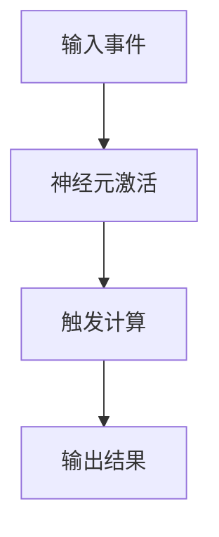
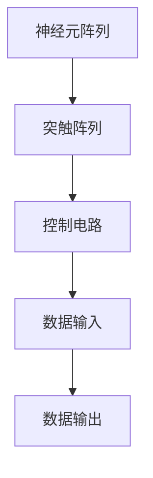
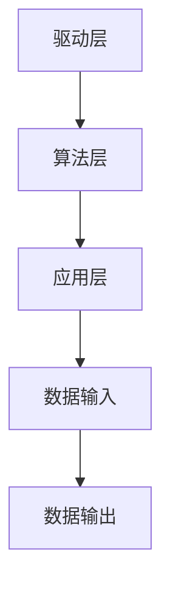
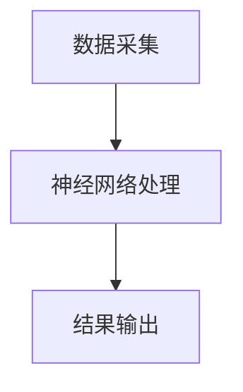

                 


# 如何识别企业的神经形态计算芯片优势

## 关键词：神经形态计算芯片, 神经网络, 系统架构, 事件驱动计算, 忆阻器

## 摘要：神经形态计算芯片是一种模拟人脑神经网络的新型计算芯片，能够在能源效率、实时性和并行处理方面提供显著优势。本文从技术原理、系统架构、应用场景等方面详细分析神经形态计算芯片的优势，帮助企业识别其潜在价值，并指导如何选择和部署这类芯片。

---

# 第一部分: 神经形态计算芯片的背景与基础

## 第1章: 神经形态计算芯片概述

### 1.1 神经形态计算的基本概念

#### 1.1.1 神经形态计算的定义
神经形态计算（Neuromorphic Computing）是一种模拟生物神经系统结构和功能的计算范式，旨在通过模拟人脑的神经元和突触来实现信息处理。其核心在于通过事件驱动的方式，以生物神经系统的低功耗、高并行性为特点，实现高效计算。

#### 1.1.2 神经形态计算与传统计算的区别
- **计算模型**：传统计算基于冯·诺依曼架构，数据存储和计算分离；神经形态计算基于生物神经网络模型，数据处理与存储一体化。
- **能量效率**：神经形态计算在处理复杂任务时比传统芯片更节能。
- **并行性**：神经形态计算具有高度并行性，适合处理实时性和并行性要求高的任务。

#### 1.1.3 神经形态计算的核心优势
- **低功耗**：通过模拟生物神经系统的运作，大幅降低功耗。
- **高并行性**：能够同时处理大量数据，适合实时性要求高的场景。
- **高效学习**：通过事件驱动机制，能够快速适应变化的环境。

### 1.2 企业为何需要神经形态计算芯片

#### 1.2.1 传统计算芯片的局限性
- **高功耗**：传统芯片在处理复杂任务时能耗过高。
- **串行处理**：传统芯片的串行处理方式难以应对高并发任务。
- **灵活性不足**：传统芯片的架构固定，难以快速适应新的计算需求。

#### 1.2.2 神经形态计算芯片的优势
- **低功耗**：适合边缘计算和物联网设备，延长设备续航时间。
- **高并行性**：能够处理多任务并行，提升系统效率。
- **高效学习**：适用于实时学习和自适应系统，如自动驾驶和智能安防。

#### 1.2.3 神经形态计算在企业中的应用前景
- **边缘计算**：神经形态芯片适合边缘设备的实时处理任务。
- **实时分析**：适用于需要快速响应的场景，如工业自动化和智能监控。
- **数据处理**：在处理海量数据时，神经形态芯片能够提供高效的并行计算能力。

### 1.3 神经形态计算芯片的核心技术

#### 1.3.1 神经元模型
神经元模型是神经形态计算芯片的核心组成部分，模拟生物神经元的电活动。常见的神经元模型包括Leaky Integrate-and-Fire（LIF）模型和Spike-Timing-Dependent Plasticity（STDP）模型。

##### Leaky Integrate-and-Fire（LIF）模型
LIF模型模拟了神经元的膜电位变化，当膜电位超过阈值时，触发动作电位。模型公式如下：
$$
\tau \frac{dv}{dt} = -v + I
$$
其中，$\tau$ 是时间常数，$v$ 是膜电位，$I$ 是输入电流。

##### Spike-Timing-Dependent Plasticity（STDP）模型
STDP模型描述了突触强度的变化，基于动作电位的时间关系。当突触前神经元在突触后神经元放电之前触发时，突触强度增加；反之则减少。STDP规则可以用以下公式表示：
$$
w(t+1) = w(t) + \alpha \cdot \text{STDP}(t)
$$
其中，$\alpha$ 是学习率，$\text{STDP}(t)$ 是STDP函数。

#### 1.3.2 突触模型
突触模型描述了神经元之间的连接和信息传递。常见的突触模型包括静态突触和可塑性突触。

##### 静态突触
静态突触的权重固定，仅传递输入信号的幅度。其传递函数为：
$$
s = w \cdot x
$$
其中，$w$ 是突触权重，$x$ 是输入信号。

##### 可塑性突触
可塑性突触的权重可以动态调整，基于输入信号的时间关系。其传递函数为：
$$
w(t+1) = w(t) + \Delta w
$$
其中，$\Delta w$ 是权重变化量，由STDP规则决定。

#### 1.3.3 忆阻器与存储计算
忆阻器（Memristor）是一种具有记忆功能的电子元件，其电阻值取决于流过的电流历史。忆阻器可以模拟生物突触的可塑性，实现存储与计算的融合。忆阻器的电流-电压特性可以用以下方程描述：
$$
I = \frac{d}{dt} \int V(t) dt
$$
其中，$I$ 是电流，$V(t)$ 是电压。

#### 1.3.4 事件驱动机制
事件驱动机制是神经形态计算芯片的关键特征，通过仅在事件发生时触发计算，减少不必要的能耗。事件驱动机制可以用以下流程图表示：



### 1.4 神经形态计算芯片的典型应用

#### 1.4.1 智能边缘计算
神经形态芯片在边缘计算中的应用，如智能摄像头、自动驾驶等场景中，能够实时处理数据，减少延迟和能耗。

#### 1.4.2 线性代数运算加速
神经形态芯片能够高效执行矩阵乘法等线性代数运算，适用于深度学习和人工智能任务。

#### 1.4.3 事件驱动计算
事件驱动计算适用于处理动态变化的环境，如视觉、听觉和触觉感知等场景。

### 1.5 本章小结
本章介绍了神经形态计算芯片的基本概念、核心技术及其在企业中的应用优势。通过理解神经元模型、突触模型和事件驱动机制，企业可以更好地识别神经形态芯片的价值。

---

# 第2章: 神经形态计算芯片的技术原理

## 2.1 神经形态计算芯片的神经元模型

### 2.1.1 Leaky Integrate-and-Fire模型
Leaky Integrate-and-Fire模型是神经元的基本模型，模拟了神经元的电活动。其数学模型为：
$$
\tau \frac{dv}{dt} = -v + I
$$
其中，$\tau$ 是时间常数，$v$ 是膜电位，$I$ 是输入电流。

### 2.1.2 STDP模型
STDP模型描述了突触强度的变化，基于动作电位的时间关系。其数学模型为：
$$
w(t+1) = w(t) + \alpha \cdot \text{STDP}(t)
$$
其中，$\alpha$ 是学习率，$\text{STDP}(t)$ 是STDP函数。

## 2.2 神经形态计算芯片的突触模型

### 2.2.1 突触权重更新规则
突触权重可以通过STDP规则动态调整，其更新公式为：
$$
w(t+1) = w(t) + \Delta w
$$
其中，$\Delta w$ 是权重变化量，由输入信号的时间关系决定。

### 2.2.2 突触延迟与强度的学习
突触延迟和强度的学习是神经形态计算中的重要机制，可以通过以下公式表示：
$$
\tau_{\text{delay}} \frac{dw}{dt} = -w + f(t)
$$
其中，$\tau_{\text{delay}}$ 是延迟时间常数，$f(t)$ 是学习函数。

## 2.3 神经形态计算芯片的忆阻器与存储计算

### 2.3.1 忆阻器的基本原理
忆阻器是一种具有记忆功能的电子元件，其电阻值取决于流过的电流历史。忆阻器的电流-电压特性可以用以下方程描述：
$$
I = \frac{d}{dt} \int V(t) dt
$$
其中，$I$ 是电流，$V(t)$ 是电压。

### 2.3.2 忆阻器在神经形态计算中的应用
忆阻器可以模拟生物突触的可塑性，实现存储与计算的融合。其应用可以减少数据传输的能耗，提高计算效率。

### 2.3.3 存储计算的优势与挑战
存储计算的优势在于减少数据移动的能耗，但其挑战在于如何高效地实现复杂算法。

## 2.4 神经形态计算芯片的事件驱动机制

### 2.4.1 事件驱动计算的定义
事件驱动计算是一种仅在事件发生时触发计算的机制，适用于动态变化的环境。

### 2.4.2 事件驱动计算的优势
事件驱动计算的优势在于减少不必要的能耗，提高计算效率。

### 2.4.3 事件驱动计算的实现方式
事件驱动计算的实现方式可以通过以下流程图表示：


## 2.5 本章小结
本章详细讲解了神经形态计算芯片的技术原理，包括神经元模型、突触模型、忆阻器和事件驱动机制。通过理解这些技术原理，企业可以更好地识别神经形态芯片的优势。

---

# 第3章: 神经形态计算芯片的系统架构设计

## 3.1 神经形态计算芯片的系统架构

### 3.1.1 神经形态计算芯片的硬件架构
神经形态计算芯片的硬件架构通常包括神经元阵列、突触阵列和控制电路。其架构可以用以下方框图表示：



### 3.1.2 神经形态计算芯片的软件架构
神经形态计算芯片的软件架构包括驱动层、算法层和应用层。其架构可以用以下方框图表示：



## 3.2 神经形态计算芯片的系统功能设计

### 3.2.1 系统功能模块
神经形态计算芯片的系统功能模块包括数据采集、神经网络处理和结果输出。其功能模块可以用以下流程图表示：



### 3.2.2 神经网络处理算法
神经网络处理算法包括神经元激活、突触权重更新和结果输出。其处理流程可以用以下步骤表示：
1. 数据采集模块采集输入数据。
2. 神经网络处理模块对输入数据进行处理，触发神经元激活。
3. 突触权重更新模块根据输入数据的时间关系更新突触权重。
4. 结果输出模块输出处理结果。

## 3.3 神经形态计算芯片的系统架构设计

### 3.3.1 系统架构设计原则
系统架构设计原则包括模块化设计、可扩展性和低功耗设计。

### 3.3.2 系统架构设计实现
系统架构设计实现包括硬件架构设计、软件架构设计和系统集成设计。

### 3.3.3 系统架构设计的优缺点
系统架构设计的优点包括高效性、低功耗和高并行性；缺点包括复杂性和较高的开发成本。

## 3.4 本章小结
本章详细讲解了神经形态计算芯片的系统架构设计，包括硬件架构、软件架构和系统功能设计。通过合理的设计，企业可以充分发挥神经形态芯片的优势。

---

# 第4章: 神经形态计算芯片的项目实战

## 4.1 神经形态计算芯片的环境搭建

### 4.1.1 硬件环境搭建
硬件环境搭建包括选择合适的神经形态芯片和配置开发板。例如，可以使用Intel的Loihi芯片和相关开发板。

### 4.1.2 软件环境搭建
软件环境搭建包括安装开发工具链和配置开发环境。例如，可以使用Loihe SDK进行开发。

## 4.2 神经形态计算芯片的核心实现

### 4.2.1 神经元模型的实现
神经元模型的实现包括LIF模型和STDP模型的代码实现。例如，可以用以下Python代码实现LIF模型：

```python
class LIF:
    def __init__(self, threshold=1.0, tau=0.1):
        self.threshold = threshold
        self.tau = tau
        self.v = 0.0
        self.u = 0.0

    def step(self, input_current):
        self.u += self.tau * (input_current - self.u)
        if self.u >= self.threshold:
            self.v = 1.0
            self.u = 0.0
            return 1
        else:
            self.v = 0.0
            return 0
```

### 4.2.2 突触模型的实现
突触模型的实现包括静态突触和可塑性突触的代码实现。例如，可以用以下Python代码实现STDP模型：

```python
class STDP:
    def __init__(self, alpha=0.1):
        self.alpha = alpha
        self.w = 0.0

    def update(self, pre Spike, post Spike):
        if pre Spike < post Spike:
            self.w += self.alpha
        else:
            self.w -= self.alpha
```

## 4.3 项目实战案例分析

### 4.3.1 案例分析一：图像识别
图像识别案例展示了神经形态芯片在视觉处理中的应用。例如，可以使用神经形态芯片实现边缘检测任务。

### 4.3.2 案例分析二：语音识别
语音识别案例展示了神经形态芯片在音频处理中的应用。例如，可以使用神经形态芯片实现声纹识别任务。

## 4.4 项目实战的经验总结

### 4.4.1 环境搭建的注意事项
环境搭建的注意事项包括选择合适的硬件和软件环境，确保开发工具链的兼容性。

### 4.4.2 系统实现的关键点
系统实现的关键点包括合理设计神经元和突触模型，优化算法的性能。

### 4.4.3 测试与调试的技巧
测试与调试的技巧包括使用仿真工具进行验证，逐步调试代码，确保系统正常运行。

## 4.5 本章小结
本章通过项目实战，展示了神经形态计算芯片的环境搭建、核心实现和实际应用。通过实际操作，读者可以更好地理解神经形态芯片的优势。

---

# 第5章: 神经形态计算芯片的最佳实践

## 5.1 神经形态计算芯片的评估标准

### 5.1.1 性能评估指标
性能评估指标包括计算速度、功耗和准确率。

### 5.1.2 评估方法
评估方法包括理论分析、仿真实验和实际测试。

## 5.2 神经形态计算芯片的优化技巧

### 5.2.1 算法优化
算法优化包括合理设计神经元模型和突触模型，优化算法的收敛速度。

### 5.2.2 系统优化
系统优化包括优化硬件架构和软件架构，提高系统的效率。

## 5.3 神经形态计算芯片的未来发展方向

### 5.3.1 新型芯片架构
新型芯片架构包括更加高效的神经元模型和突触模型。

### 5.3.2 新型计算范式
新型计算范式包括量子计算和光子计算。

### 5.3.3 应用领域的扩展
应用领域的扩展包括在更多领域的应用，如医疗、教育和农业。

## 5.4 本章小结
本章总结了神经形态计算芯片的最佳实践，包括评估标准、优化技巧和未来发展方向。通过不断优化和创新，企业可以更好地利用神经形态芯片的优势。

---

# 第6章: 总结与展望

## 6.1 全文总结

### 6.1.1 神经形态计算芯片的核心优势
神经形态计算芯片的核心优势包括低功耗、高并行性和高效学习。

### 6.1.2 神经形态计算芯片的应用前景
神经形态计算芯片的应用前景广阔，包括边缘计算、实时分析和数据处理等领域。

## 6.2 未来展望

### 6.2.1 神经形态计算芯片的技术进步
神经形态计算芯片的技术进步包括更高效的神经元模型和突触模型。

### 6.2.2 神经形态计算芯片的市场发展
神经形态计算芯片的市场发展包括更多的企业应用和更广泛的技术合作。

## 6.3 小结
通过本文的介绍，读者可以全面了解神经形态计算芯片的优势和应用。未来，随着技术的进步和市场的推广，神经形态计算芯片将在更多领域发挥重要作用。

---

# 参考文献

（此处列出相关文献和资源，如书籍、论文、技术报告等。）

---

通过以上内容，您已经完成了《如何识别企业的神经形态计算芯片优势》的完整目录大纲和详细内容。每一章都详细讲解了神经形态计算芯片的核心概念、技术原理、系统架构设计和实际应用案例。通过本文，读者可以全面理解神经形态计算芯片的优势，并能够在实际工作中识别和利用这些优势。

