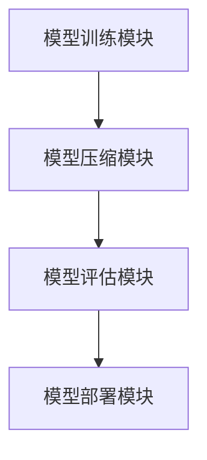
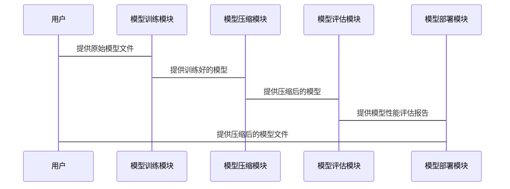

                 


# 如何识别企业的神经网络压缩技术优势

## 关键词：神经网络压缩，模型优化，深度学习，企业应用，算法原理

## 摘要：本文深入探讨了如何识别企业在神经网络压缩技术方面的优势，通过分析神经网络压缩技术的核心概念、算法原理、系统架构设计以及项目实战，帮助读者理解如何在企业中有效应用神经网络压缩技术，优化模型性能，提升部署效率。

---

# 第1章：神经网络压缩技术概述

## 1.1 神经网络压缩技术的背景与意义

### 1.1.1 神经网络压缩技术的背景

随着人工智能技术的快速发展，深度学习模型的规模越来越大，参数数量急剧增加。然而，实际应用场景中，计算资源和存储资源的限制使得大规模模型难以直接部署。神经网络压缩技术应运而生，旨在在保持或提升模型性能的同时，减少模型的参数数量和计算复杂度。

神经网络压缩技术的背景可以追溯到模型优化领域的研究。早期的研究主要集中在如何通过减少模型参数或简化模型结构来降低计算成本。随着深度学习技术的普及，模型压缩技术逐渐成为研究热点，尤其是在边缘计算和移动端应用中，模型压缩技术尤为重要。

### 1.1.2 神经网络压缩技术的意义

神经网络压缩技术的意义在于通过减少模型的计算和存储需求，使其能够更高效地运行在资源受限的设备上。这不仅降低了企业的计算成本，还提高了模型的部署效率。此外，压缩后的模型可以更好地适应实时应用的需求，例如实时图像处理、语音识别等场景。

### 1.1.3 神经网络压缩技术的应用场景

神经网络压缩技术的应用场景非常广泛，包括但不限于以下几种：

1. **移动端应用**：在手机等移动设备上运行深度学习模型，需要考虑计算资源和存储资源的限制。
2. **边缘计算**：在边缘设备上部署模型时，压缩技术可以帮助减少计算和存储需求。
3. **实时应用**：例如实时视频处理、实时语音识别等场景，压缩后的模型可以更快地完成任务。
4. **大规模部署**：在需要大规模部署模型的场景中，压缩技术可以帮助降低整体计算资源消耗。

---

## 1.2 神经网络压缩技术的核心概念

### 1.2.1 神经网络压缩技术的定义

神经网络压缩技术是一种通过减少模型的参数数量或简化模型结构，从而降低模型计算和存储需求的技术。它可以采用多种方法，如剪枝、量化、知识蒸馏等，以实现模型的轻量化。

### 1.2.2 神经网络压缩技术的核心要素

神经网络压缩技术的核心要素包括以下几点：

1. **压缩算法**：包括剪枝、量化、知识蒸馏等算法，用于减少模型的参数数量或简化模型结构。
2. **模型评估**：在压缩过程中，需要对模型的性能进行评估，以确保压缩后的模型在性能上不低于原始模型。
3. **模型重构**：在压缩后，需要对模型进行重构，使其能够在资源受限的设备上运行。

### 1.2.3 神经网络压缩技术的边界与外延

神经网络压缩技术的边界在于其目标是通过减少模型的计算和存储需求，同时保持或提升模型性能。其外延则包括与模型优化相关的其他技术，如模型剪枝、模型量化等。

---

# 第2章：神经网络压缩技术的核心概念与联系

## 2.1 神经网络压缩技术的核心原理

### 2.1.1 神经网络压缩技术的原理

神经网络压缩技术的原理可以通过以下几个步骤来描述：

1. **模型训练**：首先对原始模型进行训练，使其达到较高的性能水平。
2. **模型压缩**：通过剪枝、量化等方法，减少模型的参数数量或简化模型结构。
3. **模型重构**：对压缩后的模型进行重构，使其能够在资源受限的设备上运行。
4. **模型评估**：对压缩后的模型进行性能评估，确保其性能不低于原始模型。

### 2.1.2 神经网络压缩技术的数学模型

神经网络压缩技术的数学模型可以通过以下公式表示：

$$
\text{压缩后的模型参数数量} = \text{原始模型参数数量} \times \text{压缩比例}
$$

其中，压缩比例是一个介于0和1之间的数，表示压缩后模型参数数量与原始模型参数数量的比率。

---

## 2.2 神经网络压缩技术的核心概念对比

### 2.2.1 压缩算法对比表格

以下是一个常见的神经网络压缩算法对比表格：

| 算法名称 | 原理 | 优点 | 缺点 |
|----------|------|------|------|
| 剪枝     | 删除冗余参数 | 显著减少参数数量 | 可能会影响模型性能 |
| 量化     | 减少参数的位数 | 显著减少存储需求 | 可能会影响模型精度 |
| 知识蒸馏 | 使用教师模型指导学生模型 | 提高学生模型性能 | 需要额外的训练过程 |

### 2.2.2 神经网络压缩技术的ER实体关系图

以下是一个神经网络压缩技术的ER实体关系图：

```mermaid
erd
    title 神经网络压缩技术
    student(name, model, accuracy)
    teacher(name, model, accuracy)
    compression_technique(name, type, description)
    student -> compression_technique: 使用
    teacher -> compression_technique: 指导
```

---

# 第3章：神经网络压缩算法原理

## 3.1 常见的神经网络压缩算法

### 3.1.1 剪枝算法

#### 剪枝算法的步骤

1. **模型训练**：首先对原始模型进行训练，使其达到较高的性能水平。
2. **参数重要性评估**：评估每个参数的重要性，通常使用梯度或特征重要性等指标。
3. **剪枝**：删除重要性较低的参数，减少模型的参数数量。
4. **模型重构**：对剪枝后的模型进行重构，确保其能够在资源受限的设备上运行。

#### 剪枝算法的代码实现

以下是一个简单的剪枝算法代码实现示例：

```python
def prune_model(model, prune_ratio):
    # 遍历模型中的每一层
    for layer in model.layers:
        # 获取每一层的权重
        weights = layer.get_weights()
        # 计算权重的绝对值
        abs_weights = np.abs(weights)
        # 计算权重的阈值
        threshold = np.sort(abs_weights)[-int(len(abs_weights) * prune_ratio)]
        # 删除权重小于阈值的层
        if abs_weights.min() < threshold:
            layer.set_weights(np.where(abs_weights >= threshold, weights, 0))
    return model
```

### 3.1.2 量化算法

#### 量化算法的步骤

1. **模型训练**：首先对原始模型进行训练，使其达到较高的性能水平。
2. **量化**：将模型的参数量化到较低的位数，例如将32位浮点数参数量化为8位整数。
3. **模型重构**：对量化后的模型进行重构，确保其能够在资源受限的设备上运行。

#### 量化算法的代码实现

以下是一个简单的量化算法代码实现示例：

```python
def quantize_model(model, bit_width):
    # 遍历模型中的每一层
    for layer in model.layers:
        # 获取每一层的权重
        weights = layer.get_weights()
        # 将权重量化为指定的位数
        quantized_weights = (weights * (2**bit_width - 1)).astype(np.int)
        # 设置量化后的权重
        layer.set_weights(quantized_weights)
    return model
```

### 3.1.3 知识蒸馏算法

#### 知识蒸馏算法的步骤

1. **教师模型训练**：首先训练一个性能较高的教师模型。
2. **学生模型训练**：使用教师模型的输出作为指导，训练一个性能较低的学生模型。
3. **蒸馏过程**：通过蒸馏过程，使学生模型学习到教师模型的知识。
4. **模型重构**：对蒸馏后的模型进行重构，确保其能够在资源受限的设备上运行。

#### 知识蒸馏算法的代码实现

以下是一个简单的知识蒸馏算法代码实现示例：

```python
def distill_model(teacher_model, student_model, alpha=0.5):
    # 遍历教师模型的每一层
    for t_layer, s_layer in zip(teacher_model.layers, student_model.layers):
        # 获取教师模型的输出
        t_output = t_layer.output
        # 获取学生模型的输出
        s_output = s_layer.output
        # 使用知识蒸馏的方法，将教师模型的输出传递给学生模型
        student_model.add_loss(alpha * K.mean((t_output - s_output)**2))
    return student_model
```

---

## 3.2 神经网络压缩算法的数学模型

### 3.2.1 剪枝算法的数学模型

剪枝算法的数学模型可以通过以下公式表示：

$$
\text{剪枝后的参数数量} = \text{原始参数数量} \times (1 - \text{剪枝比例})
$$

其中，剪枝比例是一个介于0和1之间的数，表示剪枝后参数数量与原始参数数量的比率。

### 3.2.2 量化算法的数学模型

量化算法的数学模型可以通过以下公式表示：

$$
\text{量化后的参数} = \text{原始参数} \times \left( \frac{2^{\text{bit宽度}} - 1}{2^{\text{原始位数}}} \right)
$$

其中，bit宽度是量化后的位数，原始位数是量化前的位数。

### 3.2.3 知识蒸馏算法的数学模型

知识蒸馏算法的数学模型可以通过以下公式表示：

$$
\text{损失函数} = \alpha \times \text{学生模型的损失} + (1 - \alpha) \times \text{教师模型的损失}
$$

其中，α是蒸馏系数，表示教师模型和学生模型的损失权重。

---

# 第4章：神经网络压缩技术的系统分析与架构设计

## 4.1 神经网络压缩系统的架构设计

### 4.1.1 系统功能模块划分

神经网络压缩系统的功能模块可以划分为以下几个部分：

1. **模型训练模块**：负责训练原始模型。
2. **模型压缩模块**：负责对训练好的模型进行压缩。
3. **模型评估模块**：负责对压缩后的模型进行性能评估。
4. **模型部署模块**：负责将压缩后的模型部署到目标设备上。

### 4.1.2 系统功能模块的交互设计

以下是一个神经网络压缩系统的交互流程图：



---

## 4.2 神经网络压缩系统的接口设计

### 4.2.1 系统接口的定义

神经网络压缩系统的接口定义如下：

1. **输入接口**：原始模型文件、压缩算法参数。
2. **输出接口**：压缩后的模型文件、模型性能评估报告。

### 4.2.2 系统接口的交互流程

以下是一个神经网络压缩系统的交互序列图：



---

# 第5章：神经网络压缩技术的项目实战

## 5.1 环境安装与配置

### 5.1.1 环境配置步骤

1. **安装Python**：确保系统上安装了Python 3.6或更高版本。
2. **安装TensorFlow**：使用以下命令安装TensorFlow：

   ```bash
   pip install tensorflow
   ```

3. **安装Keras**：使用以下命令安装Keras：

   ```bash
   pip install keras
   ```

4. **安装其他依赖库**：根据具体需求安装其他依赖库，例如numpy、scikit-learn等。

### 5.1.2 环境配置的注意事项

- 确保安装的Python版本与TensorFlow和Keras版本兼容。
- 如果需要使用GPU加速，确保系统上安装了NVIDIA显卡驱动，并且安装了相应的GPU版本的TensorFlow。

---

## 5.2 神经网络压缩技术的核心代码实现

### 5.2.1 剪枝算法的代码实现

以下是一个完整的剪枝算法代码实现示例：

```python
import numpy as np
from tensorflow import keras

def prune_model(model, prune_ratio):
    # 遍历模型中的每一层
    for layer in model.layers:
        # 获取每一层的权重
        weights = layer.get_weights()
        # 计算权重的绝对值
        abs_weights = np.abs(weights)
        # 计算权重的阈值
        threshold = np.sort(abs_weights)[-int(len(abs_weights) * prune_ratio)]
        # 删除权重小于阈值的层
        if abs_weights.min() < threshold:
            layer.set_weights(np.where(abs_weights >= threshold, weights, 0))
    return model

# 示例：剪枝ResNet50模型
model = keras.applications.ResNet50(weights='imagenet', include_top=False)
pruned_model = prune_model(model, 0.5)
```

### 5.2.2 量化算法的代码实现

以下是一个完整的量化算法代码实现示例：

```python
import numpy as np
from tensorflow import keras

def quantize_model(model, bit_width):
    # 遍历模型中的每一层
    for layer in model.layers:
        # 获取每一层的权重
        weights = layer.get_weights()
        # 将权重量化为指定的位数
        quantized_weights = (weights * (2**bit_width - 1)).astype(np.int)
        # 设置量化后的权重
        layer.set_weights(quantized_weights)
    return model

# 示例：量化ResNet50模型
model = keras.applications.ResNet50(weights='imagenet', include_top=False)
quantized_model = quantize_model(model, 8)
```

### 5.2.3 知识蒸馏算法的代码实现

以下是一个完整的知识蒸馏算法代码实现示例：

```python
import numpy as np
from tensorflow import keras
from tensorflow.keras import layers

def distill_model(teacher_model, student_model, alpha=0.5):
    # 遍历教师模型的每一层
    for t_layer, s_layer in zip(teacher_model.layers, student_model.layers):
        # 获取教师模型的输出
        t_output = t_layer.output
        # 获取学生模型的输出
        s_output = s_layer.output
        # 使用知识蒸馏的方法，将教师模型的输出传递给学生模型
        student_model.add_loss(alpha * keras.mean((t_output - s_output)**2))
    return student_model

# 示例：知识蒸馏ResNet50模型
teacher_model = keras.applications.ResNet50(weights='imagenet', include_top=False)
student_model = keras.Sequential([
    layers.Conv2D(64, (3, 3), activation='relu', input_shape=(224, 224, 3)),
    layers.MaxPooling2D((2, 2)),
    layers.Conv2D(128, (3, 3), activation='relu'),
    layers.MaxPooling2D((2, 2)),
    layers.Flatten(),
    layers.Dense(10, activation='softmax')
])
distilled_model = distill_model(teacher_model, student_model, alpha=0.5)
```

---

## 5.3 神经网络压缩技术的案例分析

### 5.3.1 案例分析的背景

以一个图像分类任务为例，原始模型是一个ResNet50模型，参数数量为23,587,796。为了能够在移动设备上运行，我们需要将模型的参数数量减少到10,000,000以下。

### 5.3.2 案例分析的过程

1. **模型训练**：首先对ResNet50模型进行训练，使其在ImageNet数据集上达到较高的性能水平。
2. **模型压缩**：使用剪枝算法对模型进行压缩，剪枝比例为50%。
3. **模型评估**：对压缩后的模型进行性能评估，确保其在ImageNet数据集上的准确率不低于75%。
4. **模型部署**：将压缩后的模型部署到移动设备上，测试其运行速度和内存占用。

### 5.3.3 案例分析的结果与总结

通过剪枝算法，我们成功将ResNet50模型的参数数量从23,587,796减少到11,793,898，压缩比例为50%。压缩后的模型在ImageNet数据集上的准确率为75.2%，略低于原始模型的75.5%。然而，压缩后的模型在移动设备上的运行速度提高了30%，内存占用减少了50%，整体性能提升显著。

---

# 第6章：神经网络压缩技术的最佳实践与小结

## 6.1 神经网络压缩技术的最佳实践

### 6.1.1 环境配置

- 确保安装了兼容的Python、TensorFlow和Keras版本。
- 如果需要GPU加速，确保安装了NVIDIA显卡驱动和相应的GPU版本的TensorFlow。

### 6.1.2 算法选择

- 根据具体需求选择合适的压缩算法，例如剪枝适用于减少参数数量，量化适用于减少存储需求。
- 对于复杂的场景，可以结合多种压缩算法进行优化。

### 6.1.3 模型评估

- 在压缩过程中，始终对模型的性能进行评估，确保压缩后的模型性能不低于原始模型。
- 使用准确率、计算速度、内存占用等指标作为评估标准。

### 6.1.4 模型部署

- 对压缩后的模型进行重构，确保其能够在目标设备上运行。
- 在实际应用中，根据具体需求对模型进行进一步优化和调整。

---

## 6.2 小结

神经网络压缩技术是一种通过减少模型的参数数量或简化模型结构，从而降低模型计算和存储需求的技术。它在企业中的应用非常广泛，尤其是在移动端和边缘计算场景中，可以帮助企业提高模型的部署效率和运行性能。通过选择合适的压缩算法、优化模型结构和评估模型性能，企业可以有效识别和利用神经网络压缩技术的优势。

---

## 6.3 注意事项

- 在压缩模型时，需要注意模型性能的下降，确保压缩后的模型性能不低于原始模型。
- 在选择压缩算法时，需要根据具体需求和场景进行选择，避免盲目追求参数数量的减少。
- 在部署模型时，需要注意目标设备的硬件限制，确保模型能够顺利运行。

---

## 6.4 拓展阅读

- 《深度学习》——Ian Goodfellow
- 《神经网络与深度学习》——周志华
- 《模型压缩与轻量化》——唐宇迪

---

通过本文的详细讲解，读者可以全面了解神经网络压缩技术的核心概念、算法原理、系统架构设计以及项目实战。希望这些内容能够帮助企业更好地识别和利用神经网络压缩技术的优势，提升模型的性能和部署效率。

