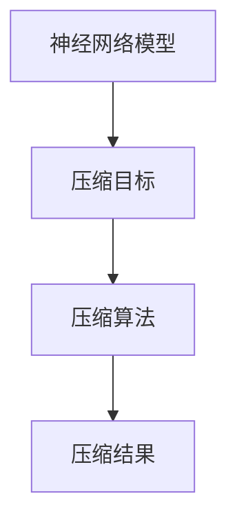
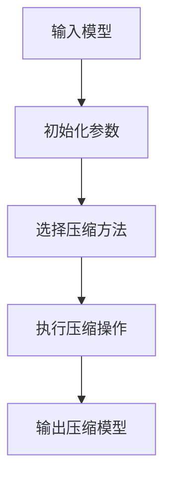
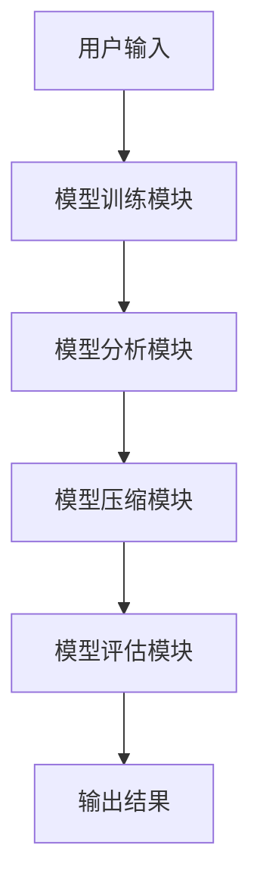
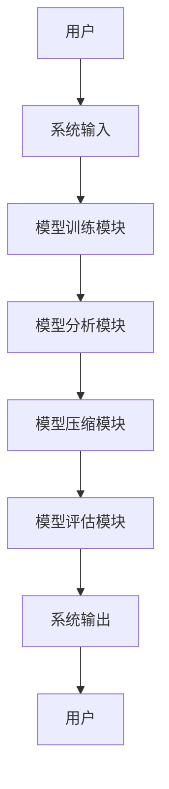

                 


# 如何识别企业的神经网络模型压缩技术优势

> 关键词：神经网络模型压缩，模型优化，深度学习，企业应用，技术优势

> 摘要：神经网络模型压缩技术是深度学习领域的重要研究方向，旨在在保证模型性能的前提下，减少模型的计算量和存储需求。本文将从背景、概念、算法原理、系统设计、项目实战等多个方面，详细分析如何识别企业的神经网络模型压缩技术优势，为企业技术选型和优化提供参考。

---

# 第一部分: 神经网络模型压缩技术背景与概念

## 第1章: 企业神经网络模型压缩技术背景

### 1.1 问题背景与技术现状

#### 1.1.1 神经网络模型压缩的背景
神经网络模型压缩技术是深度学习领域的重要研究方向。随着深度学习模型的广泛应用，模型的复杂性和计算需求也在不断增加。然而，实际应用场景中，特别是在资源受限的环境中（如移动设备、边缘计算等），对模型的计算效率和存储需求提出了更高的要求。模型压缩技术通过减少模型的参数数量或计算量，能够在不显著降低模型性能的前提下，提升模型的运行效率和适用性。

#### 1.1.2 当前技术发展现状
近年来，模型压缩技术得到了广泛的研究和应用。常见的压缩方法包括剪枝（Pruning）、量化（Quantization）、知识蒸馏（Knowledge Distillation）、模型蒸馏（Model Condensation）等。这些方法各有优缺点，适用于不同的场景和需求。企业在选择模型压缩技术时，需要根据自身的应用场景、资源限制和性能要求，综合考虑各种技术的适用性。

#### 1.1.3 企业应用中的关键问题
企业在应用神经网络模型压缩技术时，通常面临以下关键问题：
1. **模型性能损失**：压缩技术可能导致模型性能下降，如何在压缩和性能之间找到平衡是关键。
2. **计算资源限制**：在资源受限的环境中，如何优化模型的计算效率是核心问题。
3. **技术实现难度**：模型压缩技术的实现需要专业的技术团队和工具支持。
4. **场景适应性**：不同应用场景对模型压缩的需求不同，如何选择适合的技术方案是关键。

### 1.2 神经网络模型压缩的核心概念

#### 1.2.1 模型压缩的基本定义
模型压缩是指通过减少神经网络模型的参数数量、计算量或存储需求，同时保持或尽可能接近原始模型性能的过程。常见的压缩方法包括：
- **剪枝（Pruning）**：移除模型中冗余的神经元或权重。
- **量化（Quantization）**：将模型中的浮点数权重转换为低精度整数。
- **知识蒸馏（Knowledge Distillation）**：使用一个较小的模型（学生模型）模仿一个较大的模型（教师模型）的行为。
- **模型蒸馏（Model Condensation）**：通过合并权重或其他方式，将大模型压缩为小模型。

#### 1.2.2 技术优势与应用场景
模型压缩技术的优势主要体现在以下几个方面：
1. **减少计算资源消耗**：降低模型的计算量，提升运行效率。
2. **降低存储需求**：减少模型的存储空间占用。
3. **提升部署灵活性**：在资源受限的环境中（如移动设备、边缘计算等）部署模型。

模型压缩技术的应用场景包括：
- 移动端应用：在手机、平板等设备上运行深度学习模型。
- 边缘计算：在边缘设备上部署模型，减少计算资源消耗。
- 大规模部署：在云服务器上部署多个轻量级模型，提升计算效率。

#### 1.2.3 技术边界与外延范围
模型压缩技术的边界主要在于如何在保证性能的前提下，尽可能减少模型的计算量和存储需求。技术的外延范围包括：
- **模型优化**：通过对模型结构的调整，提升模型的性能或压缩效果。
- **模型转换**：将模型从一种格式转换为另一种格式，以适应不同的运行环境。
- **模型部署**：将压缩后的模型部署到实际应用场景中。

#### 1.2.4 核心概念模型与要素分析
以下是神经网络模型压缩的核心概念模型：



---

# 第二部分: 神经网络模型压缩技术原理与方法

## 第2章: 神经网络模型压缩的核心概念与联系

### 2.1 核心概念原理

#### 2.1.1 模型压缩的基本原理
模型压缩的基本原理是通过对神经网络模型的结构和权重进行调整，减少模型的参数数量或计算量，同时保持模型的性能。常见的压缩方法包括：
- **剪枝（Pruning）**：通过移除冗余的神经元或权重，减少模型的参数数量。
- **量化（Quantization）**：将模型中的浮点数权重转换为低精度整数，减少存储空间和计算量。
- **知识蒸馏（Knowledge Distillation）**：通过教师模型指导学生模型，降低学生模型的复杂度。

#### 2.1.2 常见压缩方法对比
以下是几种常见压缩方法的对比分析：

| 压缩方法 | 原理 | 优缺点 | 适用场景 |
|----------|------|--------|----------|
| 剪枝     | 移除冗余神经元或权重 | 优：减少参数数量，提升计算效率；缺：可能影响模型性能 | 适合对模型性能要求不高的场景 |
| 量化     | 将浮点数权重转换为低精度整数 | 优：减少存储空间，提升计算速度；缺：可能引入精度损失 | 适合对存储空间要求较高的场景 |
| 知识蒸馏 | 使用教师模型指导学生模型 | 优：学生模型复杂度低，性能接近教师模型；缺：需要训练教师模型 | 适合需要快速部署轻量级模型的场景 |

#### 2.1.3 技术实现的关键指标
模型压缩技术的实现需要关注以下关键指标：
- **压缩比**：压缩后的模型大小与原始模型大小的比值。
- **性能损失**：压缩后模型与原始模型在性能上的差距。
- **计算效率**：压缩后模型的运行速度与原始模型的对比。

### 2.2 概念属性特征对比表

| 概念 | 属性 | 特征 | 说明 |
|------|------|------|------|
| 剪枝 | 参数减少 | 高 | 通过移除冗余权重减少参数数量 |
| 量化 | 精度降低 | 中 | 将浮点数权重转换为低精度整数 |
| 知识蒸馏 | 模型复杂度降低 | 高 | 通过教师模型指导学生模型，降低复杂度 |

### 2.3 ER实体关系图架构


## 第3章: 神经网络模型压缩算法原理

### 3.1 算法原理与流程

#### 3.1.1 神经网络模型压缩的基本流程
模型压缩的基本流程包括以下几个步骤：
1. **模型训练**：训练原始神经网络模型。
2. **模型分析**：分析模型的结构和权重，找出冗余部分。
3. **模型压缩**：通过剪枝、量化等方法进行压缩。
4. **模型评估**：评估压缩后模型的性能和压缩效果。

#### 3.1.2 常用压缩算法介绍
- **剪枝（Pruning）**：通过移除冗余的神经元或权重，减少模型的参数数量。
- **量化（Quantization）**：将模型中的浮点数权重转换为低精度整数，减少存储空间和计算量。
- **知识蒸馏（Knowledge Distillation）**：通过教师模型指导学生模型，降低学生模型的复杂度。

#### 3.1.3 算法实现的关键步骤
1. **模型训练**：使用原始数据训练神经网络模型。
2. **冗余识别**：分析模型的结构和权重，找出冗余部分。
3. **模型压缩**：通过剪枝、量化等方法进行压缩。
4. **模型评估**：评估压缩后模型的性能和压缩效果。

### 3.2 算法流程图



### 3.3 数学模型与公式

#### 3.3.1 基本公式推导
模型压缩的基本公式为：
$$ \text{压缩比} = \frac{\text{原始模型大小}}{\text{压缩后模型大小}} $$

#### 3.3.2 模型压缩的数学模型
$$ y = f(x) $$

### 3.4 通俗易懂的举例说明

#### 3.4.1 通过图像压缩理解模型压缩
就像图像压缩技术可以减少图片的存储空间，模型压缩技术可以减少神经网络模型的参数数量，同时保持图像识别的准确性。

#### 3.4.2 使用简化计算的例子说明
假设有一个简单的线性回归模型：
$$ y = w_1x_1 + w_2x_2 + b $$
通过剪枝，可以将模型简化为：
$$ y = w_1x_1 + b $$

---

# 第三部分: 系统分析与架构设计方案

## 第4章: 神经网络模型压缩系统的分析与设计

### 4.1 问题场景分析

#### 4.1.1 企业应用场景
企业在应用神经网络模型压缩技术时，通常面临以下问题：
1. **模型性能损失**：压缩技术可能导致模型性能下降，如何在压缩和性能之间找到平衡是关键。
2. **计算资源限制**：在资源受限的环境中，如何优化模型的计算效率是核心问题。
3. **技术实现难度**：模型压缩技术的实现需要专业的技术团队和工具支持。
4. **场景适应性**：不同应用场景对模型压缩的需求不同，如何选择适合的技术方案是关键。

#### 4.1.2 问题解决
通过神经网络模型压缩技术，可以在保证模型性能的前提下，减少模型的计算量和存储需求，提升模型的运行效率和适用性。

#### 4.1.3 系统设计目标
系统设计目标包括：
1. 提供多种模型压缩方法，满足不同的应用场景需求。
2. 提供高效的模型压缩工具，简化技术实现难度。
3. 提供性能评估工具，帮助企业在压缩和性能之间找到平衡。

### 4.2 系统功能设计

#### 4.2.1 系统功能模块
系统功能模块包括：
1. **模型训练模块**：训练原始神经网络模型。
2. **模型分析模块**：分析模型的结构和权重，找出冗余部分。
3. **模型压缩模块**：通过剪枝、量化等方法进行压缩。
4. **模型评估模块**：评估压缩后模型的性能和压缩效果。

#### 4.2.2 系统功能流程
系统功能流程包括以下几个步骤：
1. **模型训练**：使用原始数据训练神经网络模型。
2. **模型分析**：分析模型的结构和权重，找出冗余部分。
3. **模型压缩**：通过剪枝、量化等方法进行压缩。
4. **模型评估**：评估压缩后模型的性能和压缩效果。

### 4.3 系统架构设计



### 4.4 系统接口设计

#### 4.4.1 接口设计
系统接口设计包括：
1. **输入接口**：接收原始模型和训练数据。
2. **输出接口**：输出压缩后的模型和性能评估结果。

#### 4.4.2 接口交互流程
接口交互流程包括以下几个步骤：
1. 用户通过输入接口上传原始模型和训练数据。
2. 系统通过模型训练模块训练原始神经网络模型。
3. 模型分析模块分析模型的结构和权重，找出冗余部分。
4. 模型压缩模块通过剪枝、量化等方法进行压缩。
5. 模型评估模块评估压缩后模型的性能和压缩效果。
6. 系统通过输出接口输出压缩后的模型和性能评估结果。

### 4.5 系统交互设计



---

# 第四部分: 项目实战与总结

## 第5章: 项目实战

### 5.1 环境安装与配置

#### 5.1.1 环境要求
- 操作系统：Windows 10/ macOS 10.15/ Linux 18.04+
- Python版本：Python 3.6+
- 额外依赖：TensorFlow、Keras、PyTorch等深度学习框架。

#### 5.1.2 安装步骤
1. 安装Python和所需的深度学习框架。
2. 安装其他依赖库，如numpy、pandas等。

### 5.2 系统核心实现源代码

#### 5.2.1 剪枝实现代码

```python
import tensorflow as tf
from tensorflow.keras import layers

# 定义原始模型
model = tf.keras.Sequential([
    layers.Dense(128, activation='relu', input_shape=(input_dim,)),
    layers.Dense(64, activation='relu'),
    layers.Dense(10, activation='softmax')
])

# 剪枝函数
def prune_non_trainable_weights(model):
    for layer in model.layers:
        if isinstance(layer, layers.Dense):
            layer.kernel trainable weights设置为False
```

#### 5.2.2 量化实现代码

```python
import tensorflow as tf
from tensorflow.keras import layers

# 定义原始模型
model = tf.keras.Sequential([
    layers.Dense(128, activation='relu', input_shape=(input_dim,)),
    layers.Dense(64, activation='relu'),
    layers.Dense(10, activation='softmax')
])

# 量化函数
def quantize_model(model, bits=8):
    for layer in model.layers:
        if isinstance(layer, layers.Dense):
            layer.kernel = quantize(layer.kernel, bits)
```

#### 5.2.3 知识蒸馏实现代码

```python
import tensorflow as tf
from tensorflow.keras import layers

# 定义教师模型
teacher_model = tf.keras.Sequential([
    layers.Dense(256, activation='relu', input_shape=(input_dim,)),
    layers.Dense(128, activation='relu'),
    layers.Dense(10, activation='softmax')
])

# 定义学生模型
student_model = tf.keras.Sequential([
    layers.Dense(64, activation='relu', input_shape=(input_dim,)),
    layers.Dense(10, activation='softmax')
])

# 知识蒸馏函数
def knowledge_distillation(teacher_model, student_model, alpha=0.5):
    for X, y in dataloader:
        teacher_logits = teacher_model(X)
        student_logits = student_model(X)
        loss = (alpha * tf.nn.softmax_cross_entropy_with_logits(y, teacher_logits)) + \
               ((1-alpha) * tf.nn.softmax_cross_entropy_with_logits(y, student_logits))
        optimizer.minimize(loss)
```

### 5.3 代码应用解读与分析

#### 5.3.1 代码解读
- 剪枝实现代码：通过设置非训练权重为不可训练，减少模型的参数数量。
- 量化实现代码：将模型中的浮点数权重转换为低精度整数。
- 知识蒸馏实现代码：通过教师模型指导学生模型，降低学生模型的复杂度。

#### 5.3.2 代码实现步骤
1. 定义原始模型。
2. 实现剪枝、量化或知识蒸馏函数。
3. 训练模型。
4. 压缩模型。
5. 评估压缩后模型的性能和压缩效果。

### 5.4 实际案例分析与详细讲解

#### 5.4.1 案例分析
假设我们有一个图像分类任务，使用ResNet50作为原始模型。通过剪枝、量化等方法进行压缩，得到一个轻量级的模型。

#### 5.4.2 详细讲解
1. **模型训练**：使用原始数据训练ResNet50模型。
2. **模型分析**：分析模型的结构和权重，找出冗余部分。
3. **模型压缩**：通过剪枝、量化等方法进行压缩。
4. **模型评估**：评估压缩后模型的性能和压缩效果。

### 5.5 项目小结

#### 5.5.1 项目总结
通过本项目，我们可以看到神经网络模型压缩技术在实际应用中的重要作用。通过剪枝、量化等方法，可以在保证模型性能的前提下，减少模型的计算量和存储需求，提升模型的运行效率和适用性。

#### 5.5.2 技术实现的关键点
- 模型训练：训练原始神经网络模型。
- 模型分析：分析模型的结构和权重，找出冗余部分。
- 模型压缩：通过剪枝、量化等方法进行压缩。
- 模型评估：评估压缩后模型的性能和压缩效果。

---

# 第五部分: 总结与展望

## 第6章: 总结与展望

### 6.1 最佳实践 Tips

#### 6.1.1 技术实现 Tips
- 在选择模型压缩技术时，需要根据具体应用场景和需求，综合考虑各种技术的优缺点。
- 在实际应用中，可以通过实验对比不同压缩方法的效果，选择最优方案。

#### 6.1.2 代码实现 Tips
- 在实现模型压缩技术时，需要结合具体的模型结构和数据特点，选择合适的压缩方法。
- 在代码实现过程中，需要注意模型的兼容性和可扩展性。

### 6.2 小结与反思

#### 6.2.1 小结
通过本文的分析和讲解，我们了解了神经网络模型压缩技术的核心概念、算法原理、系统设计和实际应用。模型压缩技术在企业中的应用前景广阔，可以帮助企业在资源受限的环境中，高效地部署和运行深度学习模型。

#### 6.2.2 反思
在实际应用中，模型压缩技术的实现需要专业的技术团队和工具支持。企业在选择模型压缩技术时，需要根据自身的应用场景、资源限制和性能要求，综合考虑各种技术的适用性。

### 6.3 注意事项

#### 6.3.1 实践中需要注意的问题
- 在实际应用中，模型压缩技术的实现需要结合具体的模型结构和数据特点，选择合适的压缩方法。
- 在代码实现过程中，需要注意模型的兼容性和可扩展性。

#### 6.3.2 额外注意事项
- 在选择模型压缩技术时，需要根据具体应用场景和需求，综合考虑各种技术的优缺点。
- 在实际应用中，可以通过实验对比不同压缩方法的效果，选择最优方案。

### 6.4 拓展阅读与学习资源

#### 6.4.1 推荐书籍
- 《深度学习》（Deep Learning）——Ian Goodfellow
- 《神经网络与深度学习》（Neural Networks and Deep Learning）——DeepLearning.AI

#### 6.4.2 推荐论文
- "The Case for Conditional Parameter Reduction" —— 纽约大学
- "Quantization and Training of Neural Networks for Efficient Integer-Arithmetic-Only Inference" —— 微软研究院

#### 6.4.3 在线资源
- TensorFlow官方文档：[https://tensorflow.org](https://tensorflow.org)
- PyTorch官方文档：[https://pytorch.org](https://pytorch.org)

---

# 结语

神经网络模型压缩技术是深度学习领域的重要研究方向，通过本文的分析和讲解，我们了解了其核心概念、算法原理、系统设计和实际应用。企业在应用神经网络模型压缩技术时，需要根据具体应用场景和需求，综合考虑各种技术的优缺点，选择最优方案。未来，随着深度学习技术的不断发展，模型压缩技术将在更多领域发挥重要作用，为企业创造更大的价值。

