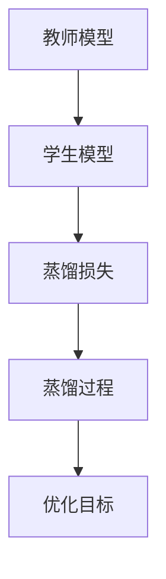
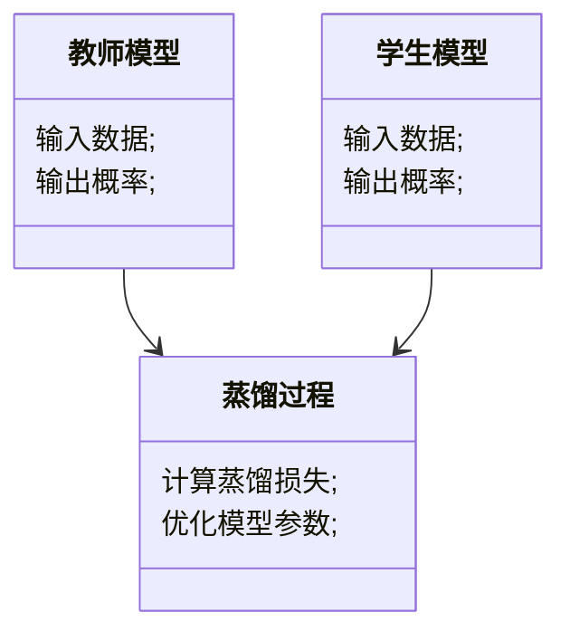
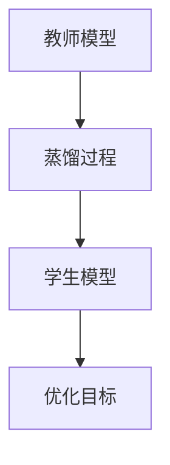
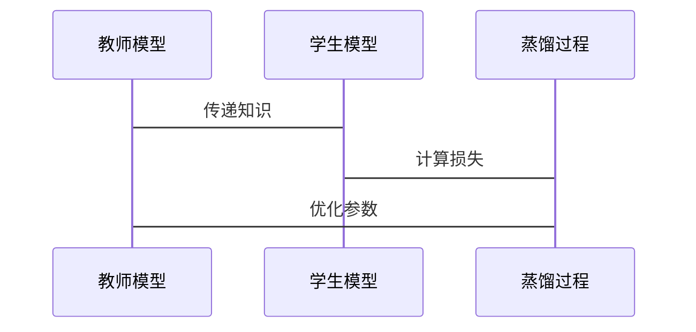

                 


# 如何识别企业的神经网络模型蒸馏技术优势

> 关键词：神经网络模型蒸馏，企业技术优势，模型压缩，知识蒸馏，深度学习，机器学习优化

> 摘要：本文将深入探讨如何识别企业在使用神经网络模型蒸馏技术时的优势。通过分析蒸馏技术的核心概念、算法原理、系统架构设计和项目实战，本文将为读者提供一套识别和评估企业蒸馏技术优势的系统方法。从背景介绍到实际应用，从理论分析到代码实现，本文旨在帮助技术从业者全面理解神经网络模型蒸馏技术的优势，从而在企业实践中更好地应用和优化该技术。

---

# 第1章: 神经网络模型蒸馏技术背景与概念

## 1.1 神经网络模型蒸馏技术的背景

### 1.1.1 从传统机器学习到深度学习的演进
- 传统机器学习的局限性
- 深度学习的崛起及其优势
- 神经网络模型蒸馏技术的起源与动机

### 1.1.2 神经网络模型蒸馏技术的提出背景
- 模型压缩的需求：为什么需要蒸馏技术
- 计算资源的限制：如何在资源受限的环境中部署深度学习模型
- 知识转移的挑战：如何在不损失性能的前提下简化模型

### 1.1.3 企业级应用中的模型优化需求
- 企业对高效模型的追求
- 蒸馏技术在企业中的潜在应用领域
- 技术驱动下的效率优化

## 1.2 神经网络模型蒸馏技术的定义与特点

### 1.2.1 神经网络模型蒸馏技术的定义
- 蒸馏技术的定义
- 教师模型与学生模型的概念
- 知识蒸馏的核心思想

### 1.2.2 神经网络模型蒸馏技术的核心特点
- 模型压缩：减少计算复杂度
- 知识转移：从大模型到小模型的知识传递
- 高效性：在资源受限的环境中实现高性能

### 1.2.3 神经网络模型蒸馏技术与传统模型压缩技术的区别
- 剪枝、量化等传统压缩技术的优缺点
- 蒸馏技术的独特优势：知识的系统性转移
- 综合技术的应用：蒸馏技术与其他压缩技术的结合

## 1.3 神经网络模型蒸馏技术的应用场景

### 1.3.1 企业级应用中的模型部署挑战
- 复杂模型在边缘设备上的部署问题
- 计算资源有限环境下的模型优化需求
- 实时性要求高的场景中的应用

### 1.3.2 神经网络模型蒸馏技术的优势与适用场景
- 高效性：在保持性能的同时减少计算资源消耗
- 灵活性：适用于多种模型架构和任务
- 易用性：降低模型部署的复杂性

### 1.3.3 神经网络模型蒸馏技术的边界与外延
- 蒸馏技术的适用范围
- 与其他模型优化技术的边界区分
- 蒸馏技术的未来发展与外延

## 1.4 神经网络模型蒸馏技术的核心要素

### 1.4.1 教师模型与学生模型的关系
- 教师模型的选择与优化
- 学生模型的设计与训练
- 教师模型与学生模型之间的知识传递机制

### 1.4.2 知识蒸馏的过程与关键步骤
- 知识蒸馏的基本流程
- 蒸馏损失的计算与优化
- 知识蒸馏中的正则化技术

### 1.4.3 神经网络模型蒸馏技术的数学模型与公式
- 蒸馏损失的数学表达
- 知识蒸馏的优化目标
- 教师模型和学生模型的联合优化公式

## 1.5 本章小结
- 本章总结了神经网络模型蒸馏技术的背景、定义、特点及其应用场景
- 强调了蒸馏技术在企业中的重要性及其优势
- 为后续章节的深入分析奠定了基础

---

# 第2章: 神经网络模型蒸馏技术的核心概念与联系

## 2.1 神经网络模型蒸馏技术的核心原理

### 2.1.1 知识蒸馏的基本概念
- 知识蒸馏的定义与作用
- 教师模型与学生模型的交互过程
- 知识蒸馏的实现机制

### 2.1.2 教师模型与学生模型的交互过程
- 教师模型的输出与学生模型的预测
- 蒸馏损失的计算与优化
- 知识蒸馏中的温度调整技术

### 2.1.3 神经网络模型蒸馏技术的关键算法
- 基于KL散度的蒸馏方法
- 基于交叉熵损失的蒸馏方法
- 其他变体算法的简要介绍

## 2.2 神经网络模型蒸馏技术的核心概念对比

### 2.2.1 神经网络模型蒸馏技术与传统模型压缩技术的对比
- 剪枝技术的优缺点
- 量化技术的优缺点
- 蒸馏技术的独特优势

### 2.2.2 神经网络模型蒸馏技术与模型迁移学习的对比
- 迁移学习的定义与应用场景
- 蒸馏技术与迁移学习的异同点
- 综合应用的可能性

### 2.2.3 神经网络模型蒸馏技术与其他模型优化技术的对比
- 网络剪枝、参数量化等技术的对比
- 蒸馏技术的优势与不足
- 综合优化策略的探讨

## 2.3 神经网络模型蒸馏技术的ER实体关系图



## 2.4 本章小结
- 深入分析了神经网络模型蒸馏技术的核心原理
- 对比了蒸馏技术与其他模型优化技术的异同
- 通过ER实体关系图展示了蒸馏技术的核心要素及其相互关系

---

# 第3章: 神经网络模型蒸馏技术的算法原理

## 3.1 神经网络模型蒸馏技术的算法流程

### 3.1.1 神经网络模型蒸馏技术的总体流程
- 确定教师模型与学生模型
- 训练学生模型以模仿教师模型
- 蒸馏损失的计算与优化

### 3.1.2 教师模型的输出与学生模型的预测
- 教师模型的输出概率分布
- 学生模型的预测概率分布
- 两者的差异与优化方向

### 3.1.3 蒸馏损失的计算与优化
- KL散度的定义与计算
- 蒸馏损失的公式推导
- 温度调整对蒸馏过程的影响

## 3.2 神经网络模型蒸馏技术的数学模型

### 3.2.1 神经网络模型蒸馏技术的数学公式
- 教师模型的输出：$p_i = \text{softmax}(\frac{z_i}{T})$
- 学生模型的输出：$\hat{p_i} = \text{softmax}(\frac{\hat{z_i}}{T})$
- 蒸馏损失：$L_{\text{distill}} = -\sum_{i=1}^n p_i \log \hat{p_i}$

### 3.2.2 蒸馏过程中的温度调整
- 温度参数$T$的作用与选择
- 温度调整对模型性能的影响
- 温度与模型复杂度的关系

## 3.3 神经网络模型蒸馏技术的优化策略

### 3.3.1 蒸馏损失与分类损失的平衡
- 分类损失的定义与作用
- 蒸馏损失与分类损失的权重分配
- 综合损失函数的优化

### 3.3.2 多教师模型与多学生模型的蒸馏策略
- 多教师模型的优势与实现方式
- 多学生模型的应用场景与设计
- 跨模型蒸馏的技术挑战与解决方案

## 3.4 本章小结
- 详细推导了神经网络模型蒸馏技术的数学公式
- 分析了蒸馏过程中的关键参数与优化策略
- 展示了蒸馏技术在实际应用中的灵活性与可扩展性

---

# 第4章: 神经网络模型蒸馏技术的系统架构设计

## 4.1 系统问题场景介绍

### 4.1.1 系统目标
- 在资源受限的环境中部署高效模型
- 实现模型压缩与知识蒸馏的结合
- 提供可扩展的模型优化解决方案

### 4.1.2 系统需求
- 高效性：快速训练与部署
- 可靠性：模型性能的保障
- 可扩展性：支持多种模型架构与任务

## 4.2 系统功能设计

### 4.2.1 领域模型设计


### 4.2.2 系统架构设计


### 4.2.3 系统接口设计
- 教师模型接口
- 学生模型接口
- 蒸馏过程接口

### 4.2.4 系统交互设计


## 4.3 本章小结
- 通过系统架构设计展示了神经网络模型蒸馏技术的实现方式
- 绘制了领域模型与系统架构图，直观展示了各组件的关系
- 通过接口和交互设计，明确了系统的运行流程

---

# 第5章: 神经网络模型蒸馏技术的项目实战

## 5.1 环境安装与配置

### 5.1.1 环境需求
- Python版本要求
- 依赖库安装：TensorFlow/PyTorch等
- 其他工具与库的安装

### 5.1.2 环境配置示例
- 安装Python与虚拟环境
- 安装TensorFlow或PyTorch
- 其他依赖库的安装命令

## 5.2 系统核心实现源代码

### 5.2.1 教师模型与学生模型的定义
```python
import tensorflow as tf
from tensorflow import keras

# 教师模型
teacher_model = keras.Sequential([
    keras.layers.Dense(128, activation='relu'),
    keras.layers.Dense(10, activation='softmax')
])

# 学生模型
student_model = keras.Sequential([
    keras.layers.Dense(64, activation='relu'),
    keras.layers.Dense(10, activation='softmax')
])
```

### 5.2.2 蒸馏过程的实现
```python
def distillation_loss(teacher_logits, student_logits, temperature=1.0):
    teacher_probs = tf.nn.softmax(teacher_logits / temperature)
    student_probs = tf.nn.softmax(student_logits / temperature)
    loss = tf.reduce_mean(tf.keras.losses.KLDivergence()(teacher_probs, student_probs))
    return loss

# 训练过程
optimizer = tf.keras.optimizers.Adam()
losses = []
for epoch in range(num_epochs):
    for x, y in dataset:
        with tf.GradientTape() as tape:
            teacher_logits = teacher_model(x)
            student_logits = student_model(x)
            distill_loss = distillation_loss(teacher_logits, student_logits)
            total_loss = distill_loss + student_model.losses
        gradients = tape.gradient(total_loss, student_model.trainable_weights)
        optimizer.apply_gradients(student_model.trainable_weights, gradients)
        losses.append(total_loss)
```

### 5.2.3 模型训练与优化
- 训练数据的准备
- 模型训练的优化策略
- 模型评估与调优

## 5.3 代码应用解读与分析

### 5.3.1 代码结构分析
- 教师模型与学生模型的定义
- 蒸馏损失的计算与优化
- 训练过程的实现

### 5.3.2 代码运行结果分析
- 模型训练曲线的解读
- 模型性能的评估
- 蒸馏效果的可视化

## 5.4 实际案例分析与详细讲解

### 5.4.1 案例背景介绍
- 案例目标：在边缘设备上部署高效模型
- 数据集选择：手写数字识别
- 模型选择：卷积神经网络

### 5.4.2 案例实现过程
- 教师模型与学生模型的定义
- 蒸馏过程的实现
- 模型训练与优化

### 5.4.3 案例结果分析
- 模型压缩效果的评估
- 模型性能的对比分析
- 蒸馏技术的优势体现

## 5.5 本章小结
- 通过项目实战展示了神经网络模型蒸馏技术的实现过程
- 分析了代码的结构与运行结果
- 通过实际案例验证了蒸馏技术的优势与应用效果

---

# 第6章: 神经网络模型蒸馏技术的最佳实践

## 6.1 小结

### 6.1.1 本章总结
- 总结了神经网络模型蒸馏技术的核心概念与算法原理
- 展示了系统的架构设计与项目实战

### 6.1.2 关键点回顾
- 蒸馏技术的优势与应用场景
- 算法实现的关键步骤与注意事项
- 系统设计与优化策略

## 6.2 注意事项

### 6.2.1 模型选择与优化
- 教师模型与学生模型的选择策略
- 蒸馏过程中的温度调整技巧
- 模型性能与计算资源的平衡

### 6.2.2 环境配置与调试
- 开发环境的配置建议
- 调试过程中常见的问题与解决方案
- 性能优化的注意事项

## 6.3 拓展阅读

### 6.3.1 神经网络模型蒸馏技术的最新研究
- 最新研究成果概述
- 技术发展趋势分析
- 未来研究方向的探讨

### 6.3.2 相关技术的深入学习
- 深度学习基础
- 模型压缩技术
- 知识蒸馏的高级应用

## 6.4 本章小结
- 总结了神经网络模型蒸馏技术的最佳实践
- 提供了实际应用中的注意事项与优化建议
- 展望了技术的未来发展方向

---

# 结语

神经网络模型蒸馏技术作为深度学习领域的重要技术之一，在企业级应用中展现出了巨大的潜力与优势。通过本文的系统分析与实践，读者可以全面理解蒸馏技术的核心概念、算法原理、系统架构设计与实际应用。未来，随着技术的不断发展，蒸馏技术将在更多领域发挥其优势，为企业带来更大的价值。

---

**感谢您的耐心阅读！如果本文对您有所帮助，欢迎分享与交流！**

