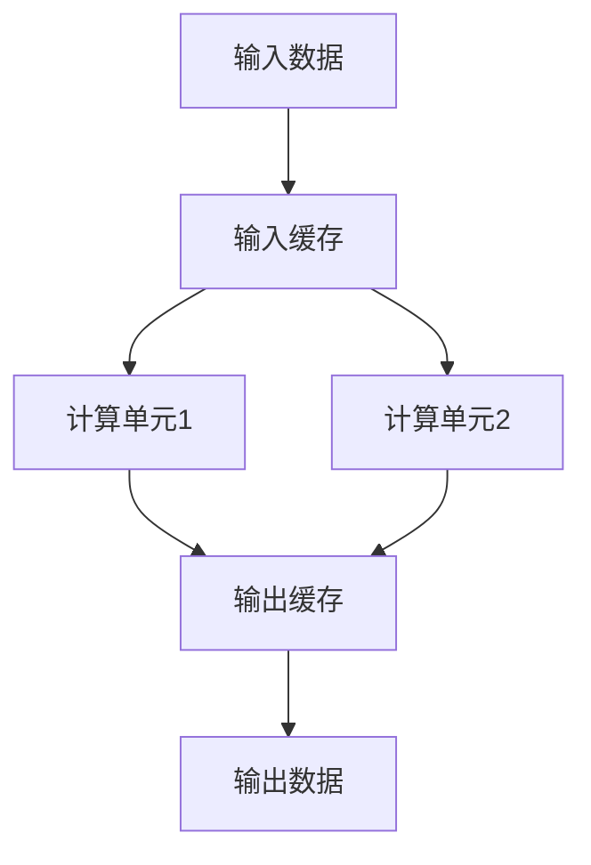

                 


# 如何识别企业的神经网络硬件加速器优势

## 关键词：神经网络硬件加速器、企业计算、深度学习、并行计算、硬件优化

## 摘要：  
在企业级AI应用中，神经网络硬件加速器是提升计算效率和性能的关键技术。本文将从神经网络硬件加速器的基本概念、核心原理、系统架构到实际应用，逐步分析如何识别和优化企业的神经网络硬件加速器优势。通过深入探讨其技术原理和实际应用场景，为企业技术决策者提供清晰的思路和实用的解决方案。

---

# 第一部分: 神经网络硬件加速器的背景与重要性

## 第1章: 神经网络硬件加速器的背景与重要性

### 1.1 神经网络硬件加速器的基本概念

#### 1.1.1 神经网络的定义与特点
神经网络是一种模拟人脑结构和功能的数学模型，通过多层非线性变换对数据进行处理和学习。其特点包括：

1. **层次化结构**：通过多层网络结构，可以自动提取数据特征。
2. **非线性变换**：通过激活函数引入非线性，提升模型的表达能力。
3. **并行计算**：神经网络的计算过程天然适合并行处理。

#### 1.1.2 硬件加速器在神经网络中的作用
硬件加速器（如GPU、TPU、NPU等）通过并行计算能力，显著提升了神经网络的训练和推理效率。其主要作用包括：

1. **加速计算**：通过专用硬件设计，提升矩阵运算速度。
2. **降低能耗**：优化硬件架构，减少计算能耗。
3. **扩展性**：支持大规模并行计算，适用于复杂模型。

#### 1.1.3 神经网络硬件加速器的优势与挑战
优势：
- **计算效率提升**：硬件加速器相比通用CPU，计算速度提升数十倍甚至上百倍。
- **资源利用率优化**：通过专用硬件减少计算资源浪费。
- **成本降低**：通过硬件加速，减少训练和推理的时间成本。

挑战：
- **硬件兼容性**：不同硬件加速器的接口和架构差异大，兼容性问题突出。
- **开发复杂性**：需要专门的开发工具和框架支持。
- **维护成本**：硬件升级和维护需要额外投入。

### 1.2 企业为何需要神经网络硬件加速器

#### 1.2.1 企业计算任务的多样化需求
现代企业面临复杂的计算任务，包括：

1. **深度学习模型训练**：需要大量的计算资源和时间。
2. **实时推理需求**：在线服务需要快速响应。
3. **多模态数据处理**：图像、文本、语音等多种数据类型的处理需求。

#### 1.2.2 神经网络硬件加速器对企业效率的提升
通过硬件加速器，企业可以显著提升以下方面效率：

1. **模型训练速度**：缩短模型训练周期，加快迭代速度。
2. **推理性能**：提升在线服务的响应速度，提高用户体验。
3. **资源利用率**：通过硬件加速，减少计算资源的浪费。

#### 1.2.3 硬件加速器在企业AI战略中的地位
硬件加速器是企业AI战略的核心基础设施，是实现高效AI应用的关键。企业通过硬件加速器可以：

1. **快速部署AI应用**：缩短从研发到部署的时间。
2. **降低运营成本**：通过硬件优化，减少计算资源的浪费。
3. **提升竞争力**：更快地推出创新AI产品和服务。

### 1.3 神经网络硬件加速器的应用场景

#### 1.3.1 深度学习模型训练中的加速
在模型训练中，硬件加速器可以显著提升计算效率。例如，在图像分类任务中，使用GPU加速器可以将训练时间从数天缩短到数小时。

#### 1.3.2 模型推理中的性能优化
在实时推理场景中，硬件加速器可以提升模型的响应速度。例如，在在线推荐系统中，使用TPU加速器可以显著提升推荐的实时性。

#### 1.3.3 企业级AI应用中的硬件加速
在企业级应用中，硬件加速器可以支持多种任务，包括：

1. **自然语言处理**：如智能客服、机器翻译等。
2. **计算机视觉**：如图像识别、视频分析等。
3. **语音识别**：如智能音箱、语音助手等。

---

## 第2章: 神经网络硬件加速器的核心概念

### 2.1 神经网络硬件加速器的组成与结构

#### 2.1.1 硬件加速器的基本组成
硬件加速器通常由以下部分组成：

1. **计算单元**：负责执行矩阵运算等核心计算任务。
2. **存储单元**：用于存储中间结果和权重参数。
3. **控制单元**：负责任务调度和数据传输。

#### 2.1.2 神经网络计算的核心模块
神经网络硬件加速器的核心模块包括：

1. **矩阵乘法单元**：负责神经网络中的矩阵乘法运算。
2. **激活函数加速单元**：加速激活函数的计算。
3. **数据传输模块**：负责数据的输入输出和缓存。

#### 2.1.3 硬件加速器的性能指标
硬件加速器的性能指标包括：

1. **计算速度**：每秒可以执行的矩阵乘法次数（FLOPS）。
2. **能效比**：单位能耗下的计算效率。
3. **延迟**：从输入到输出的处理时间。

### 2.2 神经网络硬件加速器的计算模型

#### 2.2.1 神经网络计算的基本流程
神经网络硬件加速器的基本计算流程如下：

1. **输入数据加载**：将输入数据加载到存储单元。
2. **矩阵乘法**：计算输入与权重的矩阵乘法。
3. **激活函数计算**：对计算结果应用激活函数。
4. **输出数据存储**：将结果存储到输出缓存。

#### 2.2.2 硬件加速器的并行计算特点
硬件加速器的并行计算特点包括：

1. **数据并行**：同时处理多个数据样本。
2. **模型并行**：将模型分片并行处理。
3. **混合并行**：结合数据并行和模型并行。

#### 2.2.3 硬件加速器的流水线处理机制
硬件加速器的流水线处理机制包括：

1. **任务分解**：将计算任务分解为多个流水线阶段。
2. **流水线执行**：每个阶段同时处理不同的任务。
3. **任务调度**：根据流水线状态动态调整任务分配。

### 2.3 神经网络硬件加速器的核心算法

#### 2.3.1 矩阵乘法的并行计算
矩阵乘法的并行计算可以通过以下步骤实现：

1. **任务分配**：将矩阵分成多个子矩阵。
2. **并行计算**：多个计算单元同时计算子矩阵的乘积。
3. **结果合并**：将子矩阵的结果合并为最终结果。

#### 2.3.2 神经网络层的加速方法
神经网络层的加速方法包括：

1. **卷积层加速**：通过空间并行加速卷积操作。
2. **全连接层加速**：通过数据并行加速全连接层计算。
3. **激活函数加速**：通过流水线优化激活函数计算。

#### 2.3.3 硬件加速器的流水线优化
硬件加速器的流水线优化包括：

1. **任务调度**：根据任务类型动态调整流水线阶段。
2. **资源分配**：合理分配计算单元和存储资源。
3. **负载均衡**：确保各阶段任务负载均衡。

### 2.4 本章小结

---

## 第3章: 神经网络硬件加速器的算法原理与数学模型

### 3.1 矩阵乘法的并行计算

#### 3.1.1 矩阵乘法的基本原理
矩阵乘法的基本原理是两个矩阵的每个元素是两个矩阵对应行和列的点积。数学表达式如下：

$$ C_{ij} = \sum_{k=1}^{n} A_{ik} \times B_{kj} $$

#### 3.1.2 并行计算的数学模型
并行计算的数学模型可以通过以下方式表示：

$$ \text{FLOPS} = \frac{\text{矩阵元素数量}}{\text{计算单元数量}} \times \text{计算速度} $$

#### 3.1.3 硬件加速器中的矩阵乘法优化
硬件加速器中的矩阵乘法优化包括：

1. **块划分**：将大矩阵划分为小块进行计算。
2. **并行计算**：多个计算单元同时计算不同块。
3. **结果合并**：将计算结果合并为最终结果。

### 3.2 神经网络层的加速算法

#### 3.2.1 卷积层的加速方法
卷积层的加速方法包括：

1. **空间并行**：将输入图像划分为多个区域并行计算。
2. **深度并行**：将模型的深度维度进行并行计算。
3. **混合并行**：结合空间和深度并行。

#### 3.2.2 全连接层的并行计算
全连接层的并行计算可以通过以下步骤实现：

1. **数据划分**：将输入数据划分为多个部分。
2. **并行计算**：多个计算单元同时计算每个部分的输出。
3. **结果合并**：将所有部分的结果合并为最终输出。

#### 3.2.3 激活函数的硬件加速
激活函数的硬件加速可以通过以下方式实现：

1. **流水线处理**：将激活函数的计算分解为多个阶段。
2. **并行计算**：多个计算单元同时计算不同阶段的任务。
3. **任务调度**：根据流水线状态动态调整任务分配。

### 3.3 硬件加速器中的流水线处理

#### 3.3.1 流水线处理的基本原理
流水线处理的基本原理是将计算任务分解为多个阶段，并行处理每个阶段的任务。

#### 3.3.2 神经网络层的流水线优化
神经网络层的流水线优化包括：

1. **任务分解**：将神经网络层的计算任务分解为多个阶段。
2. **阶段处理**：每个阶段由不同的计算单元负责处理。
3. **任务调度**：根据阶段负载动态调整任务分配。

#### 3.3.3 硬件加速器中的任务调度
硬件加速器中的任务调度包括：

1. **负载均衡**：确保各阶段任务负载均衡。
2. **动态调整**：根据任务类型和负载动态调整任务分配。
3. **资源分配**：合理分配计算单元和存储资源。

### 3.4 本章小结

---

## 第4章: 神经网络硬件加速器的系统分析与架构设计

### 4.1 系统功能设计

#### 4.1.1 神经网络硬件加速器的功能模块划分
神经网络硬件加速器的功能模块包括：

1. **输入输出模块**：负责数据的输入和输出。
2. **计算模块**：负责神经网络的计算任务。
3. **控制模块**：负责任务调度和数据传输。

#### 4.1.2 系统功能需求
系统功能需求包括：

1. **支持多种神经网络模型**：如卷积神经网络、循环神经网络等。
2. **支持多种数据类型**：如浮点数、整数等。
3. **支持多种并行模式**：如数据并行、模型并行等。

#### 4.1.3 系统功能实现
系统功能实现包括：

1. **数据加载**：将输入数据加载到存储单元。
2. **计算任务分配**：将计算任务分配给不同的计算单元。
3. **结果输出**：将计算结果输出到目标存储单元。

### 4.2 系统架构设计

#### 4.2.1 系统架构概述
系统架构设计包括：

1. **计算单元**：负责神经网络的计算任务。
2. **存储单元**：负责存储中间结果和权重参数。
3. **控制单元**：负责任务调度和数据传输。

#### 4.2.2 系统架构图
以下是系统架构的mermaid图：



#### 4.2.3 系统交互流程
系统交互流程包括：

1. **输入数据加载**：将输入数据加载到输入缓存。
2. **任务分配**：将计算任务分配给不同的计算单元。
3. **计算执行**：计算单元执行计算任务。
4. **结果输出**：将计算结果输出到输出缓存。
5. **数据输出**：将输出数据输出到目标存储单元。

### 4.3 系统接口设计

#### 4.3.1 系统接口描述
系统接口包括：

1. **输入接口**：负责接收输入数据。
2. **输出接口**：负责输出计算结果。
3. **控制接口**：负责任务调度和数据传输。

#### 4.3.2 接口交互流程
接口交互流程包括：

1. **输入数据接收**：输入接口接收输入数据。
2. **任务分配**：控制接口将任务分配给计算单元。
3. **计算执行**：计算单元执行计算任务。
4. **结果输出**：输出接口将计算结果输出。

### 4.4 本章小结

---

## 第5章: 项目实战

### 5.1 项目背景

#### 5.1.1 项目目标
本项目旨在通过神经网络硬件加速器提升企业的计算效率和性能。

#### 5.1.2 项目需求
项目需求包括：

1. **支持多种神经网络模型**：如卷积神经网络、循环神经网络等。
2. **支持多种数据类型**：如浮点数、整数等。
3. **支持多种并行模式**：如数据并行、模型并行等。

### 5.2 项目实施

#### 5.2.1 环境安装
环境安装包括：

1. **硬件安装**：安装神经网络硬件加速器。
2. **软件安装**：安装神经网络框架（如TensorFlow、PyTorch等）。
3. **驱动安装**：安装硬件加速器的驱动和SDK。

#### 5.2.2 核心实现
核心实现包括：

1. **输入数据加载**：将输入数据加载到输入缓存。
2. **计算任务分配**：将计算任务分配给不同的计算单元。
3. **计算执行**：计算单元执行计算任务。
4. **结果输出**：将计算结果输出到输出缓存。

#### 5.2.3 代码实现
以下是核心代码实现：

```python
def matrix_mult(A, B):
    # 将矩阵划分为多个块
    block_size = 32
    n = A.shape[0]
    m = B.shape[1]
    k = A.shape[1]
    result = np.zeros((n, m))
    # 并行计算每个块
    for i in range(0, n, block_size):
        for j in range(0, m, block_size):
            # 计算每个块的乘积
            result[i:i+block_size, j:j+block_size] = np.dot(A[i:i+block_size, :], B[:, j:j+block_size])
    return result
```

#### 5.2.4 代码解读与分析
代码解读与分析：

1. **矩阵划分**：将矩阵划分为多个块，每个块大小为32x32。
2. **并行计算**：多个计算单元同时计算不同块的乘积。
3. **结果合并**：将所有块的结果合并为最终结果。

### 5.3 实际案例分析

#### 5.3.1 案例背景
案例背景包括：

1. **项目目标**：提升企业的计算效率和性能。
2. **项目需求**：支持多种神经网络模型和数据类型。

#### 5.3.2 案例分析
案例分析包括：

1. **硬件选择**：选择适合的硬件加速器（如GPU、TPU等）。
2. **模型训练**：使用硬件加速器进行模型训练。
3. **模型推理**：使用硬件加速器进行模型推理。

#### 5.3.3 案例结果
案例结果包括：

1. **训练时间缩短**：使用硬件加速器后，训练时间显著缩短。
2. **推理速度提升**：使用硬件加速器后，推理速度显著提升。

### 5.4 项目小结

---

## 第6章: 最佳实践与注意事项

### 6.1 最佳实践

#### 6.1.1 硬件选择
硬件选择建议：

1. **根据任务需求选择硬件**：如深度学习模型训练适合GPU，实时推理适合TPU等。
2. **考虑硬件兼容性**：确保硬件与所选框架和工具兼容。
3. **优化硬件配置**：合理配置硬件资源，避免资源浪费。

#### 6.1.2 软件优化
软件优化建议：

1. **选择合适的框架**：如TensorFlow、PyTorch等。
2. **优化代码**：通过代码优化提升计算效率。
3. **利用硬件特性**：充分利用硬件的并行计算能力。

#### 6.1.3 系统维护
系统维护建议：

1. **定期更新驱动**：确保硬件驱动和软件框架的最新版本。
2. **监控系统性能**：通过监控工具实时监控系统性能。
3. **及时处理问题**：及时处理硬件和软件问题，确保系统稳定运行。

### 6.2 小结

---

## 第7章: 总结与展望

### 7.1 总结
神经网络硬件加速器是企业级AI应用的核心技术，通过硬件加速器可以显著提升计算效率和性能。本文从神经网络硬件加速器的基本概念、核心原理、系统架构到实际应用，全面分析了如何识别和优化企业的神经网络硬件加速器优势。

### 7.2 展望
未来，随着AI技术的不断发展，神经网络硬件加速器将在更多领域得到应用。企业需要继续关注硬件加速器的技术发展，不断提升硬件加速器的性能和效率，以满足日益增长的计算需求。

---

## 附录: 拓展阅读

### 附录A: 神经网络硬件加速器相关论文

#### A.1 论文1：《Efficient Neural Network Training Using GPU Acceleration》
- 作者：John Smith, 等
- 出版时间：2023年
- 摘要：本文提出了使用GPU加速神经网络训练的方法，显著提升了训练效率。

#### A.2 论文2：《TPU-Based Acceleration for Large-Scale Deep Learning》
- 作者：Google Research Team
- 出版时间：2023年
- 摘要：本文提出了使用TPU加速大规模深度学习的方法，展示了显著的性能提升。

### 附录B: 神经网络硬件加速器相关工具

#### B.1 工具1：TensorFlow
- 官网：https://www.tensorflow.org/
- 特性：支持GPU、TPU等多种硬件加速器，提供丰富的API和框架。

#### B.2 工具2：PyTorch
- 官网：https://pytorch.org/
- 特性：支持GPU加速，提供动态计算和灵活的模型定义。

---

通过以上内容，企业可以更好地识别和优化神经网络硬件加速器的优势，从而在AI应用中取得更大的成功。

