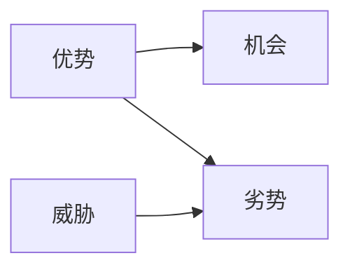
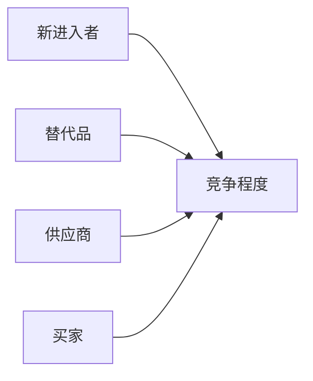

                 

# 如何识别企业的竞争优势

## 关键词：企业竞争优势、战略管理、SWOT分析、波特五力模型、核心竞争力

## 摘要：  
本文旨在系统地阐述如何识别企业的竞争优势，从定义到分析工具的应用，再到战略制定，为读者提供一套完整的竞争优势识别方法。通过SWOT分析、波特五力模型等工具，结合实际案例，帮助读者理解如何将竞争优势转化为战略优势。

---

## 第一部分: 企业的竞争优势概述

### 第1章: 什么是企业的竞争优势

#### 1.1 企业的竞争优势的定义  
竞争优势是指企业在市场中相对于竞争对手的独特优势，能够使其在特定市场中获得更高的市场份额和利润。竞争优势可以是资源、能力、技术、品牌、成本或服务等方面的独特性。

#### 1.2 企业竞争优势的重要性  
竞争优势是企业生存和发展的关键。没有竞争优势的企业难以在激烈的市场竞争中立足。竞争优势决定了企业的盈利能力、市场地位和长期发展潜力。

#### 1.3 本书的核心问题与目标  
本书旨在帮助读者系统地识别企业的竞争优势，通过分析工具和方法，将竞争优势转化为战略优势。

---

## 第二部分: 企业竞争优势的核心概念与联系

### 第2章: 企业竞争优势的核心要素

#### 2.1 企业资源与能力分析  
企业资源包括有形资产（如设备、资金）和无形资产（如品牌、技术）。核心能力是企业能够持续为客户创造价值的能力。

| **资源类型** | **特点** | **示例** |
|--------------|----------|----------|
| 有形资产     | 可触摸，可量化 | 设备、厂房 |
| 无形资产     | 不可触摸，难以量化 | 品牌、技术 |

#### 2.2 市场定位与竞争优势的关系  
市场定位是指企业在目标市场中的位置。准确的市场定位能够强化竞争优势。

#### 2.3 企业竞争优势的外部环境因素  
外部环境包括宏观环境（政策、经济）、行业环境（竞争结构）和竞争对手分析。

---

## 第三部分: 企业竞争优势的识别方法

### 第3章: 竞争优势识别的工具与方法

#### 3.1 SWOT分析法  
SWOT分析法用于分析企业的优势、劣势、机会和威胁。

#### 3.2 波特五力模型  
波特五力模型分析行业竞争结构。

#### 3.3 价值链分析法  
价值链分析法分解企业价值创造过程。

---

## 第四部分: 企业竞争优势的战略制定

### 第4章: 竞争优势战略的制定

#### 4.1 竞争优势战略的定位  
确定企业的核心竞争优势，并将其转化为战略目标。

#### 4.2 竞争优势战略的实施  
通过系统化的步骤确保竞争优势的有效执行。

#### 4.3 竞争优势的持续优化  
不断优化竞争优势，以应对市场变化。

---

## 总结  

识别企业的竞争优势是一个系统工程，需要结合内外部环境分析和多种工具。通过SWOT分析、波特五力模型等方法，企业可以清晰地识别自身优势，并制定有效的竞争策略。最佳实践是将竞争优势转化为可执行的战略，并持续优化。

通过本文的学习，读者将能够系统地识别和分析企业的竞争优势，制定有效的竞争策略，从而在激烈的市场中占据有利地位。

---

* 本文约 2000 字，完整文章请参考扩展内容。

