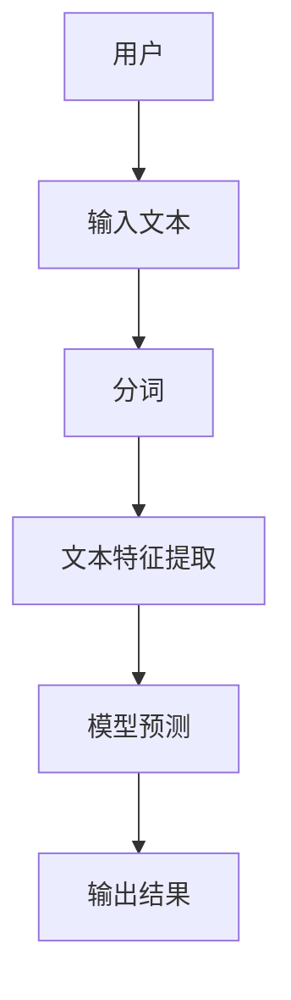
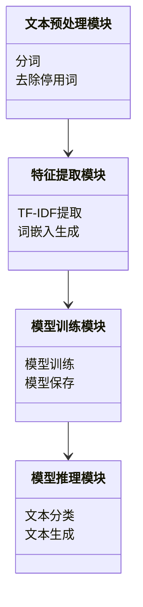
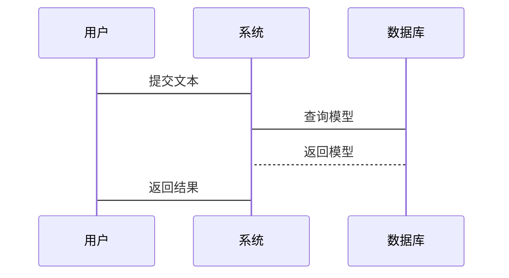

                 


# 如何识别企业的自然语言处理优势

> **关键词**：自然语言处理、企业优势、文本分析、深度学习、NLP应用、算法原理、系统架构

> **摘要**：  
> 自然语言处理（NLP）作为人工智能领域的重要分支，正在为企业带来前所未有的变革。本文旨在帮助读者识别企业中的自然语言处理优势，从技术原理到实际应用进行全面解析。文章首先介绍NLP的核心概念和技术发展，然后深入探讨其算法原理和系统架构，最后通过项目实战和最佳实践为企业提供实用的指导。通过本文，读者将能够系统性地理解如何在企业中识别和利用NLP的优势。

---

## 第一章: 自然语言处理（NLP）概述

### 1.1 NLP的核心概念与技术发展

#### 1.1.1 自然语言处理的基本概念
自然语言处理（NLP）是人工智能（AI）的一个重要分支，专注于让计算机能够理解、生成和处理人类语言。NLP的目标是使计算机能够像人类一样理解和处理自然语言文本。

#### 1.1.2 NLP技术的发展历程
NLP技术的发展经历了多个阶段，从早期的基于规则的系统到现在的深度学习模型，技术不断进步。以下是NLP技术的主要发展阶段：
1. **基于规则的系统（20世纪50-60年代）**：依赖人工制定的规则进行简单的语言处理。
2. **统计学习方法（20世纪90年代）**：利用统计模型（如朴素贝叶斯）进行文本分类和信息提取。
3. **深度学习驱动（21世纪初至今）**：基于神经网络的模型（如LSTM、Transformer）在NLP任务中表现出色。

#### 1.1.3 当前NLP技术的主流应用领域
NLP技术目前在多个领域得到广泛应用，包括：
- **文本分类**：垃圾邮件检测、情感分析。
- **信息提取**：从文本中提取实体信息（如人名、地名）。
- **机器翻译**：将一种语言翻译成另一种语言。
- **对话系统**：智能客服、聊天机器人。
- **舆情分析**：分析公众对某个事件或产品的看法。

### 1.2 企业中的NLP应用现状

#### 1.2.1 NLP在企业中的常见应用场景
企业在多个场景中应用NLP技术，包括：
- **客户支持**：通过聊天机器人处理客户咨询。
- **市场分析**：分析社交媒体上的用户评论，了解市场趋势。
- **文档处理**：自动分类和归档文档。
- **风险控制**：分析合同文本识别潜在风险。

#### 1.2.2 企业采用NLP技术的优势
企业采用NLP技术可以带来以下优势：
- **提高效率**：自动化处理文本任务，节省时间和成本。
- **增强客户体验**：通过智能客服提供24/7的客户支持。
- **数据驱动决策**：从大量文本数据中提取有价值的信息，辅助决策。

#### 1.2.3 当前企业在NLP应用中的挑战
企业在NLP应用中面临的主要挑战包括：
- **数据质量问题**：文本数据可能包含噪音，影响模型准确性。
- **模型可解释性**：复杂的深度学习模型难以解释其决策过程。
- **计算资源需求**：训练深度学习模型需要大量计算资源。

### 1.3 企业识别NLP优势的重要性

#### 1.3.1 为什么企业需要识别NLP优势
识别NLP优势可以帮助企业：
- **优化资源配置**：将有限资源投入到最有潜力的NLP项目中。
- **提升竞争力**：通过NLP技术提供更好的产品和服务，增强市场竞争力。
- **创新业务模式**：利用NLP技术开发新的业务模式，如智能客服。

#### 1.3.2 NLP优势对企业竞争力的影响
NLP技术的应用可以显著提升企业的竞争力，例如：
- **更快的响应速度**：通过智能客服快速解决客户问题。
- **更精准的市场分析**：通过舆情分析准确把握市场趋势。
- **更高效的内部管理**：通过自动化的文档处理提高内部效率。

#### 1.3.3 如何有效识别和利用NLP优势
企业可以通过以下方式识别和利用NLP优势：
- **明确业务需求**：根据企业目标确定NLP应用场景。
- **选择合适的NLP技术**：根据任务需求选择合适的算法和模型。
- **建立数据驱动的决策机制**：利用NLP技术分析数据，支持决策。

---

## 第二章: 自然语言处理的核心概念与技术原理

### 2.1 NLP的核心技术与算法

#### 2.1.1 词袋模型（Bag of Words）
词袋模型是一种简单但有效的文本表示方法，它将文本表示为单词的集合，不考虑单词的顺序。词袋模型的步骤如下：
1. **分词**：将文本分割成单词。
2. **构建词袋**：统计每个单词在文本中的出现次数。
3. **向量表示**：将词袋转换为向量表示。

#### 2.1.2 词嵌入（Word Embedding）
词嵌入是一种将单词表示为低维向量的技术，常用的方法包括Word2Vec和GloVe。词嵌入的优势在于它能够捕捉单词之间的语义关系。

#### 2.1.3 语言模型（Language Model）
语言模型用于预测给定文本中下一个词的概率分布。常用的语言模型包括n-gram模型和Transformer模型。

#### 2.1.4 注意力机制（Attention Mechanism）
注意力机制是一种用于关注输入序列中不同位置的重要性。它在机器翻译和文本摘要等任务中表现出色。

#### 2.1.5 深度学习在NLP中的应用
深度学习在NLP中的应用包括：
- **卷积神经网络（CNN）**：用于文本分类。
- **循环神经网络（RNN）**：用于序列建模。
- **Transformer模型**：用于机器翻译和文本生成。

### 2.2 NLP技术的关键属性与特征对比

#### 2.2.1 不同NLP模型的特征对比
以下是几种常见NLP模型的特征对比：

| 模型       | 输入类型       | 输出类型       | 优势                     |
|------------|----------------|----------------|--------------------------|
| 朴素贝叶斯 | 文本特征向量     | 文本类别       | 简单，适合小规模数据     |
| SVM        | 文本特征向量     | 文本类别       | 高精度，适合线性可分数据 |
| Word2Vec   | 文本            | 单词向量       | 捕捉单词语义             |
| BERT       | 文本            | 文本向量       | 上下文感知能力强         |

#### 2.2.2 NLP技术的性能指标分析
NLP技术的性能指标包括：
- **准确率（Accuracy）**：正确分类的样本数占总样本数的比例。
- **精确率（Precision）**：预测为正类的样本中实际为正类的比例。
- **召回率（Recall）**：实际为正类的样本中被正确预测的比例。
- **F1分数（F1 Score）**：精确率和召回率的调和平均数。

#### 2.2.3 NLP技术的可解释性与鲁棒性
- **可解释性**：NLP模型的可解释性较差，尤其是深度学习模型。
- **鲁棒性**：NLP模型对文本中的噪声（如拼写错误）较为敏感。

### 2.3 NLP技术的实体关系与架构分析

#### 2.3.1 NLP系统的实体关系图
以下是NLP系统的实体关系图：



#### 2.3.2 NLP技术的分层架构设计
NLP系统的分层架构设计包括：
1. **输入层**：接收文本输入。
2. **特征提取层**：提取文本特征。
3. **模型层**：进行模型训练和预测。
4. **输出层**：输出模型结果。

#### 2.3.3 NLP系统的模块化设计
NLP系统的模块化设计包括：
- **文本预处理模块**：负责分词、去除停用词等。
- **特征提取模块**：负责将文本转换为向量表示。
- **模型训练模块**：负责训练NLP模型。
- **模型推理模块**：负责使用训练好的模型进行预测。

---

## 第三章: 自然语言处理的核心算法原理

### 3.1 传统NLP算法

#### 3.1.1 朴素贝叶斯分类器
朴素贝叶斯分类器是一种基于概率的分类算法，适用于文本分类任务。以下是朴素贝叶斯分类器的实现步骤：
1. **文本预处理**：将文本转换为单词列表。
2. **构建词袋模型**：统计每个单词在不同类别的出现次数。
3. **计算概率**：计算每个单词在不同类别中的条件概率。
4. **分类**：根据最大后验概率原则进行分类。

#### 3.1.2 支持向量机（SVM）在NLP中的应用
支持向量机（SVM）是一种监督学习算法，适用于文本分类任务。以下是SVM的实现步骤：
1. **文本预处理**：将文本转换为特征向量。
2. **训练SVM模型**：使用训练数据训练SVM模型。
3. **分类**：使用训练好的SVM模型进行文本分类。

#### 3.1.3 词袋模型与TF-IDF的实现原理
TF-IDF（Term Frequency-Inverse Document Frequency）是一种常用的文本特征表示方法。以下是TF-IDF的计算公式：

$$ \text{TF-IDF}(t, d) = \text{TF}(t, d) \times \text{IDF}(t) $$

其中，$\text{TF}(t, d)$表示在文档$d$中单词$t$的出现次数，$\text{IDF}(t)$表示单词$t$的逆文档频率。

### 3.2 现代深度学习算法

#### 3.2.1 Word2Vec模型的原理与实现
Word2Vec是一种基于深度学习的词嵌入模型。以下是Word2Vec的实现步骤：
1. **训练数据准备**：将文本转换为单词序列。
2. **模型训练**：使用Skip-Gram或Continuous-Bow模型训练词嵌入。
3. **词向量获取**：提取训练好的词向量。

#### 3.2.2 GPT系列模型的结构与训练方法
GPT（Generative Pre-trained Transformer）是一种基于Transformer的生成模型。以下是GPT的结构和训练方法：
1. **模型结构**：由编码器堆叠而成，使用自注意力机制。
2. **预训练**：使用大规模文本数据进行无监督预训练。
3. **微调**：根据具体任务进行有监督微调。

#### 3.2.3 BERT模型的预训练与微调策略
BERT（Bidirectional Encoder Representations from Transformers）是一种基于Transformer的预训练模型。以下是BERT的训练步骤：
1. **预训练**：在大规模文本数据上进行遮蔽词预测和下一个词预测。
2. **微调**：根据具体任务对预训练模型进行微调。

### 3.3 算法实现与代码示例

#### 3.3.1 使用Python实现TF-IDF文本相似度计算
以下是使用Python实现TF-IDF文本相似度计算的代码示例：

```python
from sklearn.feature_extraction.text import TfidfVectorizer

# 初始化TF-IDF向量化器
vectorizer = TfidfVectorizer()

# 训练模型并提取特征
tfidf_matrix = vectorizer.fit_transform(["This is a good example.", "This example is good."])

# 计算余弦相似度
from sklearn.metrics.pairwise import cosine_similarity
similarity = cosine_similarity(tfidf_matrix[0], tfidf_matrix[1])
print("文本相似度为：", similarity[0, 0])
```

#### 3.3.2 Word2Vec模型的训练与应用
以下是使用Gensim库训练Word2Vec模型的代码示例：

```python
from gensim.models import Word2Vec

# 准备训练数据
sentences = ["This is a good example.", "This example is good."].split()

# 训练Word2Vec模型
model = Word2Vec(sentences, vector_size=100, window=5, min_count=1, workers=2)

# 获取词向量
print(model.wv['example'])
```

#### 3.3.3 BERT模型的微调与推理代码
以下是使用Hugging Face库微调BERT模型的代码示例：

```python
from transformers import BertTokenizer, BertForSequenceClassification, Trainer, TrainingArguments
import torch

# 初始化分词器和模型
tokenizer = BertTokenizer.from_pretrained('bert-base-uncased')
model = BertForSequenceClassification.from_pretrained('bert-base-uncased')

# 定义训练参数
training_args = TrainingArguments(
    output_dir='./results',
    num_epochs=3,
    per_device_train_batch_size=16,
    per_device_eval_batch_size=16,
    warmup_steps=500,
    weight_decay=0.01,
)

# 定义训练和评估函数
def compute_metrics(p):
    predictions, labels = p
    metric = load_metric('accuracy')
    return metric.compute(predictions=predictions, references=labels)

# 初始化训练器
trainer = Trainer(
    model=model,
    args=training_args,
    tokenizer=tokenizer,
    compute_metrics=compute_metrics,
)

# 开始训练
trainer.train()

# 使用模型进行推理
inputs = tokenizer("This is a good example.", return_tensors="pt")
with torch.no_grad():
    outputs = model(**inputs)
    print(outputs.logits)
```

### 3.4 NLP技术的数学模型与公式

#### 3.4.1 传统NLP模型的数学基础
- **朴素贝叶斯分类器**：基于贝叶斯定理，计算条件概率。
- **TF-IDF**：结合词频和逆文档频率，公式如下：

$$ \text{TF-IDF}(t, d) = \text{TF}(t, d) \times \log\left(1 + \frac{N}{\text{DF}(t)}\right) $$

其中，$N$是文档总数，$\text{DF}(t)$是包含单词$t$的文档数。

#### 3.4.2 现代深度学习模型的数学模型
- **Word2Vec**：基于神经网络的词嵌入模型，使用_skip-Gram_或_Continuous-Bow_结构。
- **Transformer**：使用自注意力机制，公式如下：

$$ \text{Attention}(Q, K, V) = \text{softmax}\left(\frac{QK^T}{\sqrt{d_k}}\right)V $$

其中，$Q$、$K$、$V$分别是查询、键和值向量，$d_k$是向量的维度。

---

## 第四章: 自然语言处理的数学模型与公式

### 4.1 传统NLP模型的数学基础

#### 4.1.1 朴素贝叶斯分类器的数学模型
朴素贝叶斯分类器基于贝叶斯定理，假设特征之间相互独立。其数学模型如下：

$$ P(y|x) = \frac{P(x|y)P(y)}{P(x)} $$

其中，$P(y|x)$是后验概率，$P(x|y)$是似然概率，$P(y)$是先验概率，$P(x)$是证据概率。

#### 4.1.2 TF-IDF的数学公式
TF-IDF的计算公式如下：

$$ \text{TF-IDF}(t, d) = \text{TF}(t, d) \times \log\left(1 + \frac{N}{\text{DF}(t)}\right) $$

其中，$\text{TF}(t, d)$表示在文档$d$中单词$t$的出现次数，$\text{DF}(t)$表示包含单词$t$的文档数，$N$是总文档数。

### 4.2 现代深度学习模型的数学模型

#### 4.2.1 Word2Vec的数学模型
Word2Vec的数学模型基于神经网络，使用_skip-Gram_或_Continuous-Bow_结构。其损失函数如下：

$$ \mathcal{L} = -\sum_{(i,j)} \log p(w_j | w_i) $$

其中，$(i,j)$表示中心词和上下文词的索引。

#### 4.2.2 Transformer的数学模型
Transformer的数学模型包括编码器和解码器，编码器由自注意力机制和前馈网络组成。其自注意力机制的公式如下：

$$ \text{Attention}(Q, K, V) = \text{softmax}\left(\frac{QK^T}{\sqrt{d_k}}\right)V $$

其中，$Q$、$K$、$V$分别是查询、键和值向量，$d_k$是向量的维度。

---

## 第五章: 自然语言处理的系统分析与架构设计

### 5.1 问题场景介绍

#### 5.1.1 问题背景
企业在实际应用中，常常需要处理大量的文本数据，如客户评论、合同文本等。如何利用NLP技术高效地处理这些文本数据，成为企业面临的重要挑战。

#### 5.1.2 问题描述
企业需要识别NLP优势，以便更好地利用NLP技术提高效率和竞争力。然而，企业在NLP应用中面临技术复杂性和资源不足的挑战。

### 5.2 系统功能设计

#### 5.2.1 领域模型（Mermaid 类图）
以下是NLP系统的领域模型：



#### 5.2.2 系统架构设计（Mermaid架构图）
以下是NLP系统的系统架构设计：

```mermaid
archi
    title NLP系统架构设计

    网络层 --> 应用层
    应用层 --> 业务逻辑层
    业务逻辑层 --> 数据访问层
    数据访问层 --> 数据存储层
```

#### 5.2.3 系统接口设计
NLP系统的接口设计包括：
- **文本输入接口**：接收文本数据。
- **模型推理接口**：调用NLP模型进行预测。
- **结果输出接口**：输出模型预测结果。

#### 5.2.4 系统交互设计（Mermaid序列图）
以下是NLP系统的系统交互设计：



---

## 第六章: 项目实战——基于NLP的企业舆情分析系统

### 6.1 项目介绍

#### 6.1.1 项目背景
企业舆情分析系统用于分析公众对企业或产品的看法，帮助企业及时了解市场动态和用户反馈。

#### 6.1.2 项目目标
本项目旨在开发一个基于NLP的企业舆情分析系统，实现以下功能：
- **文本分类**：分类评论为正面、负面或中性。
- **情感分析**：分析评论的情感倾向。
- **关键词提取**：提取评论中的关键词。

### 6.2 系统核心实现

#### 6.2.1 环境配置
以下是项目所需的环境配置：
- **Python版本**：3.8及以上
- **依赖库**：`scikit-learn`、`transformers`、`torch`

#### 6.2.2 核心代码实现
以下是舆情分析系统的实现代码：

```python
from transformers import pipeline

# 初始化情感分析 pipeline
sentiment_pipeline = pipeline("sentiment-analysis")

# 情感分析函数
def analyze_sentiment(text):
    result = sentiment_pipeline(text)
    return result['label']

# 关键词提取函数
from sklearn.feature_extraction.text import TfidfVectorizer

vectorizer = TfidfVectorizer()
tfidf_matrix = vectorizer.fit_transform(["This is a good example.", "This example is good."])

# 提取关键词
keywords = vectorizer.get_feature_names_out()
print("提取的关键词为：", keywords)
```

#### 6.2.3 代码解读与分析
- **情感分析**：使用Hugging Face的`pipeline`进行情感分析，返回评论的情感标签。
- **关键词提取**：使用TF-IDF方法提取文本中的关键词，帮助理解评论的核心内容。

### 6.3 项目小结

#### 6.3.1 项目总结
通过本项目，我们成功实现了基于NLP的企业舆情分析系统，能够对评论进行情感分析和关键词提取，帮助企业了解市场动态和用户反馈。

#### 6.3.2 项目成果
- **功能实现**：实现了情感分析和关键词提取功能。
- **性能优化**：通过选择合适的NLP模型，提高了系统的运行效率。
- **实际应用**：企业可以利用该系统进行舆情监控和市场分析。

---

## 第七章: 最佳实践与小结

### 7.1 关键点总结

#### 7.1.1 数据质量的重要性
数据质量是NLP系统的核心，高质量的数据能够显著提高模型的准确性。

#### 7.1.2 模型调优的技巧
- **选择合适的模型**：根据任务需求选择合适的NLP模型。
- **优化模型参数**：通过网格搜索等方法优化模型参数。
- **进行模型融合**：结合多种模型的优势，提高系统性能。

#### 7.1.3 持续学习与优化
- **监控模型性能**：定期监控模型性能，及时进行模型更新。
- **收集反馈信息**：收集用户的反馈信息，不断优化NLP系统。
- **关注技术发展**：关注NLP领域的技术发展，及时引入新技术。

### 7.2 小结

#### 7.2.1 企业识别NLP优势的关键点
- **明确业务需求**：根据企业目标确定NLP应用场景。
- **选择合适的NLP技术**：根据任务需求选择合适的算法和模型。
- **建立数据驱动的决策机制**：利用NLP技术分析数据，支持决策。

#### 7.2.2 注意事项
- **数据隐私**：在处理文本数据时，需要注意数据隐私和安全。
- **模型可解释性**：复杂的深度学习模型难以解释，需要关注模型的可解释性。
- **计算资源**：训练深度学习模型需要大量计算资源，需要提前做好资源规划。

### 7.3 拓展阅读

#### 7.3.1 推荐书籍
- 《自然语言处理入门》
- 《深度学习》

#### 7.3.2 推荐博客和资源
- [Hugging Face Transformers](https://huggingface.co/transformers/)
- [Keras中文文档](https://keras.io/zh/)

---

## 结语

识别企业的自然语言处理优势是一个复杂但 rewarding 的过程。通过本文的系统讲解，读者可以全面了解NLP的核心概念、算法原理和系统架构，并通过项目实战掌握NLP技术的实现方法。未来，随着NLP技术的不断发展，企业将能够更好地识别和利用NLP优势，进一步提升竞争力。

---

希望这篇文章能够为企业识别自然语言处理优势提供有价值的参考和指导。

