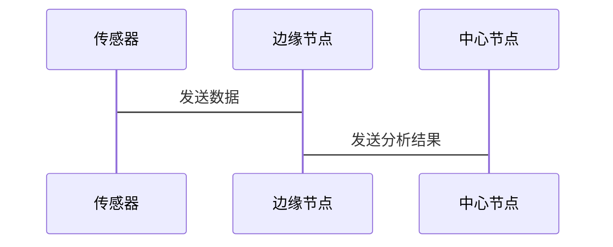

                 


# 如何识别企业的边缘AI芯片优势

## 关键词：边缘AI芯片，AI技术，边缘计算，系统架构，算法原理

## 摘要：边缘AI芯片在企业中的优势识别

随着人工智能技术的迅速发展和边缘计算的兴起，边缘AI芯片在企业中的应用越来越广泛。本文旨在详细分析边缘AI芯片的核心概念、算法原理、系统架构，并通过具体案例展示其优势识别过程。通过本篇文章，读者将能够深入了解边缘AI芯片的优势，掌握如何在实际项目中识别和利用这些优势。

---

## 第1章：边缘AI芯片的背景与问题背景

### 1.1 边缘AI芯片的发展背景

#### 1.1.1 边缘计算的兴起
边缘计算是一种分布式计算范式，将数据处理从云端转移到数据源附近。其兴起源于对实时性、低延迟和数据隐私的需求。

#### 1.1.2 AI技术的快速发展
人工智能技术的成熟推动了AI芯片的发展，使其能够高效处理复杂的计算任务。

#### 1.1.3 边缘AI芯片的出现与重要性
边缘AI芯片结合了边缘计算和AI技术的优势，成为企业数字化转型中的关键工具。

### 1.2 问题背景与问题描述

#### 1.2.1 传统计算模式的局限性
传统云计算模式存在延迟高、带宽占用大等问题，难以满足边缘场景的需求。

#### 1.2.2 边缘计算面临的挑战
边缘计算环境复杂，数据量大，且对实时性和安全性要求高，传统芯片难以应对。

#### 1.2.3 边缘AI芯片的应用场景
边缘AI芯片适用于智能制造、智慧城市、自动驾驶等领域，能够高效处理实时数据。

### 1.3 问题解决与边界

#### 1.3.1 边缘AI芯片如何解决问题
边缘AI芯片通过本地化数据处理，降低延迟，提高实时性和数据安全性。

#### 1.3.2 边缘AI芯片的边界与外延
边缘AI芯片专注于边缘计算环境，与其他计算模式协同工作，形成完整的计算体系。

#### 1.3.3 边缘AI芯片与云计算的关系
边缘AI芯片与云计算互补，前者处理实时任务，后者负责数据存储和分析。

### 1.4 核心概念与组成

#### 1.4.1 边缘AI芯片的核心概念
边缘AI芯片是一种专为边缘计算设计的硬件，用于高效执行AI任务。

#### 1.4.2 边缘AI芯片的组成要素
包括处理器、内存、存储、AI加速器等，协同工作以实现高效计算。

#### 1.4.3 边缘AI芯片的系统结构
边缘AI芯片通常集成多种功能模块，支持神经网络推理、数据处理和通信。

---

## 第2章：边缘AI芯片的核心原理

### 2.1 边缘AI芯片的原理概述

#### 2.1.1 边缘AI芯片的基本工作原理
边缘AI芯片通过硬件加速神经网络推理，快速处理数据并输出结果。

#### 2.1.2 边缘AI芯片的计算模型
采用卷积神经网络（CNN）、循环神经网络（RNN）等模型，优化边缘计算场景的性能。

#### 2.1.3 边缘AI芯片的数据处理流程
数据采集、预处理、特征提取、模型推理、结果输出，整个流程高效且低延迟。

### 2.2 核心概念的属性特征对比

#### 2.2.1 边缘AI芯片与传统芯片的对比

| 特性          | 传统芯片          | 边缘AI芯片        |
|---------------|-------------------|-------------------|
| 计算能力       | 通用，处理复杂任务 | 专用，高效处理AI任务 |
| 能耗           | 较高              | 较低              |
| 延迟           | 较高              | 较低              |
| 数据处理方式   | 云端集中处理      | 边缘本地处理      |

#### 2.2.2 不同类型AI芯片的性能对比

| 芯片类型   | 优势               | 劣势               |
|------------|--------------------|--------------------|
| GPU         | 高计算能力，通用性强 | 能耗高，不专用于AI |
| TPU         | 专用于AI，性能优越 | 价格高，生态不完善 |
| ASIC芯片    | 低功耗，高效        | 开发周期长         |

#### 2.2.3 边缘AI芯片的优劣势分析

- **优势**：低延迟、高能效、实时性强。
- **劣势**：硬件更换成本高，开发周期长，生态支持有限。

### 2.3 ER实体关系图架构

```mermaid
er
actor 边缘AI芯片, [通过硬件加速优化数据处理流程]
actor 系统架构, [支持神经网络推理]
```

---

## 第3章：边缘AI芯片的算法原理

### 3.1 算法原理概述

#### 3.1.1 神经网络的基本原理

神经网络由输入层、隐藏层和输出层组成，通过权重和激活函数进行数据处理。

#### 3.1.2 边缘AI芯片的计算模型

边缘AI芯片主要采用卷积神经网络（CNN）和循环神经网络（RNN）进行数据推理。

#### 3.1.3 边缘AI芯片的数据处理流程

数据通过输入层，经过卷积层提取特征，再通过池化层降低维度，最终由全连接层输出结果。

### 3.2 算法实现与优化

#### 3.2.1 神经网络的训练过程

训练过程包括前向传播和反向传播，通过梯度下降优化权重参数。

#### 3.2.2 边缘AI芯片的推理过程

推理过程包括输入数据预处理、特征提取、模型预测和结果输出。

#### 3.2.3 算法的数学模型和公式

- **矩阵乘法**：$$ W \cdot X + b $$
- **激活函数**：$$ f(x) = \max(0, x) $$
- **损失函数**：$$ L = \frac{1}{n}\sum_{i=1}^{n}(y_i - \hat{y}_i)^2 $$

### 3.3 算法流程图

```mermaid
graph TD
    A[输入数据] -> B[输入层]
    B -> C[卷积层]
    C -> D[池化层]
    D -> E[全连接层]
    E -> F[输出结果]
```

---

## 第4章：边缘AI芯片的系统分析与架构设计

### 4.1 问题场景介绍

#### 4.1.1 项目介绍
在智能制造中，边缘AI芯片用于实时监控生产线，检测产品缺陷。

#### 4.1.2 系统功能设计
- 数据采集与预处理
- 神经网络推理
- 结果输出与反馈

#### 4.1.3 系统架构设计
- 边缘节点：部署边缘AI芯片，处理实时数据。
- 中心节点：负责数据汇总和分析。

#### 4.1.4 系统接口设计
- 边缘节点与传感器通信接口
- 边缘节点与中心节点通信接口

#### 4.1.5 系统交互设计



---

## 第5章：边缘AI芯片的项目实战

### 5.1 环境安装

#### 5.1.1 系统环境要求
- 操作系统：Linux
- 硬件：支持边缘AI芯片的开发板
- 软件：TensorFlow Lite、OpenCV

#### 5.1.2 安装依赖
```bash
pip install tensorflow-lite
pip install opencv-python
```

### 5.2 核心代码实现

#### 5.2.1 数据采集与预处理
```python
import cv2

def preprocess_image(image_path):
    image = cv2.imread(image_path)
    image = cv2.resize(image, (224, 224))
    image = image.astype(float) / 255.0
    return image
```

#### 5.2.2 模型加载与推理
```python
import tensorflow as tf
from tensorflow import lite

# 加载模型
interpreter = lite.Interpreter(model_path="model.tflite")
interpreter.allocate_tensors()

# 执行推理
input_tensor = interpreter.get_input_details()[0]
output_tensor = interpreter.get_output_details()[0]

image = preprocess_image("input.jpg")
interpreter.set_tensor(input_tensor['index'], image)
interpreter.invoke()
result = interpreter.get_tensor(output_tensor['index'])
```

#### 5.2.3 结果输出与分析
```python
print(f"预测结果：{result}")
```

### 5.3 代码解读与分析

#### 5.3.1 数据采集与预处理
函数`preprocess_image`负责读取图像并进行归一化处理，确保模型输入格式正确。

#### 5.3.2 模型加载与推理
使用TensorFlow Lite加载模型，并通过`interpreter.invoke()`执行推理，得到预测结果。

### 5.4 实际案例分析

#### 5.4.1 案例场景
智能制造中的缺陷检测，边缘AI芯片实时处理图像数据，快速识别缺陷。

#### 5.4.2 案例分析
通过部署边缘AI芯片，企业能够实时检测产品缺陷，减少废品率，提高生产效率。

### 5.5 项目小结

#### 5.5.1 项目总结
边缘AI芯片在智能制造中的应用显著提升了检测效率和准确性。

#### 5.5.2 项目经验
硬件选择、模型优化、系统集成是成功的关键因素。

---

## 第6章：边缘AI芯片的最佳实践

### 6.1 最佳实践

#### 6.1.1 选择合适的边缘AI芯片
根据具体需求选择性能与成本匹配的芯片。

#### 6.1.2 系统架构设计
确保系统架构合理，便于后续扩展和维护。

#### 6.1.3 算法优化
优化模型结构和参数，降低计算复杂度。

#### 6.1.4 安全性保障
确保数据传输和存储的安全性，防止数据泄露。

### 6.2 小结

通过本文的详细分析，读者可以全面了解边缘AI芯片的优势识别方法，掌握如何在实际项目中应用这些技术。

### 6.3 注意事项

- 确保硬件和软件的兼容性。
- 定期更新模型和系统，保持最佳性能。
- 做好异常处理和容错设计。

### 6.4 拓展阅读

推荐阅读以下书籍和资源：
- 《深入理解边缘计算》
- TensorFlow Lite官方文档
- PyTorch边缘计算案例集

---

通过以上章节的内容，读者可以系统性地了解边缘AI芯片的优势识别方法，掌握从理论到实践的应用技巧。

