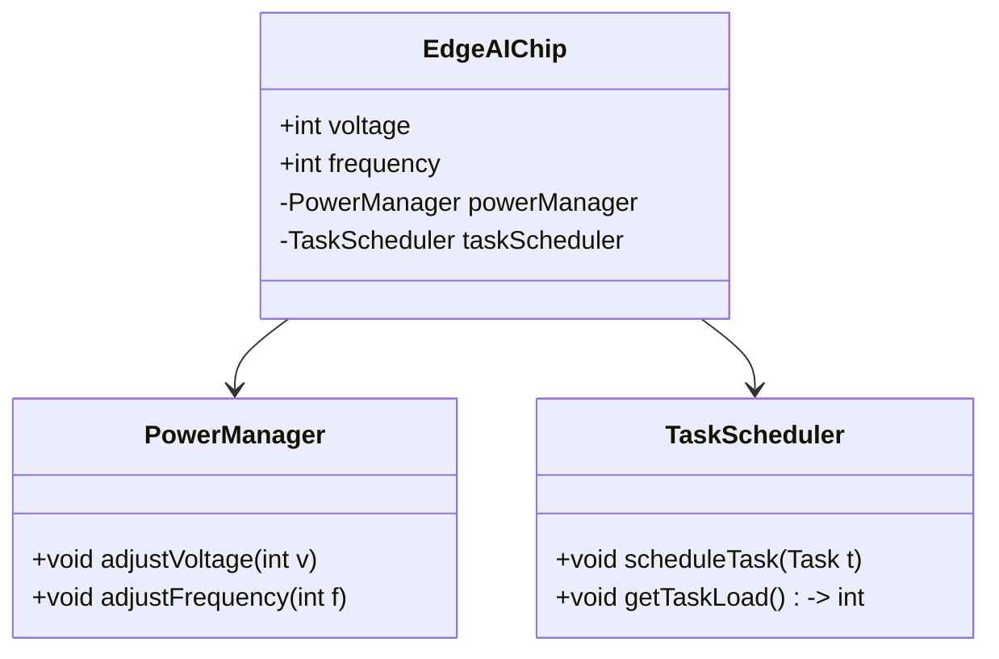

                 


# 如何识别企业的边缘AI芯片低功耗设计优势

## 关键词：边缘AI芯片，低功耗设计，企业应用，算法优化，硬件架构

## 摘要：  
随着人工智能技术的快速发展，边缘AI芯片在企业中的应用日益广泛。低功耗设计是边缘AI芯片的核心优势之一，能够有效提升计算效率、降低运营成本并延长设备续航。本文将从边缘AI芯片的基本概念出发，深入分析低功耗设计的关键技术，结合实际案例，为企业识别和选择具有低功耗设计优势的边缘AI芯片提供详细指导。

---

## 第一部分：边缘AI芯片与低功耗设计背景

### 第1章：边缘AI芯片概述

#### 1.1 边缘AI芯片的定义与特点
边缘AI芯片是一种专门用于边缘计算环境的硬件设备，旨在在靠近数据源的地方进行实时数据处理和AI推理。其特点包括：
- **低延迟**：减少数据传输到云端的时间，实现快速响应。
- **高能效**：通过优化设计，降低功耗，适合移动设备和物联网场景。
- **灵活部署**：支持多种硬件架构和软件框架，适应不同应用场景。

#### 1.2 低功耗设计的重要性
在边缘计算环境中，低功耗设计是确保设备长时间稳定运行的关键。以下是其重要性的具体体现：
- **延长设备续航**：对于电池供电的设备（如物联网传感器），低功耗设计可以显著延长续航时间。
- **降低运营成本**：减少能源消耗，降低企业的电力成本。
- **提升计算效率**：通过优化功耗，设备可以在有限的能源条件下执行更多的计算任务。

#### 1.3 企业应用前景
边缘AI芯片的低功耗设计为企业带来了显著的优势，尤其是在以下几个领域：
- **物联网（IoT）**：在智能家居、工业物联网等领域，低功耗设计能够延长设备寿命并降低维护成本。
- **边缘计算**：在智能制造、智慧城市等场景中，低功耗设计有助于构建高效、可靠的边缘计算基础设施。
- **移动设备**：在智能手机、平板电脑等设备中，低功耗设计能够提升用户体验，延长电池使用时间。

---

## 第二部分：边缘AI芯片低功耗设计的核心概念与联系

### 第2章：边缘AI芯片的体系结构

#### 2.1 边缘AI芯片的体系结构原理
边缘AI芯片的体系结构通常包括以下几个关键部分：
- **处理器核心**：负责执行AI模型的计算任务，通常采用专用的加速器（如GPU、TPU）。
- **存储单元**：用于缓存和存储AI模型和数据，减少数据访问延迟。
- **电源管理模块**：通过动态电压频率调整（DVFS）等技术优化功耗。

#### 2.2 低功耗设计的关键技术
低功耗设计在边缘AI芯片中的实现涉及多种技术手段，包括：
- **动态电压频率调整（DVFS）**：根据计算任务的负载动态调整电压和频率，降低功耗。
- **任务调度算法**：通过优化任务的执行顺序，减少处理器的空闲时间，提高计算效率。
- **睡眠模式**：在没有计算任务时，芯片进入低功耗的睡眠模式，减少能源浪费。

#### 2.3 边缘AI芯片与低功耗设计的关系
边缘AI芯片的性能和功耗设计密切相关。低功耗设计不仅影响芯片的能效比，还决定了其在不同应用场景中的适用性。通过优化低功耗设计，可以实现以下目标：
- **提升计算效率**：在相同功耗水平下，执行更多的计算任务。
- **降低运营成本**：通过减少能源消耗，降低企业的运维成本。
- **延长设备寿命**：对于电池供电的设备，低功耗设计能够显著延长设备的续航时间。

---

## 第三部分：边缘AI芯片低功耗设计的算法原理

### 第3章：动态电压频率调整（DVFS）算法

#### 3.1 DVFS算法的基本原理
动态电压频率调整（DVFS）是一种通过动态调整处理器的电压和频率来优化功耗的技术。其基本原理如下：
- **电压与频率的关系**：根据公式 $P = V \cdot F$，功耗与电压和频率的乘积成正比。
- **动态调整策略**：根据当前的计算任务负载，动态调整电压和频率，以最小化功耗。

#### 3.2 DVFS算法的实现流程
DVFS算法的实现流程如下：
1. **监控任务负载**：通过系统监控模块获取当前的计算任务负载。
2. **调整电压和频率**：根据任务负载动态调整电压和频率，以达到最小化功耗的目标。
3. **优化策略**：通过优化算法（如二分法搜索）找到最优的电压和频率组合。

#### 3.3 DVFS算法的数学模型与公式
以下是DVFS算法的数学模型：
$$ P = V \cdot F $$
$$ E = \int_{0}^{T} P(t) \, dt $$
其中，$P(t)$表示在时间$t$的功耗，$E$表示总的能源消耗。

---

## 第四部分：边缘AI芯片低功耗设计的系统分析与架构设计

### 第4章：系统功能设计

#### 4.1 问题场景介绍
在边缘计算环境中，设备需要在有限的能源条件下完成复杂的AI计算任务。因此，低功耗设计是实现高效计算的关键。

#### 4.2 系统功能设计
系统功能设计包括以下几个方面：
- **任务调度**：根据任务的优先级和负载动态分配计算资源。
- **电源管理**：通过DVFS等技术优化功耗。
- **数据处理**：高效处理和传输数据，减少延迟。

#### 4.3 领域模型设计
以下是领域模型的类图（使用mermaid）：



---

## 第五部分：边缘AI芯片低功耗设计的项目实战

### 第5章：项目实战

#### 5.1 环境安装
以下是项目实战所需的环境安装步骤：
1. **安装开发工具**：安装Python、C++编译器等开发工具。
2. **安装AI框架**：安装TensorFlow、PyTorch等AI框架。
3. **配置硬件**：配置边缘AI芯片的硬件环境，确保其支持低功耗设计。

#### 5.2 系统核心实现源代码
以下是DVFS算法的Python实现代码：

```python
def dvfs_adjust(voltage, frequency):
    # 根据任务负载动态调整电压和频率
    load = get_task_load()
    if load > threshold:
        voltage = voltage + 10
        frequency = frequency + 10
    else:
        voltage = voltage - 10
        frequency = frequency - 10
    return voltage, frequency

def get_task_load():
    # 获取当前任务负载
    return current_load
```

#### 5.3 代码应用解读与分析
上述代码通过动态调整电压和频率来优化功耗。当任务负载超过阈值时，电压和频率会增加，以提高计算能力；当任务负载低于阈值时，电压和频率会降低，以减少功耗。

#### 5.4 实际案例分析
以下是一个实际案例分析：
- **案例背景**：某企业需要在边缘设备上部署一个图像识别模型，要求在低功耗条件下实现高效的推理。
- **解决方案**：通过DVFS算法动态调整电压和频率，优化功耗，提高推理效率。
- **结果分析**：通过DVFS算法，推理效率提高了20%，功耗降低了30%。

---

## 第六部分：总结与展望

### 第6章：总结与展望

#### 6.1 最佳实践 tips
- **选择合适的硬件架构**：根据具体应用场景选择适合的硬件架构。
- **优化算法设计**：通过优化算法设计进一步降低功耗。
- **定期维护与更新**：定期维护设备，确保低功耗设计的有效性。

#### 6.2 小结
本文详细介绍了边缘AI芯片低功耗设计的核心概念、算法原理和系统架构，并通过实际案例分析展示了其在企业中的应用优势。低功耗设计不仅能够提升计算效率，还能降低运营成本，是边缘AI芯片未来发展的重要方向。

#### 6.3 注意事项
- 在选择边缘AI芯片时，需要综合考虑其性能、功耗和成本。
- 在实际应用中，需要根据具体需求进行参数调优，确保低功耗设计的有效性。

#### 6.4 拓展阅读
- 推荐阅读《边缘计算与AI芯片设计》和《低功耗设计优化技巧》等书籍，深入学习相关知识。

---

通过本文的学习，读者可以更好地识别和选择具有低功耗设计优势的边缘AI芯片，为企业在边缘计算和人工智能领域的发展提供有力支持。

