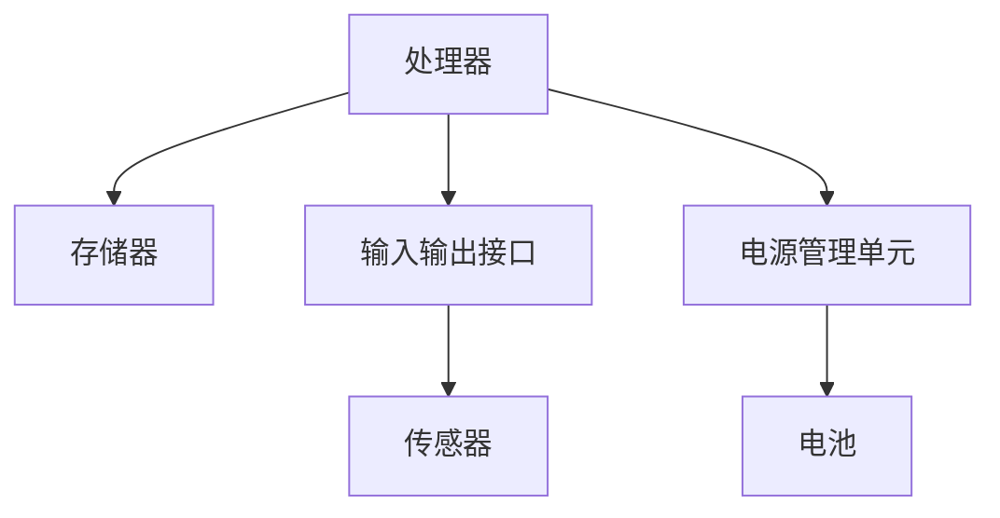
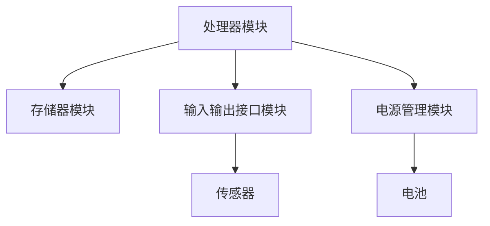

                 


# 如何识别企业的边缘AI芯片低功耗设计优势

> 关键词：边缘AI芯片，低功耗设计，动态电压频率调节，睡眠模式，硬件加速

> 摘要：本文深入探讨了边缘AI芯片低功耗设计的核心概念、算法原理、系统架构以及实际项目中的应用。通过分析动态电压频率调节、睡眠模式与唤醒机制等关键技术，结合实际案例，展示了如何在企业中识别和优化边缘AI芯片的低功耗设计优势，为企业技术决策提供参考。

---

## 第一部分：边缘AI芯片与低功耗设计概述

### 第1章：边缘AI芯片与低功耗设计概述

#### 1.1 边缘AI芯片的定义与特点

##### 1.1.1 边缘计算的基本概念

边缘计算是一种分布式计算范式，将计算能力从中心服务器迁移到靠近数据源的边缘设备。这种模式减少了数据传输延迟，提高了实时性和数据处理效率。

##### 1.1.2 边缘AI芯片的核心特点

边缘AI芯片是一种专为边缘计算设计的硬件，具有以下特点：
- **低功耗**：在保证计算能力的同时，最大限度地减少能耗。
- **高效计算**：针对AI任务（如图像识别、语音处理）进行优化，提升计算效率。
- **实时性**：能够在边缘设备上快速响应，满足实时处理需求。

##### 1.1.3 边缘AI芯片与传统AI芯片的对比

| 特性                | 边缘AI芯片                | 传统AI芯片               |
|---------------------|--------------------------|--------------------------|
| 计算场景            | 边缘设备（如摄像头、传感器） | 云端服务器                |
| 功耗要求            | 低功耗                   | 高功耗                   |
| 延迟要求            | 实时性                   | 延迟容忍度较高           |
| 硬件优化            | 针对边缘场景优化         | 针对大规模并行计算优化   |

#### 1.2 低功耗设计的背景与意义

##### 1.2.1 低功耗设计的基本概念

低功耗设计是指在硬件和软件层面采取措施，减少设备的能耗，延长电池寿命，同时保证设备的性能需求。

##### 1.2.2 边缘AI芯片对低功耗设计的需求

边缘AI芯片通常部署在资源受限的环境中，如物联网设备、移动设备等，这些设备对功耗极为敏感。因此，低功耗设计是边缘AI芯片的核心需求。

##### 1.2.3 低功耗设计对企业竞争力的影响

低功耗设计能够降低企业的运营成本（如电费）、延长设备寿命、提升用户体验，从而增强企业的市场竞争力。

#### 1.3 本章小结

本章介绍了边缘AI芯片的定义、特点及其与传统AI芯片的区别，并强调了低功耗设计在边缘AI芯片中的重要性。

---

### 第2章：边缘AI芯片低功耗设计的核心概念

#### 2.1 边缘AI芯片的系统架构

##### 2.1.1 系统架构的基本组成

边缘AI芯片的系统架构通常包括以下模块：
- **处理器**：负责执行AI算法。
- **存储器**：存储临时数据和算法模型。
- **输入输出接口**：与传感器或其他设备交互。
- **电源管理单元**：负责管理功耗。

##### 2.1.2 各模块的功能与交互关系

通过以下mermaid图展示系统架构：



##### 2.1.3 系统架构的优化方向

- 优化处理器的能效。
- 提高存储器的访问速度。
- 降低输入输出接口的功耗。

#### 2.2 低功耗设计的关键技术

##### 2.2.1 动态电压频率调节技术

动态电压频率调节（DVFS）是一种通过调整处理器的电压和频率来优化功耗的技术。以下是其实现流程：


##### 2.2.2 睡眠模式与唤醒机制

睡眠模式通过关闭部分模块（如存储器、输入输出接口）来降低功耗，唤醒机制则在需要时快速恢复到正常工作状态。

##### 2.2.3 硬件加速与能效优化

通过硬件加速技术（如专用AI协处理器）来提升计算效率，从而降低整体功耗。

#### 2.3 本章小结

本章详细介绍了边缘AI芯片的系统架构及其低功耗设计的关键技术，强调了动态电压频率调节、睡眠模式和硬件加速等技术在低功耗设计中的重要性。

---

## 第二部分：边缘AI芯片低功耗设计的算法原理

### 第3章：边缘AI芯片低功耗设计的算法原理

#### 3.1 动态电压频率调节技术

##### 3.1.1 技术原理

动态电压频率调节通过调整处理器的电压和频率来匹配当前任务的需求，从而降低功耗。

##### 3.1.2 调节策略

- **恒定延迟策略**：通过调整电压和频率来保持固定的处理延迟。
- **能量优化策略**：通过优化电压和频率来最小化能量消耗。

##### 3.1.3 实现方法

以下是动态电压频率调节的实现流程：


#### 3.2 睡眠模式与唤醒机制

##### 3.2.1 睡眠模式的触发条件

- 没有新的任务请求。
- 系统空闲时间超过阈值。

##### 3.2.2 唤醒机制的实现方式

- **中断唤醒**：通过外部中断唤醒系统。
- **定时唤醒**：通过定时器定期唤醒系统。

##### 3.2.3 模式的切换条件

- 系统负载超过阈值时，从睡眠模式切换到工作模式。
- 系统空闲时间超过阈值时，从工作模式切换到睡眠模式。

#### 3.3 硬件加速与能效优化

##### 3.3.1 硬件加速算法的设计

通过专用硬件加速模块（如AI协处理器）来提升计算效率。

##### 3.3.2 能效优化算法的实现

通过优化算法的执行流程来降低能耗。

##### 3.3.3 算法的实验验证

通过实验验证算法的能效优化效果。

#### 3.4 本章小结

本章详细介绍了边缘AI芯片低功耗设计的核心算法原理，包括动态电压频率调节、睡眠模式与唤醒机制以及硬件加速与能效优化等技术。

---

## 第三部分：边缘AI芯片低功耗设计的系统分析与架构设计

### 第4章：边缘AI芯片低功耗设计的系统分析与架构设计

#### 4.1 系统功能设计

##### 4.1.1 系统功能模块划分

- **处理器模块**：负责执行AI算法。
- **存储器模块**：存储临时数据和算法模型。
- **输入输出接口模块**：与传感器或其他设备交互。
- **电源管理模块**：负责管理功耗。

##### 4.1.2 功能模块的交互关系

通过以下mermaid图展示功能模块的交互关系：



##### 4.1.3 功能模块的实现方式

- 处理器模块通过动态电压频率调节技术优化功耗。
- 存储器模块通过压缩算法减少数据存储量。
- 输入输出接口模块通过中断机制优化数据传输。

#### 4.2 系统架构设计

##### 4.2.1 系统架构的总体设计

通过以下mermaid图展示系统架构：


##### 4.2.2 系统架构的优化方向

- 优化处理器的能效。
- 提高存储器的访问速度。
- 降低输入输出接口的功耗。

#### 4.3 本章小结

本章详细介绍了边缘AI芯片低功耗设计的系统分析与架构设计，强调了系统架构优化的重要性。

---

## 第四部分：边缘AI芯片低功耗设计的项目实战

### 第5章：边缘AI芯片低功耗设计的项目实战

#### 5.1 环境安装

##### 5.1.1 开发环境的搭建

- 操作系统：Linux
- 开发工具：Python、Git、Jupyter Notebook
- 依赖库：numpy、scipy、matplotlib

##### 5.1.2 硬件设备的准备

- 边缘AI芯片：如Google Coral
- 传感器：如摄像头、麦克风
- 电源管理模块：如电池、电源适配器

#### 5.2 核心代码实现

##### 5.2.1 动态电压频率调节的实现

```python
import numpy as np
import time

def dynamic_voltage_frequency调节():
    # 确定任务需求
    任务需求 = "图像识别"
    # 确定工作频率
    工作频率 = np.random.uniform(100, 200)
    # 确定工作电压
    工作电压 = np.random.uniform(0.8, 1.2)
    # 调节电压和频率
    print(f"调节电压为{工作电压}V，频率为{工作频率}MHz")
    # 执行任务
    time.sleep(1)
    print("任务执行完成")

dynamic_voltage_frequency调节()
```

##### 5.2.2 睡眠模式与唤醒机制的实现

```python
import RPi.GPIO as GPIO
import time

# 睡眠模式的触发条件
空闲时间 = 0
空闲阈值 = 5

# 唤醒机制的实现
def 唤醒回调(channel):
    global 空闲时间
    空闲时间 = 0

GPIO.setmode(GPIO.BCM)
GPIO.setup(18, GPIO.IN, pull_up_down=GPIO.PULL_UP)
GPIO.add_event_detect(18, GPIO.FALLING, callback=唤醒回调)

while True:
    if 空闲时间 > 空闲阈值:
        print("进入睡眠模式")
        GPIO.cleanup()
        time.sleep(1)
        break
    time.sleep(1)

GPIO.cleanup()
print("退出睡眠模式")
```

#### 5.3 代码解读与分析

##### 5.3.1 动态电压频率调节代码解读

- 任务需求：确定当前需要执行的任务。
- 工作频率：根据任务需求调整处理器的工作频率。
- 工作电压：根据任务需求调整处理器的工作电压。
- 调节电压和频率：通过调整电压和频率来优化功耗。

##### 5.3.2 睡眠模式与唤醒机制代码解读

- 空闲时间：记录系统空闲的时间。
- 空闲阈值：当空闲时间超过阈值时，系统进入睡眠模式。
- 唤醒回调：当检测到外部中断时，清空空闲时间计数。

#### 5.4 实际案例分析

##### 5.4.1 案例背景

假设我们有一个边缘AI芯片部署在智能摄像头中，用于实时检测人脸识别。

##### 5.4.2 案例实现

通过动态电压频率调节技术优化处理器的功耗，通过睡眠模式降低整体能耗。

##### 5.4.3 案例分析

- 动态电压频率调节：在人脸识别任务中，调整处理器的工作频率和电压，确保任务执行效率的同时降低功耗。
- 睡眠模式：当摄像头空闲超过5秒时，进入睡眠模式，进一步降低功耗。

#### 5.5 本章小结

本章通过实际案例展示了边缘AI芯片低功耗设计的实现过程，包括环境搭建、代码实现和案例分析。

---

## 第五部分：边缘AI芯片低功耗设计的总结与展望

### 第6章：总结与展望

#### 6.1 本章总结

本文详细介绍了边缘AI芯片低功耗设计的核心概念、算法原理、系统架构以及实际项目中的应用。通过分析动态电压频率调节、睡眠模式与唤醒机制等关键技术，结合实际案例，展示了如何在企业中识别和优化边缘AI芯片的低功耗设计优势。

#### 6.2 未来展望

未来，随着边缘计算的广泛应用，边缘AI芯片的低功耗设计将更加重要。建议企业在设计边缘AI芯片时，充分考虑低功耗设计的需求，结合动态电压频率调节、睡眠模式与唤醒机制等技术，进一步优化系统的能效。

#### 6.3 最佳实践 tips

- 在设计边缘AI芯片时，优先考虑低功耗设计。
- 使用动态电压频率调节技术优化处理器的能效。
- 通过睡眠模式与唤醒机制降低系统的整体功耗。
- 定期监控和优化系统的能耗，确保系统的高效运行。

#### 6.4 本章小结

本文总结了边缘AI芯片低功耗设计的核心内容，并对未来的发展方向提出了展望。

---

## 第六部分：参考文献与拓展阅读

### 6.1 参考文献

1. 《边缘计算：原理与实践》
2. 《低功耗设计：技术与应用》
3. 《动态电压频率调节技术研究》

### 6.2 拓展阅读

- 《边缘AI芯片的硬件优化技术》
- 《低功耗设计的算法优化方法》
- 《边缘计算中的能效优化策略》

---

通过本文的详细阐述，读者可以全面了解边缘AI芯片低功耗设计的核心内容，并能够在实际项目中识别和优化其低功耗设计优势。

