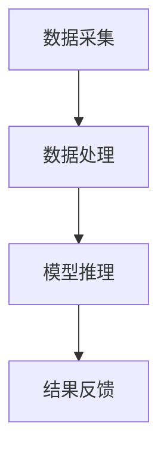
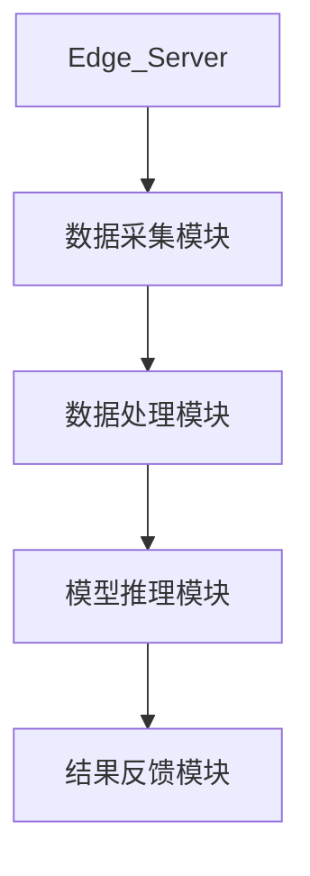
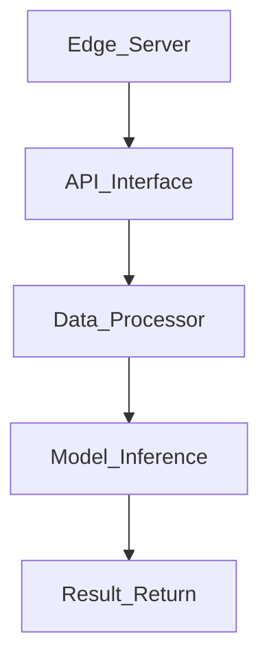
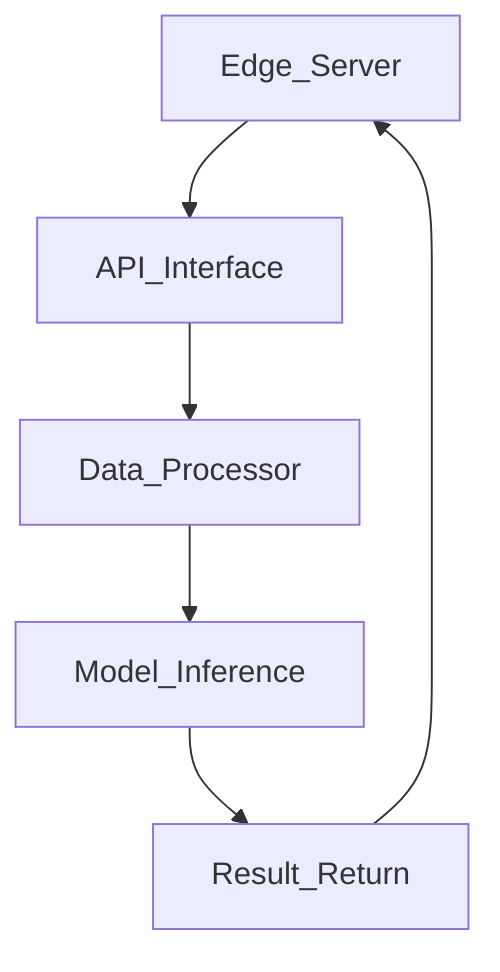

                 


# 如何识别企业的边缘AI芯片低延迟设计优势

## 关键词：边缘AI芯片，低延迟设计，边缘计算，实时性，资源优化，数据处理效率

## 摘要：本文深入探讨了企业在边缘AI芯片设计中如何实现低延迟，分析了其技术原理、系统架构和优化策略，通过案例分析和实战指导，帮助读者识别和应用这些优势。

---

## 第1章：边缘AI芯片概述

### 1.1 边缘计算的概念与特点
边缘计算是指在靠近数据源的地方进行数据处理和分析，而非依赖于中心化的云服务器。其特点包括低延迟、高实时性、本地化数据处理和减少网络依赖。

#### 1.1.1 边缘计算的定义
边缘计算是一种分布式计算范式，通过将计算能力推向数据生成的边缘，减少对中心服务器的依赖。这种计算模式在物联网、自动驾驶等领域尤为重要。

#### 1.1.2 边缘计算的核心特点
- **低延迟**：数据处理在边缘进行，减少网络传输时间。
- **高实时性**：实时处理数据，快速响应。
- **本地化数据处理**：在边缘设备上直接处理数据，减少数据传输量。
- **减少网络依赖**：降低对带宽的需求，提高数据安全性。

#### 1.1.3 边缘计算在企业中的应用
边缘计算在企业中的应用广泛，例如智能制造中的实时监控、自动驾驶中的实时决策、智能安防中的快速响应等。

### 1.2 AI芯片的基本概念
AI芯片是专门用于加速人工智能任务（如深度学习、机器学习）的硬件。其核心优势在于高效处理大量数据和快速执行计算任务。

#### 1.2.1 AI芯片的定义
AI芯片是针对AI任务设计的专用芯片，能够高效执行神经网络计算、矩阵运算等任务。

#### 1.2.2 AI芯片的主要类型
- **GPU**：通用图形处理器，广泛用于深度学习训练。
- **TPU**：张量处理单元，专为机器学习设计。
- **FPGA**：现场可编程门阵列，适用于灵活的AI加速。
- **ASIC**：专用集成电路，针对特定AI任务优化。

#### 1.2.3 AI芯片在边缘计算中的作用
AI芯片在边缘计算中的作用包括加速数据处理、降低延迟、提高实时性等。边缘AI芯片能够直接在设备端处理数据，减少对云端的依赖。

### 1.3 低延迟设计的重要性
低延迟设计是边缘AI芯片的核心优势，直接影响系统的响应速度和用户体验。

#### 1.3.1 低延迟的定义
低延迟是指系统在处理请求时的延迟尽可能小，通常以毫秒为单位。

#### 1.3.2 低延迟设计在边缘计算中的意义
- **提升用户体验**：快速响应用户请求，减少等待时间。
- **提高系统效率**：通过减少数据传输时间，提高系统整体效率。
- **增强实时性**：在实时性要求高的场景中，如自动驾驶、工业自动化等，低延迟设计至关重要。

#### 1.3.3 低延迟设计的优势与挑战
优势：
- 提高系统响应速度。
- 减少网络带宽占用。
- 提高数据安全性。

挑战：
- 设计复杂性高。
- 需要高性能硬件支持。
- 开发和优化难度大。

---

## 第2章：边缘AI芯片低延迟设计的核心概念

### 2.1 低延迟设计的关键要素
低延迟设计需要从多个方面进行优化，包括实时性、资源优化和数据处理效率。

#### 2.1.1 实时性要求
实时性是指系统在规定时间内完成任务的能力。边缘AI芯片需要在极短的时间内处理数据，以满足实时性要求。

#### 2.1.2 资源优化
资源优化是低延迟设计的重要组成部分，包括计算资源、存储资源和网络资源的优化。

#### 2.1.3 数据处理效率
数据处理效率是衡量低延迟设计的重要指标，包括数据预处理、特征提取和模型推理的速度。

### 2.2 核心概念对比分析
通过对比传统设计与低延迟设计的差异，可以更好地理解低延迟设计的优势。

#### 2.2.1 传统设计与低延迟设计的对比
| 对比维度 | 传统设计 | 低延迟设计 |
|----------|----------|------------|
| 响应时间 | 较高延迟 | 低延迟     |
| 数据处理 | 中心化处理 | 边缘化处理 |
| 网络依赖 | 高依赖   | 低依赖     |

#### 2.2.2 低延迟设计的特征分析
低延迟设计的特征包括实时性强、资源利用率高、数据处理速度快等。

#### 2.2.3 案例分析：低延迟设计的实际应用
例如，在自动驾驶中，低延迟设计能够快速处理传感器数据，确保车辆在紧急情况下做出快速反应。

---

## 第3章：边缘AI芯片低延迟设计的算法原理

### 3.1 低延迟设计的算法概述
低延迟设计的算法包括任务调度算法、数据压缩算法和并行处理算法。

#### 3.1.1 任务调度算法
任务调度算法用于优化任务的分配和执行顺序，减少处理时间。

##### 3.1.1.1 任务调度算法的数学模型
任务调度问题可以建模为一个优化问题，目标是最小化完成时间。数学模型如下：
$$ \text{目标函数} = \min \sum_{i=1}^{n} T_i $$
其中，\( T_i \) 表示任务 \( i \) 的完成时间。

##### 3.1.1.2 任务调度算法的Python代码示例
```python
def scheduling_algorithm(tasks):
    tasks.sort(key=lambda x: x['duration'])
    scheduled = []
    for task in tasks:
        scheduled.append(task['duration'])
    return scheduled
```

#### 3.1.2 数据压缩算法
数据压缩算法用于减少数据传输量，降低网络负载。

##### 3.1.2.1 数据压缩算法的数学模型
数据压缩可以通过熵编码实现，例如使用哈夫曼编码。熵的计算公式为：
$$ H = -\sum_{i=1}^{n} p_i \log_2 p_i $$
其中，\( p_i \) 是数据符号 \( i \) 的概率。

##### 3.1.2.2 数据压缩算法的Python代码示例
```python
import zlib

def compress_data(data):
    return zlib.compress(data)
```

#### 3.1.3 并行处理算法
并行处理算法通过同时执行多个任务，提高处理速度。

##### 3.1.3.1 并行处理算法的数学模型
并行处理可以通过将任务分解为多个子任务并行执行。数学模型如下：
$$ T_{\text{total}} = \max_{i} T_i $$
其中，\( T_i \) 表示子任务 \( i \) 的完成时间。

##### 3.1.3.2 并行处理算法的Python代码示例
```python
import concurrent.futures

def parallel_processing(tasks):
    with concurrent.futures.ThreadPoolExecutor() as executor:
        futures = {executor.submit(task) for task in tasks}
        for future in concurrent.futures.as_completed(futures):
            print(future.result())
```

### 3.2 算法原理的数学模型和公式
算法的数学模型和公式是理解其工作原理的关键。

#### 3.2.1 任务调度模型
任务调度模型的目标是最小化完成时间，数学模型如前所述。

#### 3.2.2 并行处理模型
并行处理模型通过将任务分解为多个子任务，同时执行以提高效率。

#### 3.2.3 数据压缩模型
数据压缩模型通过减少数据量，降低网络传输时间。

### 3.3 算法实现的Python代码示例
通过Python代码示例，可以更好地理解算法的实现。

#### 3.3.1 任务调度算法代码
```python
def scheduling_algorithm(tasks):
    tasks.sort(key=lambda x: x['duration'])
    scheduled = []
    for task in tasks:
        scheduled.append(task['duration'])
    return scheduled
```

#### 3.3.2 并行处理算法代码
```python
import concurrent.futures

def parallel_processing(tasks):
    with concurrent.futures.ThreadPoolExecutor() as executor:
        futures = {executor.submit(task) for task in tasks}
        for future in concurrent.futures.as_completed(futures):
            print(future.result())
```

#### 3.3.3 数据压缩算法代码
```python
import zlib

def compress_data(data):
    return zlib.compress(data)
```

---

## 第4章：边缘AI芯片低延迟设计的系统架构

### 4.1 系统架构设计概述
系统架构设计是实现低延迟设计的关键，包括系统功能模块划分、架构设计原则和优缺点分析。

#### 4.1.1 系统功能模块划分
系统功能模块通常包括数据采集、数据处理、模型推理和结果反馈。

#### 4.1.2 系统架构设计原则
- **模块化设计**：各模块独立，便于维护和升级。
- **高可用性**：系统能够在部分模块故障时继续运行。
- **可扩展性**：系统能够扩展以处理更多的任务。

#### 4.1.3 系统架构的优缺点分析
优点：
- 模块化设计便于维护和升级。
- 高可用性确保系统可靠性。
- 可扩展性满足业务需求。

缺点：
- 系统架构复杂，设计难度大。
- 硬件要求高，成本较高。

### 4.2 系统架构的Mermaid图
通过Mermaid图可以清晰地展示系统架构。

#### 4.2.1 系统功能模块图


#### 4.2.2 系统架构图


#### 4.2.3 系统接口设计图


#### 4.2.4 系统交互流程图


### 4.3 系统接口设计
系统接口设计需要考虑模块之间的通信和数据交互。

#### 4.3.1 接口设计原则
- **标准化接口**：使用标准化接口，便于模块间的通信。
- **高效性**：接口设计要高效，减少数据传输时间。
- **安全性**：确保接口的安全性，防止数据泄露。

#### 4.3.2 接口设计的注意事项
- **数据格式**：接口数据格式统一，如JSON、XML等。
- **协议选择**：选择合适的通信协议，如HTTP、WebSocket等。
- **错误处理**：设计完善的错误处理机制，确保系统健壮性。

### 4.4 系统架构设计的注意事项
在系统架构设计中，需要注意以下几点：

#### 4.4.1 系统架构的可扩展性
系统架构需要具备可扩展性，以便在未来业务需求变化时能够轻松扩展。

#### 4.4.2 系统架构的高可用性
系统架构需要设计高可用性，确保系统能够在部分模块故障时继续运行。

#### 4.4.3 系统架构的安全性
系统架构需要考虑安全性，防止数据泄露和系统攻击。

---

## 第5章：边缘AI芯片低延迟设计的优化策略

### 5.1 优化策略概述
优化策略包括硬件加速、算法优化和系统架构优化。

#### 5.1.1 硬件加速
硬件加速是提高处理速度的重要手段，可以通过使用专用硬件（如GPU、FPGA）来加速计算任务。

#### 5.1.2 算法优化
算法优化是通过改进算法本身来提高处理速度，例如使用更高效的算法和数据结构。

#### 5.1.3 系统架构优化
系统架构优化是通过改进系统架构设计来提高整体性能，例如采用分布式架构和负载均衡。

### 5.2 硬件加速方案
硬件加速是实现低延迟设计的重要手段，可以通过使用专用硬件来加速计算任务。

#### 5.2.1 GPU加速
GPU加速通过并行计算能力，显著提高计算速度。

#### 5.2.2 FPGA加速
FPGA加速通过硬件可编程性，实现高效的加速任务。

#### 5.2.3 ASIC加速
ASIC加速通过专用硬件设计，实现高效的加速任务。

### 5.3 算法优化策略
算法优化是通过改进算法本身来提高处理速度，例如使用更高效的算法和数据结构。

#### 5.3.1 算法优化方法
- **减少计算量**：通过优化算法，减少计算量。
- **优化数据结构**：选择合适的数据结构，提高处理效率。
- **并行计算**：利用并行计算能力，加速任务处理。

#### 5.3.2 算法优化的Python代码示例
```python
def optimized_algorithm(data):
    # 优化后的算法实现
    pass
```

### 5.4 系统架构优化方案
系统架构优化是通过改进系统架构设计来提高整体性能，例如采用分布式架构和负载均衡。

#### 5.4.1 分布式架构
分布式架构通过将任务分配到多个节点进行处理，提高处理速度。

#### 5.4.2 负载均衡
负载均衡通过合理分配任务，避免节点过载，提高系统效率。

#### 5.4.3 高可用性设计
高可用性设计通过冗余设计，确保系统在部分节点故障时仍能正常运行。

### 5.5 优化策略的注意事项
在优化策略实施中，需要注意以下几点：

#### 5.5.1 硬件加速的兼容性
硬件加速方案需要考虑与现有系统的兼容性，确保能够顺利集成。

#### 5.5.2 算法优化的可行性
算法优化需要考虑实际应用场景，确保优化后的算法能够满足需求。

#### 5.5.3 系统架构的可扩展性
系统架构优化需要考虑未来的扩展性，确保系统能够适应业务需求的变化。

---

## 第6章：边缘AI芯片低延迟设计的项目实战

### 6.1 项目背景
本项目旨在设计一个低延迟的边缘AI芯片系统，用于实时处理视频流数据。

### 6.2 项目需求分析
- **目标**：实时处理视频流数据，实现低延迟。
- **输入**：视频流数据。
- **输出**：处理后的数据，例如目标检测结果。
- **约束条件**：低延迟、高实时性、资源利用率高。

### 6.3 项目实施步骤
#### 6.3.1 环境配置
- 操作系统：Linux
- 开发工具：Python、OpenCV
- 硬件设备：边缘服务器、摄像头

#### 6.3.2 系统核心实现源代码
```python
import cv2
import time

def process_frame(frame):
    # 图像处理逻辑
    return processed_frame

def main():
    cap = cv2.VideoCapture(0)
    while True:
        ret, frame = cap.read()
        if not ret:
            break
        start_time = time.time()
        processed_frame = process_frame(frame)
        end_time = time.time()
        print(f"Processing time: {end_time - start_time}")
        cv2.imshow('Processed Frame', processed_frame)
        if cv2.waitKey(1) == ord('q'):
            break
    cap.release()
    cv2.destroyAllWindows()

if __name__ == "__main__":
    main()
```

#### 6.3.3 代码应用解读与分析
- **代码功能**：实时读取视频流，处理每一帧图像，输出处理后的图像。
- **性能优化**：通过优化图像处理算法，减少处理时间。
- **结果分析**：分析处理时间，确保满足低延迟要求。

### 6.4 项目小结
通过本项目，可以掌握边缘AI芯片低延迟设计的核心技术，包括任务调度、数据压缩和并行处理等。

---

## 第7章：边缘AI芯片低延迟设计的注意事项和最佳实践

### 7.1 注意事项
在实施低延迟设计时，需要注意以下几点：

#### 7.1.1 硬件选择
选择合适的硬件是实现低延迟设计的关键，例如选择高性能的GPU或FPGA。

#### 7.1.2 软件优化
软件优化是实现低延迟设计的重要手段，例如优化算法和数据结构。

#### 7.1.3 系统架构设计
系统架构设计需要考虑可扩展性、高可用性和安全性。

### 7.2 最佳实践
最佳实践包括以下几点：

#### 7.2.1 使用高效的算法
选择高效的算法和数据结构，减少计算时间。

#### 7.2.2 优化数据传输
通过压缩和缓存技术，减少数据传输时间。

#### 7.2.3 并行处理
利用并行计算能力，加速任务处理。

### 7.3 拓展阅读
推荐以下书籍和资源，供进一步学习：

- 《边缘计算：原理与实践》
- 《AI芯片设计：从原理到实践》
- 《低延迟系统设计：方法与技巧》

---

## 第8章：总结与展望

### 8.1 总结
本文深入探讨了边缘AI芯片低延迟设计的核心概念、技术原理和优化策略，通过项目实战和案例分析，帮助读者掌握低延迟设计的关键技术。

### 8.2 展望
随着边缘计算和人工智能技术的不断发展，低延迟设计将在更多领域得到应用。未来的研究方向包括更高效的算法设计、更先进的硬件加速技术以及更优化的系统架构设计。

---

通过以上内容，读者可以系统地掌握边缘AI芯片低延迟设计的核心技术，从理论到实践，全面了解如何实现低延迟设计，提升系统的性能和用户体验。

