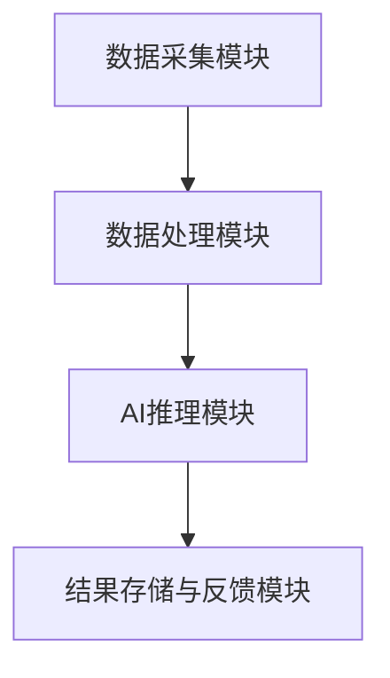
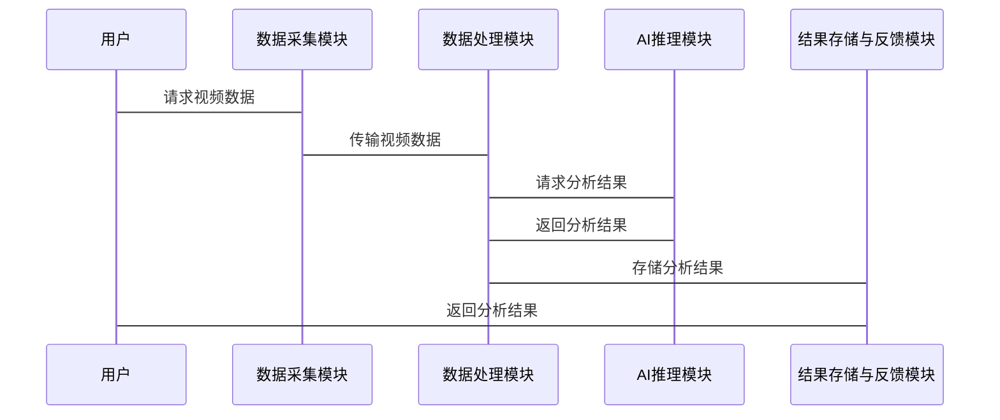

                 


# 如何识别企业的边缘AI视频分析优势

---

## 关键词：
- 边缘AI
- 视频分析
- 企业优势
- 算法原理
- 系统架构

---

## 摘要：
边缘AI视频分析是一种将人工智能技术应用于边缘计算环境中的视频分析方法，能够在靠近数据源的地方实时处理视频数据，减少延迟并提高效率。本文将从边缘AI视频分析的背景与意义出发，深入探讨其核心概念与算法原理，分析系统架构与设计，并通过项目实战展示如何识别和应用企业的边缘AI视频分析优势。通过本文的学习，读者将能够全面理解边缘AI视频分析的优势，并掌握如何在企业中识别和应用这些优势。

---

# 第一部分: 边缘AI视频分析的背景与意义

## 第1章: 边缘AI视频分析的背景与意义

### 1.1 边缘计算与AI的结合

#### 1.1.1 边缘计算的基本概念
边缘计算是一种分布式计算范式，数据在靠近数据源的地方进行处理，而不是依赖于云端。边缘计算的优势在于低延迟和高实时性，适用于需要快速响应的场景，如工业自动化、智能安防和自动驾驶等。

#### 1.1.2 AI在边缘计算中的作用
AI技术的引入使边缘计算能够实现智能决策和自动化操作。通过在边缘设备上部署AI模型，企业可以在本地处理视频数据，减少对云端的依赖，同时提高数据隐私和安全性。

#### 1.1.3 边缘AI视频分析的定义与特点
边缘AI视频分析是指在边缘设备上利用AI技术对视频数据进行实时分析的过程。其特点包括低延迟、高实时性、数据隐私性高、资源消耗低等。

---

### 1.2 企业视频分析的需求与痛点

#### 1.2.1 传统视频分析的局限性
传统视频分析主要依赖于云端服务器，数据传输过程中的延迟较高，且需要大量的带宽支持。此外，云端服务器的计算资源有限，难以满足大规模视频分析的需求。

#### 1.2.2 边缘AI视频分析的优势
边缘AI视频分析可以在本地处理视频数据，减少延迟和带宽消耗。同时，边缘设备的分布式部署能够满足大规模视频分析的需求，提升系统的扩展性和灵活性。

#### 1.2.3 企业视频分析的典型场景
企业视频分析的典型场景包括智能安防、工业监控、交通管理、智能零售等。这些场景对实时性和数据隐私性有较高要求，边缘AI视频分析能够很好地满足这些需求。

---

### 1.3 本章小结

通过本章的介绍，我们了解了边缘计算的基本概念以及AI在边缘计算中的作用，明确了边缘AI视频分析的定义与特点。同时，我们还分析了企业视频分析的需求与痛点，为后续内容奠定了基础。

---

# 第二部分: 边缘AI视频分析的核心概念与原理

## 第2章: 边缘AI视频分析的核心概念

### 2.1 边缘AI视频分析的关键技术

#### 2.1.1 视频流处理
视频流处理是指对实时视频数据流进行处理的过程。边缘AI视频分析需要对视频流进行实时分析，提取有用的信息，如目标检测、行为识别等。

#### 2.1.2 AI模型推理
AI模型推理是指在边缘设备上运行预训练的AI模型，对视频数据进行分析和预测。边缘设备的计算资源有限，因此需要优化AI模型以适应边缘环境。

#### 2.1.3 边缘设备的资源限制
边缘设备的计算能力、存储能力和带宽有限，因此需要在模型压缩、算法优化和资源分配等方面进行优化，以确保视频分析的高效性和准确性。

---

### 2.2 边缘AI视频分析的系统架构

#### 2.2.1 边缘设备的分类与特点
边缘设备包括智能摄像头、边缘服务器、嵌入式设备等。不同类型的边缘设备具有不同的计算能力和功能特点，适用于不同的视频分析场景。

#### 2.2.2 边缘AI视频分析的流程
边缘AI视频分析的流程包括数据采集、数据预处理、模型推理、结果反馈等步骤。每个步骤都需要在边缘设备上高效完成，以确保实时性和准确性。

#### 2.2.3 系统的可扩展性与灵活性
边缘AI视频分析系统的可扩展性与灵活性是企业选择的关键因素。系统需要能够支持大规模部署，同时能够根据需求进行功能扩展和优化。

---

### 2.3 边缘AI视频分析的核心要素

#### 2.3.1 数据采集与预处理
数据采集是视频分析的第一步，需要确保数据的完整性和准确性。数据预处理包括图像增强、噪声消除等，以提高后续分析的准确性。

#### 2.3.2 模型训练与部署
模型训练是指在云端对AI模型进行训练，部署是指将训练好的模型部署到边缘设备上。模型训练需要考虑边缘设备的资源限制，进行模型压缩和优化。

#### 2.3.3 结果反馈与优化
结果反馈是指将视频分析的结果传回给系统或用户，优化是指根据反馈结果对模型或系统进行优化，以提高分析的准确性和效率。

---

## 第3章: 边缘AI视频分析的原理与算法

### 3.1 边缘AI视频分析的算法原理

#### 3.1.1 目标检测算法
目标检测算法用于在视频中检测和识别特定的目标。常用的算法包括YOLO、Faster R-CNN等。目标检测算法需要在边缘设备上高效运行，因此需要优化模型和算法。

#### 3.1.2 语义分割算法
语义分割算法用于对视频中的每个像素进行分类，识别场景中的物体和背景。语义分割算法在边缘设备上的应用需要考虑计算资源的限制。

#### 3.1.3 行为识别算法
行为识别算法用于识别视频中人物的行为，如行走、跑步、挥手等。行为识别算法需要对视频流进行实时分析，具有较高的实时性和准确性要求。

---

### 3.2 常见算法的优劣势对比

#### 3.2.1 YOLO系列算法
YOLO系列算法以其高效的推理速度和简单的实现方式著称。YOLO v3和YOLO v4在目标检测任务中表现出色，但模型体积较大，对边缘设备的计算资源要求较高。

#### 3.2.2 Faster R-CNN系列算法
Faster R-CNN系列算法以其准确率高、性能稳定著称。Faster R-CNN在目标检测任务中表现出色，但推理速度较慢，不适合对实时性要求较高的场景。

#### 3.2.3 深度学习与传统算法的对比
深度学习算法在准确性和灵活性方面具有优势，但需要较高的计算资源。传统算法在实时性和资源占用方面具有优势，但在复杂场景中的表现较差。

---

### 3.3 算法实现的数学模型与公式

#### 3.3.1 深度学习模型的数学基础
深度学习模型的数学基础包括线性代数、微积分、概率论等。常用的模型包括卷积神经网络（CNN）、循环神经网络（RNN）等。

#### 3.3.2 检测算法的损失函数
目标检测算法的损失函数包括分类损失、定位损失和置信度损失。常用的损失函数包括交叉熵损失和均方误差损失。

#### 3.3.3 模型优化的数学方法
模型优化的数学方法包括梯度下降、Adam优化器、批量归一化等。这些方法能够有效降低模型的训练误差和测试误差，提高模型的泛化能力。

---

# 第三部分: 边缘AI视频分析的系统架构与设计

## 第4章: 边缘AI视频分析的系统架构

### 4.1 系统功能模块设计

#### 4.1.1 数据采集模块
数据采集模块负责从边缘设备中采集视频数据，包括摄像头、传感器等。数据采集模块需要确保数据的完整性和准确性。

#### 4.1.2 数据处理模块
数据处理模块负责对采集到的视频数据进行预处理，包括图像增强、噪声消除等。数据处理模块需要提高后续分析的准确性和效率。

#### 4.1.3 AI推理模块
AI推理模块负责对预处理后的视频数据进行分析和预测，包括目标检测、语义分割等。AI推理模块需要在边缘设备上高效运行，确保实时性和准确性。

#### 4.1.4 结果存储与反馈模块
结果存储与反馈模块负责将分析结果存储到数据库或传送给用户。结果反馈模块需要根据反馈结果对模型或系统进行优化，提高系统的整体性能。

---

### 4.2 系统架构设计

#### 4.2.1 系统功能设计
系统功能设计包括数据采集、数据处理、AI推理、结果存储与反馈等功能模块。每个模块需要协同工作，确保系统的高效性和准确性。

#### 4.2.2 系统架构设计图
以下是系统架构设计的Mermaid图：



#### 4.2.3 系统接口设计
系统接口设计需要定义各模块之间的接口和协议，确保模块之间的高效通信和数据交换。

#### 4.2.4 系统交互流程图
以下是系统交互流程的Mermaid序列图：



---

## 第5章: 边缘AI视频分析的项目实战

### 5.1 环境安装

#### 5.1.1 安装边缘计算框架
常用的边缘计算框架包括Kubernetes、Docker、边缘计算平台等。需要根据具体需求选择合适的框架，并进行安装和配置。

#### 5.1.2 安装AI库与工具
常用的AI库与工具包括TensorFlow、PyTorch、OpenCV等。需要根据具体需求选择合适的库，并进行安装和配置。

#### 5.1.3 安装边缘设备驱动
边缘设备驱动是指用于控制和管理边缘设备的驱动程序。需要根据具体的边缘设备类型选择合适的驱动程序，并进行安装和配置。

---

### 5.2 系统核心实现源代码

#### 5.2.1 数据采集模块
以下是数据采集模块的Python代码示例：

```python
import cv2

def video_capture():
    cap = cv2.VideoCapture(0)
    while True:
        ret, frame = cap.read()
        if not ret:
            break
        # 对视频流进行处理
        # ...
        cv2.imshow('Video', frame)
        if cv2.waitKey(1) & 0xFF == ord('q'):
            break
    cap.release()
    cv2.destroyAllWindows()

video_capture()
```

#### 5.2.2 AI推理模块
以下是AI推理模块的Python代码示例：

```python
import tensorflow as tf
from tensorflow.keras.models import load_model

model = load_model('edge_detection_model.h5')
def predict_image(image):
    prediction = model.predict(image)
    return prediction

image = ...  # 输入视频帧
result = predict_image(image)
print(result)
```

#### 5.2.3 结果存储与反馈模块
以下是结果存储与反馈模块的Python代码示例：

```python
import sqlite3

conn = sqlite3.connect('analysis_results.db')
cursor = conn.cursor()
cursor.execute('CREATE TABLE IF NOT EXISTS results (id INTEGER PRIMARY KEY AUTOINCREMENT, result TEXT, timestamp TEXT)')
cursor.execute('INSERT INTO results (result, timestamp) VALUES (?, ?)', (str(result), datetime.now()))
conn.commit()
conn.close()
```

---

### 5.3 实际案例分析

#### 5.3.1 案例背景介绍
以智能安防场景为例，企业需要在边缘设备上部署目标检测算法，实时监控视频流中的异常行为。

#### 5.3.2 系统实现与分析
通过在边缘设备上部署YOLO目标检测算法，实现对视频流中异常行为的实时检测和报警。系统需要考虑边缘设备的计算资源限制，进行模型优化和算法优化。

#### 5.3.3 代码实现与解读
以下是目标检测算法的代码实现：

```python
import cv2
import numpy as np

def detect_objects(image):
    # 图像预处理
    image = cv2.resize(image, (416, 416))
    image = image / 255.0
    image = np.expand_dims(image, axis=0)
    # 模型推理
    prediction = model.predict(image)
    # 解析结果
    boxes = prediction[0]
    # 处理边界框
    for box in boxes:
        x1, y1, x2, y2 = box
        cv2.rectangle(image, (x1, y1), (x2, y2), (0, 255, 0), 2)
    return image

image = ...  # 输入视频帧
result_image = detect_objects(image)
cv2.imshow('Detected Objects', result_image)
cv2.waitKey(0)
cv2.destroyAllWindows()
```

---

### 5.4 项目小结

通过本章的项目实战，我们了解了边缘AI视频分析系统的实现流程，包括环境安装、核心模块实现、实际案例分析等。通过实际案例的分析和实现，我们能够更好地理解边缘AI视频分析的优势和应用场景。

---

## 第6章: 边缘AI视频分析的最佳实践

### 6.1 系统优化与性能提升

#### 6.1.1 模型优化技巧
模型优化技巧包括模型压缩、知识蒸馏、模型剪枝等。这些技巧能够有效降低模型的计算复杂度，提高模型在边缘设备上的运行效率。

#### 6.1.2 算法优化技巧
算法优化技巧包括算法加速、并行计算、量化等。这些技巧能够有效提高算法的运行速度，降低算法的资源消耗。

#### 6.1.3 系统架构优化技巧
系统架构优化技巧包括模块化设计、异步处理、资源分配优化等。这些技巧能够有效提高系统的整体性能，降低系统的运行成本。

---

### 6.2 注意事项与风险提示

#### 6.2.1 数据隐私与安全
边缘AI视频分析需要考虑数据隐私和安全问题。企业需要采取数据加密、访问控制等措施，确保数据的安全性和隐私性。

#### 6.2.2 系统稳定性与容错性
边缘AI视频分析系统需要考虑系统的稳定性和容错性。企业需要设计完善的容错机制，确保系统在异常情况下的稳定运行。

#### 6.2.3 系统可扩展性与维护
边缘AI视频分析系统需要考虑系统的可扩展性和维护性。企业需要设计模块化的系统架构，便于系统的扩展和维护。

---

### 6.3 拓展阅读与学习资源

#### 6.3.1 边缘计算相关书籍
推荐书籍：《边缘计算：原理与实践》、《边缘计算与物联网》。

#### 6.3.2 AI视频分析相关书籍
推荐书籍：《深度学习实战》、《目标检测与图像识别》。

#### 6.3.3 开发工具与框架
推荐工具与框架：TensorFlow、PyTorch、OpenCV、Kubernetes、Docker。

---

## 第7章: 总结与展望

### 7.1 本章小结
通过本文的介绍，我们全面了解了边缘AI视频分析的背景与意义、核心概念与原理、系统架构与设计，以及项目实战与最佳实践。边缘AI视频分析作为一种新兴的技术，具有广阔的应用前景和巨大的发展潜力。

### 7.2 未来展望
未来，边缘AI视频分析技术将在更多的领域得到应用，如智能安防、工业自动化、交通管理等。同时，随着AI技术的不断发展，边缘AI视频分析系统将更加智能化、高效化和个性化。

---

# 结语

边缘AI视频分析是一种将边缘计算与AI技术相结合的新兴技术，能够在企业中发挥巨大的优势。通过本文的介绍，我们了解了边缘AI视频分析的核心概念与原理，掌握了系统架构与设计的要点，同时通过项目实战掌握了边缘AI视频分析的实现方法。希望本文能够为企业识别和应用边缘AI视频分析优势提供有价值的参考和指导。

