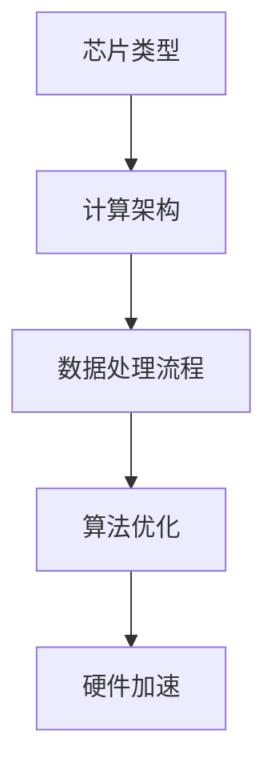
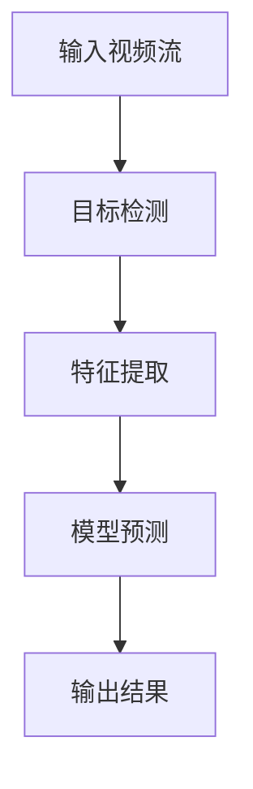
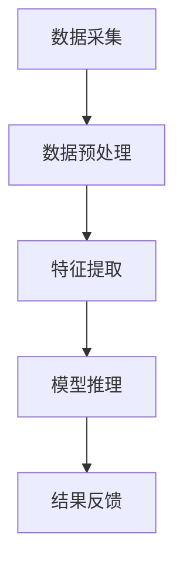
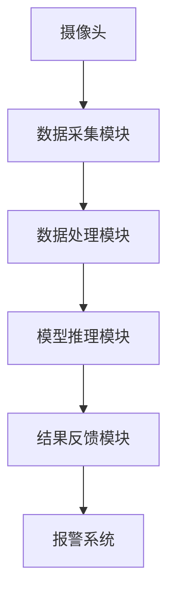
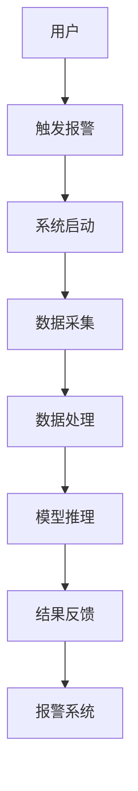

                 


# 如何识别企业的边缘AI视频分析芯片优势

> 关键词：边缘计算，AI视频分析，芯片优势，系统架构，算法优化

> 摘要：本文将深入探讨如何识别企业在边缘AI视频分析芯片方面的优势。通过分析边缘计算的背景、AI视频分析芯片的核心概念、算法原理、系统架构、项目实战以及最佳实践，帮助读者全面理解边缘AI视频分析芯片的优势，为企业在该领域的技术应用和决策提供参考。

---

# 第一部分: 边缘AI视频分析芯片的背景与优势

## 第1章: 边缘AI视频分析芯片的背景介绍

### 1.1 问题背景与定义

#### 1.1.1 边缘AI视频分析的定义
边缘AI视频分析指的是在靠近数据源（如摄像头或其他传感器）的地方，利用人工智能技术对视频流进行实时分析。与传统的云端视频分析不同，边缘AI视频分析能够在本地完成数据处理，减少了网络延迟和数据传输量，提高了实时性和隐私保护能力。

#### 1.1.2 问题背景与需求分析
随着视频监控、智能交通、工业自动化等领域对实时性要求的提高，传统的云端视频分析模式逐渐暴露出以下问题：
- **延迟高**：云端处理需要将数据上传到远程服务器，再将结果回传，延迟较高。
- **带宽消耗大**：视频数据量大，频繁上传到云端会占用大量带宽。
- **隐私问题**：视频数据在传输过程中可能被截获，存在隐私泄露风险。
- **可靠性差**：网络中断时，视频分析功能无法正常运行。

因此，边缘AI视频分析芯片的需求日益增长。

#### 1.1.3 边缘计算与AI的结合
边缘计算通过将计算能力推向数据源端，能够实现低延迟、高实时性的本地化数据处理。AI技术的引入，则使得边缘计算能够完成复杂的视频分析任务，如目标检测、图像识别、行为分析等。

---

### 1.2 核心概念与问题解决

#### 1.2.1 边缘AI视频分析的核心要素
边缘AI视频分析芯片的优势主要体现在以下几个方面：
- **低延迟**：本地化处理，减少数据传输时间。
- **高实时性**：能够在毫秒级别完成视频分析任务。
- **隐私保护**：数据无需上传到云端，降低隐私泄露风险。
- **高能效比**：通过专用硬件设计，实现高效能比，延长设备续航时间。

#### 1.2.2 问题解决的逻辑框架
边缘AI视频分析芯片通过以下方式解决问题：
1. **数据采集**：通过摄像头或其他传感器采集视频流。
2. **数据处理**：在本地完成视频编码、解码和特征提取。
3. **模型推理**：利用预训练的AI模型对视频数据进行分析，生成结果。
4. **结果反馈**：将分析结果用于实时监控、报警或其他应用。

#### 1.2.3 边缘AI视频分析的边界与外延
边缘AI视频分析的边界在于其处理能力的限制，通常适用于低复杂度的视频分析任务。其外延则包括与云端的协同计算，即在边缘设备完成初步分析后，将感兴趣的数据上传到云端进行深度分析。

---

### 1.3 核心概念的结构与组成

#### 1.3.1 核心概念的层次结构
边缘AI视频分析芯片的层次结构可以分为以下几个层次：
1. **数据采集层**：负责采集视频流数据。
2. **数据处理层**：对视频数据进行预处理，提取特征。
3. **模型推理层**：利用AI模型对视频数据进行分析，生成结果。
4. **结果应用层**：将分析结果应用于实际场景，如报警、控制等。

#### 1.3.2 核心要素的关联关系
边缘AI视频分析芯片的核心要素包括：
- **计算架构**：决定芯片的处理能力。
- **数据处理**：影响芯片的吞吐量和延迟。
- **算法优化**：决定芯片的分析精度和效率。
- **硬件加速**：提升芯片的性能。

#### 1.3.3 案例分析与应用场景
**案例分析**：
- **智能安防**：通过边缘AI芯片实时检测异常行为，如人脸识别、行为分析。
- **工业自动化**：通过边缘AI芯片实时检测生产线上的缺陷产品。
- **智能交通**：通过边缘AI芯片实时分析交通流量，优化信号灯控制。

---

## 第2章: 边缘AI视频分析芯片的核心概念与联系

### 2.1 核心概念的原理分析

#### 2.1.1 边缘AI视频分析芯片的原理
边缘AI视频分析芯片的工作原理可以分为以下几个步骤：
1. **数据采集**：通过摄像头或其他传感器采集视频流数据。
2. **数据预处理**：对视频数据进行降噪、编码等预处理。
3. **特征提取**：利用深度学习模型提取视频数据的特征。
4. **模型推理**：利用预训练的模型对特征进行分析，生成结果。
5. **结果反馈**：将分析结果应用于实际场景。

#### 2.1.2 计算架构与数据处理流程
边缘AI视频分析芯片的计算架构通常包括：
- **计算单元**：负责执行模型推理任务。
- **数据缓存**：用于存储中间数据和结果。
- **控制单元**：负责协调各部分的工作。

#### 2.1.3 算法优化与硬件加速
为了提高边缘AI视频分析芯片的性能，通常会对算法进行优化，例如：
- **模型剪枝**：减少模型的参数数量，降低计算量。
- **模型量化**：将模型的参数精度从浮点数降低到低位整数，减少计算资源消耗。
- **硬件加速**：利用专用硬件（如GPU、FPGA）加速模型推理过程。

---

### 2.2 核心概念的属性特征对比

#### 2.2.1 芯片类型对比
以下是几种常见的边缘AI视频分析芯片的对比：

| 芯片类型 | 优点 | 缺点 |
|----------|------|------|
| GPU       | 高计算能力，支持复杂模型 | 高功耗，不适合移动设备 |
| FPGA      | 低功耗，可编程 | 开发周期长，复杂度高 |
| ASIC      | 低功耗，高能效 | 开发成本高，周期长 |

#### 2.2.2 计算能力对比
以下是几种芯片的计算能力对比：

| 芯片类型 | 计算能力（FLOPS） | 适用场景 |
|----------|------------------|-----------|
| GPU       | 高               | 高端服务器 |
| FPGA      | 中               | 工业自动化 |
| ASIC      | 高               | 智能安防 |

#### 2.2.3 时延与资源消耗对比
以下是几种芯片的时延与资源消耗对比：

| 芯片类型 | 平均时延（毫秒） | 资源消耗（功耗/W） |
|----------|------------------|-------------------|
| GPU       | 50               | 100               |
| FPGA      | 30               | 50                |
| ASIC      | 20               | 20                |

---

### 2.3 ER实体关系图架构



---

## 第3章: 边缘AI视频分析芯片的算法原理

### 3.1 算法原理的数学模型

#### 3.1.1 模型训练的数学公式
边缘AI视频分析芯片通常使用深度学习模型，如YOLO或Faster R-CNN。模型训练的数学公式如下：
$$\text{损失函数} = \lambda_1 \text{分类损失} + \lambda_2 \text{回归损失}$$

其中，$\lambda_1$ 和 $\lambda_2$ 是超参数，用于权衡分类和回归损失的重要性。

#### 3.1.2 模型优化的数学公式
模型优化通常采用梯度下降算法，例如Adam优化器：
$$\theta_{t+1} = \theta_t - \eta \nabla L(\theta_t)$$
其中，$\theta$ 是模型参数，$\eta$ 是学习率，$\nabla L$ 是损失函数的梯度。

---

### 3.2 算法原理的流程图



---

### 3.3 算法实现的Python代码

#### 3.3.1 环境搭建
为了实现边缘AI视频分析，首先需要安装以下Python库：
```bash
pip install numpy
pip install tensorflow
pip install opencv-python
```

#### 3.3.2 核心代码实现
以下是YOLO模型的Python实现示例：
```python
import numpy as np
import tensorflow as tf
import cv2

def load_model():
    # 加载预训练模型
    model = tf.keras.models.load_model("yolov4.tf")
    return model

def preprocess_image(image_path):
    # 读取图片并预处理
    image = cv2.imread(image_path)
    image = cv2.resize(image, (416, 416))
    image = image / 255.0
    return image

def detect_objects(model, image):
    # 检测目标
    predictions = model.predict(np.array([image]))
    return predictions

if __name__ == "__main__":
    model = load_model()
    image = preprocess_image("input.jpg")
    predictions = detect_objects(model, image)
    print("检测到的目标：", predictions)
```

#### 3.3.3 代码功能解读
- **load_model()**：加载预训练的YOLO模型。
- **preprocess_image()**：读取图片并进行预处理，包括调整尺寸和归一化。
- **detect_objects()**：利用模型对图片进行预测，返回检测结果。

---

### 3.4 算法原理的详细讲解

#### 3.4.1 模型训练
模型训练需要大量的标注数据和计算资源。通常使用GPU加速训练过程，采用批量训练和学习率衰减策略来优化模型性能。

#### 3.4.2 模型推理
模型推理是边缘AI视频分析芯片的核心任务。芯片需要在本地快速完成模型推理，生成实时的分析结果。

#### 3.4.3 算法优化
为了提高模型推理效率，通常会对模型进行剪枝和量化优化，减少模型的参数数量和精度，降低计算资源消耗。

---

## 第4章: 边缘AI视频分析芯片的系统分析与架构设计

### 4.1 系统分析

#### 4.1.1 问题场景介绍
边缘AI视频分析芯片的应用场景通常包括：
- **智能安防**：实时监控视频流，检测异常行为。
- **工业自动化**：实时检测生产线上的缺陷产品。
- **智能交通**：实时分析交通流量，优化信号灯控制。

#### 4.1.2 项目介绍
以智能安防为例，设计一个边缘AI视频分析系统，用于实时检测非法闯入行为。

---

### 4.2 系统功能设计

#### 4.2.1 系统功能模块
边缘AI视频分析系统的功能模块包括：
1. **数据采集模块**：负责采集视频流数据。
2. **数据处理模块**：对视频数据进行预处理和特征提取。
3. **模型推理模块**：利用AI模型对视频数据进行分析，生成结果。
4. **结果反馈模块**：将分析结果应用于实际场景，如报警、控制等。

#### 4.2.2 系统功能流程
以下是系统功能流程图：



---

### 4.3 系统架构设计

#### 4.3.1 系统架构图
以下是系统架构图：



---

### 4.4 系统接口设计

#### 4.4.1 接口设计
系统接口设计包括：
1. **摄像头接口**：用于接收视频流数据。
2. **报警系统接口**：用于发送报警信号。
3. **用户界面接口**：用于显示分析结果。

---

### 4.5 系统交互流程图



---

## 第5章: 边缘AI视频分析芯片的项目实战

### 5.1 环境搭建

#### 5.1.1 环境需求
- **硬件要求**：支持边缘计算的设备，如树莓派、NVIDIA Jetson等。
- **软件要求**：安装Python、OpenCV、TensorFlow等开发工具。

#### 5.1.2 环境安装
```bash
# 安装必要的Python库
pip install numpy
pip install tensorflow
pip install opencv-python
```

---

### 5.2 系统核心实现

#### 5.2.1 核心代码实现
以下是边缘AI视频分析芯片的核心代码实现：
```python
import cv2
import numpy as np
import tensorflow as tf

# 加载预训练模型
model = tf.keras.models.load_model("yolov4.tf")

# 摄像头采集视频流
cap = cv2.VideoCapture(0)

while True:
    ret, frame = cap.read()
    if not ret:
        break
    # 预处理
    resized_frame = cv2.resize(frame, (416, 416))
    normalized_frame = resized_frame / 255.0
    # 模型推理
    prediction = model.predict(np.array([normalized_frame]))
    # 显示结果
    cv2.imshow("AI视频分析", frame)
    if cv2.waitKey(1) & 0xFF == ord('q'):
        break

cap.release()
cv2.destroyAllWindows()
```

---

### 5.3 代码功能解读与优化

#### 5.3.1 代码功能解读
- **摄像头采集**：使用OpenCV库采集视频流。
- **预处理**：将视频帧调整到模型输入尺寸，并归一化。
- **模型推理**：利用预训练模型对视频帧进行目标检测。
- **结果展示**：将检测结果实时显示在视频流中。

#### 5.3.2 代码优化
为了提高代码的运行效率，可以进行以下优化：
- **批处理**：将多帧视频数据一起输入模型进行推理。
- **量化**：将模型的参数精度从浮点数降低到低位整数，减少计算资源消耗。

---

### 5.4 实际案例分析

#### 5.4.1 案例分析
以智能安防为例，利用边缘AI视频分析芯片实时检测非法闯入行为。

#### 5.4.2 案例实现
以下是案例实现的代码：
```python
import cv2
import numpy as np
import tensorflow as tf

# 加载预训练模型
model = tf.keras.models.load_model("yolov4.tf")

# 摄像头采集视频流
cap = cv2.VideoCapture(0)

while True:
    ret, frame = cap.read()
    if not ret:
        break
    # 预处理
    resized_frame = cv2.resize(frame, (416, 416))
    normalized_frame = resized_frame / 255.0
    # 模型推理
    prediction = model.predict(np.array([normalized_frame]))
    # 显示结果
    cv2.imshow("AI视频分析", frame)
    if cv2.waitKey(1) & 0xFF == ord('q'):
        break

cap.release()
cv2.destroyAllWindows()
```

---

## 第6章: 边缘AI视频分析芯片的最佳实践

### 6.1 小结
边缘AI视频分析芯片的优势主要体现在低延迟、高实时性和隐私保护方面。通过优化算法和硬件设计，可以进一步提高芯片的性能和能效比。

### 6.2 注意事项
- **硬件选择**：根据具体需求选择合适的芯片类型，如GPU、FPGA或ASIC。
- **算法优化**：通过模型剪枝和量化优化，降低计算资源消耗。
- **系统设计**：合理设计系统架构，确保各模块协同工作。

### 6.3 拓展阅读
- **推荐书籍**：《深度学习》—— Ian Goodfellow
- **推荐论文**：YOLO: Real-Time Object Detection, arXiv:1612.01184
- **推荐博客**：Towards Data Science, Analytics Vidhya

---

# 第四部分: 总结

## 第7章: 边缘AI视频分析芯片的总结与展望

### 7.1 总结
本文详细探讨了边缘AI视频分析芯片的优势识别，包括背景介绍、核心概念、算法原理、系统架构和项目实战等方面。通过理论分析和实际案例，帮助读者全面理解边缘AI视频分析芯片的优势。

### 7.2 展望
随着边缘计算和AI技术的不断发展，边缘AI视频分析芯片的应用场景将更加广泛。未来的研究方向包括：
- **更高效的算法设计**：进一步优化模型推理效率，降低计算资源消耗。
- **更先进的硬件设计**：开发更高能效比的专用芯片，支持更复杂的视频分析任务。
- **更智能的系统架构**：实现边缘与云端的协同计算，充分发挥边缘AI的优势。

---

# 结语

通过本文的分析，读者可以更好地识别企业在边缘AI视频分析芯片方面的优势，并为实际应用提供参考。希望本文的内容能够为企业在该领域的技术应用和决策提供有价值的帮助。

