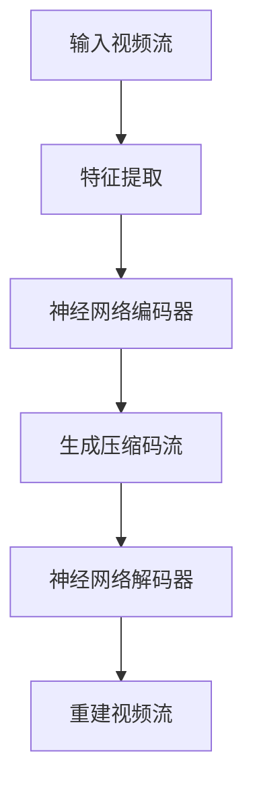
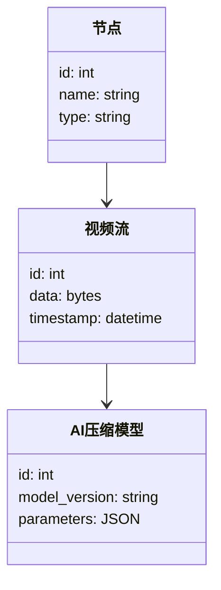
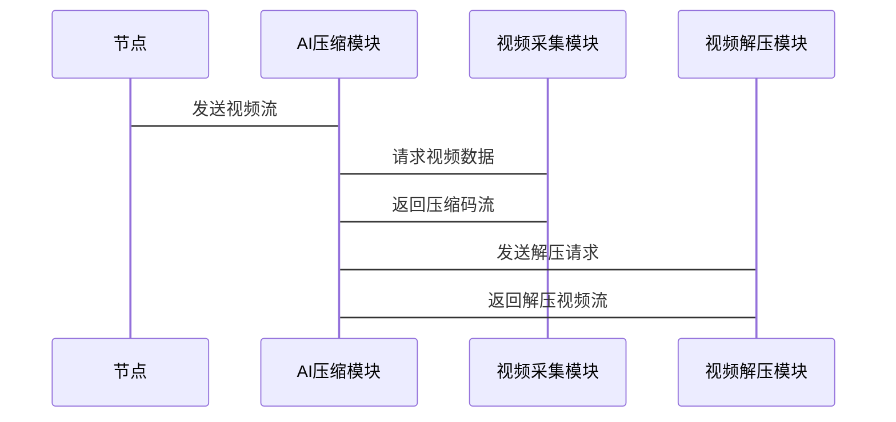

                 


# 如何识别企业的边缘AI视频压缩技术优势

## 关键词：边缘计算, AI视频压缩, 企业技术优势, 算法优化, 系统架构

## 摘要：  
本文详细探讨了企业在边缘AI视频压缩技术领域的优势识别方法。通过分析边缘计算的特点、AI技术在视频压缩中的应用，以及具体的算法优化策略，帮助企业识别和提升边缘AI视频压缩技术的核心竞争力。文章从背景介绍、核心概念、算法原理、系统架构、项目实战等多个维度展开，为企业提供实用的技术指导和优化建议。

---

# 第1章: 企业边缘AI视频压缩技术背景

## 1.1 问题背景与技术现状  
### 1.1.1 视频压缩技术的演进与挑战  
随着视频数据量的爆炸式增长，传统的视频压缩技术在带宽、存储和计算效率方面面临瓶颈。AI技术的引入为视频压缩带来了新的可能性。  

### 1.1.2 边缘计算的崛起与应用场景  
边缘计算的分布式特性使其成为视频压缩技术的理想平台，尤其是在实时性要求高、带宽有限的场景中。  

### 1.1.3 AI技术在视频压缩中的应用潜力  
AI技术可以通过深度学习模型优化视频压缩算法，降低码率的同时保持视频质量。  

## 1.2 企业需求与技术优势  
### 1.2.1 企业视频压缩的痛点分析  
- 高带宽消耗  
- 高计算资源占用  
- 实时性要求高  

### 1.2.2 边缘AI视频压缩的优势  
- 降低带宽消耗  
- 提高计算效率  
- 支持实时处理  

### 1.2.3 企业边缘AI视频压缩的市场前景  
AI视频压缩技术在企业中的应用将推动视频监控、远程医疗、智能安防等领域的发展。  

## 1.3 边缘AI视频压缩的基本概念  
### 1.3.1 视频压缩的基本原理  
视频压缩通过去除冗余信息（如空间冗余、时间冗余）来减少数据量。  

### 1.3.2 边缘计算的特点与优势  
边缘计算的分布式、低延迟和高实时性特点使其成为视频压缩的理想选择。  

### 1.3.3 AI在视频压缩中的作用  
AI通过深度学习模型优化压缩算法，提升压缩效率和视频质量。  

## 1.4 本章小结  
本章介绍了企业边缘AI视频压缩技术的背景、需求和技术优势，为后续章节的深入分析奠定了基础。

---

# 第2章: 边缘AI视频压缩的核心概念与联系  

## 2.1 核心概念原理  
### 2.1.1 AI在视频压缩中的优化原理  
AI模型通过学习视频特征，优化压缩算法的参数，实现更高效的压缩。  

### 2.1.2 边缘计算环境下的视频压缩特点  
边缘计算环境下的视频压缩需要考虑低延迟、高实时性和资源受限的问题。  

### 2.1.3 边缘AI视频压缩的核心算法  
基于深度学习的视频压缩算法（如神经网络编码器-解码器架构）是当前的研究热点。  

## 2.2 核心概念属性特征对比  
### 2.2.1 传统视频压缩算法与AI优化算法对比  
| 对比维度       | 传统压缩算法 | AI优化压缩算法 |  
|----------------|--------------|-----------------|  
| 压缩效率       | 较低         | 较高            |  
| 实时性          | 一般         | 更高            |  
| 模型复杂度      | 简单         | 复杂            |  

### 2.2.2 边缘计算与传统视频压缩环境对比  
| 对比维度       | 边缘计算环境 | 传统视频压缩环境 |  
|----------------|--------------|------------------|  
| 计算资源       | 分布式       | 集中式           |  
| 带宽占用       | 低           | 高               |  
| 实时性          | 高           | 一般             |  

### 2.2.3 AI模型在视频压缩中的性能对比  
| 对比维度       | 线性模型      | 深度学习模型     |  
|----------------|--------------|-----------------|  
| 压缩效果       | 一般         | 更优            |  
| 模型训练时间    | 短           | 长              |  

## 2.3 ER实体关系图架构  
```mermaid
erd
    entity 节点: {
        id: int,
        name: string,
        type: string
    }
    entity 视频流: {
        id: int,
        data: bytes,
        timestamp: datetime
    }
    entity AI压缩模型: {
        id: int,
        model_version: string,
        parameters: JSON
    }
    节点 --> 视频流
    视频流 --> AI压缩模型
```

## 2.4 本章小结  
本章通过对比分析和实体关系图，详细阐述了边缘AI视频压缩技术的核心概念及其与其他技术的联系。

---

# 第3章: 边缘AI视频压缩算法原理  

## 3.1 基于深度学习的视频压缩算法  
### 3.1.1 算法流程图  


### 3.1.2 算法实现代码示例  
```python
import tensorflow as tf
from tensorflow.keras import layers

# 定义神经网络编码器
def video_encoder(input_shape):
    inputs = layers.Input(shape=input_shape)
    x = layers.Conv2D(64, (3,3), padding='same')(inputs)
    x = layers.BatchNormalization()(x)
    x = layers.ReLU()(x)
    return tf.keras.Model(inputs=inputs, outputs=x)

# 定义神经网络解码器
def video_decoder(output_shape):
    inputs = layers.Input(shape=(None, 64, 64, 3))
    x = layers.Conv2DTranspose(64, (3,3), padding='same')(inputs)
    x = layers.BatchNormalization()(x)
    x = layers.ReLU()(x)
    return tf.keras.Model(inputs=inputs, outputs=x)
```

### 3.1.3 算法的数学模型和公式  
- 编码器输出：  
  $$ y = f(x) $$  
  其中，$x$ 是输入视频流，$f$ 是编码器模型。  

- 解码器输出：  
  $$ \hat{x} = g(y) $$  
  其中，$g$ 是解码器模型，$\hat{x}$ 是重建视频流。  

## 3.2 压缩效果评估  
### 3.2.1 常见评估指标  
- 帧率（FPS）  
- 码率（Bitrate）  
- 视频质量（PSNR、SSIM）  

### 3.2.2 模型训练与优化  
- 损失函数：  
  $$ L = \text{MSE}(x, \hat{x}) $$  

- 优化目标：  
  $$ \min L $$  

## 3.3 本章小结  
本章通过深度学习算法的实现和评估，详细探讨了边缘AI视频压缩技术的数学模型和优化策略。

---

# 第4章: 边缘AI视频压缩系统分析与架构设计  

## 4.1 问题场景介绍  
企业边缘AI视频压缩系统通常应用于视频监控、实时流媒体等场景。  

## 4.2 系统功能设计  
### 4.2.1 功能模块划分  
- 视频采集模块  
- AI压缩模块  
- 视频解压模块  

### 4.2.2 领域模型类图  


### 4.2.3 系统架构图  


## 4.3 接口和交互设计  
### 4.3.1 接口设计  
- 视频流输入接口：`POST /api/video-stream`  
- 压缩结果输出接口：`GET /api/compressed-stream`  

### 4.3.2 交互流程图  


## 4.4 本章小结  
本章通过系统分析和架构设计，详细阐述了边缘AI视频压缩技术的实现方案和交互流程。

---

# 第5章: 企业边缘AI视频压缩技术项目实战  

## 5.1 环境搭建与工具安装  
### 5.1.1 环境需求  
- Python 3.8+  
- TensorFlow 2.5+  
- OpenCV 4.5+  

### 5.1.2 工具安装  
```bash
pip install tensorflow==2.5.0
pip install opencv-python==4.5.5.52
```

## 5.2 核心功能实现  
### 5.2.1 视频采集模块实现  
```python
import cv2

def capture_video(cap):
    while True:
        ret, frame = cap.read()
        if not ret:
            break
        yield frame
```

### 5.2.2 AI压缩模块实现  
```python
def compress_video(frames, model):
    compressed_frames = []
    for frame in frames:
        compressed_frame = model.predict(frame)
        compressed_frames.append(compressed_frame)
    return compressed_frames
```

### 5.2.3 视频解压模块实现  
```python
def decompress_video(compressed_frames, model):
    decompressed_frames = []
    for compressed_frame in compressed_frames:
        decompressed_frame = model.predict(compressed_frame)
        decompressed_frames.append(decompressed_frame)
    return decompressed_frames
```

## 5.3 项目代码解读与分析  
- 视频采集模块：从摄像头或文件中读取视频流。  
- AI压缩模块：使用预训练模型对视频流进行压缩。  
- 视频解压模块：对压缩后的码流进行解压，恢复原始视频流。  

## 5.4 实际案例分析  
### 5.4.1 案例背景  
某企业视频监控系统采用边缘AI视频压缩技术，显著降低了带宽消耗。  

### 5.4.2 案例分析  
- 压缩前带宽：1000 Mbps  
- 压缩后带宽：300 Mbps  
- 压缩比：3:1  
- 视频质量：PSNR=35 dB  

## 5.5 本章小结  
本章通过项目实战，详细展示了边缘AI视频压缩技术的实现过程和实际应用效果。

---

# 第6章: 企业边缘AI视频压缩技术的最佳实践与小结  

## 6.1 最佳实践 tips  
- 选择合适的AI压缩算法  
- 优化模型训练效率  
- 降低系统计算资源消耗  

## 6.2 项目总结与经验分享  
- 系统设计的灵活性和可扩展性是关键  
- 模型优化和调参是提升压缩效率的核心  

## 6.3 注意事项与风险提示  
- 确保模型的实时性和稳定性  
- 处理好数据隐私和安全问题  

## 6.4 拓展阅读与学习资源  
- 推荐书籍：《深度学习与视频压缩》  
- 推荐论文：《基于深度学习的低比特率视频压缩》  

## 6.5 本章小结  
本章总结了企业边缘AI视频压缩技术的最佳实践经验和注意事项，为后续优化和应用提供了参考。

---

# 结语  

通过本文的详细讲解，企业可以更好地识别和提升边缘AI视频压缩技术的优势，从而在实际应用中实现更高的效率和更低的成本。希望本文的内容能够为企业提供有价值的参考和指导。

