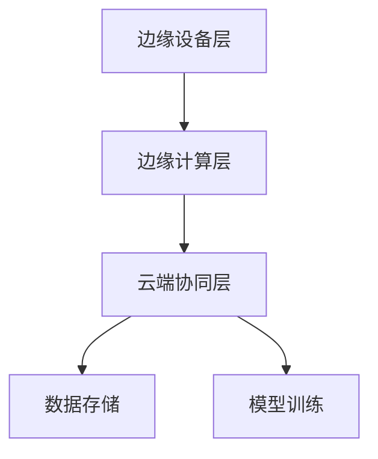
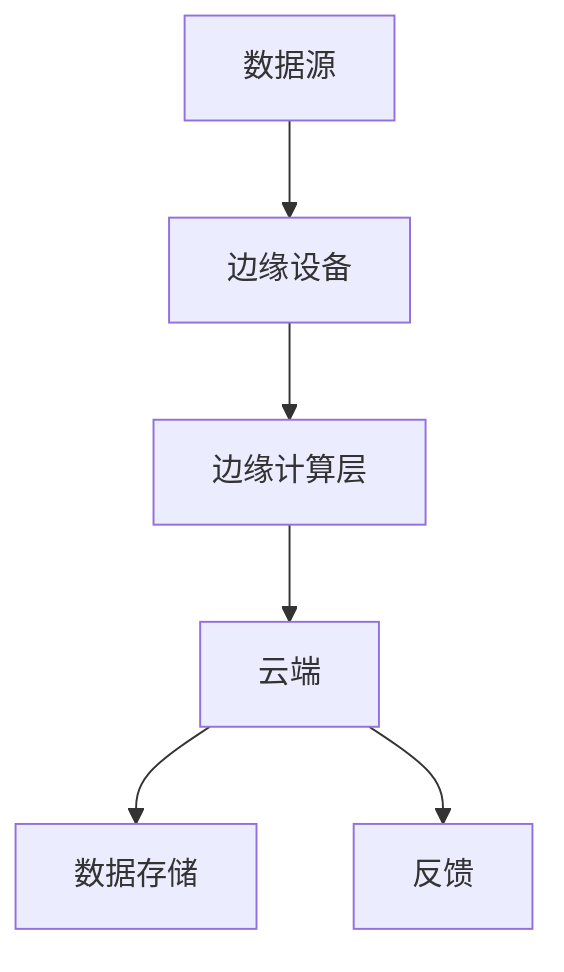
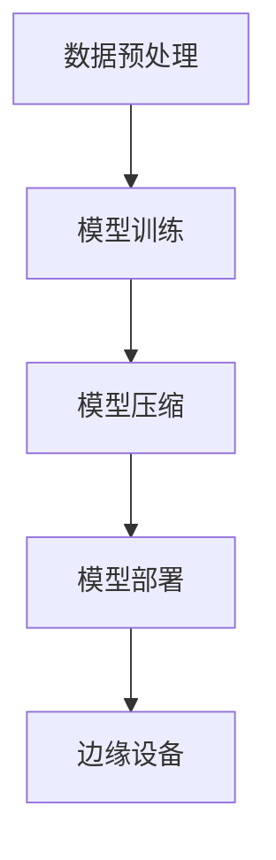
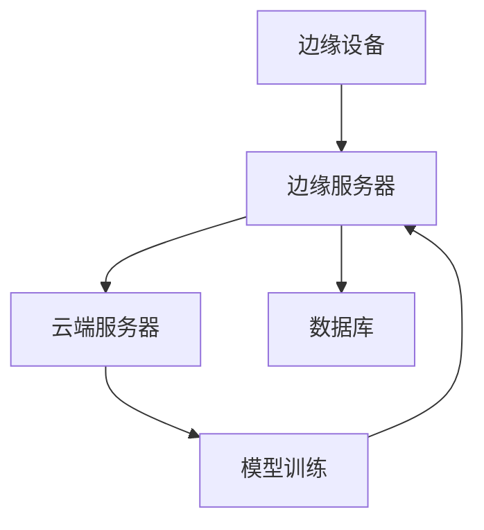
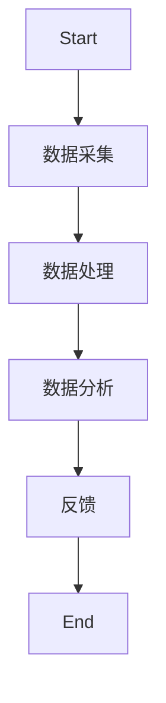

                 


# 如何识别企业的边缘AI计算优势

> 关键词：边缘AI、边缘计算、人工智能、企业优势、系统架构

> 摘要：本文深入探讨了如何识别企业在边缘AI计算中的优势，从核心概念到系统架构，结合实际案例，帮助读者全面理解并有效应用边缘AI技术。

---

## 第一章：引言

边缘AI计算近年来迅速崛起，成为企业数字化转型的重要推动力。随着物联网设备的普及和AI技术的成熟，边缘AI为企业提供了实时、高效的数据处理能力。本文旨在帮助企业识别边缘AI的优势，优化其应用，从而提升竞争力。

---

## 第二章：边缘AI的核心概念

### 2.1 边缘AI的定义与特点

边缘AI是指在靠近数据源的边缘设备上进行AI处理的技术。其特点包括低延迟、实时性、数据隐私和资源优化。

### 2.2 边缘AI与云计算的区别

| 特性 | 边缘AI | 云计算 |
|------|--------|--------|
| 数据处理 | 实时本地处理 | 中央化处理 |
| 带宽需求 | 低 | 高 |
| 延迟 | 低 | 高 |

### 2.3 企业边缘AI的背景与重要性

边缘AI的兴起源于企业对实时数据处理和隐私保护的需求。随着物联网设备的增加，边缘AI在智能制造、智慧城市等领域发挥着重要作用。

---

## 第三章：边缘AI的优势与劣势

### 3.1 边缘AI的优势

1. **低延迟与实时性**：边缘AI能够快速响应，适用于实时决策场景。
2. **数据隐私与安全**：数据在本地处理，减少传输中的隐私风险。
3. **网络带宽优化**：通过本地处理，减少数据传输量，降低成本。

### 3.2 边缘AI的劣势

1. **设备计算能力有限**：边缘设备的计算资源有限，影响复杂模型的运行。
2. **设备管理复杂**：大量边缘设备的维护和更新增加了管理难度。
3. **模型更新挑战**：边缘设备难以频繁更新模型，影响准确性。

---

## 第四章：边缘AI的技术架构

### 4.1 边缘AI的系统架构

系统架构通常包括边缘设备层、边缘计算层和云端协同层。以下是系统架构的Mermaid图：



### 4.2 数据流分析

数据从边缘设备采集，经过处理后传输到边缘计算层，再由云端进行分析和反馈。Mermaid数据流图如下：



---

## 第五章：边缘AI的优势识别

### 5.1 识别企业的边缘AI潜力

企业应评估现有设备的计算能力和数据处理需求，识别适合边缘AI的应用场景。

### 5.2 制定边缘AI战略

包括技术选型、资源分配和团队建设，确保边缘AI的有效实施。

### 5.3 评估边缘AI的可行性

通过技术评估、成本分析和风险评估，确定边缘AI的可行性。

---

## 第六章：边缘AI算法与模型

### 6.1 算法特点

边缘AI算法注重轻量化，适合在资源受限的设备上运行。常见的模型压缩技术包括剪枝和量化。

### 6.2 算法流程图

以下是一个边缘AI模型训练和部署的流程图：



### 6.3 模型实现

以下是模型训练的Python代码示例：

```python
import tensorflow as tf
from tensorflow.keras import layers

# 数据预处理
def preprocess_data(data):
    # 数据归一化
    return data / 255.0

# 模型定义
def create_model():
    model = tf.keras.Sequential([
        layers.Conv2D(32, (3,3), activation='relu', input_shape=(28,28,1)),
        layers.MaxPooling2D((2,2)),
        layers.Flatten(),
        layers.Dense(128, activation='relu'),
        layers.Dense(10, activation='softmax')
    ])
    model.compile(optimizer='adam', loss='sparse_categorical_crossentropy', metrics=['accuracy'])
    return model

# 模型训练
def train_model(model, train_data, train_labels):
    model.fit(train_data, train_labels, epochs=5, batch_size=64)

# 模型压缩
def model_quantization(model):
    # 使用量化技术减少模型大小
    converter = tf.lite.TFLiteConverter.from_keras_model(model)
    tflite_model = converter.convert()
    return tflite_model

# 模型部署
def deploy_model(model, test_data, test_labels):
    # 使用模型进行预测
    predictions = model.predict(test_data)
    print('Accuracy:', accuracy_score(test_labels, predictions.argmax(axis=1)))
```

### 6.4 算法优化策略

通过轻量化设计、分布式计算和动态调整，优化算法性能。例如，使用迁移学习减少训练数据量。

---

## 第七章：边缘AI系统架构设计

### 7.1 系统架构设计

以下是系统架构的Mermaid图：



### 7.2 功能设计

系统功能包括数据采集、处理、分析和反馈。Mermaid功能流程图如下：



### 7.3 接口设计

系统接口包括边缘设备与服务器之间的通信接口，服务器与云端的接口。常用的通信协议有HTTP和MQTT。

---

## 第八章：项目实战

### 8.1 环境配置

推荐使用树莓派作为边缘设备，结合TensorFlow Lite进行模型部署。

### 8.2 核心代码实现

以下是边缘AI项目的代码示例：

```python
import tensorflow.lite as tflite

# 加载量化模型
def load_quantized_model(model_path):
    interpreter = tflite.Interpreter(model_path)
    interpreter.allocate_tensors()
    return interpreter

# 推理函数
def inference(interpreter, input_data):
    input_index = interpreter.get_input_details()[0].index
    output_index = interpreter.get_output_details()[0].index
    interpreter.set_tensor(input_index, input_data)
    interpreter.invoke()
    output_data = interpreter.get_tensor(output_index)
    return output_data

# 示例使用
def main():
    model_path = 'quantized_model.tflite'
    interpreter = load_quantized_model(model_path)
    input_data = preprocess_data(...)
    result = inference(interpreter, input_data)
    print('Result:', result)

if __name__ == '__main__':
    main()
```

### 8.3 案例分析

以智能制造为例，边缘AI可以实时监控生产线，检测产品缺陷，显著提高效率。

---

## 第九章：总结与最佳实践

### 9.1 总结

边缘AI在企业中的应用优势显著，但需要克服设备计算能力和管理复杂性等挑战。

### 9.2 最佳实践

1. **评估资源**：全面评估企业现有资源，识别适合的边缘AI场景。
2. **选择合适的技术**：根据需求选择合适的算法和架构。
3. **数据安全**：确保数据在边缘设备上的安全存储和传输。
4. **团队协作**：建立跨部门团队，确保项目顺利实施。

### 9.3 小结

边缘AI为企业提供了新的发展机遇，合理识别和利用其优势，将为企业带来显著的竞争优势。

---

通过以上结构，本文系统地介绍了边缘AI的优势、技术架构和实际应用，帮助读者全面理解并有效应用边缘AI技术。

