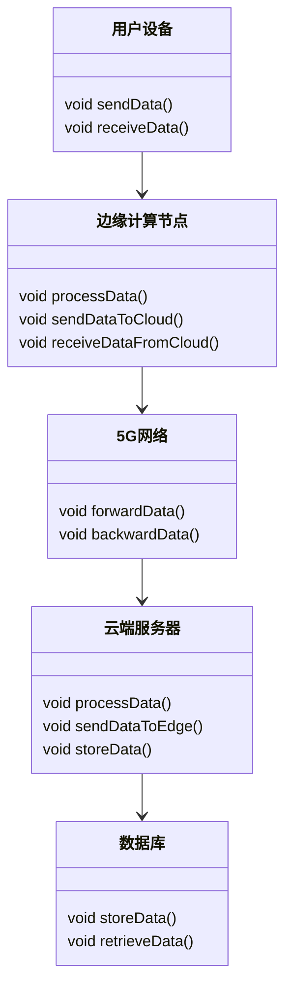
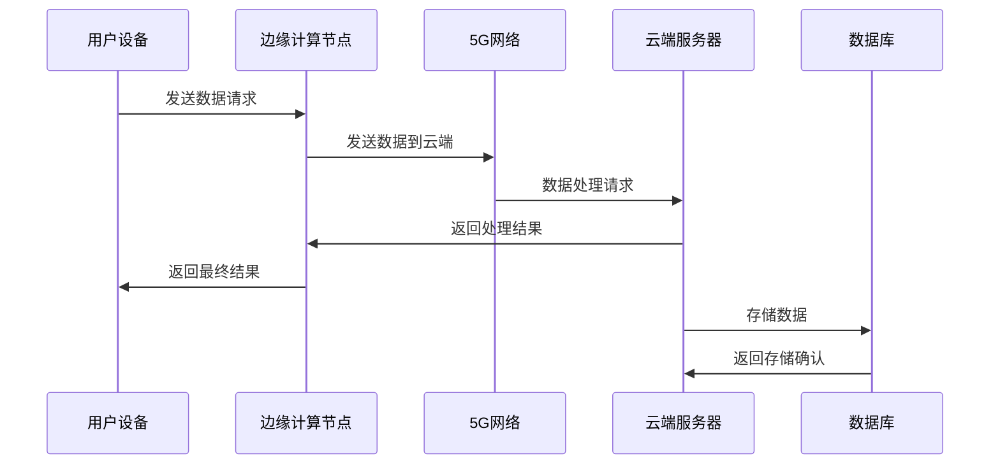

                 


# 如何识别企业的边缘计算5G优化优势

## 关键词：边缘计算，5G优化，企业应用，系统架构，数学模型

## 摘要：边缘计算和5G技术的结合为企业带来了显著的优势，包括降低延迟、节省带宽成本、提高数据安全性等。本文将从背景介绍、技术原理、系统架构、项目实战、最佳实践和扩展阅读六个方面详细分析如何识别和利用这些优势，帮助企业在数字化转型中取得更大的成功。

---

## 第1章: 边缘计算与5G的基本概念

### 1.1 边缘计算的定义与特点

#### 1.1.1 边缘计算的定义
边缘计算是一种分布式计算范式，将计算能力从云端扩展到数据生成的边缘，减少延迟并提高响应速度。

#### 1.1.2 边缘计算的核心特点
- **分布式**：数据在边缘节点进行处理，减少对云端的依赖。
- **低延迟**：边缘计算能够快速响应本地事件。
- **高带宽**：通过边缘节点处理大量数据，降低网络负载。

#### 1.1.3 边缘计算与云计算的区别
- **数据处理位置**：边缘计算在边缘节点处理数据，云计算在云端处理。
- **延迟**：边缘计算延迟低，云计算延迟较高。
- **应用场景**：边缘计算适用于实时性要求高的场景，云计算适用于数据集中处理的场景。

### 1.2 5G技术的定义与特点

#### 1.2.1 5G技术的定义
5G是第五代移动通信技术，提供更高的网络速度、更低的延迟和更大的连接密度。

#### 1.2.2 5G技术的核心特点
- **高速度**：理论下载速度可达1Gbps以上。
- **低延迟**：端到端延迟小于1ms。
- **大规模连接**：支持百万级物联网设备同时连接。

#### 1.2.3 5G与4G的区别
- **网络速度**：5G显著高于4G。
- **延迟**：5G延迟更低，支持实时应用。
- **连接能力**：5G支持更多设备连接，适用于物联网场景。

### 1.3 边缘计算与5G的协同关系

#### 1.3.1 边缘计算与5G的结合方式
- **边缘计算节点**：部署在靠近数据源的地方，利用5G网络连接到云端。
- **5G网络切片**：为边缘计算提供专用的网络资源，保证服务质量。

#### 1.3.2 边缘计算与5G协同的优势
- **低延迟**：边缘计算与5G结合，实现端到端低延迟。
- **高带宽**：5G提供高速网络，支持大量数据传输。
- **智能化**：边缘计算节点可以运行AI模型，实现本地智能决策。

#### 1.3.3 边缘计算与5G的未来发展趋势
- **智能化边缘**：边缘节点将集成更多AI功能，提升本地决策能力。
- **网络自动化**：5G网络将更加智能化，支持自动化的网络切片和资源分配。

---

## 第2章: 企业边缘计算与5G优化的优势

### 2.1 边缘计算在企业中的优势

#### 2.1.1 降低延迟
边缘计算将数据处理从云端转移到边缘节点，显著降低延迟，适用于实时性要求高的场景。

#### 2.1.2 节省带宽成本
边缘计算在本地处理数据，减少需要传输到云端的数据量，从而节省带宽成本。

#### 2.1.3 提高数据安全性
边缘计算可以在本地处理敏感数据，减少数据在传输过程中的暴露风险，提高数据安全性。

### 2.2 5G技术在企业中的优势

#### 2.2.1 提高网络速度
5G提供更高的网络速度，支持大规模数据传输，适用于高清视频、大文件传输等场景。

#### 2.2.2 支持大规模物联网设备
5G的高连接密度支持企业部署大量物联网设备，实现智能化管理。

#### 2.2.3 提供高可靠性连接
5G网络的高可靠性和低延迟为企业关键业务提供稳定的网络支持。

### 2.3 边缘计算与5G优化的协同优势

#### 2.3.1 提高企业效率
边缘计算与5G结合，实现数据快速处理和决策，提高企业整体效率。

#### 2.3.2 降低成本
边缘计算减少数据传输量，降低带宽成本和云端计算成本。

#### 2.3.3 支持智能化应用
边缘计算与5G结合，支持企业部署AI、机器学习等智能化应用，提升业务创新能力。

---

## 第3章: 企业边缘计算与5G优化的应用场景

### 3.1 制造业中的应用

#### 3.1.1 智能工厂
边缘计算和5G优化在智能工厂中的应用包括：
- **实时监控**：通过边缘节点实时监控生产线设备状态，及时发现故障。
- **预测维护**：利用AI模型预测设备故障，减少停机时间。
- **质量控制**：通过边缘计算节点进行实时质量检测，确保产品符合标准。

#### 3.1.2 智能物流
边缘计算和5G优化在智能物流中的应用包括：
- **实时跟踪**：通过边缘节点实时跟踪物流车辆位置，优化配送路线。
- **智能调度**：利用AI算法优化配送任务分配，提高效率。
- **货物监控**：通过边缘节点监控货物状态，确保货物安全。

#### 3.1.3 智能监控
边缘计算和5G优化在智能监控中的应用包括：
- **实时视频监控**：通过边缘节点实时处理视频流，识别异常情况。
- **智能报警**：利用AI模型分析视频流，自动触发报警系统。
- **数据存储**：通过边缘节点存储监控数据，减少云端存储压力。

### 3.2 服务业中的应用

#### 3.2.1 智慧零售
边缘计算和5G优化在智慧零售中的应用包括：
- **实时库存管理**：通过边缘节点实时更新库存数据，确保库存准确性。
- **智能推荐**：利用AI模型分析顾客行为，推荐个性化产品。
- **智能支付**：通过边缘节点支持多种支付方式，提高支付效率。

#### 3.2.2 智慧医疗
边缘计算和5G优化在智慧医疗中的应用包括：
- **实时患者监测**：通过边缘节点实时监测患者生命体征，及时发现异常。
- **智能诊断**：利用AI模型辅助医生进行疾病诊断，提高诊断准确率。
- **远程手术**：通过5G网络支持远程手术，确保手术过程的低延迟和高稳定性。

#### 3.2.3 智慧金融
边缘计算和5G优化在智慧金融中的应用包括：
- **实时交易监控**：通过边缘节点实时监控交易数据，发现异常交易。
- **智能风控**：利用AI模型进行风险评估，降低金融风险。
- **智能客户服务**：通过边缘节点支持智能客服，提高客户满意度。

### 3.3 其他行业的应用

#### 3.3.1 智能交通
边缘计算和5G优化在智能交通中的应用包括：
- **实时交通监控**：通过边缘节点实时监控交通流量，优化交通信号灯控制。
- **智能自动驾驶**：通过边缘节点支持自动驾驶汽车的实时决策和数据传输。
- **智能停车管理**：通过边缘节点优化停车场管理，提高停车效率。

#### 3.3.2 智能能源
边缘计算和5G优化在智能能源中的应用包括：
- **实时电力监测**：通过边缘节点实时监测电力设备运行状态，及时发现故障。
- **智能电网管理**：利用AI模型优化电力分配，提高能源利用效率。
- **智能需求响应**：通过边缘节点实现智能需求响应，平衡电力供需。

---

## 第4章: 系统架构设计

### 4.1 系统架构设计图

以下是系统架构设计图，展示了边缘计算和5G优化的系统架构：



### 4.2 接口交互流程图

以下是接口交互流程图，展示了系统中关键接口的交互流程：



### 4.3 系统架构设计说明

系统架构设计基于模块化原则，分为边缘计算节点、5G网络、云端服务器和数据库。边缘计算节点负责数据的预处理和本地计算，5G网络提供高速连接，云端服务器负责数据的集中处理和存储，数据库则用于存储和管理数据。

---

## 第5章: 项目实战

### 5.1 环境配置

为了进行项目实战，我们需要以下环境配置：

- **操作系统**：Linux（推荐）或macOS/Windows（基于Docker）
- **编程语言**：Python 3.8+
- **框架和库**：Flask、Pandas、numpy、scikit-learn
- **工具**：Docker、Minikube（可选）

### 5.2 系统核心实现源代码

以下是项目的核心代码实现：

```python
import pandas as pd
import numpy as np
from sklearn import linear_model

# 加载数据
data = pd.read_csv('data.csv')

# 数据预处理
X = data[['feature1', 'feature2']]
y = data['target']

# 建立线性回归模型
model = linear_model.LinearRegression()
model.fit(X, y)

# 预测
predictions = model.predict(X)
```

### 5.3 案例分析

假设我们有一个制造业企业，希望通过边缘计算和5G优化来提高生产效率。我们选择了一个工厂的生产线作为案例，安装了边缘计算节点和5G设备，收集生产线上的实时数据，如温度、压力等，并通过模型预测设备故障。

### 5.4 代码解读与分析

上述代码使用了scikit-learn库中的线性回归模型进行数据预测。通过边缘计算节点处理实时数据，并通过5G网络将数据发送到云端进行进一步分析。这种设计可以实时监控设备状态，提前预测故障，减少停机时间。

### 5.5 项目小结

通过这个案例，我们展示了边缘计算与5G优化在制造业中的应用，证明了该技术可以显著提高生产效率并降低成本。

---

## 第6章: 最佳实践

### 6.1 关键点总结

- **数据安全**：确保边缘计算节点和5G网络的安全性，防止数据泄露。
- **网络延迟**：合理设计边缘计算节点的分布，减少网络延迟。
- **数据隐私**：在数据传输和存储过程中，确保数据隐私。

### 6.2 小结

通过本文的分析，我们了解了边缘计算与5G优化在企业中的优势和应用场景。结合实际案例，我们展示了如何通过系统架构设计和项目实战来实现这些优化。同时，最佳实践部分为我们提供了在实际应用中需要注意的关键点。

### 6.3 注意事项

- 在设计系统架构时，需充分考虑系统的扩展性和可维护性。
- 数据安全和隐私保护是系统设计的重要部分，不容忽视。
- 在实际项目中，需根据具体需求选择合适的技术和工具。

### 6.4 拓展阅读

- [边缘计算与5G优化的更多信息](https://example.com)
- [相关技术书籍推荐](https://example.com)
- [行业内的最新动态](https://example.com)

---

## 第7章: 数学模型与优化算法

### 7.1 数学模型

在技术原理部分，我们可以使用以下数学模型来描述优化过程：

$$
\text{目标函数} = \min_{x} \left( \sum_{i=1}^{n} (y_i - f(x_i))^2 \right)
$$

其中，\( y_i \) 是实际值，\( f(x_i) \) 是模型预测值，\( x_i \) 是输入数据。

### 7.2 优化算法

优化算法可以通过以下步骤实现：

1. 数据预处理：清洗和归一化数据。
2. 模型训练：使用训练数据训练模型参数。
3. 模型预测：对新数据进行预测。
4. 模型评估：通过评估指标（如均方误差、准确率等）评估模型性能。

---

## 第8章: 结论

### 8.1 总结

通过本文的分析，我们了解了边缘计算与5G优化在企业中的优势和应用场景。结合实际案例，我们展示了如何通过系统架构设计和项目实战来实现这些优化。同时，最佳实践部分为我们提供了在实际应用中需要注意的关键点。

### 8.2 展望

未来，随着5G网络的普及和边缘计算技术的成熟，企业将能够更高效地利用这些技术优化业务流程，提高竞争力。边缘计算和5G优化的结合将为企业带来更多的创新机会，推动数字化转型的深入发展。

---

通过以上章节的详细分析，我们全面探讨了如何识别企业的边缘计算5G优化优势，并通过实际案例和技术细节展示了其在企业中的应用和优势。

