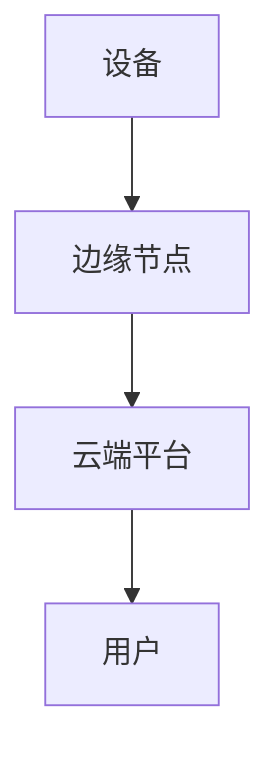

                 

# 如何识别企业的边缘计算IoT平台优势

> 关键词：边缘计算, IoT平台, 企业优势, 实时性, 数据处理效率, 数据安全性

> 摘要：本文详细分析了如何识别企业边缘计算IoT平台的优势，涵盖背景介绍、核心概念、算法原理、系统架构、项目实战、数学模型、系统分析与设计以及最佳实践等多个方面，通过丰富的案例和详细的解释，帮助读者全面理解并应用这些优势。

---

## 第一部分: 边缘计算IoT平台背景与概念

### 第1章: 边缘计算与IoT平台概述

#### 1.1 边缘计算的基本概念

##### 1.1.1 什么是边缘计算

边缘计算是指在靠近数据源的地方进行数据处理和计算的技术。与传统的云计算模式不同，边缘计算将计算能力从中心化的云端扩展到网络的边缘，使得数据能够在生成的地方进行处理，减少延迟并提高效率。

##### 1.1.2 边缘计算的特点与优势

- **低延迟**：边缘计算能够在数据生成的地方直接处理，避免了数据传输到云端的延迟。
- **高实时性**：适用于需要实时响应的场景，如工业自动化、自动驾驶等。
- **高效性**：通过在边缘处理数据，减少数据传输量，降低网络带宽的使用。
- **安全性**：边缘计算可以减少数据在传输过程中被截获的风险，提高数据安全性。

##### 1.1.3 边缘计算与云计算的区别

- **云计算**：数据集中处理，延迟较高，适用于非实时性需求。
- **边缘计算**：数据分散处理，延迟低，适用于实时性需求。

#### 1.2 IoT平台的核心概念

##### 1.2.1 IoT的基本定义

物联网（IoT）是指通过各种信息传感设备，如传感器、射频识别（RFID）技术、全球定位系统、红外感应器等，按约定的协议，把任何物品与互联网连接起来，进行信息交换和通信，以实现智能化识别、定位、跟踪、监控和管理。

##### 1.2.2 IoT平台的功能与作用

- **数据采集**：通过传感器等设备采集数据。
- **数据传输**：将数据从设备传输到平台或云端。
- **数据存储与分析**：对数据进行存储和分析，提取有价值的信息。
- **应用开发**：基于分析结果开发各种应用。

##### 1.2.3 边缘计算与IoT的结合

边缘计算与IoT的结合使得数据可以在设备端进行处理，减少数据传输到云端的延迟，提高数据处理效率。

#### 1.3 企业边缘计算IoT平台的优势

##### 1.3.1 提高数据处理效率

边缘计算可以在数据生成的地方进行处理，减少数据传输到云端的延迟，提高数据处理效率。

##### 1.3.2 降低延迟

边缘计算适用于需要实时响应的场景，如工业自动化、自动驾驶等，能够显著降低延迟。

##### 1.3.3 提高数据安全性

边缘计算可以减少数据在传输过程中被截获的风险，提高数据安全性。

#### 1.4 本章小结

本章介绍了边缘计算和IoT的基本概念，分析了边缘计算与云计算的区别，以及企业边缘计算IoT平台的优势，包括提高数据处理效率、降低延迟和提高数据安全性。

---

### 第2章: 边缘计算IoT平台的核心概念与联系

#### 2.1 边缘计算的核心原理

##### 2.1.1 边缘计算的计算模型

边缘计算采用分布式计算模型，数据在生成的地方进行处理，减少数据传输到云端的延迟。

##### 2.1.2 边缘计算的通信机制

边缘计算通过各种通信协议（如MQTT、HTTP、CoAP）实现设备与边缘节点、边缘节点与云端平台之间的通信。

##### 2.1.3 边缘计算的数据存储方式

边缘计算可以在边缘节点存储数据，也可以将数据传输到云端存储。边缘节点通常采用本地存储，云端平台采用集中存储。

#### 2.2 边缘计算与IoT的关系

##### 2.2.1 边缘计算在IoT中的作用

边缘计算在IoT中起到减少延迟、提高数据处理效率的作用，特别是在需要实时响应的场景中。

##### 2.2.2 边缘计算与IoT的协同工作

边缘计算与IoT协同工作，通过边缘节点处理数据，减少数据传输到云端的延迟，提高数据处理效率。

#### 2.3 边缘计算IoT平台的实体关系图

#### 2.4 本章小结

本章详细介绍了边缘计算的核心原理，分析了边缘计算与IoT的关系，并通过实体关系图展示了边缘计算IoT平台的结构。

---

### 第3章: 边缘计算IoT平台的系统架构分析

#### 3.1 系统架构的整体设计

##### 3.1.1 分层架构

边缘计算IoT平台通常采用分层架构，包括设备层、边缘层、云端层和应用层。设备层负责数据采集，边缘层负责数据处理，云端层负责数据存储和分析，应用层负责应用开发和展示。

##### 3.1.2 分布式架构

边缘计算采用分布式架构，数据处理和存储分散在各个边缘节点，避免了单点故障，提高了系统的可靠性和可扩展性。

##### 3.1.3 混合架构

混合架构结合了边缘计算和云计算的优势，数据在边缘节点进行初步处理后，将重要的数据传输到云端进行深度分析和存储。

#### 3.2 关键组件分析

##### 3.2.1 边缘节点

边缘节点是边缘计算的核心组件，负责数据采集、数据处理和数据传输。边缘节点通常部署在靠近数据源的地方，如工厂车间、智能家居等。

##### 3.2.2 云端平台

云端平台负责接收边缘节点传输的数据，进行深度分析和存储。云端平台通常用于需要长期存储和大数据分析的场景。

##### 3.2.3 数据传输层

数据传输层负责将数据从设备传输到边缘节点，再从边缘节点传输到云端平台。数据传输层通常采用各种通信协议，如MQTT、HTTP、CoAP等。

#### 3.3 通信协议的选择与实现

##### 3.3.1 MQTT协议

MQTT是一种轻量级的物联网通信协议，适用于低带宽、高延迟的网络环境。MQTT协议采用发布-订阅模式，支持一对一或多对一的消息分发。

##### 3.3.2 HTTP协议

HTTP是一种常用的Web通信协议，适用于请求-响应模式的数据传输。HTTP协议简单易用，但不适合实时性要求高的场景。

##### 3.3.3 CoAP协议

CoAP是专为物联网设计的轻量级协议，适用于资源受限的设备。CoAP支持RESTful风格的资源访问，适合嵌入式设备和物联网场景。

#### 3.4 数据处理流程

##### 3.4.1 数据采集

通过传感器等设备采集数据，数据采集过程通常采用ADC（模数转换器）将模拟信号转换为数字信号。

##### 3.4.2 数据传输

将采集到的数据通过通信协议传输到边缘节点，再从边缘节点传输到云端平台。

##### 3.4.3 数据存储与分析

云端平台接收数据后，进行数据存储和分析，提取有价值的信息，为应用开发提供支持。

#### 3.5 本章小结

本章分析了边缘计算IoT平台的系统架构，包括分层架构、分布式架构和混合架构，详细介绍了边缘节点、云端平台和数据传输层的关键组件，分析了MQTT、HTTP和CoAP等通信协议的优缺点，并描述了数据处理流程。

---

### 第4章: 边缘计算IoT平台的优势识别方法

#### 4.1 优势识别的背景与目标

识别边缘计算IoT平台的优势需要从企业的实际需求出发，结合技术特点和应用场景，找到适合的解决方案。

#### 4.2 优势识别的关键步骤

##### 4.2.1 业务需求分析

分析企业的业务需求，确定哪些场景适合边缘计算。例如，实时性要求高的业务适合边缘处理，而需要长期存储和深度分析的业务适合云端处理。

##### 4.2.2 技术评估

评估企业现有的技术能力，包括网络带宽、计算资源、数据存储能力等，确保边缘计算的可行性。

##### 4.2.3 安全性评估

评估数据在边缘处理的安全性，确保数据在传输和处理过程中不被截获和篡改。

##### 4.2.4 可扩展性评估

评估边缘计算平台的可扩展性，确保随着业务增长，能够灵活扩展边缘节点和计算能力。

#### 4.3 优势识别的数学模型

##### 4.3.1 数据处理效率模型

数据处理效率 = (处理时间 / 数据量) × 100%

##### 4.3.2 延迟优化模型

延迟优化 = 原始延迟 - 边缘计算后的延迟

##### 4.3.3 安全性评估模型

安全性 = (数据完整性 × 数据机密性 × 数据可用性) / 100%

#### 4.4 优势识别的案例分析

##### 4.4.1 工业自动化案例

某制造企业采用边缘计算IoT平台，通过边缘节点实时监控生产线设备的状态，减少设备故障停机时间，提高生产效率。

##### 4.4.2 智慧交通案例

某城市交通管理系统采用边缘计算IoT平台，通过边缘节点实时处理交通流量数据，优化交通信号灯控制，减少交通拥堵。

#### 4.5 本章小结

本章详细分析了识别边缘计算IoT平台优势的关键步骤，包括业务需求分析、技术评估、安全性评估和可扩展性评估，并通过数学模型和案例分析，帮助企业识别和利用边缘计算的优势。

---

### 第5章: 边缘计算IoT平台的最佳实践

#### 5.1 小结

边缘计算IoT平台的优势包括提高数据处理效率、降低延迟和提高数据安全性。企业需要根据自身需求和实际情况，选择适合的边缘计算方案。

#### 5.2 注意事项

- 数据安全是边缘计算的重要考虑因素，企业需要采取有效的安全措施，确保数据在传输和处理过程中的安全性。
- 边缘计算的可扩展性是企业长期发展的关键，需要预留足够的扩展空间。
- 选择适合的通信协议和数据处理流程，确保系统高效运行。

#### 5.3 拓展阅读

建议读者进一步阅读以下内容：

- 《边缘计算：原理与实践》
- 《物联网平台开发与应用》
- 《分布式系统：设计与实现》

#### 5.4 本章小结

本章总结了边缘计算IoT平台的优势识别方法，提出了注意事项，并推荐了拓展阅读材料，帮助读者进一步深入学习和实践。

---

### 第6章: 总结与展望

#### 6.1 总结

本文详细分析了如何识别企业边缘计算IoT平台的优势，从背景介绍到系统架构，再到优势识别和最佳实践，为企业提供了全面的指导。

#### 6.2 展望

随着技术的发展，边缘计算IoT平台的优势将更加显著，未来将有更多的企业采用边缘计算技术，推动物联网的发展。

---

通过以上步骤，我们可以系统地识别和利用企业边缘计算IoT平台的优势，为企业的数字化转型和智能化发展提供有力支持。

