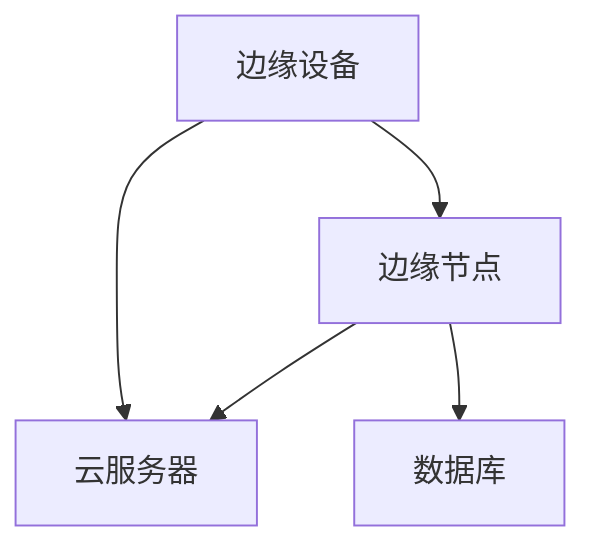
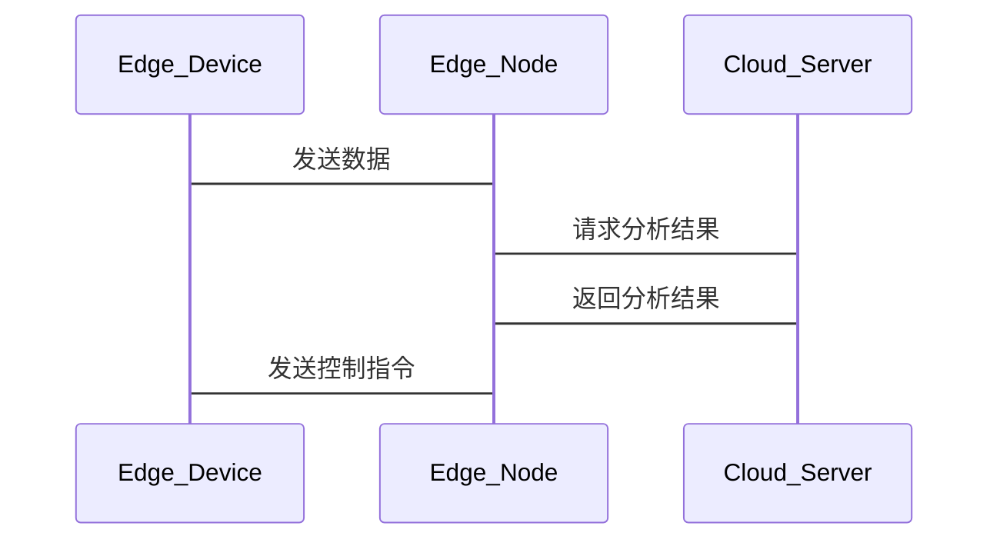

                 


# 如何识别企业的边缘计算优势

## 关键词：
边缘计算、企业优势、分布式计算、数据处理、系统架构

## 摘要：
本文将详细探讨如何识别企业边缘计算的优势，涵盖边缘计算的核心概念、算法原理、系统架构设计、项目实战以及最佳实践。通过分析边缘计算的定义、优势、算法实现、系统架构和实际案例，帮助读者全面理解如何在企业中有效应用边缘计算，优化资源配置，提升业务效率。

---

# 第三部分: 边缘计算的算法与数学模型

## 第4章: 边缘计算的算法与数学模型

### 4.1 边缘计算的算法概述

#### 4.1.1 边缘计算中的典型算法
边缘计算涉及多种算法，包括数据处理、分类、聚类和预测等。以下是一些典型的算法：

- **边缘聚类算法**：用于在边缘节点中对数据进行聚类分析，识别数据中的模式。
- **边缘分类算法**：用于在边缘节点中对数据进行分类，预测数据类别。
- **边缘预测算法**：用于在边缘节点中对数据进行预测，如时间序列预测。

#### 4.1.2 边缘计算算法的特点
边缘计算算法的特点包括低延迟、高实时性、分布式计算和资源受限。这些特点决定了算法的设计需要高效、轻量且能够在边缘设备上运行。

#### 4.1.3 边缘计算算法的应用场景
边缘计算算法广泛应用于智能制造、智慧城市、智能家居等领域。例如，在智能制造中，边缘计算可以用于实时监控生产线的状态，预测设备故障。

### 4.2 边缘计算的典型算法实现

#### 4.2.1 边缘聚类算法
边缘聚类算法用于在边缘节点中对数据进行聚类分析。以下是K-means聚类算法的实现示例：

```python
def edge_clustering(data, num_clusters):
    # 初始化质心
    centroids = initialize_centroids(data, num_clusters)
    
    while True:
        # 分配每个数据点到最近的质心
        clusters = assign_clusters(data, centroids)
        
        # 更新质心
        new_centroids = update_centroids(clusters, data)
        
        # 检查质心是否变化
        if centroids == new_centroids:
            break
            
        centroids = new_centroids
    return clusters, centroids
```

#### 4.2.2 边缘分类算法
边缘分类算法用于在边缘节点中对数据进行分类。以下是支持向量机（SVM）的实现示例：

```python
from sklearn import svm

def edge_classification(data, labels):
    # 训练SVM模型
    model = svm.SVC()
    model.fit(data, labels)
    
    # 预测新数据
    new_data = ...  # 输入新的数据点
    prediction = model.predict(new_data)
    return prediction
```

#### 4.2.3 边缘预测算法
边缘预测算法用于在边缘节点中对数据进行预测。以下是时间序列预测的ARIMA模型实现示例：

```python
from statsmodels.tsa.arima_model import ARIMA

def edge_prediction(data):
    # 训练ARIMA模型
    model = ARIMA(data, order=(1, 1, 1))
    model_fit = model.fit()
    
    # 预测下一个时间点的值
    forecast = model_fit.forecast(steps=1)
    return forecast
```

### 4.3 边缘计算的数学模型与公式

#### 4.3.1 边缘聚类的数学模型
K-means算法的目标是最小化簇内平方和，数学表达式为：

$$
\text{目标函数} = \sum_{i=1}^{k} \sum_{j=1}^{n_i} (x_j - c_i)^2
$$

其中，$k$ 是簇的数量，$n_i$ 是第$i$个簇中的数据点数量，$x_j$ 是数据点，$c_i$ 是第$i$个簇的质心。

#### 4.3.2 边缘分类的数学模型
支持向量机（SVM）的目标是找到一个超平面，使得正负样本被正确分类。优化问题可以表示为：

$$
\text{最大化} \quad \frac{1}{2} ||w||^2
$$

$$
\text{约束} \quad y_i(w \cdot x_i + b) \geq 1 \quad \forall i
$$

其中，$w$ 是权重向量，$b$ 是偏置，$y_i$ 是标签，$x_i$ 是数据点。

#### 4.3.3 边缘预测的数学模型
ARIMA模型通过自回归和移动平均来预测时间序列数据。模型可以表示为：

$$
\phi(\theta) X_t = \theta(B) \epsilon_t
$$

其中，$\phi(\theta)$ 是自回归多项式，$\theta(B)$ 是移动平均多项式，$X_t$ 是数据序列，$\epsilon_t$ 是误差项。

---

# 第四部分: 边缘计算的系统架构与设计方案

## 第5章: 边缘计算的系统架构与设计方案

### 5.1 问题场景介绍

在企业中，边缘计算通常用于实时监控、设备管理、数据分析等场景。例如，在智能制造中，边缘计算可以用于实时监控生产线设备的状态，预测设备故障，优化生产流程。

### 5.2 系统功能设计

系统功能设计包括数据采集、数据处理、数据存储、数据分析和结果反馈。

#### 5.2.1 数据采集模块
数据采集模块负责从边缘设备中采集数据，并将其传输到边缘节点进行处理。

#### 5.2.2 数据处理模块
数据处理模块负责对数据进行预处理、转换和清洗，确保数据的质量和一致性。

#### 5.2.3 数据分析模块
数据分析模块负责对数据进行分析，使用机器学习算法进行预测和分类，生成分析结果。

#### 5.2.4 结果反馈模块
结果反馈模块将分析结果反馈给边缘设备或中心服务器，用于进一步的决策和控制。

### 5.3 系统架构设计

以下是边缘计算系统的架构图：



### 5.4 系统接口设计

系统接口设计包括边缘节点与设备之间的接口、边缘节点与云服务器之间的接口、边缘节点与数据库之间的接口。

### 5.5 系统交互设计

以下是系统交互的序列图：



---

# 第五部分: 边缘计算的项目实战与最佳实践

## 第6章: 边缘计算的项目实战与最佳实践

### 6.1 项目实战

#### 6.1.1 环境安装
需要安装边缘计算框架、数据采集工具和数据分析工具。例如，安装Kafka用于数据传输，安装TensorFlow用于数据分析。

#### 6.1.2 系统核心实现

以下是边缘计算系统的核心实现代码：

```python
import os
import json
from kafka import KafkaProducer, KafkaConsumer
from sklearn import svm

# 数据采集模块
class Edge_Device:
    def __init__(self, device_id):
        self.device_id = device_id
        
    def collect_data(self):
        # 模拟数据采集
        data = {"id": self.device_id, "value": random.uniform(0, 1)}
        return json.dumps(data)

# 数据处理模块
class Edge_Node:
    def __init__(self, node_id):
        self.node_id = node_id
        self.models = {}
        
    def process_data(self, data):
        # 解析数据
        data_dict = json.loads(data)
        # 数据处理
        return data_dict

# 数据分析模块
class Edge_Analyzer:
    def __init__(self):
        self.models = {}
        
    def train_model(self, data):
        # 训练模型
        model = svm.SVC()
        model.fit(data)
        return model

# 结果反馈模块
class Edge_Controller:
    def __init__(self):
        pass
    
    def send_control(self, device_id, control_command):
        # 发送控制指令
        pass

# 项目实战
def main():
    # 初始化设备
    device = Edge_Device("Device_001")
    # 初始化边缘节点
    edge_node = Edge_Node("Node_001")
    # 初始化分析模块
    analyzer = Edge_Analyzer()
    # 初始化控制器
    controller = Edge_Controller()
    
    # 采集数据
    data = device.collect_data()
    # 处理数据
    processed_data = edge_node.process_data(data)
    # 分析数据
    model = analyzer.train_model(processed_data)
    # 反馈结果
    controller.send_control(device.device_id, "adjust_settings")
    
if __name__ == "__main__":
    main()
```

#### 6.1.3 代码实现与解读

以上代码实现了一个简单的边缘计算系统，包括数据采集、数据处理、数据分析和结果反馈模块。数据采集模块负责采集数据，数据处理模块负责处理数据，数据分析模块负责训练模型，结果反馈模块负责发送控制指令。

#### 6.1.4 案例分析

以智能制造中的设备监控为例，边缘计算可以用于实时监控设备状态，预测设备故障，优化生产流程。通过边缘计算，企业可以减少设备停机时间，提高生产效率。

### 6.2 最佳实践

#### 6.2.1 性能优化
边缘计算需要在资源受限的边缘设备上运行，因此需要优化算法的计算效率和资源利用率。

#### 6.2.2 安全性提升
边缘计算涉及大量的数据传输和处理，需要注意数据的安全性，防止数据泄露和攻击。

#### 6.2.3 可扩展性设计
边缘计算系统需要具备良好的可扩展性，能够适应业务需求的变化。

#### 6.2.4 智能化升级
边缘计算可以通过结合人工智能技术，实现智能化的决策和控制。

---

# 总结

通过本文的详细讲解，读者可以全面了解如何识别企业的边缘计算优势，包括核心概念、算法原理、系统架构、项目实战和最佳实践。边缘计算作为一种分布式计算范式，能够帮助企业优化资源配置，提升业务效率，未来将在更多领域得到广泛应用。

