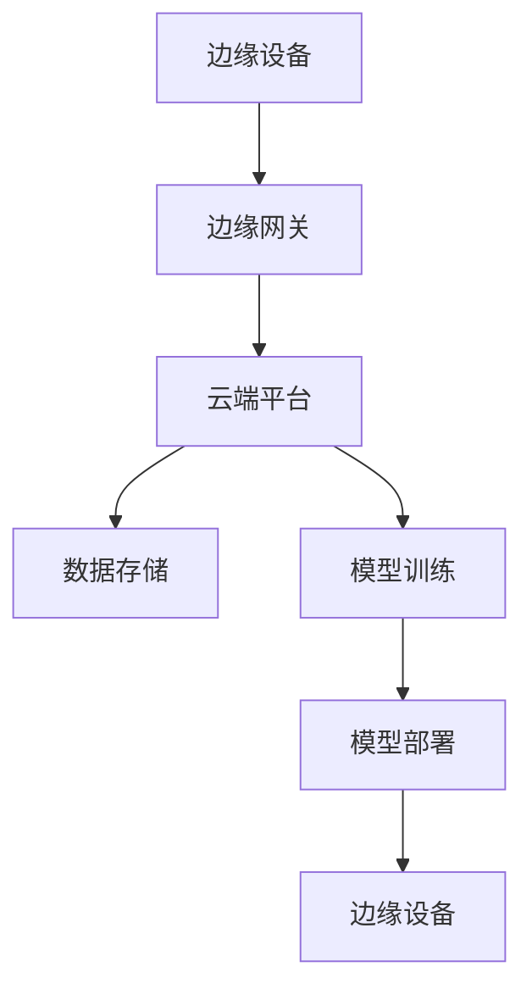
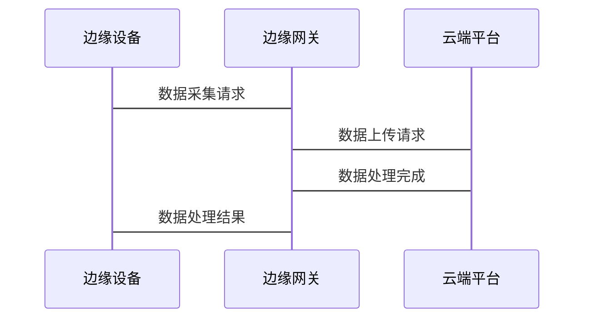

                 


# 如何识别企业的边缘计算分布式学习优势

> 关键词：边缘计算、分布式学习、企业应用、技术优势、算法原理、系统架构、项目实战

> 摘要：本文将详细探讨如何识别企业在边缘计算和分布式学习中的优势，通过逐步分析边缘计算的基本概念、分布式学习的核心原理、算法实现、系统架构设计以及实际项目案例，帮助读者理解如何将这些技术应用于企业场景中，提升企业的数据处理效率和模型优化能力。

---

# 第一部分: 边缘计算与分布式学习的背景介绍

## 第1章: 边缘计算的基本概念与特点

### 1.1 边缘计算的定义
边缘计算是一种分布式计算范式，数据在靠近数据源的边缘设备上进行处理，而非传统地将所有数据传输到云端进行集中处理。

### 1.2 边缘计算的特点
1. **低延迟**：边缘计算能够在本地快速响应，减少数据传输的延迟。
2. **高实时性**：适用于需要实时处理的场景，如工业自动化和自动驾驶。
3. **数据隐私**：边缘计算可以在本地处理数据，减少数据泄露的风险。

## 第2章: 分布式学习的核心概念与优势

### 2.1 分布式学习的定义
分布式学习是一种机器学习范式，数据分布在多个分布式节点上，模型在各个节点上进行局部训练，最后将模型参数汇总到中央服务器或在节点之间进行同步。

### 2.2 分布式学习的特点
1. **数据隐私保护**：数据无需集中到中央服务器，保护数据隐私。
2. **计算资源利用**：充分利用分布式节点的计算资源，提升训练效率。
3. **容错性**：单个节点故障不影响整个模型的训练。

## 第3章: 企业边缘计算与分布式学习的背景与意义

### 3.1 企业数字化转型的背景
随着企业数字化转型的推进，数据量急剧增加，传统的集中式计算模式已无法满足实时性和数据隐私的需求。

### 3.2 边缘计算在企业中的应用场景
1. **智能制造**：工业设备在边缘端进行实时数据处理和预测。
2. **智慧城市**：交通、环境等数据在边缘端进行实时分析。
3. **金融行业**：高频交易和实时风控需要边缘计算的支持。

### 3.3 分布式学习对企业竞争力的影响
通过分布式学习，企业可以在边缘设备上部署本地化的模型，提升数据处理效率和响应速度，增强企业的竞争力。

---

# 第二部分: 边缘计算与分布式学习的核心概念与联系

## 第4章: 边缘计算的原理与实现

### 4.1 边缘计算的架构
1. **边缘设备**：包括传感器、摄像头、工业设备等，负责数据采集和初步处理。
2. **边缘网关**：连接边缘设备和云端，负责数据汇总和协议转换。
3. **云端平台**：负责全局数据的管理、分析和模型训练。

### 4.2 边缘计算的数据处理流程
1. **数据采集**：边缘设备采集数据并进行预处理。
2. **数据传输**：通过边缘网关将数据传输到云端或分布式节点。
3. **数据存储与分析**：云端或分布式节点对数据进行存储和分析，生成模型。
4. **模型部署**：将训练好的模型部署到边缘设备上进行实时推理。

## 第5章: 分布式学习的原理与算法

### 5.1 分布式学习的核心算法
1. **联邦学习（Federated Learning）**：数据分布在多个设备或服务器上，通过加密通信进行模型训练。
2. **分布式随机梯度下降（Distributed SGD）**：在分布式节点上并行训练模型，最后汇总梯度更新全局模型。

### 5.2 边缘计算与分布式学习的结合
1. **数据本地化**：在边缘设备上进行局部模型训练，保护数据隐私。
2. **模型协同优化**：通过边缘设备之间的协同，优化全局模型，提升模型性能。

### 5.3 分布式学习的数学模型

#### 分布式随机梯度下降（Distributed SGD）
$$
\theta_{i}^{(t+1)} = \theta_{i}^{(t)} - \eta \nabla f_i(\theta_{i}^{(t)})
$$

其中，$\theta_{i}$ 表示第 $i$ 个节点的模型参数，$\eta$ 是学习率，$f_i$ 是第 $i$ 个节点的损失函数。

---

# 第三部分: 边缘计算与分布式学习的系统架构与实现

## 第6章: 系统架构设计

### 6.1 系统功能模块
1. **数据采集模块**：负责从边缘设备采集数据。
2. **数据处理模块**：对数据进行清洗、转换和增强。
3. **模型训练模块**：在分布式节点上进行模型训练。
4. **模型部署模块**：将训练好的模型部署到边缘设备上。

### 6.2 系统架构图（Mermaid）



### 6.3 接口设计与交互流程图（Mermaid）



---

# 第四部分: 项目实战与优化建议

## 第7章: 项目实战

### 7.1 环境配置
1. **硬件环境**：选择支持边缘计算的设备，如树莓派、嵌入式设备等。
2. **软件环境**：安装必要的操作系统、开发工具和分布式学习框架（如TensorFlow、PyTorch）。

### 7.2 核心代码实现

#### 分布式随机梯度下降（Distributed SGD）的Python实现

```python
import numpy as np
import tensorflow as tf

# 模拟分布式节点
class Node:
    def __init__(self, data, label):
        self.data = data
        self.label = label
        self.model = tf.keras.Sequential([
            tf.keras.layers.Dense(64, activation='relu'),
            tf.keras.layers.Dense(1, activation='sigmoid')
        ])
        self.model.compile(optimizer='sgd', loss='binary_crossentropy')

    def train(self, batch_size=32, epochs=1):
        self.model.fit(self.data, self.label, batch_size=batch_size, epochs=epochs)

# 创建分布式节点
node1 = Node(np.random.randn(100, 64), np.random.randint(0, 2, 100))
node2 = Node(np.random.randn(100, 64), np.random.randint(0, 2, 100))

# 模型汇总
model_avg = node1.model.get_weights()
model_avg = [ (model_avg[i] + node2.model.get_weights()[i])/2 for i in range(len(model_avg)) ]
node1.model.set_weights(model_avg)
```

### 7.3 项目小结
通过实际项目，我们可以看到边缘计算与分布式学习的优势，特别是在数据隐私保护和计算效率提升方面。

---

# 第五部分: 最佳实践与未来展望

## 第8章: 最佳实践与注意事项

### 8.1 数据隐私保护
在边缘计算和分布式学习中，数据隐私是核心问题。可以通过加密通信和联邦学习等技术保护数据隐私。

### 8.2 模型更新频率
根据业务需求，合理设置模型更新频率，平衡模型性能和计算资源消耗。

### 8.3 计算资源分配
合理分配计算资源，确保各分布式节点之间的负载均衡，避免热点节点过载。

## 第9章: 未来展望

### 9.1 边缘计算与AI的深度融合
随着AI技术的发展，边缘计算与分布式学习将更加紧密地结合，推动智能化应用的普及。

### 9.2 新型算法的研究
未来将会有更多创新的算法，进一步提升边缘计算和分布式学习的效率和性能。

---

# 结语

通过本文的详细讲解，读者可以全面理解如何识别企业在边缘计算和分布式学习中的优势，并在实际项目中应用这些技术，提升企业的数据处理能力和模型优化水平。

