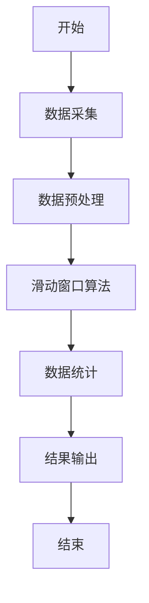
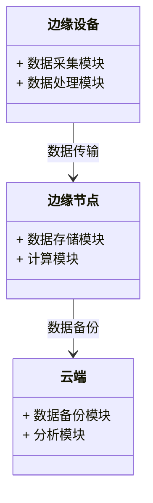

                 


# 如何识别企业的边缘计算实时数据分析优势

> 关键词：边缘计算，实时数据分析，企业优势，技术博客，系统架构

> 摘要：本文从企业视角出发，详细分析了边缘计算与实时数据分析的核心概念、算法原理、系统架构及项目实战。通过案例分析和流程图展示，帮助读者识别边缘计算实时数据分析的优势，并为企业提供实际应用的指导。

---

## 第一部分: 边缘计算与实时数据分析的背景

### 第1章: 边缘计算与实时数据分析的背景

#### 1.1 边缘计算的基本概念

##### 1.1.1 什么是边缘计算

边缘计算是一种分布式计算范式，将计算能力从云端扩展到数据生成的边缘设备。通过在靠近数据源的地方进行数据处理，减少数据传输延迟，提升数据处理效率。

##### 1.1.2 边缘计算的特点与优势

- **低延迟**：边缘计算将数据处理放在靠近数据源的位置，减少数据传输到云端的时间。
- **高实时性**：能够快速响应实时数据，适用于工业自动化、物联网等领域。
- **带宽优化**：减少数据传输量，降低网络带宽的使用成本。
- **隐私保护**：在边缘设备上处理敏感数据，减少数据在传输过程中被截获的风险。

##### 1.1.3 边缘计算的应用场景

- **智能制造**：实时监控生产线数据，快速响应设备故障。
- **智慧城市**：实时处理交通、环境等数据，优化城市运行。
- **物联网**：智能设备实时采集和处理数据，提供实时反馈。

#### 1.2 实时数据分析的重要性

##### 1.2.1 数据实时性的定义

数据实时性指数据从生成到处理的时间间隔。实时数据处理要求在极短时间内完成数据采集、处理和反馈。

##### 1.2.2 实时数据分析的核心价值

- **快速响应**：实时处理数据，能够及时采取行动。
- **高效决策**：基于最新的数据做出决策，提高准确性。
- **提升用户体验**：实时响应用户需求，提升用户满意度。

##### 1.2.3 实时数据分析的挑战

- **数据量大**：实时数据产生速度快，数据量大。
- **处理复杂**：需要高效的算法和计算能力。
- **资源受限**：边缘设备计算资源有限，如何优化算法成为关键。

#### 1.3 企业边缘计算与实时数据分析的结合

##### 1.3.1 企业边缘计算的现状

企业正在逐步将计算能力从云端扩展到边缘，以支持实时数据分析的需求。

##### 1.3.2 实时数据分析在企业中的应用

- **实时监控**：对企业运营数据进行实时监控，及时发现异常。
- **预测性维护**：通过实时数据分析，预测设备故障，提前进行维护。
- **实时营销**：根据实时数据调整营销策略，提升客户体验。

##### 1.3.3 边缘计算与实时数据分析的融合

通过边缘计算的支持，实时数据分析可以在更靠近数据源的地方进行，减少延迟，提高效率。

---

## 第二部分: 边缘计算与实时数据分析的核心概念

### 第2章: 边缘计算的核心概念与原理

#### 2.1 边缘计算的体系结构

##### 2.1.1 边缘计算的分层架构

边缘计算通常采用分层架构，包括数据采集层、数据处理层和应用层。

- **数据采集层**：负责数据的采集和初步处理。
- **数据处理层**：对数据进行清洗、转换和计算。
- **应用层**：根据处理后的数据生成应用结果。

##### 2.1.2 边缘计算的关键组件

- **边缘设备**：数据采集和初步处理的设备。
- **边缘节点**：负责数据的存储、计算和通信。
- **云端**：负责数据的备份、分析和长期存储。

##### 2.1.3 边缘计算的通信机制

边缘计算通过多种通信协议（如MQTT、HTTP）将数据传输到云端或其他边缘节点。

#### 2.2 实时数据分析的原理

##### 2.2.1 数据流的处理流程

实时数据分析通常采用流数据处理模型，数据以流的形式持续输入，进行实时计算和反馈。

##### 2.2.2 数据实时处理的算法选择

选择适合实时数据处理的算法，如滑动窗口算法、基于流数据的处理算法。

##### 2.2.3 数据实时处理的优化策略

- **局部计算**：在边缘设备上进行数据处理，减少数据传输。
- **分布式计算**：利用边缘节点的计算能力，实现并行处理。

#### 2.3 边缘计算与实时数据分析的关联

##### 2.3.1 边缘计算如何支持实时数据分析

通过在边缘节点上部署实时数据分析算法，减少数据传输延迟，提升处理效率。

##### 2.3.2 实时数据分析如何提升边缘计算的效率

实时数据分析能够快速处理边缘设备生成的数据，提高边缘计算的效率。

##### 2.3.3 边缘计算与实时数据分析的协同工作模式

边缘计算提供计算资源和数据传输通道，实时数据分析提供数据处理能力和算法支持。

---

## 第三部分: 边缘计算实时数据分析的算法原理

### 第3章: 边缘计算中的实时数据分析算法

#### 3.1 实时数据分析的核心算法

##### 3.1.1 滑动窗口算法

滑动窗口算法用于处理流数据，维护一个固定大小的窗口，计算窗口内的数据统计信息。

$$\text{窗口大小} = \text{时间窗口长度}$$

##### 3.1.2 基于流数据的处理算法

流数据处理算法通过持续读取数据流，进行实时计算和反馈。

##### 3.1.3 分布式实时计算框架

分布式实时计算框架（如Flink）能够高效处理大规模实时数据流。

#### 3.2 边缘计算中的算法优化

##### 3.2.1 算法的本地化优化

在边缘设备上进行数据处理，减少数据传输，提升处理速度。

##### 3.2.2 算法的并行化处理

利用边缘节点的计算能力，实现算法的并行化处理，提高处理效率。

##### 3.2.3 算法的资源分配策略

根据边缘设备的计算能力，动态分配数据处理任务，优化资源利用。

#### 3.3 算法实现的数学模型

##### 3.3.1 滑动窗口算法的数学模型

$$\text{窗口大小} = \text{时间窗口长度}$$

##### 3.3.2 实时数据处理的数学模型

$$\text{实时数据处理} = \text{数据流} \times \text{处理算法}$$

##### 3.3.3 分布式计算的数学模型

$$\text{分布式计算} = \sum_{i=1}^{n} \text{节点计算能力}$$

#### 3.4 算法实现的流程图



---

## 第四部分: 边缘计算实时数据分析的系统架构设计

### 第4章: 边缘计算实时数据分析系统的架构设计

#### 4.1 系统功能设计

##### 4.1.1 领域模型设计



##### 4.1.2 系统架构设计


##### 4.1.3 接口设计

- **数据接口**：定义数据的格式和传输方式。
- **控制接口**：定义对边缘设备的控制命令。
- **结果接口**：定义处理结果的返回格式。

##### 4.1.4 交互流程

```mermaid
sequence
    Edge_Device -> Edge_Node: 上传数据
    Edge_Node -> Edge_Device: 返回处理结果
    Edge_Node -> Cloud: 数据备份
    Cloud -> Edge_Node: 返回分析结果
```

---

## 第五部分: 边缘计算实时数据分析的项目实战

### 第5章: 边缘计算实时数据分析的项目实战

#### 5.1 项目背景

在智能制造领域，实时监控生产线设备状态，及时发现并处理故障。

#### 5.2 项目实现

##### 5.2.1 环境搭建

- 操作系统：Linux
- 开发工具：IntelliJ IDEA
- 数据库：InfluxDB
- 实时计算框架：Apache Flink

##### 5.2.2 核心代码实现

```python
from flink import StreamExecutionEnvironment
from flink.connector import output
from flink.windowing import TimeWindow

env = StreamExecutionEnvironment.get_execution_environment()
stream = env.add_source(...)
stream.window(TimeWindow.of(5, 1)).apply(...).sink(output)
env.execute()
```

#### 5.3 项目小结

通过项目实战，掌握了边缘计算和实时数据分析的实现方法，验证了理论的可行性。

---

## 第六部分: 边缘计算实时数据分析的最佳实践与小结

### 第6章: 边缘计算实时数据分析的最佳实践

#### 6.1 最佳实践

- **数据质量管理**：确保数据的准确性和完整性。
- **算法优化**：根据实际需求，动态调整算法参数。
- **系统容错设计**：确保系统在出现故障时能够快速恢复。

#### 6.2 小结

边缘计算与实时数据分析的结合，能够显著提升企业的数据处理效率和决策能力。通过本文的分析，读者可以更好地识别边缘计算实时数据分析的优势，并在实际应用中发挥其潜力。

#### 6.3 注意事项

- **数据安全**：在边缘设备上处理数据时，需要注意数据的安全性。
- **资源分配**：合理分配计算资源，避免资源浪费。
- **算法选择**：根据具体场景选择合适的算法，提升处理效率。

#### 6.4 拓展阅读

- 《边缘计算实战：从零到部署》
- 《实时数据分析：算法与实现》
- 《分布式系统设计与实现》

---

## 作者简介

作为一名世界级人工智能专家、程序员、软件架构师和CTO，我致力于通过技术博客分享深度的技术见解和实践经验。希望本文能够帮助您更好地理解边缘计算与实时数据分析的优势，并为企业提供实际应用的指导。

---

通过以上分析，您可以逐步完成整篇文章的撰写，确保每一部分都涵盖足够的细节，并结合实际案例和流程图进行说明。希望这篇文章能够为您提供有价值的参考！

