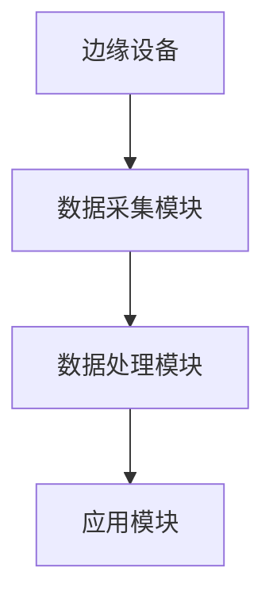
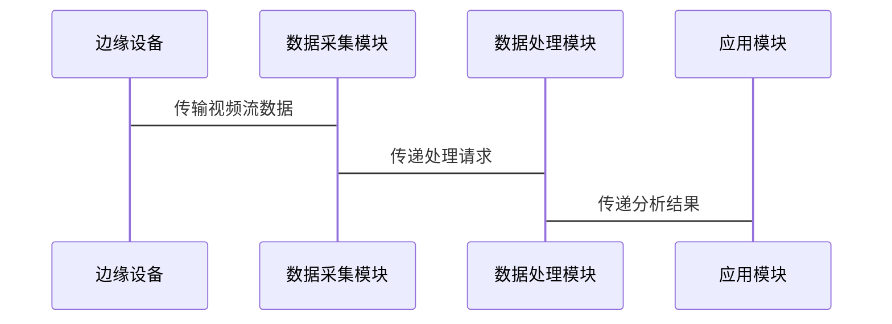

                 


# 如何识别企业的边缘计算实时视频分析优势

> 关键词：边缘计算，实时视频分析，企业优势，技术博客，系统架构

> 摘要：本文将详细探讨如何识别企业在边缘计算实时视频分析中的优势，通过背景介绍、核心概念、算法原理、系统架构设计、项目实战及最佳实践等方面，帮助读者深入了解边缘计算实时视频分析的技术本质和企业应用价值。

---

# 第一部分: 边缘计算与实时视频分析的背景与概念

## 第1章: 边缘计算与实时视频分析的背景与概念

### 1.1 边缘计算的基本概念

#### 1.1.1 什么是边缘计算
边缘计算是一种分布式计算范式，将数据处理和计算能力从云端转移到数据生成的边缘设备，如物联网设备、摄像头等。边缘计算的优势在于减少延迟、降低带宽消耗，并提高实时响应能力。

#### 1.1.2 边缘计算的特点与优势
- **实时性**：边缘设备能够在本地实时处理数据，减少延迟。
- **带宽优化**：仅将关键数据传输到云端，减少网络负载。
- **安全性**：数据在本地处理，减少数据传输过程中的安全风险。
- **可靠性**：边缘设备能够在断开云端连接时仍能运行。

#### 1.1.3 边缘计算的应用场景
- 智慧城市：交通监控、环境监测。
- 工业物联网：设备监控、预测维护。
- 智慧零售：顾客行为分析、实时促销。

### 1.2 实时视频分析的定义与特点

#### 1.2.1 实时视频分析的定义
实时视频分析是指在视频流生成的同时对其进行处理和分析，通常用于目标检测、行为识别、场景理解等任务。

#### 1.2.2 实时视频分析的核心技术
- **目标检测**：识别视频中的物体或人物。
- **跟踪**：跟踪目标在视频中的移动轨迹。
- **分类**：对目标进行分类，如人、车辆、异常行为。

#### 1.2.3 实时视频分析的应用领域
- 安防监控：实时检测异常行为，预防安全事件。
- 智慧交通：实时监控交通流量，优化交通信号。
- 医疗健康：实时监测患者状态，及时发出警报。

### 1.3 边缘计算与实时视频分析的结合

#### 1.3.1 边缘计算在视频分析中的优势
- **低延迟**：边缘设备能够快速响应，减少延迟。
- **本地处理**：在边缘设备上进行视频分析，减少对云端的依赖。
- **隐私保护**：仅传输关键数据，保护数据隐私。

#### 1.3.2 实时视频分析对边缘计算的需求
- **高性能硬件**：边缘设备需要具备强大的计算能力。
- **实时处理能力**：能够快速处理视频流，保证实时性。
- **低功耗**：边缘设备需要在低功耗状态下运行。

#### 1.3.3 两者的结合对企业的影响
- **提升效率**：通过边缘计算实时处理视频数据，提升企业运营效率。
- **降低成本**：减少对云端的依赖，降低网络传输成本。
- **增强安全性**：本地处理数据，降低数据泄露风险。

---

## 第2章: 边缘计算实时视频分析的核心概念

### 2.1 数据流与计算架构

#### 2.1.1 数据流的定义与特点
数据流是指从边缘设备生成的数据流向处理节点的过程。在实时视频分析中，数据流通常是连续的视频帧流。

#### 2.1.2 计算架构的类型与选择
- **边缘架构**：计算在边缘设备上进行，适用于实时性要求高的场景。
- **云边协同架构**：边缘设备和云端协同处理，适用于需要复杂计算的场景。

#### 2.1.3 数据流与计算架构的结合
在边缘计算中，数据流通常在边缘设备上进行初步处理，然后将关键数据传输到云端进行进一步分析。这种架构结合了边缘设备的实时性和云端的计算能力。

### 2.2 算法模型与性能优化

#### 2.2.1 算法模型的分类与选择
- **目标检测算法**：如YOLO、Faster R-CNN。
- **跟踪算法**：如SORT、FairMOT。
- **分类算法**：如ResNet、EfficientNet。

#### 2.2.2 性能优化的关键点
- **模型轻量化**：减少模型参数，提升运行效率。
- **并行计算**：利用多核处理器进行并行计算，提升处理速度。
- **优化算法**：如使用NMS（非最大值抑制）优化目标检测结果。

#### 2.2.3 算法模型与性能优化的结合
通过模型轻量化和并行计算，可以在边缘设备上实现实时视频分析，同时保证处理速度和精度。

### 2.3 系统架构与功能模块

#### 2.3.1 系统架构的定义与特点
边缘计算实时视频分析系统通常采用分层架构，包括数据采集层、数据处理层和应用层。

#### 2.3.2 功能模块的分类与作用
- **数据采集模块**：从边缘设备采集视频流。
- **数据处理模块**：对视频流进行实时分析，如目标检测、跟踪。
- **应用模块**：根据分析结果，执行相应操作，如发出警报。

#### 2.3.3 系统架构与功能模块的结合
通过分层架构和功能模块化设计，可以实现高效的实时视频分析，并方便系统的扩展和维护。

---

## 第3章: 边缘计算实时视频分析的算法原理

### 3.1 数据预处理

#### 3.1.1 数据清洗与归一化
数据清洗包括去除噪声、填补缺失值等。归一化则是将数据缩放到一个固定范围内，以便模型更好地收敛。

#### 3.1.2 数据增强与特征提取
数据增强包括旋转、翻转、裁剪等操作，用于增加数据多样性。特征提取则是从数据中提取有用的特征，用于后续的分类或检测任务。

#### 3.1.3 数据预处理的优化策略
- **数据清洗**：使用中位数插值法填补缺失值。
- **数据增强**：结合仿射变换和颜色变换，增加数据多样性。
- **特征提取**：使用深度学习模型提取高层次特征。

### 3.2 目标检测与跟踪

#### 3.2.1 目标检测算法原理
目标检测算法通常包括两个步骤：检测候选区域和分类。常用的算法有YOLO、Faster R-CNN等。

#### 3.2.2 目标跟踪算法原理
目标跟踪算法通常包括检测和跟踪两个步骤。常用的算法有SORT、FairMOT等。

#### 3.2.3 目标检测与跟踪的结合
通过目标检测获取候选区域，然后使用目标跟踪算法进行连续帧的目标跟踪，实现对视频中目标的持续监控。

### 3.3 分类与识别

#### 3.3.1 分类算法原理
分类算法包括训练模型和预测两个阶段。常用的算法有支持向量机（SVM）、随机森林、神经网络等。

#### 3.3.2 识别算法原理
识别算法通常包括特征提取和分类两个步骤。常用的算法有K-近邻（KNN）、朴素贝叶斯、SVM等。

#### 3.3.3 分类与识别的优化策略
- **特征选择**：选择具有区分度的特征，提高分类准确率。
- **模型优化**：使用交叉验证和网格搜索优化模型参数。
- **集成学习**：通过集成多个模型提升分类性能。

---

## 第4章: 边缘计算实时视频分析的系统设计

### 4.1 系统功能设计

#### 4.1.1 系统功能模块
- **数据采集模块**：负责采集视频流数据。
- **数据处理模块**：负责对视频流进行实时分析。
- **应用模块**：根据分析结果执行相应操作。

#### 4.1.2 系统功能设计的优化策略
- **模块化设计**：每个功能模块独立开发，便于维护和扩展。
- **并行处理**：利用多线程或异步处理提升系统性能。
- **容错设计**：通过冗余设计提升系统的健壮性。

### 4.2 系统架构设计

#### 4.2.1 系统架构图


#### 4.2.2 系统架构设计的优化策略
- **分层架构**：将系统划分为数据采集层、数据处理层和应用层。
- **模块化设计**：每个功能模块独立设计，便于维护和扩展。
- **负载均衡**：通过负载均衡技术提升系统的处理能力。

### 4.3 接口与交互设计

#### 4.3.1 系统接口设计
- **数据接口**：定义数据格式和传输协议。
- **控制接口**：定义系统控制命令的接口。

#### 4.3.2 系统交互流程图


---

## 第5章: 边缘计算实时视频分析的项目实战

### 5.1 环境安装

#### 5.1.1 系统环境
- 操作系统：Linux
- 开发工具：PyCharm
- 依赖库：OpenCV、TensorFlow、Keras

#### 5.1.2 安装依赖
```bash
pip install opencv-python tensorflow keras
```

### 5.2 核心实现

#### 5.2.1 数据采集模块实现
```python
import cv2

def video_capture():
    cap = cv2.VideoCapture(0)
    while cap.isOpened():
        ret, frame = cap.read()
        if not ret:
            break
        yield frame
    cap.release()
```

#### 5.2.2 数据处理模块实现
```python
import cv2
import tensorflow as tf
from tensorflow.keras.models import load_model

model = load_model('model.h5')

def process_frame(frame):
    # 预处理
    resized_frame = cv2.resize(frame, (224, 224))
    input_data = resized_frame.reshape((1, 224, 224, 3))
    # 预测
    prediction = model.predict(input_data)
    return prediction[0]

for frame in video_capture():
    result = process_frame(frame)
    print(result)
```

### 5.3 项目实战总结

#### 5.3.1 项目实现的关键点
- **数据采集**：确保视频流的稳定采集。
- **数据处理**：优化模型在边缘设备上的运行效率。
- **结果展示**：实时显示分析结果。

#### 5.3.2 项目实战的经验教训
- **性能优化**：在边缘设备上运行模型时，需要进行模型轻量化和优化。
- **调试技巧**：使用调试工具定位问题，如使用pdb进行调试。

### 5.4 项目小结

#### 5.4.1 项目总结
通过本项目，我们实现了边缘计算实时视频分析的核心功能，包括视频流采集、目标检测和结果展示。

#### 5.4.2 项目的意义
本项目展示了边缘计算在实时视频分析中的应用潜力，为企业提供了实现高效实时视频分析的参考方案。

---

## 第6章: 边缘计算实时视频分析的最佳实践

### 6.1 最佳实践 Tips

#### 6.1.1 系统设计
- **模块化设计**：便于维护和扩展。
- **负载均衡**：提升系统的处理能力。
- **容错设计**：确保系统的健壮性。

#### 6.1.2 代码实现
- **代码规范**：遵循PEP8规范。
- **注释清晰**：便于他人理解代码。
- **测试覆盖率**：确保代码的测试覆盖率。

### 6.2 小结

#### 6.2.1 总结
本文详细介绍了边缘计算实时视频分析的核心概念、算法原理和系统设计，并通过项目实战展示了如何在实际中应用这些技术。

#### 6.2.2 注意事项
- **性能优化**：在边缘设备上运行模型时，需要进行模型轻量化和优化。
- **安全性**：确保数据的安全性，避免数据泄露。

### 6.3 拓展阅读

#### 6.3.1 推荐书籍
- 《深入理解深度学习》
- 《边缘计算：从原理到实践》

#### 6.3.2 推荐博客
- https://blog.csdn.net/边缘计算
- https://medium.com/边缘计算

---

# 结语

通过本文的详细讲解，读者可以深入了解边缘计算实时视频分析的技术优势和应用场景。未来，随着边缘计算和人工智能技术的不断发展，边缘计算实时视频分析将在更多领域发挥重要作用。

