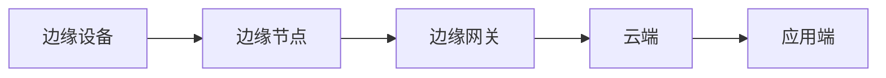
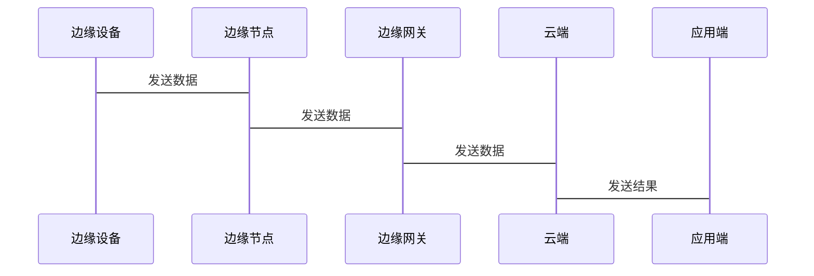

                 


# 如何识别企业的边缘计算联合推理优势

## 关键词：边缘计算、联合推理、系统架构、算法原理、企业应用、项目实战

## 摘要：边缘计算和联合推理是当前企业数字化转型中的重要技术。边缘计算通过将计算能力推送到数据源附近，减少了延迟和带宽消耗；而联合推理则通过分布式计算和模型协作，提升了系统的智能性和决策能力。本文将从背景介绍、核心概念、算法原理、系统架构、项目实战等多方面详细分析，帮助企业识别边缘计算联合推理的优势。

---

## 第一部分：企业边缘计算联合推理的背景与概念

### 第1章：边缘计算与联合推理概述

#### 1.1 边缘计算的基本概念
- **定义与特点**：边缘计算是一种分布式计算范式，将数据处理和计算能力从云端推向数据源附近，减少延迟和带宽消耗。其特点包括实时性、分布式、本地化处理等。
- **核心要素与组成**：边缘计算通常由边缘设备、边缘节点、边缘网关和云端协同组成，具备数据采集、本地处理、通信和协同计算的特点。
- **应用场景与优势**：边缘计算广泛应用于智能制造、智慧城市、自动驾驶等领域，优势包括低延迟、高带宽利用率和数据隐私保护。

#### 1.2 联合推理的概念与特点
- **定义与核心原理**：联合推理是一种分布式计算技术，通过多个计算节点协作，共同完成模型的推理任务。其核心原理包括分布式计算、模型同步和隐私保护。
- **联合推理与边缘计算的结合**：联合推理可以利用边缘计算的分布式架构，实现模型的联合训练和推理，提升系统的整体智能性和决策能力。
- **优势与应用场景**：联合推理的优势包括数据隐私保护、计算资源利用率高和抗单点故障能力强。应用场景包括金融风险评估、医疗数据分析、智能制造优化等。

#### 1.3 企业边缘计算联合推理的背景与问题
- **企业数字化转型的背景**：随着企业数字化转型的推进，数据量急剧增加，传统的集中式计算模式难以满足实时性和隐私保护的需求。
- **边缘计算在企业中的应用现状**：边缘计算在企业中的应用逐渐普及，但如何实现边缘节点的智能推理和模型协作仍是一个挑战。
- **联合推理在企业中的需求与挑战**：联合推理在企业中的需求日益增长，但实现联合推理需要解决通信开销、模型同步和隐私保护等问题。

### 第2章：边缘计算与联合推理的核心概念与联系

#### 2.1 边缘计算的核心原理
- **体系结构**：边缘计算的体系结构通常包括边缘设备、边缘节点、边缘网关和云端。边缘设备负责数据采集，边缘节点负责本地数据处理和初步推理，边缘网关负责数据的汇聚和通信，云端负责全局协调和模型更新。
- **数据处理流程**：边缘计算的数据处理流程包括数据采集、预处理、模型推理和结果反馈。数据采集后，经过预处理，通过模型进行推理，最后将结果反馈给应用端。
- **通信机制**：边缘计算的通信机制包括设备间通信、设备与云端通信以及设备与边缘节点通信。通信机制需要考虑带宽、延迟和安全性。

#### 2.2 联合推理的核心原理
- **算法原理**：联合推理的核心原理包括分布式计算、模型同步和隐私保护。分布式计算通过将模型参数分发到多个节点，每个节点仅处理部分数据，模型同步通过将各节点的模型参数进行汇总和优化，隐私保护通过加密和隐私计算技术保护数据隐私。
- **分布式计算特点**：联合推理的分布式计算特点包括计算资源分散、数据分布存储、模型参数同步和异步计算。这些特点使得联合推理能够充分利用边缘设备的计算资源，同时保护数据隐私。
- **隐私保护机制**：联合推理的隐私保护机制包括加密通信、同态加密、安全多方计算和差分隐私。这些机制能够有效保护数据在传输和计算过程中的隐私。

#### 2.3 边缘计算与联合推理的对比分析
- **属性特征对比**：通过对比边缘计算和联合推理的属性特征，可以发现边缘计算更注重数据的实时性和本地处理能力，而联合推理更注重模型的协作和数据隐私保护。
- **ER实体关系图**：通过ER实体关系图可以展示边缘计算和联合推理在系统中的实体关系。边缘计算主要涉及边缘设备、边缘节点和云端，而联合推理主要涉及分布式节点、模型参数和隐私保护机制。

### 第3章：边缘计算与联合推理的算法原理

#### 3.1 边缘计算的算法流程
- **数据采集与预处理**：边缘设备通过传感器或数据接口采集数据，然后进行预处理，如去噪、归一化和特征提取。
- **模型训练与部署**：边缘节点在本地进行模型训练，通过参数优化算法（如随机梯度下降）进行模型更新。模型部署后，边缘节点可以进行实时推理。
- **推理过程与结果反馈**：边缘节点通过模型推理生成结果，将结果反馈给应用端。推理过程需要考虑模型的准确性和实时性。

#### 3.2 联合推理的算法流程
- **数据分布与通信**：联合推理的数据分布通常采用分片存储的方式，每个节点仅存储部分数据。数据通信通过安全通道进行，确保数据在传输过程中的安全性。
- **模型同步与优化**：联合推理的模型同步过程包括参数聚合、模型更新和版本控制。参数聚合通常采用加权平均的方式，模型更新通过优化算法（如Adam）进行。
- **隐私保护机制**：联合推理的隐私保护机制包括数据加密、模型加密和安全多方计算。数据加密确保数据在传输中的隐私，模型加密保护模型参数不被窃取，安全多方计算通过秘密共享和计算协议实现多方协作。

#### 3.3 边缘计算与联合推理的算法对比
- **算法流程对比**：边缘计算的算法流程注重实时性和本地处理能力，而联合推理的算法流程注重模型协作和数据隐私保护。两者的算法流程在数据处理和模型优化上有明显的区别。
- **数学模型与公式**：边缘计算的模型优化通常采用传统的优化算法，如随机梯度下降。而联合推理的模型优化通常采用分布式优化算法，如分布式Adam。两者在数学模型和优化目标上有明显的区别。

---

## 第二部分：企业边缘计算联合推理的系统分析与架构设计

### 第4章：边缘计算与联合推理的系统架构

#### 4.1 项目场景介绍
- **项目介绍**：本项目旨在通过边缘计算和联合推理技术，实现企业数据的实时分析和智能决策。项目主要应用于智能制造、智慧城市等领域。
- **系统功能设计**：系统功能包括数据采集、本地推理、模型同步、隐私保护和结果反馈。数据采集负责从边缘设备获取数据，本地推理负责在边缘节点进行初步推理，模型同步负责将各节点的模型参数进行汇总和优化，隐私保护负责保护数据和模型的隐私，结果反馈负责将推理结果反馈给应用端。
- **领域模型**：通过Mermaid类图展示系统的领域模型，包括边缘设备、边缘节点、边缘网关、云端和应用端。每个实体之间的关系和交互通过类图展示。

#### 4.2 系统架构设计
- **系统架构图**：通过Mermaid架构图展示系统的整体架构，包括边缘设备、边缘节点、边缘网关、云端和应用端。边缘设备负责数据采集，边缘节点负责本地推理，边缘网关负责数据汇聚和通信，云端负责全局协调和模型更新，应用端负责展示和使用推理结果。
- **接口设计**：系统接口包括边缘设备与边缘节点之间的数据接口，边缘节点与边缘网关之间的通信接口，边缘网关与云端之间的数据接口，云端与应用端之间的结果接口。每个接口的设计需要考虑数据格式、通信协议和安全性。
- **交互流程**：通过Mermaid序列图展示系统的交互流程，包括数据采集、本地推理、模型同步、隐私保护和结果反馈。每个步骤之间的交互关系和时间顺序通过序列图展示。

---

## 第三部分：企业边缘计算联合推理的项目实战

### 第5章：项目实战与案例分析

#### 5.1 环境安装与配置
- **环境要求**：项目需要安装Python 3.8及以上版本、TensorFlow 2.0及以上版本、Flask框架和Keras库。安装环境可以通过Anaconda虚拟环境进行管理。
- **依赖安装**：使用pip命令安装所需的依赖包，如`pip install tensorflow flask numpy`等。

#### 5.2 系统核心实现
- **边缘设备数据采集**：编写Python代码实现数据采集功能，如使用传感器数据模拟器生成数据。
- **边缘节点本地推理**：编写代码实现边缘节点的本地推理功能，如使用Keras模型进行图像识别或分类。
- **模型同步与优化**：编写代码实现模型参数的同步和优化，如使用Flask框架搭建API接口进行模型参数的上传和下载。
- **隐私保护实现**：编写代码实现数据和模型的隐私保护，如使用加密算法对数据和模型参数进行加密。

#### 5.3 代码实现与解读
- **数据采集代码**：编写数据采集代码，如：
  ```python
  import numpy as np

  def generate_data(batch_size):
      # 模拟传感器数据
      data = np.random.randn(batch_size, 10)
      return data
  ```
- **本地推理代码**：编写本地推理代码，如：
  ```python
  import tensorflow as tf
  from tensorflow.keras import layers

  model = tf.keras.Sequential([
      layers.Dense(64, activation='relu'),
      layers.Dense(1, activation='sigmoid')
  ])
  model.compile(optimizer='adam', loss='binary_crossentropy')
  ```

- **模型同步代码**：编写模型同步代码，如：
  ```python
  import requests

  def sync_model(model, server_url):
      # 将模型参数发送到服务器
      weights = model.get_weights()
      response = requests.post(server_url, json={'weights': weights.tolist()})
      return response.status_code
  ```

#### 5.4 案例分析与详细讲解
- **案例分析**：通过具体案例分析边缘计算和联合推理的优势，如在智能制造中的应用。案例分析需要包括数据采集、本地推理、模型同步和结果反馈的详细过程。
- **详细讲解**：通过案例分析详细讲解边缘计算和联合推理在实际应用中的优势，如低延迟、高带宽利用率和数据隐私保护。

---

## 第四部分：企业边缘计算联合推理的最佳实践

### 第6章：总结与展望

#### 6.1 总结
- **核心内容回顾**：总结本文的核心内容，包括边缘计算和联合推理的定义、核心概念、算法原理、系统架构和项目实战。
- **主要优势总结**：总结边缘计算和联合推理的主要优势，如低延迟、高带宽利用率、数据隐私保护和智能决策能力。

#### 6.2 注意事项与建议
- **注意事项**：在实际应用中需要注意数据隐私保护、模型同步的效率和通信开销等问题。
- **最佳实践**：建议企业在实施边缘计算和联合推理时，选择合适的硬件和软件架构，确保数据和模型的安全性，同时合理分配计算资源。

#### 6.3 拓展阅读
- **相关技术领域**：建议读者进一步阅读分布式计算、隐私保护、边缘AI和模型压缩等领域的相关书籍和论文。
- **推荐阅读书籍**：推荐《分布式系统：概念与设计》、《隐私保护与数据安全》和《边缘计算：原理与应用》等书籍。

---

## 第五部分：附录

### 附录A：边缘计算与联合推理的数学公式

#### A.1 边缘计算的模型优化公式
- **随机梯度下降算法**：
  $$\theta_{t+1} = \theta_t - \eta \nabla L(\theta_t)$$
  其中，$\theta$ 表示模型参数，$\eta$ 表示学习率，$\nabla L$ 表示损失函数的梯度。

#### A.2 联合推理的模型同步公式
- **参数聚合公式**：
  $$\theta_{new} = \frac{1}{N} \sum_{i=1}^{N} \theta_i$$
  其中，$\theta_{new}$ 表示新模型参数，$N$ 表示节点数，$\theta_i$ 表示第$i$个节点的模型参数。

---

### 附录B：边缘计算与联合推理的系统架构图

#### B.1 系统架构图


#### B.2 交互流程图


---

通过以上内容，您可以系统地识别企业的边缘计算联合推理优势，并将其应用于实际项目中。

