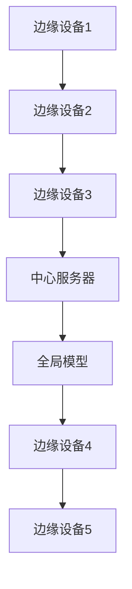
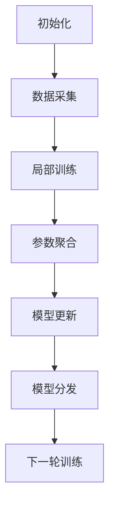
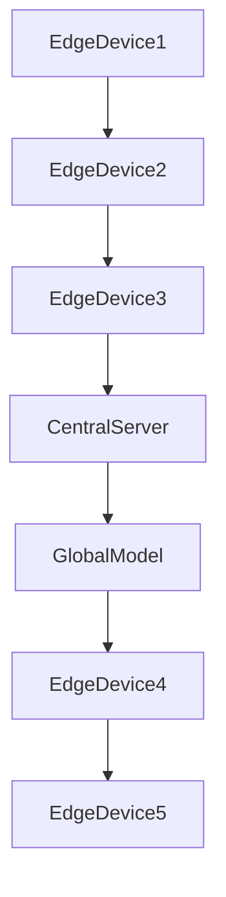
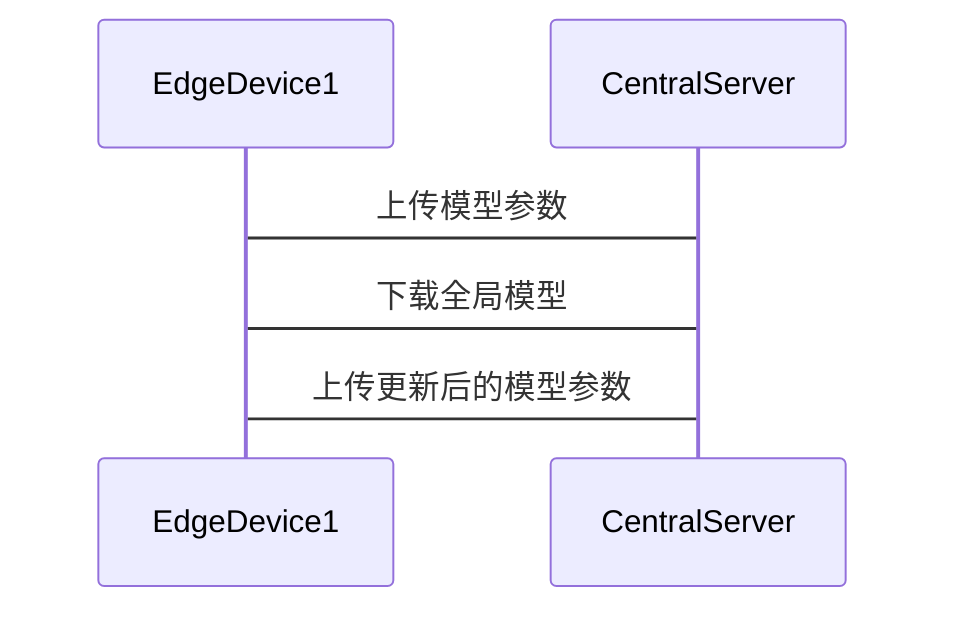

                 


# 如何识别企业的边缘计算联邦学习优势

## 关键词：边缘计算，联邦学习，分布式计算，数据隐私，机器学习，企业应用

## 摘要

边缘计算和联邦学习是当前技术领域的重要趋势，分别在数据处理和模型训练方面展现了独特的优势。边缘计算通过将计算能力推向数据源，减少了数据传输的延迟和成本；而联邦学习则通过在分布式的设备上进行模型训练，保护了数据隐私。本文将深入探讨边缘计算与联邦学习的结合，分析企业在识别和应用这种技术优势时的关键点，包括技术原理、系统架构、项目实战和最佳实践。

---

# 目录

1. [边缘计算与联邦学习的背景](#边缘计算与联邦学习的背景)
2. [边缘计算联邦学习的核心概念](#边缘计算联邦学习的核心概念)
3. [边缘计算联邦学习的算法原理](#边缘计算联邦学习的算法原理)
4. [边缘计算联邦学习的系统架构设计](#边缘计算联邦学习的系统架构设计)
5. [边缘计算联邦学习的项目实战](#边缘计算联邦学习的项目实战)
6. [边缘计算联邦学习的最佳实践](#边缘计算联邦学习的最佳实践)

---

## 1. 边缘计算与联邦学习的背景

### 1.1 边缘计算的基本概念

边缘计算是一种将计算能力从云端迁移到数据源端的技术。它通过在边缘设备上进行数据处理，减少了数据传输到云端的延迟，提高了实时响应能力。边缘计算的特点包括：

- **低延迟**：数据在生成地直接处理，减少了数据传输的时间。
- **带宽优化**：仅传输必要的数据，减少了网络带宽的使用。
- **隐私保护**：数据在边缘设备上处理，减少了数据外泄的风险。

### 1.2 联邦学习的基本概念

联邦学习是一种分布式机器学习技术，允许多个参与方在不共享原始数据的情况下，协同训练共享的模型。其特点包括：

- **数据隐私**：数据无需集中到一个地方，保护了数据隐私。
- **分布式训练**：模型在多个设备或服务器上协同训练，提高了模型的泛化能力。
- **异构环境**：支持不同设备和数据格式的协作。

### 1.3 边缘计算与联邦学习的结合

边缘计算和联邦学习的结合，充分利用了边缘计算的低延迟和分布式计算能力，以及联邦学习的隐私保护和分布式模型训练优势。这种结合为企业提供了在边缘设备上进行高效、安全的模型训练的能力。

---

## 2. 边缘计算联邦学习的核心概念

### 2.1 边缘计算联邦学习的核心原理

边缘计算联邦学习的原理是通过在边缘设备上进行分布式模型训练，将各个边缘设备的模型参数聚合到一个中心服务器，生成全局模型。具体流程如下：

1. **数据采集**：边缘设备收集数据。
2. **模型初始化**：在边缘设备上初始化模型。
3. **局部训练**：边缘设备在本地数据上训练模型，生成更新后的模型参数。
4. **参数聚合**：将各个边缘设备的模型参数上传到中心服务器，进行参数聚合，生成全局模型。
5. **模型分发**：将全局模型分发回边缘设备，进行下一轮训练。

### 2.2 边缘计算与联邦学习的对比分析

| **特性**         | **边缘计算**             | **联邦学习**             |
|------------------|--------------------------|--------------------------|
| 数据处理位置     | 边缘设备                 | 多个边缘设备或中心服务器 |
| 数据隐私保护     | 较低，依赖于传输过程     | 较高，数据不集中存储     |
| 计算资源         | 边缘设备计算能力有限     | 边缘设备和中心服务器     |
| 适用场景         | 实时数据处理             | 分布式模型训练           |

### 2.3 边缘计算联邦学习的系统架构

以下是边缘计算联邦学习的系统架构图：



---

## 3. 边缘计算联邦学习的算法原理

### 3.1 联邦学习的算法流程

以下是联邦学习的算法流程图：



### 3.2 联邦学习的数学模型

假设我们有 $n$ 个边缘设备，每个设备有数据集 $D_i$，全局模型参数为 $\theta$。每个设备在本地训练模型，更新参数 $\theta_i$，然后将 $\theta_i$ 上传到中心服务器。中心服务器将所有 $\theta_i$ 聚合，生成全局模型参数 $\theta_{\text{new}}$。

聚合过程可以使用以下公式：

$$ \theta_{\text{new}} = \frac{1}{n} \sum_{i=1}^{n} \theta_i $$

### 3.3 Python代码示例

以下是一个简单的边缘计算联邦学习代码示例：

```python
import numpy as np
from sklearn.linear_model import SGDClassifier
from sklearn.datasets import make_classification

# 初始化全局模型
global_model = SGDClassifier()

# 边缘设备数量
num_devices = 3

# 生成数据集
X, y = make_classification(n_samples=100, n_features=2, n_classes=2, random_state=42)

# 在边缘设备上进行局部训练
for i in range(num_devices):
    # 分割数据集到每个设备
    device_X = X[i::num_devices]
    device_y = y[i::num_devices]
    
    # 初始化局部模型
    local_model = SGDClassifier()
    
    # 局部训练
    local_model.fit(device_X, device_y)
    
    # 更新全局模型参数
    global_model.coef_ += local_model.coef_
    global_model.intercept_ += local_model.intercept_

# 聚合全局模型参数
global_model.coef_ /= num_devices
global_model.intercept_ /= num_devices

# 输出全局模型
print(global_model)
```

---

## 4. 边缘计算联邦学习的系统架构设计

### 4.1 问题场景介绍

在企业环境中，数据通常分布在多个边缘设备上，例如 IoT 设备、移动设备等。为了在不集中数据的情况下训练全局模型，企业可以采用边缘计算联邦学习技术。

### 4.2 系统功能设计

以下是系统功能设计的领域模型类图：

```mermaid
classDiagram
    class EdgeDevice {
        - id: int
        - data: array
        - model: Model
        + train_model(): void
    }
    
    class Model {
        - weights: array
        - bias: float
        + update(weights, bias): void
    }
    
    class CentralServer {
        - global_model: Model
        + aggregate_models(models): Model
    }
    
    EdgeDevice o- Model
    EdgeDevice --> CentralServer
```

### 4.3 系统架构设计

以下是系统架构设计的mermaid图：



### 4.4 接口设计与交互流程

以下是系统交互的mermaid序列图：



---

## 5. 边缘计算联邦学习的项目实战

### 5.1 环境安装

要运行边缘计算联邦学习代码，需要安装以下依赖：

```bash
pip install numpy scikit-learn
```

### 5.2 核心代码实现

以下是核心代码实现：

```python
import numpy as np
from sklearn.linear_model import SGDClassifier
from sklearn.datasets import make_classification

# 初始化全局模型
global_model = SGDClassifier()

# 边缘设备数量
num_devices = 3

# 生成数据集
X, y = make_classification(n_samples=100, n_features=2, n_classes=2, random_state=42)

# 在边缘设备上进行局部训练
for i in range(num_devices):
    # 分割数据集到每个设备
    device_X = X[i::num_devices]
    device_y = y[i::num_devices]
    
    # 初始化局部模型
    local_model = SGDClassifier()
    
    # 局部训练
    local_model.fit(device_X, device_y)
    
    # 更新全局模型参数
    global_model.coef_ += local_model.coef_
    global_model.intercept_ += local_model.intercept_

# 聚合全局模型参数
global_model.coef_ /= num_devices
global_model.intercept_ /= num_devices

# 输出全局模型
print(global_model)
```

### 5.3 代码功能解读

- **数据生成**：使用 `make_classification` 生成分类数据集。
- **局部训练**：在每个边缘设备上训练局部模型，并更新全局模型参数。
- **参数聚合**：将所有边缘设备的模型参数聚合，生成全局模型。

### 5.4 实际案例分析

假设我们有3个边缘设备，每个设备训练一个逻辑回归模型，然后将模型参数上传到中心服务器。中心服务器将所有参数平均，生成全局模型。

### 5.5 项目小结

通过上述步骤，我们可以看到边缘计算联邦学习的优势在于能够高效地在分布式的设备上进行模型训练，同时保护数据隐私。

---

## 6. 边缘计算联邦学习的最佳实践

### 6.1 小结

边缘计算联邦学习结合了边缘计算的低延迟和联邦学习的隐私保护优势，为企业提供了高效的分布式模型训练能力。

### 6.2 注意事项

- **计算资源**：边缘设备的计算能力有限，需要合理分配任务。
- **数据同步**：数据同步的频率和方式会影响模型的训练效果。
- **模型更新**：模型更新的频率和方式需要根据具体场景进行调整。

### 6.3 拓展阅读

- [《分布式机器学习：联邦学习》](#)
- [《边缘计算技术入门与实践》](#)

---

# 结语

通过本文的详细讲解，读者可以系统地了解边缘计算联邦学习的优势、原理和实现方法。希望本文能够帮助企业识别和应用这种技术的优势，提升企业的数据处理和模型训练能力。

