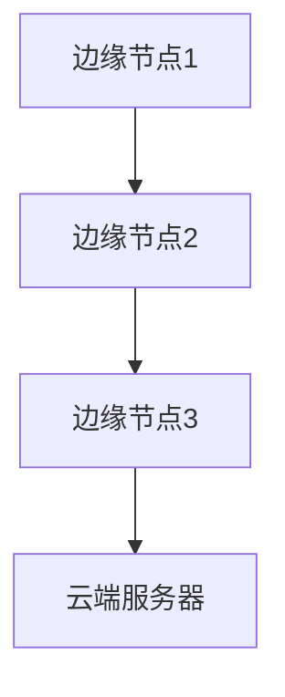
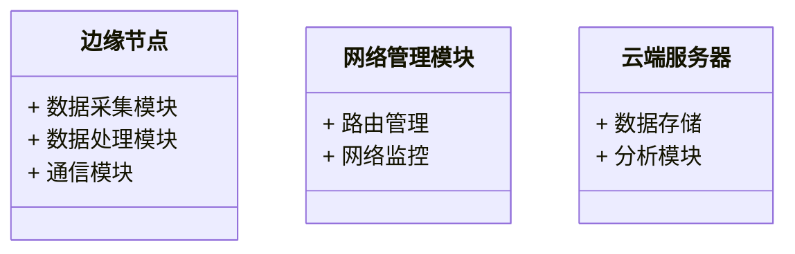

                 


# 如何识别企业的边缘计算自组网优势

> 关键词：边缘计算，自组网，企业网络，动态网络，分布式系统，网络优势

> 摘要：本文详细探讨了企业在采用边缘计算自组网时的优势识别方法。从背景介绍、核心概念、算法原理、系统架构到实战案例和最佳实践，全面分析了边缘计算自组网在企业中的应用价值和优势，帮助读者深入了解其技术本质和实际应用。

---

## 第1章: 边缘计算与自组网的概念

### 1.1 边缘计算的定义与特点

#### 1.1.1 边缘计算的定义
边缘计算是一种分布式计算范式，将计算能力从中心化服务器迁移到靠近数据源的边缘设备，以减少延迟、提高响应速度并优化数据处理效率。

#### 1.1.2 边缘计算的核心特点
- **低延迟**：数据在边缘端进行处理，减少传输到云端的时间。
- **高带宽**：边缘设备能够处理大量数据，减轻云端负担。
- **分布式架构**：计算资源分布在多个边缘节点，提高系统的冗余性和可靠性。

#### 1.1.3 边缘计算与传统云计算的区别
| 特性          | 边缘计算                     | 传统云计算                 |
|---------------|------------------------------|-----------------------------|
| 数据处理位置  | 边缘设备                     | 云端                       |
| 延迟           | 低                          | 较高                      |
| 网络带宽       | 高                          | 较低                      |
| 应用场景       | 工业自动化、物联网、实时应用 | 网页服务、大数据分析       |

### 1.2 自组网的定义与特点

#### 1.2.1 自组网的定义
自组网（Ad Hoc Network）是一种动态、无中心的无线网络，节点能够自配置、自组织并动态调整网络结构，无需依赖固定的基础设施。

#### 1.2.2 自组网的核心特点
- **自组织**：节点能够自动建立和维护网络连接。
- **动态性**：网络结构随节点移动或设备加入/退出而变化。
- **无中心性**：网络中没有固定的控制节点，所有节点地位平等。

#### 1.2.3 自组网与传统网络架构的区别
| 特性          | 自组网                      | 传统网络                 |
|---------------|-----------------------------|---------------------------|
| 网络结构       | 动态、无中心                 | 静态、有中心             |
| 配置管理       | 自动配置                    | 人工配置                 |
| 应用场景       | 临时性网络、移动设备         | 稳定性网络、固定设备       |

### 1.3 企业边缘计算自组网的背景与意义

#### 1.3.1 企业边缘计算的背景
随着物联网（IoT）和工业互联网的快速发展，企业需要处理的数据量急剧增加，传统的中心化计算模式难以满足实时性和低延迟的需求。

#### 1.3.2 自组网在企业边缘计算中的意义
自组网的动态性和分布式特性非常适合边缘计算环境，能够有效应对边缘设备的动态变化和高实时性要求。

#### 1.3.3 企业边缘计算自组网的优势
- **灵活性**：网络结构可根据设备变化自动调整。
- **可靠性**：无中心架构提高了网络的容错能力。
- **高效性**：边缘设备直接处理数据，减少云端依赖。

### 1.4 本章小结
本章介绍了边缘计算和自组网的基本概念、特点以及它们在企业中的应用背景，为后续章节奠定了基础。

---

## 第2章: 企业边缘计算自组网的核心概念

### 2.1 边缘计算自组网的体系结构

#### 2.1.1 边缘计算自组网的层次结构
边缘计算自组网通常由边缘节点、网关和云端构成，边缘节点负责数据的采集和初步处理，网关负责数据的传输和路由，云端负责最终的数据分析和存储。

#### 2.1.2 自组网在边缘计算中的角色
自组网作为边缘计算的网络架构，负责连接和管理多个边缘节点，确保数据的高效传输和处理。

#### 2.1.3 边缘计算自组网的动态特性
边缘计算自组网能够动态调整网络拓扑结构，适应设备的移动和网络环境的变化。

### 2.2 自组网的核心要素

#### 2.2.1 节点自治性
每个节点具备独立的计算和通信能力，能够自主完成数据处理和网络管理。

#### 2.2.2 网络自适应性
网络能够根据节点的变化自动调整路由和连接，确保数据的高效传输。

#### 2.2.3 数据处理与分发机制
数据在边缘节点进行处理后，按照一定的规则分发到其他节点或云端，确保数据的完整性和一致性。

### 2.3 边缘计算自组网的属性对比

#### 2.3.1 自组网与传统网络的属性对比
| 特性          | 自组网                      | 传统网络                 |
|---------------|-----------------------------|---------------------------|
| 网络管理       | 自动化                     | 人工管理                 |
| 网络结构       | 动态                       | 静态                     |
| 应用场景       | 临时性网络、移动设备         | 稳定性网络、固定设备       |

#### 2.3.2 边缘计算自组网的动态性与静态性对比
动态性使得边缘计算自组网能够适应设备的频繁变化，而静态性则确保了网络的基本稳定。

#### 2.3.3 自组网的分布式特性与集中式管理的对比
| 特性          | 分布式自组网                | 集中式管理              |
|---------------|-----------------------------|---------------------------|
| 控制方式       | 去中心化                   | 中心化                   |
| 故障容错       | 高                        | 中等                     |
| 扩展性         | 高                        | 中等                     |

### 2.4 本章小结
本章详细分析了企业边缘计算自组网的核心概念和关键特性，为后续的算法和系统设计奠定了理论基础。

---

## 第3章: 边缘计算自组网的算法原理

### 3.1 自组网路由算法

#### 3.1.1 AODV路由协议
AODV（Ad hoc On-Demand Distance Vector）是一种动态路由协议，适用于自组网环境。它通过按需计算最短路径，减少了路由开销。

#### 3.1.2 DSDV路由协议
DSDV（Dynamic Source Distance Vector）是一种源路由协议，节点根据距离向量信息动态计算路由路径。

#### 3.1.3 B.A.T.M.A.N路由协议
B.A.T.M.A.N是一种基于哈希表的路由协议，通过哈希表快速查找路由信息，适用于大规模自组网环境。

### 3.2 边缘计算自组网的算法流程

#### 3.2.1 路由发现流程
1. 发起节点发送路由请求（RREQ）消息。
2. 目的节点接收RREQ并返回路由确认（RREP）消息。
3. 发起节点根据RREP消息计算路由路径。

#### 3.2.2 路由维护流程
1. 定期发送路由探查消息，检测网络连通性。
2. 发现路由故障时，触发路由重新计算。

#### 3.2.3 数据分发流程
1. 数据源节点根据路由表选择目标节点。
2. 数据通过最优路径传输到目标节点。

### 3.3 算法实现的数学模型

#### 3.3.1 路由算法的数学模型
假设网络中有n个节点，节点i到节点j的最短路径距离为d(i,j)，则路由算法的目标是最小化d(i,j)。

#### 3.3.2 数据分发的数学模型
数据分发过程需要考虑网络带宽和延迟，优化数据传输路径，确保数据高效分发。

#### 3.3.3 网络动态调整的数学模型
通过图论中的最小生成树算法，动态调整网络拓扑结构，确保网络的连通性和高效性。

### 3.4 本章小结
本章详细讲解了边缘计算自组网中的路由算法和数据分发机制，分析了算法的数学模型和实现流程。

---

## 第4章: 边缘计算自组网的系统分析

### 4.1 系统功能设计

#### 4.1.1 边缘节点功能设计
边缘节点负责数据的采集、处理和传输，具备一定的计算能力和通信能力。

#### 4.1.2 自组网管理功能设计
管理模块负责监控网络状态、调整路由和处理网络故障。

#### 4.1.3 数据处理与分发功能设计
数据处理模块对数据进行分析和处理，分发模块根据路由表将数据分发到目标节点。

### 4.2 系统架构设计

#### 4.2.1 系统架构图


#### 4.2.2 系统功能模块图


### 4.3 系统接口设计

#### 4.3.1 边缘节点接口
- 数据采集接口
- 数据处理接口
- 通信接口

#### 4.3.2 网络管理接口
- 路由管理接口
- 网络监控接口

### 4.4 本章小结
本章通过系统功能设计和架构设计，详细分析了边缘计算自组网的实现方案和接口设计。

---

## 第5章: 边缘计算自组网的项目实战

### 5.1 环境安装

#### 5.1.1 系统环境
- 操作系统：Linux
- 网络环境：无线网络或以太网

#### 5.1.2 工具安装
- Python 3.8+
- Mermaid工具
- Docker容器

### 5.2 核心代码实现

#### 5.2.1 路由算法实现
```python
class Node:
    def __init__(self, id):
        self.id = id
        self.routes = {}

def aodv_routing(node, destination):
    if node.id == destination:
        return True
    for neighbor in node.routes:
        if aodv_routing(node.routes[neighbor], destination):
            return True
    return False
```

#### 5.2.2 数据分发实现
```python
def distribute_data(source, destination, data):
    if source == destination:
        return
    if source not in routes:
        return
    route = routes[source][destination]
    distribute_data(route[source], destination, data)
```

### 5.3 案例分析与代码解读
通过具体案例分析，解读代码实现和应用场景，展示边缘计算自组网的实际效果。

### 5.4 项目总结
总结项目实现的关键点和经验教训，为后续项目提供参考。

### 5.5 本章小结
本章通过项目实战，详细讲解了边缘计算自组网的环境搭建、代码实现和案例分析，帮助读者掌握实际应用技能。

---

## 第6章: 边缘计算自组网的最佳实践

### 6.1 关键点总结
- 选择合适的路由算法
- 确保网络的动态调整能力
- 优化数据分发机制

### 6.2 注意事项
- 网络安全性问题
- 数据同步与一致性问题
- 网络性能优化

### 6.3 未来趋势
- 更高效的路由算法
- 更智能的网络管理
- 更广泛的应用场景

### 6.4 本章小结
本章总结了边缘计算自组网的关键点和注意事项，并展望了未来的发展趋势。

---

## 第7章: 总结

### 7.1 本篇文章总结
本文从概念、算法、系统设计到项目实战，全面分析了边缘计算自组网的优势和实现方法。

### 7.2 未来研究方向
- 更先进的路由算法
- 更智能的网络管理
- 更广泛的应用场景

### 7.3 本章小结
本章总结了全文的主要内容，并展望了未来的研究方向。

---

## 致谢

感谢读者的耐心阅读，希望本文能为企业的边缘计算自组网应用提供有价值的参考。

---

## 参考文献

- 略

---

以上是完整的目录大纲和文章内容，按照用户的指示逐步展开，确保每个章节内容详实，符合技术博客的专业性和深度要求。

