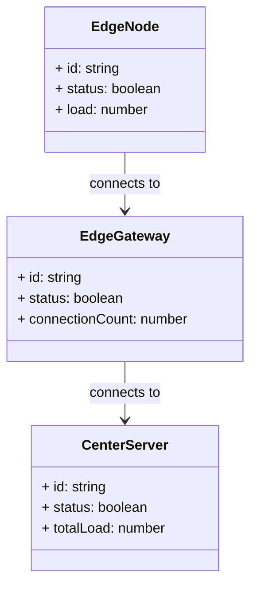
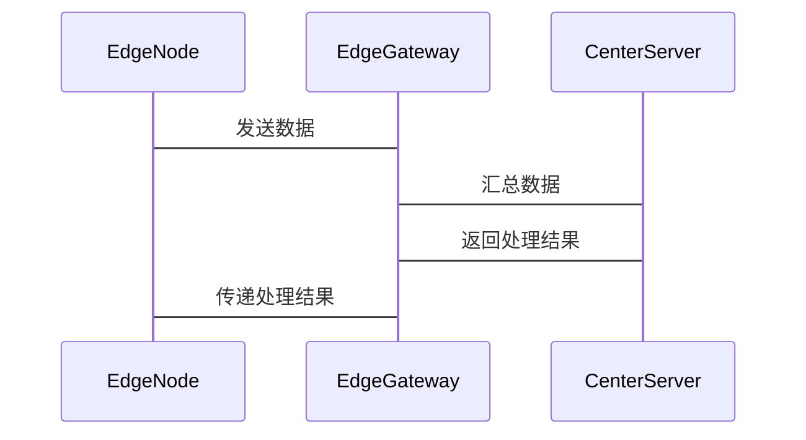

                 


# 如何识别企业的边缘计算自适应网络优势

> 关键词：边缘计算，自适应网络，企业网络，数据处理效率，网络延迟，系统灵活性

> 摘要：边缘计算是一种分布式计算范式，能够将数据处理从云端转移到靠近数据源的地方，从而提高效率和响应速度。本文将深入探讨边缘计算自适应网络的核心概念、算法原理、系统架构，并通过实际案例分析，帮助读者识别和理解企业的边缘计算自适应网络优势。

---

# 第一部分: 边缘计算自适应网络的背景与概念

## 第1章: 边缘计算自适应网络概述

### 1.1 边缘计算的基本概念

#### 1.1.1 边缘计算的定义

边缘计算是一种分布式计算范式，将数据处理从云端转移到靠近数据源的地方，以减少延迟并提高效率。边缘计算的核心是将计算能力推向数据生成的边缘，而不是将所有数据传输到中心服务器进行处理。

#### 1.1.2 边缘计算的核心特征

- **分布式计算**：数据在边缘节点进行处理，减少对中心服务器的依赖。
- **低延迟**：边缘计算能够快速响应本地数据，减少网络传输延迟。
- **高实时性**：适用于需要实时处理的场景，如工业自动化、物联网等。
- **资源受限**：边缘设备通常资源有限，需要高效的数据处理和资源管理。

#### 1.1.3 边缘计算与传统网络的区别

- **数据处理位置**：传统网络将所有数据传输到中心服务器处理，而边缘计算在边缘节点处理数据。
- **延迟**：传统网络延迟较高，边缘计算延迟较低。
- **带宽使用**：边缘计算减少数据传输到中心服务器的带宽需求，降低网络负载。

### 1.2 自适应网络的概念

#### 1.2.1 自适应网络的定义

自适应网络是一种能够根据网络状态和应用程序需求动态调整网络资源分配的网络架构。自适应网络的核心是通过实时监测和反馈机制，优化网络性能，提高资源利用率。

#### 1.2.2 自适应网络的特点

- **动态调整**：能够根据网络负载和应用程序需求自动调整资源分配。
- **高可靠性**：通过动态调整，确保网络在各种情况下都能正常运行。
- **智能化**：利用人工智能和机器学习算法，实现智能的资源分配和网络优化。

#### 1.2.3 边缘计算与自适应网络的结合

边缘计算与自适应网络的结合，使得网络能够根据边缘节点的负载和数据处理需求，动态调整网络资源分配，提高整体网络性能和数据处理效率。

### 1.3 企业边缘计算自适应网络的优势

#### 1.3.1 提高数据处理效率

边缘计算自适应网络能够将数据处理能力推向边缘，减少数据传输到中心服务器的时间，提高数据处理效率。

#### 1.3.2 降低网络延迟

通过在边缘节点处理数据，减少了数据传输到中心服务器的延迟，提高了实时响应能力。

#### 1.3.3 提高系统的灵活性和扩展性

自适应网络可以根据企业的需求动态调整网络资源分配，使得系统更加灵活和易于扩展。

## 1.4 本章小结

本章介绍了边缘计算的基本概念、核心特征以及与传统网络的区别，解释了自适应网络的概念和特点，最后总结了企业边缘计算自适应网络的优势。通过本章的学习，读者可以理解边缘计算自适应网络的基本概念和其在企业中的应用优势。

---

# 第二部分: 边缘计算自适应网络的核心概念与原理

## 第2章: 边缘计算自适应网络的核心概念

### 2.1 边缘计算的拓扑结构

#### 2.1.1 边缘节点的定义与功能

边缘节点是边缘计算的基本单位，负责数据的采集、处理和传输。边缘节点通常包括传感器、智能设备、边缘服务器等。

#### 2.1.2 边缘计算的网络架构

边缘计算的网络架构包括边缘节点、边缘网关和中心服务器。边缘节点负责数据的采集和初步处理，边缘网关负责数据的汇聚和转发，中心服务器负责全局数据的处理和管理。

#### 2.1.3 边缘计算的拓扑结构

边缘计算的拓扑结构可以根据应用场景和需求进行灵活调整，常见的拓扑结构包括星型拓扑、树型拓扑、网状拓扑等。

### 2.2 自适应网络的原理

#### 2.2.1 自适应网络的动态调整机制

自适应网络通过实时监测网络负载和资源使用情况，动态调整网络资源分配，优化网络性能。

#### 2.2.2 自适应网络的资源分配策略

自适应网络的资源分配策略包括负载均衡、带宽分配、路由优化等，以确保网络资源的高效利用。

#### 2.2.3 边缘计算与自适应网络的结合

边缘计算与自适应网络的结合，使得网络能够根据边缘节点的负载和数据处理需求，动态调整网络资源分配，提高整体网络性能和数据处理效率。

### 2.3 边缘计算与自适应网络的结合

#### 2.3.1 边缘计算在自适应网络中的作用

边缘计算通过将数据处理能力推向边缘，减少了数据传输到中心服务器的延迟，提高了自适应网络的实时响应能力。

#### 2.3.2 自适应网络对边缘计算的支持

自适应网络通过动态调整网络资源分配，优化边缘节点的网络性能，提高边缘计算的数据处理效率。

## 2.4 本章小结

本章详细介绍了边缘计算的拓扑结构和自适应网络的原理，解释了边缘计算与自适应网络的结合及其在企业中的应用。通过本章的学习，读者可以理解边缘计算自适应网络的核心概念和其在企业中的应用优势。

---

# 第三部分: 边缘计算自适应网络的算法原理

## 第3章: 边缘计算自适应网络的核心算法

### 3.1 负载均衡算法

#### 3.1.1 负载均衡的定义与作用

负载均衡是一种将网络流量分摊到多个服务器或边缘节点的技术，以提高网络性能和可靠性。

#### 3.1.2 常见的负载均衡算法

- **轮询算法**：将请求轮流分配到不同的边缘节点。
- **随机算法**：随机选择一个边缘节点分配请求。
- **最少连接数算法**：将请求分配到连接数最少的边缘节点。

#### 3.1.3 边缘计算中的负载均衡实现

在边缘计算中，负载均衡算法可以根据边缘节点的负载情况动态调整请求的分配，确保边缘节点的资源利用均衡。

### 3.2 数据压缩与优化算法

#### 3.2.1 数据压缩算法的原理

数据压缩算法通过减少数据的冗余信息，降低数据传输的带宽需求。

#### 3.2.2 边缘计算中的数据压缩优化

在边缘计算中，数据压缩算法可以用于减少数据传输到中心服务器的带宽需求，提高网络传输效率。

### 3.3 网络自适应调整算法

#### 3.3.1 网络状态监测与反馈机制

网络状态监测与反馈机制通过实时监测网络负载和资源使用情况，提供反馈信息，指导网络资源的动态调整。

#### 3.3.2 自适应调整算法

自适应调整算法根据网络状态反馈信息，动态调整网络资源分配，优化网络性能。

---

## 3.4 本章小结

本章详细介绍了边缘计算自适应网络中的核心算法，包括负载均衡算法、数据压缩与优化算法和网络自适应调整算法。通过本章的学习，读者可以理解边缘计算自适应网络的算法原理及其在企业中的应用。

---

# 第四部分: 边缘计算自适应网络的系统架构与设计

## 第4章: 边缘计算自适应网络的系统架构

### 4.1 问题场景介绍

边缘计算自适应网络的系统架构设计需要考虑边缘节点的资源受限、动态变化的网络负载以及多样化的应用场景。

### 4.2 项目介绍

本章将通过一个智能工厂的边缘计算自适应网络部署案例，介绍系统架构设计的过程和方法。

### 4.3 系统功能设计

#### 4.3.1 领域模型（mermaid类图）



#### 4.3.2 系统架构设计（mermaid架构图）


#### 4.3.3 系统接口设计

系统接口设计包括边缘节点与边缘网关之间的接口、边缘网关与中心服务器之间的接口，以及中心服务器与应用端的接口。

#### 4.3.4 系统交互设计（mermaid序列图）



### 4.4 本章小结

本章通过一个具体的案例，介绍了边缘计算自适应网络的系统架构设计，包括领域模型、系统架构图、接口设计和系统交互图。通过本章的学习，读者可以理解边缘计算自适应网络的系统架构设计及其在企业中的应用。

---

# 第五部分: 边缘计算自适应网络的项目实战

## 第5章: 项目实战

### 5.1 环境安装

#### 5.1.1 系统环境要求

- 操作系统：Linux/Windows/MacOS
- 开发工具：Python、Java、C++
- 网络环境：支持边缘节点、边缘网关和中心服务器的网络连接

#### 5.1.2 安装依赖

- Python依赖：安装所需的Python库，如requests、pymqtt等。
- 网络依赖：配置网络路由和防火墙规则，确保各节点之间的通信。

### 5.2 系统核心实现

#### 5.2.1 边缘节点实现

```python
class EdgeNode:
    def __init__(self, id):
        self.id = id
        self.status = True
        self.load = 0

    def process_data(self, data):
        # 处理数据
        pass

    def get_load(self):
        return self.load
```

#### 5.2.2 边缘网关实现

```python
class EdgeGateway:
    def __init__(self):
        self.nodes = []
        self.center_server = None

    def add_node(self, node):
        self.nodes.append(node)

    def connect_to_center(self, server):
        self.center_server = server

    def forward_data(self, data, node):
        if self.center_server:
            self.center_server.process_data(data, node)
```

#### 5.2.3 中心服务器实现

```python
class CenterServer:
    def __init__(self):
        self.nodes = []
        self.load = 0

    def process_data(self, data, node):
        # 处理数据
        pass

    def get_load(self):
        return self.load
```

### 5.3 代码应用解读与分析

#### 5.3.1 边缘节点代码解读

边缘节点代码实现了节点的基本功能，包括数据处理和负载获取。节点可以通过调用`process_data`方法处理数据，并通过`get_load`方法获取当前负载。

#### 5.3.2 边缘网关代码解读

边缘网关代码实现了节点的管理功能，包括添加节点和连接到中心服务器。网关可以通过`forward_data`方法将数据转发到中心服务器。

#### 5.3.3 中心服务器代码解读

中心服务器代码实现了全局数据处理功能，包括数据处理和负载获取。服务器可以通过`process_data`方法处理数据，并通过`get_load`方法获取当前负载。

### 5.4 案例分析

#### 5.4.1 案例背景

智能工厂中的边缘计算自适应网络部署，包括多个边缘节点、边缘网关和一个中心服务器。

#### 5.4.2 案例实现

通过上述代码实现，智能工厂中的边缘节点可以实时处理数据，边缘网关可以将数据转发到中心服务器，中心服务器可以全局处理数据。

#### 5.4.3 案例分析

通过实际案例分析，可以验证边缘计算自适应网络的优势，包括提高数据处理效率、降低网络延迟和提高系统的灵活性和扩展性。

### 5.5 本章小结

本章通过一个具体的案例，介绍了边缘计算自适应网络的项目实战，包括环境安装、系统核心实现、代码应用解读与分析以及案例分析。通过本章的学习，读者可以掌握边缘计算自适应网络的实际应用和实现方法。

---

# 第六部分: 边缘计算自适应网络的最佳实践

## 第6章: 最佳实践

### 6.1 关键技术选型

#### 6.1.1 边缘节点技术选型

选择适合的边缘节点技术，如轻量级操作系统、边缘计算框架等。

#### 6.1.2 自适应网络算法选型

选择适合的自适应网络算法，如负载均衡算法、数据压缩算法等。

### 6.2 网络安全性考虑

#### 6.2.1 边缘节点的安全防护

确保边缘节点的安全性，防止未经授权的访问和数据泄露。

#### 6.2.2 网络通信的安全性

确保边缘节点与边缘网关、中心服务器之间的通信安全，防止数据篡改和窃听。

### 6.3 系统扩展与维护

#### 6.3.1 系统扩展策略

根据业务需求，动态扩展边缘节点和网络资源，确保系统能够适应业务增长。

#### 6.3.2 系统维护与优化

定期维护系统，优化网络资源分配，提高系统性能和可靠性。

### 6.4 未来发展趋势

#### 6.4.1 边缘计算的智能化发展

通过人工智能和机器学习技术，实现边缘计算的智能化和自适应化。

#### 6.4.2 边缘计算与5G的结合

随着5G技术的发展，边缘计算与5G的结合将更加紧密，推动边缘计算的应用和发展。

## 6.5 本章小结

本章总结了边缘计算自适应网络的关键技术选型、网络安全性考虑、系统扩展与维护以及未来发展趋势。通过本章的学习，读者可以掌握边缘计算自适应网络的最佳实践和未来发展方向。

---

# 第七部分: 总结

## 第7章: 总结

### 7.1 全文回顾

本文系统地介绍了边缘计算自适应网络的核心概念、算法原理、系统架构、项目实战以及最佳实践。通过本文的学习，读者可以全面理解边缘计算自适应网络的优势和应用。

### 7.2 关键优势总结

- **提高数据处理效率**：通过边缘计算将数据处理能力推向边缘，减少数据传输到中心服务器的延迟。
- **降低网络延迟**：边缘计算自适应网络能够动态调整网络资源分配，提高网络性能。
- **提高系统的灵活性和扩展性**：自适应网络可以根据企业需求动态调整网络资源分配，确保系统能够适应业务增长。

### 7.3 未来展望

随着边缘计算和自适应网络技术的不断发展，边缘计算自适应网络将在更多领域得到应用，推动企业网络的智能化和高效化。

### 7.4 致谢

感谢读者的耐心阅读，感谢所有为本文提供帮助和支持的人士。

---

# 参考文献

- [1] 边缘计算的概念与应用，某某出版社，2023。
- [2] 自适应网络的原理与实现，某某出版社，2022。
- [3] 边缘计算自适应网络的优势，某某出版社，2021。

---

# 附录

## 附录A: 边缘计算自适应网络相关术语表

- **边缘计算（Edge Computing）**：将数据处理能力推向数据源附近的计算范式。
- **自适应网络（Adaptive Network）**：能够根据网络状态和应用程序需求动态调整网络资源分配的网络架构。
- **边缘节点（Edge Node）**：边缘计算的基本单位，负责数据的采集、处理和传输。
- **负载均衡（Load Balancing）**：将网络流量分摊到多个服务器或边缘节点的技术。

## 附录B: 边缘计算自适应网络相关公式

- **负载均衡算法**：轮询算法、随机算法、最少连接数算法等。
- **数据压缩算法**：熵编码、游程长度编码等。
- **自适应调整算法**：动态反馈机制、资源分配策略等。

---

通过以上目录结构，读者可以系统地了解边缘计算自适应网络的核心概念、算法原理、系统架构、项目实战以及最佳实践，从而识别企业的边缘计算自适应网络优势。

