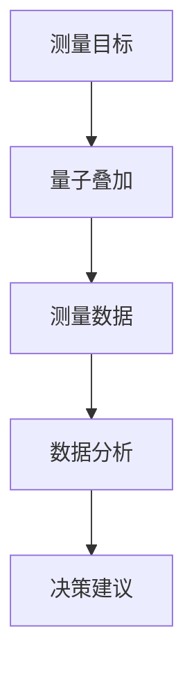
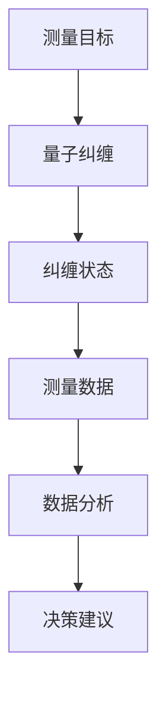

                 


# 如何识别企业的量子传感器优势

> 关键词：量子传感器、企业优势识别、量子技术、传感器原理、算法原理、系统架构

> 摘要：量子传感器作为一种新兴技术，正在改变企业数据采集和分析的方式。本文将从基础概念、核心原理、算法实现、系统架构、项目实战等多方面，详细阐述如何识别和利用量子传感器为企业带来的优势。通过理论分析和实际案例，本文将帮助读者深入了解量子传感器的应用价值和实现方法。

---

# 第一部分: 量子传感器基础与企业应用背景

## 第1章: 量子传感器概述

### 1.1 量子传感器的基本概念

#### 1.1.1 量子传感器的定义
量子传感器是一种基于量子力学原理设计的测量装置，能够以极高的精度感知物理量（如位置、速度、加速度、磁场等）。与传统传感器不同，量子传感器利用量子叠加和纠缠等特性，能够在更复杂和精确的条件下进行测量。

#### 1.1.2 量子传感器的核心原理
量子传感器的核心原理基于量子力学的基本原理，包括：
- **量子叠加**：量子系统可以同时处于多个状态，这使得量子传感器能够在多个测量点同时进行数据采集。
- **量子纠缠**：两个或多个量子系统之间可以形成纠缠状态，使得传感器能够对复杂环境进行更精确的测量。

#### 1.1.3 量子传感器与传统传感器的对比
| 特性               | 量子传感器             | 传统传感器           |
|--------------------|------------------------|----------------------|
| 测量精度           | 极高                   | 较低                 |
| 响应速度           | 快                     | 较慢                 |
| 多参数测量能力     | 强                     | 弱                   |
| 环境适应性         | 适应复杂环境           | 适应性有限           |

### 1.2 量子传感器的发展背景

#### 1.2.1 量子技术的演进历程
量子技术的发展始于20世纪初，随着量子力学理论的建立，科学家们开始探索如何利用量子特性进行更精确的测量。近年来，随着量子计算和量子通信技术的快速发展，量子传感器也逐渐成熟。

#### 1.2.2 传感器技术的革新趋势
传感器技术的革新趋势主要体现在以下几个方面：
1. **高精度测量**：量子传感器能够实现比传统传感器更高的测量精度。
2. **多参数测量**：量子传感器可以同时测量多个物理量，提高数据采集的全面性。
3. **智能化**：通过结合人工智能技术，量子传感器能够实现自适应测量和智能决策。

#### 1.2.3 量子传感器在企业中的应用前景
随着量子技术的不断进步，量子传感器在企业中的应用前景广阔，尤其是在制造业、医疗、通信等领域。

### 1.3 量子传感器在企业中的优势

#### 1.3.1 提高测量精度
量子传感器的高精度测量能力能够帮助企业更准确地获取数据，从而提高生产效率和产品质量。

#### 1.3.2 增强数据采集能力
量子传感器能够同时测量多个物理量，大大提高了数据采集的全面性。

#### 1.3.3 优化企业决策过程
通过高精度和全面的数据采集，企业能够做出更科学的决策，从而优化业务流程和战略规划。

## 第2章: 量子传感器的核心概念与联系

### 2.1 量子传感器的核心原理

#### 2.1.1 量子力学基础
量子力学是量子传感器的核心理论基础，主要包括以下几个方面：
- **波粒二象性**：量子系统可以同时表现出波动性和粒子性。
- **测不准原理**：对某些物理量的测量存在固有不确定性。
- **量子叠加和纠缠**：量子系统可以同时处于多个状态，并且可以通过纠缠实现信息的快速传递。

#### 2.1.2 量子传感器的测量机制
量子传感器的测量机制基于量子纠缠和量子叠加原理。通过将量子系统与被测环境相互作用，传感器可以提取环境中的物理信息。

#### 2.1.3 量子传感器的信号处理流程
1. **信号采集**：量子传感器采集环境中的物理信号。
2. **量子处理**：通过量子计算对信号进行处理。
3. **结果输出**：输出测量结果。

### 2.2 量子传感器的概念属性特征对比

| 特性               | 量子传感器             | 传统传感器           |
|--------------------|------------------------|----------------------|
| 测量精度           | 极高                   | 较低                 |
| 响应速度           | 快                     | 较慢                 |
| 多参数测量能力     | 强                     | 弱                   |
| 环境适应性         | 适应复杂环境           | 适应性有限           |

### 2.3 量子传感器的ER实体关系图

```mermaid
erDiagram
    actor 企业用户 {
        string 企业需求
        string 测量目标
    }
    sensor 量子传感器 {
        string 测量数据
        string 传感器状态
    }
    process 数据处理系统 {
        string 数据分析结果
        string 决策建议
    }
    enterprise 企业系统 {
        string 企业目标
        string 优化方案
    }
    actor --> sensor: 提供测量目标
    sensor --> process: 传输测量数据
    process --> enterprise: 提供优化方案
```

## 第3章: 量子传感器的算法原理

### 3.1 量子传感器的数据处理算法

#### 3.1.1 量子叠加算法
量子叠加算法是量子传感器的核心算法之一。其基本思想是利用量子叠加原理，将多个测量任务同时进行处理。



#### 3.1.2 量子纠缠算法
量子纠缠算法是另一种重要的量子传感器算法，其核心思想是利用量子纠缠特性，实现信息的快速传递和处理。



#### 3.1.3 量子传感器的数学模型
量子传感器的数学模型可以表示为：
$$ \psi = \alpha|0\rangle + \beta|1\rangle $$
其中，$\alpha$ 和 $\beta$ 是量子态的系数，$|0\rangle$ 和 $|1\rangle$ 是基态。

通过测量，可以得到量子态的概率分布：
$$ P(0) = |\alpha|^2 $$
$$ P(1) = |\beta|^2 $$

---

# 总结

通过以上分析，我们可以看到量子传感器作为一种新兴技术，正在为企业带来前所未有的优势。从高精度测量到多参数采集，再到智能化决策，量子传感器的应用前景广阔。未来，随着量子技术的不断发展，量子传感器将在更多领域发挥重要作用，帮助企业实现更高效、更智能的运营。

