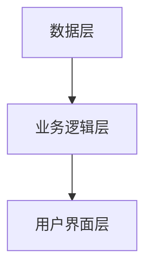

                 


# 如何识别企业的量子传感器应用优势

> 关键词：量子传感器，企业应用，技术优势，核心能力，创新应用，竞争力提升

> 摘要：本文将详细探讨如何识别企业的量子传感器应用优势，从量子传感器的基本概念、核心原理到其在企业中的应用场景，再到如何通过系统架构设计和项目实战提升企业的竞争力。通过本文的分析，企业可以更好地理解量子传感器的优势，并制定有效的策略来提升自身的创新能力。

---

## 第1章: 量子传感器的基本概念与应用背景

### 1.1 量子传感器的定义与基本原理

#### 1.1.1 量子传感器的定义

量子传感器是一种基于量子力学原理设计的传感器，能够利用量子系统的特性（如量子叠加和量子纠缠）来实现高精度的测量。与传统传感器相比，量子传感器在灵敏度、分辨率和抗干扰能力方面具有显著优势。

$$
\text{量子传感器的定义：一种基于量子力学原理的测量装置，能够检测和分析量子系统的变化。}
$$

#### 1.1.2 量子传感器的基本原理

量子传感器的核心原理在于利用量子系统的独特性质。例如，量子叠加原理允许系统同时处于多个状态，而量子纠缠则允许两个或多个系统之间产生强关联。这些特性使得量子传感器能够检测到传统传感器无法察觉的微小变化。

$$
\text{量子叠加原理：} \quad |\psi\rangle = \alpha|0\rangle + \beta|1\rangle, \quad |\alpha|^2 + |\beta|^2 = 1
$$

$$
\text{量子纠缠原理：} \quad | \psi \rangle = \frac{1}{\sqrt{2}}(|0\rangle|1\rangle + |1\rangle|0\rangle)
$$

#### 1.1.3 量子传感器的核心技术特点

| 特性                | 描述                                                         |
|---------------------|--------------------------------------------------------------|
| 高灵敏度           | 能够检测极小的信号变化，适用于高精度测量                   |
| 抗干扰能力强       | 通过量子纠缠等特性，减少外界干扰对测量结果的影响           |
| 实时监测能力       | 可以实时采集和分析数据，适用于动态环境的监测                 |
| 多参数测量         | 可以同时测量多个参数，提高测量效率                         |

---

### 1.2 量子传感器的发展历程

#### 1.2.1 量子传感器的历史演变

量子传感器的发展经历了从理论研究到实际应用的漫长过程。早期的研究主要集中在量子力学的基本原理上，随后逐渐向实际应用方向发展。近年来，随着量子计算和量子通信技术的进步，量子传感器的技术也取得了显著突破。

#### 1.2.2 当前量子传感器的技术现状

当前，量子传感器技术已进入快速发展阶段，其在精密测量、通信、医疗等领域展现出广泛的应用前景。例如，基于量子纠缠的重力传感器已经在航空领域得到应用，显著提高了导航精度。

#### 1.2.3 量子传感器的未来发展趋势

未来，量子传感器将朝着更小型化、更智能化和更广泛应用的方向发展。随着技术的进步，量子传感器的成本将进一步降低，性能将更加稳定，应用领域也将进一步拓展。

---

### 1.3 量子传感器在企业中的应用背景

#### 1.3.1 企业应用量子传感器的背景分析

随着科技的进步，企业对高精度测量和实时监测的需求日益增加。传统传感器在某些领域已经难以满足企业的需求，而量子传感器凭借其独特的优势，成为企业的理想选择。

#### 1.3.2 量子传感器在企业中的潜在应用场景

量子传感器在企业中的应用场景包括：

1. **制造业**：用于高精度零件的检测和质量控制。
2. **医疗行业**：用于医疗设备的高精度测量。
3. **通信领域**：用于量子通信网络的建设和维护。
4. **能源行业**：用于地球资源勘探和环境监测。

#### 1.3.3 量子传感器对企业竞争优势的影响

通过引入量子传感器，企业可以显著提升其产品的性能和质量，降低生产成本，提高市场竞争力。此外，量子传感器的应用还可以帮助企业实现智能化生产，提高生产效率。

---

## 第2章: 量子传感器的核心概念与理论基础

### 2.1 量子传感器的核心概念

#### 2.1.1 量子传感器的物理基础

量子传感器的物理基础主要基于量子力学的基本原理，包括量子叠加、量子纠缠和量子测量。这些原理使得量子传感器能够实现高精度的测量。

$$
\text{量子叠加：} \quad |\psi\rangle = \alpha|0\rangle + \beta|1\rangle
$$

$$
\text{量子纠缠：} \quad | \psi \rangle = \frac{1}{\sqrt{2}}(|0\rangle|1\rangle + |1\rangle|0\rangle)
$$

#### 2.1.2 量子传感器的测量原理

量子传感器通过测量量子系统的状态变化来实现对外部环境的感知。常见的测量方法包括干涉测量和磁场测量。

$$
\text{干涉测量原理：} \quad |\psi\rangle = \frac{1}{\sqrt{2}}(|0\rangle|1\rangle + |1\rangle|0\rangle)
$$

#### 2.1.3 量子传感器的性能指标

| 性能指标   | 描述               |
|------------|--------------------|
| 灵敏度     | 测量最小变化的能力   |
| 分辨率     | 区分相邻值的能力     |
| 抗干扰性   | 抵抗外界干扰的能力   |
| 响应时间   | 从输入到输出的时间   |

---

### 2.2 量子传感器与经典传感器的对比

#### 2.2.1 传感器的基本概念与分类

传感器是一种能够检测特定信号并将其转换为可测量信号的装置。传感器可以分为经典传感器和量子传感器两大类。

#### 2.2.2 量子传感器与经典传感器的对比分析

| 对比维度   | 经典传感器                     | 量子传感器                     |
|------------|-------------------------------|-------------------------------|
| 灵敏度     | 较低                          | 高                             |
| 抗干扰性   | 较差                          | 强                             |
| 实时监测   | 有限                          | 高                             |
| 应用领域   | 工业、医疗等                  | 通信、量子计算等               |

#### 2.2.3 量子传感器的独特优势

1. **高灵敏度**：能够检测到极小的变化。
2. **抗干扰能力强**：能够有效减少外界干扰对测量结果的影响。
3. **实时监测能力**：能够实时采集和分析数据。

---

### 2.3 量子传感器的数学模型与公式

#### 2.3.1 量子传感器的测量模型

量子传感器的测量模型可以通过量子力学的基本方程来描述。例如，量子态的叠加和纠缠状态可以用以下公式表示：

$$
|\psi\rangle = \alpha|0\rangle + \beta|1\rangle
$$

$$
| \psi \rangle = \frac{1}{\sqrt{2}}(|0\rangle|1\rangle + |1\rangle|0\rangle)
$$

#### 2.3.2 量子传感器的信号处理公式

量子传感器的信号处理公式通常涉及量子态的测量和转换。例如，测量量子态的叠加系数可以通过以下步骤实现：

1. **初始化量子态**：$|\psi\rangle = \alpha|0\rangle + \beta|1\rangle$
2. **测量量子态**：通过测量获得$\alpha$和$\beta$的值。
3. **信号转换**：将测量结果转换为可读的信号。

---

## 第3章: 量子传感器的算法原理与实现

### 3.1 量子传感器的信号处理算法

#### 3.1.1 量子传感器的数据采集与预处理

量子传感器的数据采集通常涉及量子态的测量和预处理。预处理步骤包括去除噪声和校准。

#### 3.1.2 量子传感器的信号分析方法

量子传感器的信号分析方法主要包括量子态的重建和参数估计。这些方法可以通过量子力学的基本方程来实现。

#### 3.1.3 量子传感器的噪声消除算法

量子传感器的噪声消除算法可以通过量子纠错码和量子滤波器来实现。这些算法能够有效减少外界干扰对测量结果的影响。

---

### 3.2 量子传感器的测量精度优化

#### 3.2.1 量子传感器的测量精度影响因素

量子传感器的测量精度受多种因素影响，包括量子态的稳定性、测量设备的精度和外界环境的干扰。

#### 3.2.2 量子传感器的误差校正算法

通过量子纠错码和量子滤波器，可以有效校正测量过程中的误差，提高测量精度。

#### 3.2.3 量子传感器的精度优化策略

1. **优化量子态的稳定性**：通过改进量子系统的稳定性来提高测量精度。
2. **减少外界干扰**：通过改进测量环境和设备来减少干扰。
3. **提高测量设备的精度**：通过升级设备和算法来提高测量精度。

---

### 3.3 量子传感器的算法实现

#### 3.3.1 量子传感器算法的实现步骤

1. **初始化量子态**：$|\psi\rangle = \alpha|0\rangle + \beta|1\rangle$
2. **测量量子态**：通过测量获得$\alpha$和$\beta$的值。
3. **信号转换**：将测量结果转换为可读的信号。

#### 3.3.2 量子传感器算法的Python实现

```python
import numpy as np

def initialize_qubit():
    alpha = np.sqrt(0.5)
    beta = np.sqrt(0.5)
    return alpha, beta

def measure_qubit(alpha, beta):
    # 模拟量子态的测量
    result = np.random.choice([0, 1], p=[alpha**2, beta**2])
    return result

alpha, beta = initialize_qubit()
measurement = measure_qubit(alpha, beta)
print(f"测量结果为：{measurement}")
```

#### 3.3.3 量子传感器算法的优化与改进

通过不断优化算法和改进测量设备，可以进一步提高量子传感器的测量精度和效率。

---

## 第4章: 量子传感器的系统架构与设计

### 4.1 量子传感器系统的整体架构

#### 4.1.1 量子传感器系统的组成模块

量子传感器系统通常包括以下几个模块：

1. **数据采集模块**：负责采集量子态的数据。
2. **信号处理模块**：负责对数据进行预处理和分析。
3. **测量控制模块**：负责控制测量过程。
4. **用户界面模块**：负责与用户的交互。

#### 4.1.2 量子传感器系统的功能划分

量子传感器系统的功能划分为数据采集、信号处理、测量控制和用户界面四个部分。

#### 4.1.3 量子传感器系统的架构设计

量子传感器系统的架构设计可以采用分层架构，包括数据层、业务逻辑层和用户界面层。

---

### 4.2 量子传感器系统的功能设计

#### 4.2.1 问题场景介绍

量子传感器系统的功能设计需要考虑其应用场景和用户需求。例如，在制造业中，量子传感器需要能够实时监测生产过程中的关键参数。

#### 4.2.2 项目介绍

以制造业中的零件质量检测为例，设计一个基于量子传感器的高精度检测系统。

#### 4.2.3 系统功能设计

系统功能设计包括：

1. **数据采集**：实时采集生产过程中的关键参数。
2. **数据处理**：对采集的数据进行分析和处理。
3. **质量控制**：根据分析结果进行质量判断。
4. **报警系统**：当检测到异常时，触发报警。

---

### 4.3 量子传感器系统的架构设计

#### 4.3.1 系统架构设计

量子传感器系统的架构设计可以采用分层架构，包括数据层、业务逻辑层和用户界面层。

#### 4.3.2 系统架构图



---

### 4.4 量子传感器系统的接口设计

#### 4.4.1 系统接口设计

量子传感器系统的接口设计需要考虑其与外部设备和其他系统的交互。例如，与生产设备的接口设计。

#### 4.4.2 系统交互设计

量子传感器系统的交互流程如下：

1. **用户输入**：用户输入检测参数。
2. **数据采集**：系统采集数据。
3. **数据处理**：系统分析数据。
4. **结果反馈**：系统反馈检测结果。

---

## 第5章: 量子传感器的项目实战

### 5.1 项目背景与目标

#### 5.1.1 项目背景

以制造业中的零件质量检测为例，设计一个基于量子传感器的高精度检测系统。

#### 5.1.2 项目目标

实现对生产过程中关键参数的实时监测和高精度检测。

---

### 5.2 项目环境的安装与配置

#### 5.2.1 安装Python环境

需要安装Python 3.8及以上版本，并安装必要的库，如numpy和qiskit。

---

### 5.3 项目核心代码的实现

#### 5.3.1 核心代码实现

```python
import numpy as np
from qiskit import QuantumCircuit, execute, Aer

def initialize_qubit():
    alpha = np.sqrt(0.5)
    beta = np.sqrt(0.5)
    return alpha, beta

def measure_qubit(alpha, beta):
    result = np.random.choice([0, 1], p=[alpha**2, beta**2])
    return result

alpha, beta = initialize_qubit()
measurement = measure_qubit(alpha, beta)
print(f"测量结果为：{measurement}")
```

---

### 5.4 项目运行与结果分析

#### 5.4.1 项目运行结果

运行上述代码，可以得到量子传感器的测量结果。

#### 5.4.2 数据分析与优化

根据测量结果，分析系统的性能，并进行优化。

---

### 5.5 项目经验总结

通过本项目的实施，我们了解了量子传感器在实际应用中的优势和挑战，并总结了一些宝贵的经验。

---

## 第6章: 量子传感器应用的最佳实践

### 6.1 应用小结

量子传感器在企业中的应用优势显著，能够帮助企业提升生产效率和产品质量。

### 6.2 应用中的注意事项

企业在应用量子传感器时，需要注意技术可行性、成本效益和数据安全等问题。

### 6.3 拓展阅读与深入学习

推荐阅读《量子计算与量子传感器》和《量子传感器技术与应用》等书籍，以进一步深入学习量子传感器的知识。

---

## 第7章: 量子传感器的未来展望

### 7.1 量子传感器的未来发展方向

量子传感器的未来发展方向包括更小型化、更智能化和更广泛应用。

### 7.2 量子传感器对企业竞争力的长期影响

量子传感器的应用将对企业的长期竞争力产生深远影响，成为企业技术创新的重要驱动力。

### 7.3 结语

通过本文的分析，我们了解了量子传感器的应用优势，并为企业识别和应用量子传感器提供了有价值的指导。

---

## 附录: 量子传感器相关资源

### 附录A: 量子传感器的数学公式汇总

$$
\text{量子叠加：} \quad |\psi\rangle = \alpha|0\rangle + \beta|1\rangle
$$

$$
\text{量子纠缠：} \quad | \psi \rangle = \frac{1}{\sqrt{2}}(|0\rangle|1\rangle + |1\rangle|0\rangle)
$$

### 附录B: 量子传感器的Python代码示例

```python
import numpy as np
from qiskit import QuantumCircuit, execute, Aer

def initialize_qubit():
    alpha = np.sqrt(0.5)
    beta = np.sqrt(0.5)
    return alpha, beta

def measure_qubit(alpha, beta):
    result = np.random.choice([0, 1], p=[alpha**2, beta**2])
    return result

alpha, beta = initialize_qubit()
measurement = measure_qubit(alpha, beta)
print(f"测量结果为：{measurement}")
```

---

通过以上详细的内容，企业可以更好地识别量子传感器的应用优势，并在实际应用中发挥其潜力。希望本文能为企业提供有价值的指导和启示。

