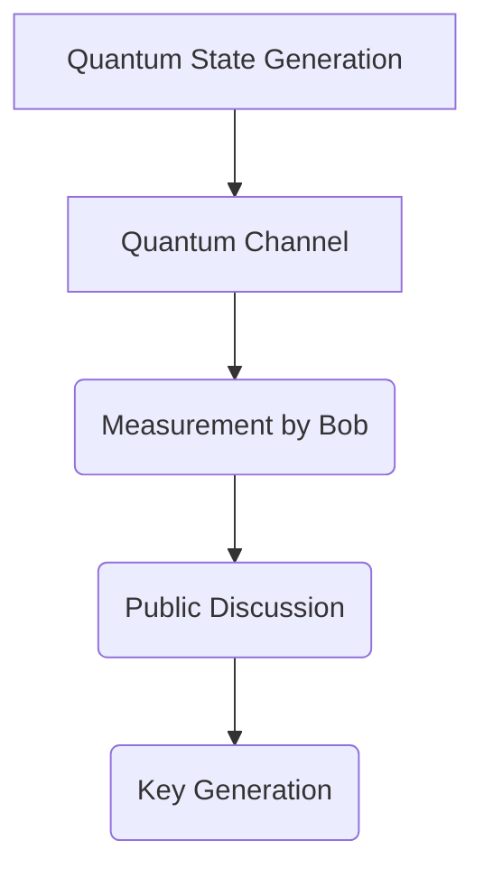
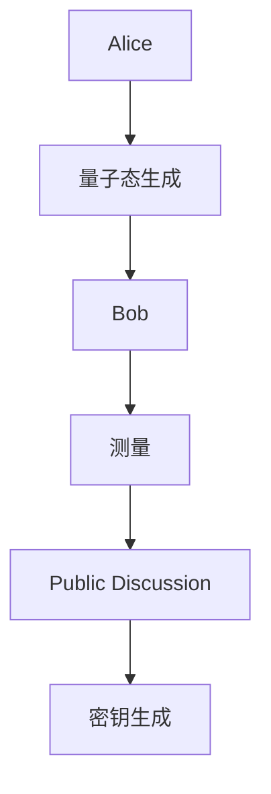
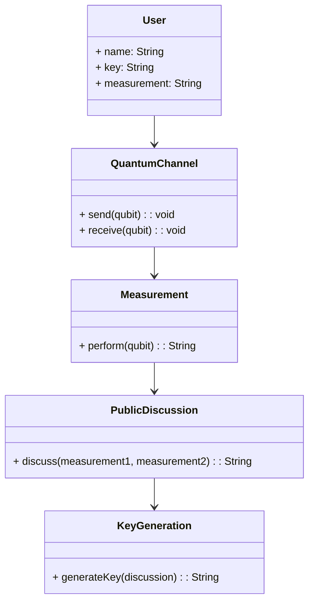
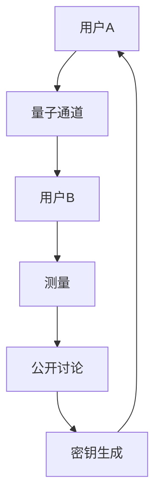

                 


---

# 如何识别企业的量子密码学优势

> 关键词：量子密码学、企业安全、量子计算、信息安全、密码学算法

> 摘要：本文深入探讨了量子密码学的基本原理、核心算法及其在企业安全中的应用。通过分析量子密码学的优势，结合实际案例，帮助企业在信息安全领域识别和利用量子密码学的技术优势。

---

## 第1章: 量子密码学的背景与概念

### 1.1 量子密码学的基本概念

#### 1.1.1 量子密码学的定义
量子密码学是结合了量子力学和密码学的新兴领域，旨在利用量子计算的特性来实现更强大的加密技术。其核心在于利用量子叠加和纠缠的特性，构建不可破解的加密系统。

#### 1.1.2 量子密码学的核心原理
量子密码学的主要原理包括：
1. **量子叠加**：量子信息可以同时处于多个状态，这种特性为加密提供了更高的安全性。
2. **量子纠缠**：两个或多个量子系统之间存在纠缠关系，任何对其中一个系统的测量都会影响另一个系统，这为密钥分发提供了安全保障。
3. **不可克隆性**：量子信息无法被完全复制，这使得量子密码学在面对潜在攻击时更具优势。

#### 1.1.3 量子密码学与传统密码学的对比

| 对比维度 | 传统密码学 | 量子密码学 |
|----------|------------|------------|
| 加密算法 | 基于数学模型 | 基于量子力学原理 |
| 安全性   | 可能被量子计算机破解 | 对抗量子计算机的优势 |
| 应用场景 | 现代信息安全 | 未来的量子时代安全 |

---

### 1.2 量子密码学的历史与发展

#### 1.2.1 量子密码学的起源
量子密码学的起源可以追溯到20世纪80年代，当时研究者提出了量子密钥分发（QKD）的概念，即利用量子力学的特性实现安全的密钥分发。

#### 1.2.2 量子密码学的关键里程碑
1. **BB84协议**：由Bennett和Braunstein提出的量子密钥分发协议，奠定了量子密码学的基础。
2. **EPR协议**：基于爱因斯坦-波多尔斯基-罗森（EPR）悖论的量子密码协议，进一步推动了量子密码学的发展。
3. **实用化应用**：近年来，量子密码学从理论研究逐渐走向实际应用，如量子通信网络的建设。

#### 1.2.3 当前量子密码学的研究热点
1. **量子密钥分发的优化**：如何提高QKD的传输距离和效率。
2. **量子签名技术**：研究如何利用量子力学实现数字签名。
3. **量子密码学的实际应用**：如金融、军事、医疗等领域的量子安全解决方案。

---

### 1.3 量子密码学在企业中的应用前景

#### 1.3.1 企业信息安全的新挑战
随着量子计算技术的快速发展，传统加密算法（如RSA、AES）面临被量子计算机破解的风险，企业信息安全面临前所未有的挑战。

#### 1.3.2 量子密码学为企业带来的优势
1. **抗量子攻击**：量子密码学算法能够抵御量子计算机的攻击，保障企业的核心数据安全。
2. **提高通信安全性**：通过量子密钥分发技术，企业可以实现更安全的通信。
3. **创新性解决方案**：量子密码学为企业提供了差异化竞争的技术优势。

#### 1.3.3 企业采用量子密码学的潜在价值
1. **保护核心数据**：防止因量子计算攻击导致的数据泄露。
2. **提升客户信任**：通过采用先进的量子安全技术，增强客户对企业的信任。
3. **推动技术创新**：量子密码学的应用将推动企业技术架构的升级。

---

## 第2章: 量子密码学的核心概念与原理

### 2.1 量子密钥分发（QKD）原理

#### 2.1.1 QKD的基本原理
量子密钥分发是通过量子通信技术，在两个用户之间安全地分发密钥。其基本步骤包括：
1. **量子态的发送**：一方（Alice）向另一方（Bob）发送随机的量子态。
2. **基的选择**：Alice和Bob各自随机选择测量基，并记录测量结果。
3. **密钥提取**：通过公开讨论选择相同的测量基，并利用测量结果生成密钥。

#### 2.1.2 QKD的实现步骤



#### 2.1.3 QKD的安全性分析
QKD的安全性基于量子力学的基本原理，任何窃听行为都会破坏量子态，从而被Alice和Bob检测到。

---

### 2.2 量子签名与认证

#### 2.2.1 量子签名的定义
量子签名是一种基于量子力学的签名技术，能够确保签名的真实性和不可否认性。

#### 2.2.2 量子签名的实现方法
量子签名的实现通常包括量子态的生成、签名的附加和验证。

#### 2.2.3 量子签名的安全性
量子签名的安全性依赖于量子态的不可克隆性和测量破坏性。

---

### 2.3 量子密码学的核心算法

#### 2.3.1 BB84协议
BB84协议是最早的量子密钥分发协议，其流程如下：



#### 2.3.2 EPR协议
EPR协议基于EPR纠缠态，通过纠缠态的分发实现密钥分发。

#### 2.3.3 其他量子密码协议
包括基于量子隐形传态的密码协议等。

---

### 2.4 核心概念对比表格

| 对比维度 | 传统密码学 | 量子密码学 |
|----------|------------|------------|
| 抗攻击性 | 易受量子攻击 | 抗量子攻击 |
| 密钥分发 | 基于经典通信 | 基于量子通信 |
| 安全性   | 可能被破解 | 极高安全性 |

---

### 2.5 ER实体关系图

```mermaid
erDiagram
    User[Alice] <---o-- Role[密钥生成]
    Role <---o-- Key[密钥]
    User -->o-- QuantumChannel[量子通道]
    QuantumChannel -->o-- Measurement[测量结果]
    Measurement <---o-- PublicDiscussion[公开讨论]
    PublicDiscussion -->o-- KeyGeneration[密钥生成]
```

---

## 第3章: 量子密码学的算法原理与数学模型

### 3.1 量子密钥分发的数学模型

#### 3.1.1 量子态的数学表示
量子态可以用向量空间中的向量表示，例如：
$$
|0\rangle = \begin{bmatrix} 1 \\ 0 \end{bmatrix}, \quad |1\rangle = \begin{bmatrix} 0 \\ 1 \end{bmatrix}
$$

#### 3.1.2 量子测量的数学模型
量子测量可以用投影算符表示，例如：
$$
E_0 = |0\rangle\langle 0|, \quad E_1 = |1\rangle\langle 1|
$$

#### 3.1.3 量子纠缠态的数学表达
纠缠态可以表示为：
$$
|\Psi\rangle = \frac{1}{\sqrt{2}}(|0\rangle|1\rangle + |1\rangle|0\rangle)
$$

---

### 3.2 量子密码学中的关键公式

#### 3.2.1 量子态叠加原理
$$
| \psi \rangle = \alpha|0\rangle + \beta|1\rangle
$$

#### 3.2.2 量子纠缠态的张量积表示
$$
| \Psi \rangle = \frac{1}{\sqrt{2}}(|0\rangle \otimes |1\rangle + |1\rangle \otimes |0\rangle)
$$

#### 3.2.3 量子密钥分发的数学推导
$$
\text{密钥生成} = \text{公开讨论} \cap \text{测量结果}
$$

---

## 第4章: 量子密码学的系统架构与设计

### 4.1 量子密码学系统的应用场景

#### 4.1.1 企业内部通信
通过量子密钥分发技术实现企业内部通信的安全加密。

#### 4.1.2 金融交易安全
在金融领域，量子密码学可以用于保护敏感的交易数据。

#### 4.1.3 医疗数据加密
医疗数据的隐私保护可以通过量子密码学技术实现。

---

### 4.2 系统功能设计

#### 4.2.1 领域模型类图



---

### 4.3 系统架构设计

#### 4.3.1 系统架构图



---

### 4.4 系统接口设计

#### 4.4.1 接口定义
1. `quantumSend(qubit)`：量子态的发送接口。
2. `quantumReceive(qubit)`：量子态的接收接口。
3. `measurement(qubit)`：量子测量接口。
4. `publicDiscuss(measurement1, measurement2)`：公开讨论接口。
5. `keyGenerate(discussion)`：密钥生成接口。

---

## 第5章: 量子密码学的项目实战

### 5.1 项目环境安装

```bash
pip install qiskit
pip install qkd
pip install python-mermaid
```

---

### 5.2 核心代码实现

#### 5.2.1 量子密钥分发的Python代码

```python
import random

def generate_basis():
    return random.choice(['z', 'x'])

def send_qubit(basis):
    if basis == 'z':
        return random.choice([0, 1])
    elif basis == 'x':
        return random.choice([0, 1])

def measure_qubit(qubit, basis):
    if basis == 'z':
        return qubit
    elif basis == 'x':
        return qubit ^ 1

# 实现QKD协议
def qkd_protocol():
    alice_basis = generate_basis()
    alice_qubit = send_qubit(alice_basis)
    bob_basis = generate_basis()
    bob_qubit = measure_qubit(alice_qubit, bob_basis)
    # 公开讨论
    if alice_basis == bob_basis:
        return alice_qubit
    else:
        return None

# 生成密钥
key = []
for _ in range(100):
    bit = qkd_protocol()
    if bit is not None:
        key.append(bit)
return ''.join(map(str, key))
```

---

### 5.3 代码功能解读与分析

1. **生成基础**：随机选择测量基。
2. **发送量子态**：根据选择的基生成量子态。
3. **测量量子态**：根据选择的基进行测量。
4. **公开讨论**：比较测量基，决定是否保留测量结果。
5. **密钥生成**：保留相同的测量基的结果，生成密钥。

---

## 第6章: 量子密码学的未来展望与最佳实践

### 6.1 量子密码学的优势总结
1. **抗量子攻击**：量子密码学能够抵御量子计算机的攻击。
2. **高安全性**：基于量子力学原理的安全性保证。
3. **技术创新**：推动企业技术架构的升级。

### 6.2 量子密码学的注意事项
1. **技术成熟度**：当前量子密码学仍处于发展阶段，实际应用需要谨慎评估。
2. **成本问题**：量子密码学的实现成本较高，企业需权衡成本与收益。
3. **标准制定**：需要统一的量子密码学标准，以确保不同系统之间的兼容性。

### 6.3 量子密码学的未来趋势
1. **标准化进程**：推动量子密码学标准的制定和推广。
2. **应用场景扩展**：进一步拓展量子密码学在各行业的应用。
3. **技术融合**：将量子密码学与其他先进技术（如人工智能）相结合，提升整体安全性。

---

## 总结

通过本文的详细分析，我们可以看到量子密码学为企业提供了强大的信息安全保障。企业可以通过识别和利用量子密码学的优势，构建更安全的信息系统，应对未来量子计算时代的挑战。同时，随着技术的不断发展，量子密码学的应用前景将更加广阔。

---

**注意**：本文内容仅用于技术研究和学习，不构成实际的投资或技术建议。

