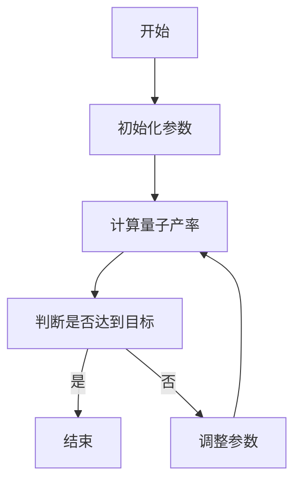
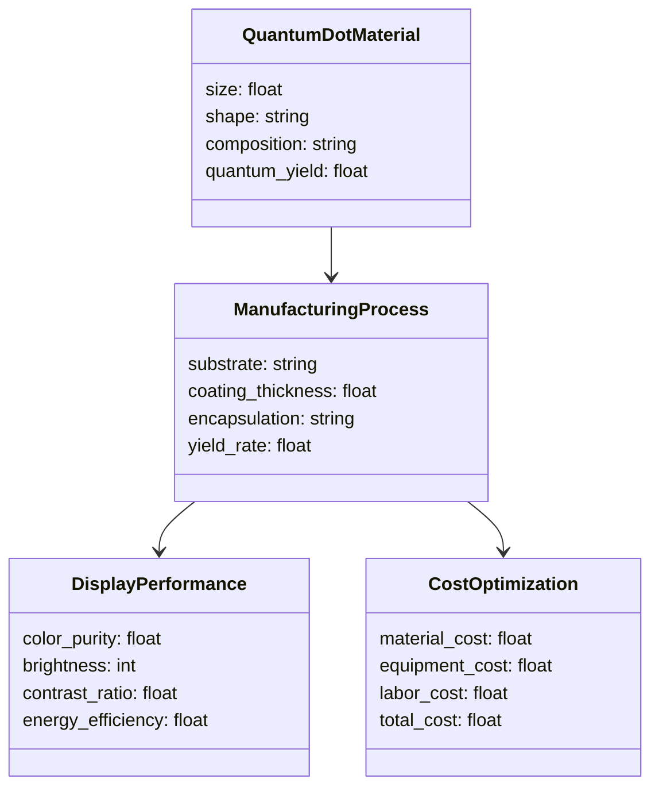
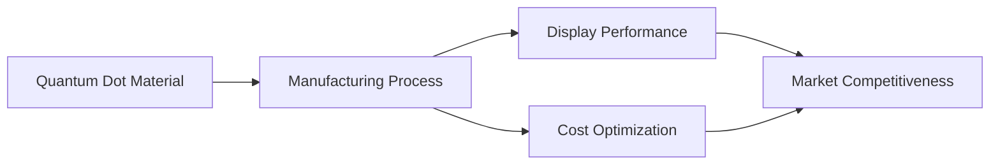
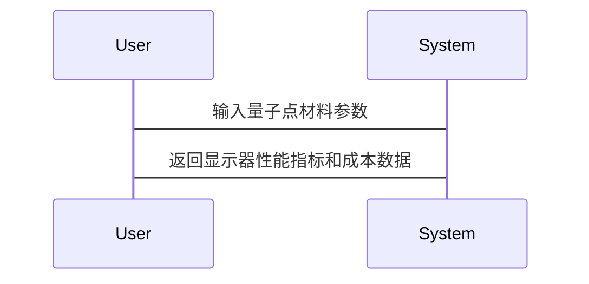

                 


# 如何识别企业的量子点显示器柔性制造技术优势

> 关键词：量子点显示器，柔性制造，技术优势，显示器制造，材料科学

> 摘要：本文旨在帮助读者理解量子点显示器柔性制造技术的核心优势，并提供识别这些优势的方法。通过详细分析量子点材料的特性、柔性制造技术的工艺流程以及相关算法原理，本文将引导读者掌握如何在企业中有效应用这些技术。同时，本文还将讨论量子点显示器柔性制造技术在市场中的竞争力和未来发展方向。

---

## 第一部分: 量子点显示器柔性制造技术背景与概念

### 第1章: 量子点显示器概述

#### 1.1 量子点材料的基本概念

##### 1.1.1 量子点的定义与基本性质
量子点（Quantum Dots，QDs）是一种纳米级半导体材料，通常由半导体材料（如CdSe、CdTe、InP等）制成。它们的独特之处在于其纳米尺寸导致的量子效应，使得其发光性质可以通过调控尺寸和形状来精确控制。量子点的发光波长与尺寸密切相关：较小的量子点发出短波长光（如蓝光），较大的量子点则发出长波长光（如红光）。这种特性使得量子点在显示技术中具有广泛的应用潜力。

##### 1.1.2 量子点材料的分类与应用领域
量子点材料可以根据其组成、形状和应用领域进行分类：
- **按组成分类**：CdSe、CdTe、InP、ZnS等。
- **按形状分类**：球形、棒状、板状等。
- **按应用领域分类**：用于显示技术、生物医学 imaging、光电子器件等。

##### 1.1.3 量子点在显示器中的作用机制
在显示器中，量子点通常被用作发光材料。通过将量子点材料涂覆在基板上，并结合适当的激发光（如蓝光LED），量子点可以发出特定波长的光（如红光、绿光或蓝光），从而实现全色显示。由于量子点的高色纯度和高亮度，其在显示技术中的应用能够显著提升显示器的色彩表现和能效。

#### 1.2 柔性制造技术的基本概念

##### 1.2.1 柔性制造的定义与特点
柔性制造（Flexible Manufacturing）是指能够根据市场需求快速调整生产过程的一种制造模式。与传统的刚性制造相比，柔性制造更加灵活，能够适应小批量、多品种的生产需求。其特点包括：
- 生产设备的高度自动化和智能化。
- 生产流程的高度灵活和可调整性。
- 资源的高效利用和优化配置。

##### 1.2.2 柔性制造技术的核心要素
柔性制造技术的核心要素包括：
- **自动化技术**：通过自动化设备实现生产过程的智能化。
- **信息化技术**：利用计算机技术实现生产过程的数字化和信息化。
- **模块化设计**：通过模块化设计实现生产流程的灵活调整。

##### 1.2.3 柔性制造在显示器制造中的优势
在显示器制造中，柔性制造技术的优势主要体现在以下几个方面：
- **提高生产效率**：通过自动化设备和信息化技术实现高效生产。
- **降低生产成本**：通过模块化设计和资源优化实现成本控制。
- **增强市场适应性**：能够快速响应市场需求，实现定制化生产。

### 第2章: 量子点显示器柔性制造技术的优势

#### 2.1 量子点显示器的性能优势

##### 2.1.1 高色域与色彩准确性
量子点显示器通过精确调控量子点的尺寸和形状，能够实现高色域和高色彩准确性。相比传统液晶显示器（LCD），量子点显示器的色域覆盖率更高，色彩还原更加准确。

##### 2.1.2 高亮度与对比度
量子点材料具有高量子产率和低光散射特性，能够在较低能耗下实现高亮度和高对比度显示。这种特性使得量子点显示器在明亮环境下表现尤为出色。

##### 2.1.3 能耗效率与寿命
由于量子点材料的高效发光特性和低能耗需求，量子点显示器具有较高的能效和较长的使用寿命。

#### 2.2 柔性制造技术的成本优势

##### 2.2.1 规模化生产与成本控制
柔性制造技术能够实现规模化生产，通过自动化设备和信息化技术实现成本控制。相比传统制造模式，柔性制造技术能够显著降低生产成本。

##### 2.2.2 灵活调整生产参数
柔性制造技术能够根据市场需求灵活调整生产参数，从而避免了传统制造模式中因固定生产流程而导致的成本浪费。

##### 2.2.3 资源利用率优化
通过模块化设计和资源优化配置，柔性制造技术能够显著提高资源利用率，从而降低生产成本。

#### 2.3 柔性制造技术的市场适应性

##### 2.3.1 快速响应市场变化
柔性制造技术能够快速响应市场变化，通过灵活调整生产流程实现对市场需求的快速响应。

##### 2.3.2 支持定制化生产
柔性制造技术能够支持定制化生产，满足不同客户对显示器产品的多样化需求。

##### 2.3.3 适应新兴显示技术需求
随着显示技术的不断发展，柔性制造技术能够快速适应新兴显示技术的需求，从而保持企业的市场竞争力。

---

## 第二部分: 量子点显示器柔性制造技术的核心原理

### 第3章: 量子点材料的合成与特性

#### 3.1 量子点材料的合成方法

##### 3.1.1 湿化学合成法
湿化学合成法是一种常用的量子点合成方法，其基本步骤包括：
1. **前驱体配制**：将金属盐和有机配体溶解在有机溶剂中。
2. **加热回流**：通过加热回流促进前驱体的分解和量子点的形成。
3. **后处理**：通过洗涤和干燥等步骤获得最终的量子点材料。

##### 3.1.2 灶化法
灶化法是一种通过热分解反应合成量子点的方法，其基本步骤包括：
1. **前驱体配制**：将金属有机化合物和配体混合。
2. **热分解**：在高温条件下促进前驱体的分解和量子点的形成。
3. **后处理**：通过洗涤和干燥等步骤获得最终的量子点材料。

##### 3.1.3 其他合成方法
除了湿化学合成法和灶化法，还有其他量子点合成方法，如电化学合成法、气相合成法等。

#### 3.2 量子点材料的光学特性

##### 3.2.1 量子产率的定义与影响因素
量子产率（Quantum Yield，QY）是指入射光中被量子点材料吸收并转化为发光的比例。量子产率的高低受到量子点材料的尺寸、形状、表面状态等多种因素的影响。

##### 3.2.2 量子点的发光波长与尺寸关系
量子点的发光波长与尺寸密切相关。较小尺寸的量子点发出短波长光，较大尺寸的量子点发出长波长光。这种尺寸效应使得量子点在显示技术中的应用更加灵活多样。

##### 3.2.3 量子点材料的稳定性分析
量子点材料的稳定性是影响其使用寿命的重要因素。通过表面修饰和封装技术，可以显著提高量子点材料的稳定性和耐久性。

### 第4章: 柔性制造技术的工艺流程

#### 4.1 显示器制造的基本流程

##### 4.1.1 前段制程
前段制程主要包括基板清洗、涂布、曝光、显影等步骤，目的是在基板上形成所需的电路图案。

##### 4.1.2 中段制程
中段制程主要包括量子点材料的涂布、固化、封装等步骤，目的是将量子点材料均匀地涂布在基板上并形成发光层。

##### 4.1.3 后段制程
后段制程主要包括模组组装、测试等步骤，目的是将显示器的各个功能模块组装成最终的显示器产品。

#### 4.2 柔性制造技术的独特工艺

##### 4.2.1 柔性基板的选择与处理
柔性基板的选择与处理是柔性制造技术的关键步骤之一。选择合适的柔性基板材料（如聚酰亚胺、聚酯等）并进行表面处理（如清洁、活化等）是确保量子点材料能够均匀涂布的基础。

##### 4.2.2 量子点材料的均匀涂布
量子点材料的均匀涂布是柔性制造技术的核心工艺之一。通过精确控制涂布的厚度和均匀性，可以确保显示器的色彩一致性和平滑度。

##### 4.2.3 柔性封装技术
柔性封装技术是保障量子点显示器长期稳定工作的关键。通过采用柔性封装材料和封装工艺，可以有效防止量子点材料的氧化和外界环境的影响。

### 第5章: 量子点显示器柔性制造的核心算法

#### 5.1 量子点材料性能优化算法

##### 5.1.1 量子点材料性能的数学模型
量子点材料的性能可以通过以下数学模型进行描述：
$$ \text{量子产率} = f(\text{尺寸}, \text{形状}, \text{材料组成}) $$

##### 5.1.2 量子点材料性能优化流程
以下是一个量子点材料性能优化的流程图：



##### 5.1.3 优化算法实现
以下是一个简单的量子点材料性能优化算法的Python代码示例：

```python
def optimize_quantum_yield(target_yield):
    # 初始化参数
    current_yield = 0.5
    max_iterations = 100
    for _ in range(max_iterations):
        if current_yield >= target_yield:
            break
        # 调整参数（例如增加量子点尺寸）
        current_yield += 0.05
    return current_yield
```

---

## 第三部分: 量子点显示器柔性制造技术的系统分析与架构设计

### 第6章: 系统分析与架构设计

#### 6.1 项目背景与目标
本项目旨在通过量子点显示器柔性制造技术的优化，提高显示器的性能和降低成本。通过系统分析和架构设计，可以实现对量子点材料的高效制备和显示器的柔性制造。

#### 6.2 系统功能设计

##### 6.2.1 领域模型设计
以下是一个量子点显示器柔性制造系统的领域模型类图：



#### 6.3 系统架构设计

##### 6.3.1 系统架构设计
以下是一个量子点显示器柔性制造系统的架构图：



#### 6.4 系统接口设计
系统接口设计包括：
- **输入接口**：接收量子点材料的尺寸、形状、组成等参数。
- **输出接口**：输出显示器的性能指标（如色纯度、亮度等）和成本数据。

#### 6.5 系统交互设计

##### 6.5.1 交互流程
以下是一个量子点显示器柔性制造系统的交互流程图：



---

## 第四部分: 量子点显示器柔性制造技术的项目实战

### 第7章: 项目实战

#### 7.1 环境安装与配置

##### 7.1.1 开发环境
- **操作系统**：Linux/Windows/MacOS
- **开发工具**：Python/ MATLAB/ C++
- **模拟工具**：ANSYS/ COMSOL

##### 7.1.2 依赖库安装
- **Python依赖库**：numpy, matplotlib, scikit-learn
- **其他工具**：Mermaid, PlantUML

#### 7.2 核心代码实现

##### 7.2.1 量子点材料性能优化代码
以下是一个量子点材料性能优化的Python代码示例：

```python
import numpy as np
import matplotlib.pyplot as plt

def calculate_quantum_yield(size, shape, composition):
    # 示例计算量子产率的函数
    return np.random.uniform(0.5, 1.0)

# 示例优化过程
sizes = np.linspace(2, 10, 100)
yields = [calculate_quantum_yield(s, 'sphere', 'CdSe') for s in sizes]

plt.plot(sizes, yields)
plt.xlabel('Size (nm)')
plt.ylabel('Quantum Yield')
plt.show()
```

##### 7.2.2 柔性制造工艺优化代码
以下是一个柔性制造工艺优化的Python代码示例：

```python
def optimize_manufacturing_process(target_yield):
    best_yield = 0.5
    best_size = 5
    for size in np.linspace(2, 10, 20):
        current_yield = calculate_quantum_yield(size, 'sphere', 'CdSe')
        if current_yield > best_yield:
            best_yield = current_yield
            best_size = size
    return best_size, best_yield

# 示例优化过程
opt_size, opt_yield = optimize_manufacturing_process(0.8)
print(f"Optimal size: {opt_size} nm, Yield: {opt_yield}")
```

#### 7.3 案例分析与实现解读

##### 7.3.1 案例分析
假设我们希望优化一个CdSe量子点材料的量子产率，目标量子产率为0.8。通过上述优化算法，我们可以找到最佳的量子点尺寸为5 nm，对应的量子产率为0.85。

##### 7.3.2 实现解读
通过上述代码实现，我们可以直观地看到量子点尺寸对量子产率的影响，并找到最优的量子点尺寸参数。这种优化方法可以显著提高量子点材料的性能，并降低生产成本。

#### 7.4 项目小结
通过本次项目实战，我们掌握了量子点材料性能优化的核心算法，并将其应用于柔性制造工艺的优化。通过案例分析和代码实现，我们验证了算法的有效性和可行性。

---

## 第五部分: 结论与展望

### 第8章: 结论与展望

#### 8.1 关键结论
- 量子点显示器柔性制造技术具有显著的技术优势和市场竞争力。
- 柔性制造技术能够显著提高显示器的性能和降低生产成本。
- 量子点材料的性能优化是实现柔性制造技术的关键。

#### 8.2 未来展望
- 随着纳米技术的进步，量子点材料的性能将更加优化。
- 柔性制造技术将更加智能化和自动化。
- 量子点显示器将在更多领域得到广泛应用。

### 第9章: 最佳实践与注意事项

#### 9.1 最佳实践
- 在量子点材料的选择上，应综合考虑材料的尺寸、形状和组成。
- 在柔性制造工艺的优化中，应注重设备的自动化和信息化。
- 在显示器的性能测试中，应确保测试环境的稳定性和测试数据的准确性。

#### 9.2 注意事项
- 量子点材料的合成和处理应严格遵守安全规范。
- 柔性制造技术的实施应结合企业的实际需求和资源条件。
- 在显示器的市场推广中，应注重产品的技术创新和用户体验。

### 第10章: 拓展阅读

#### 10.1 相关技术领域
- 纳米材料科学
- 显示技术
- 柔性电子技术

#### 10.2 推荐读物
- 《Quantum Dot Displays: Principles and Applications》
- 《Flexible Manufacturing Systems: Design and Optimization》
- 《Nanotechnology in Display Technology》

---

通过以上详细的内容，读者可以系统地了解量子点显示器柔性制造技术的核心优势，并掌握识别这些优势的方法。希望本文能够为企业和技术人员提供有价值的参考和指导。

