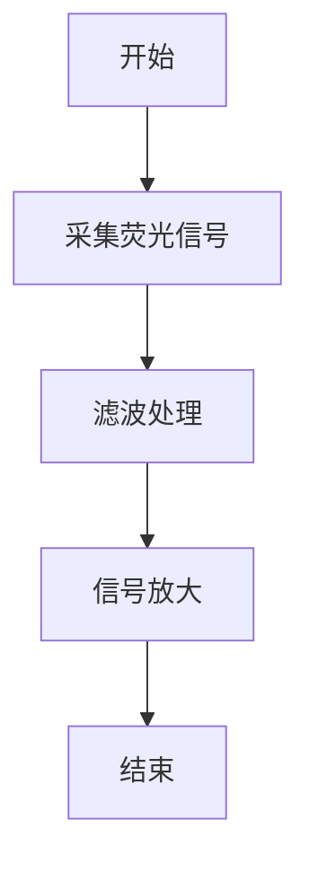

                 


# 如何识别企业的量子点生物传感器制造技术优势

> 关键词：量子点生物传感器，制造技术，技术优势，企业竞争力，传感器技术，纳米材料

> 摘要：本文旨在帮助读者识别企业在量子点生物传感器制造技术方面的优势。通过详细分析量子点生物传感器的技术背景、核心概念、算法原理、系统架构、项目实战以及最佳实践，本文为读者提供了从理论到实践的全面指导。通过对比不同生物传感器的优缺点，构建ER实体关系图，并详细讲解信号处理算法和系统架构设计，本文最终帮助读者掌握如何识别和评估企业在量子点生物传感器制造技术方面的优势。

---

### 第一部分：量子点生物传感器制造技术背景介绍

#### 第1章：量子点生物传感器的基本概念

##### 1.1 量子点的定义与特性

- **1.1.1 量子点的基本概念**  
  量子点是一种纳米级半导体材料，其尺寸通常在1-10纳米之间。由于其尺寸效应，量子点在光学和电学性质上表现出独特的性质，例如颜色可调谐和高荧光强度。

- **1.1.2 量子点的物理化学特性**  
  量子点具有以下特性：
  - 尺寸依赖的荧光颜色：通过调整量子点的尺寸，可以实现从紫外到近红外的宽范围荧光发射。
  - 高量子产率：量子点的荧光效率远高于传统荧光染料。
  - 表面可修饰性：通过化学修饰，量子点可以与生物分子（如抗体、DNA）结合，实现对目标分子的特异性识别。

- **1.1.3 量子点在生物传感器中的应用潜力**  
  量子点生物传感器结合了纳米技术和生物技术，具有以下潜在应用：
  - 疾病诊断：用于检测血液中的病原体、抗体或特定蛋白质。
  - 环境监测：用于检测水中的重金属离子、有机污染物。
  - 食品安全：用于检测食品中的有害物质。

##### 1.2 生物传感器的基本原理

- **1.2.1 生物传感器的定义**  
  生物传感器是一种能够检测生物分子（如蛋白质、DNA、酶）的装置，通常由生物识别元件和信号转换元件组成。

- **1.2.2 生物传感器的工作原理**  
  生物传感器的工作原理包括以下步骤：
  1. 生物识别元件（如抗体、核酸探针）与目标分子结合。
  2. 信号转换元件将生物分子的结合事件转化为可检测的信号（如电信号、光信号）。
  3. 信号处理系统对信号进行放大、滤波和分析，最终输出检测结果。

- **1.2.3 量子点生物传感器的优势**  
  量子点生物传感器相较于传统生物传感器具有以下优势：
  - 高灵敏度：量子点的荧光信号可以被精确检测，灵敏度远高于传统荧光传感器。
  - 快速响应：量子点的光电子响应速度快，适合实时检测。
  - 多功能化：通过表面修饰，量子点可以用于检测多种目标分子。

#### 第2章：量子点生物传感器的技术优势

##### 2.1 高灵敏度与选择性

- **2.1.1 量子点的光学特性对灵敏度的影响**  
  量子点的高量子产率和宽发射光谱使其在生物传感器中具有极高的灵敏度。例如，通过检测荧光强度的变化，可以实现对目标分子的超灵敏检测。

- **2.1.2 表面修饰对选择性的作用**  
  通过化学修饰，量子点可以与特定的生物分子（如抗体、核酸探针）结合，从而实现对目标分子的特异性识别。这种选择性是量子点生物传感器的核心优势之一。

##### 2.2 快速响应与稳定性

- **2.2.1 量子点的快速光电子响应**  
  量子点的光电子响应速度快，可以在短时间内完成信号的放大和转换，适合实时监测应用。

- **2.2.2 生物传感器的长期稳定性**  
  量子点生物传感器的稳定性主要取决于其制造工艺和表面修饰技术。通过优化表面修饰层，可以显著提高传感器的稳定性和使用寿命。

##### 2.3 成本与制造优势

- **2.3.1 制造工艺的成本分析**  
  量子点的制造工艺相对成熟，可以通过溶液合成或气相沉积等方法大规模制备，成本较低。

- **2.3.2 规模化生产的优势**  
  量子点生物传感器的制造可以实现规模化生产，从而降低成本，提高生产效率。

---

### 第二部分：量子点生物传感器的核心概念与联系

#### 第3章：量子点生物传感器的核心原理

##### 3.1 量子点的光电子特性

- **3.1.1 量子点的发光机制**  
  量子点的发光机制基于其纳米级尺寸的半导体特性。当外部光源激发量子点时，电子从价带跃迁到导带，产生荧光。通过调整量子点的尺寸，可以实现不同波长的荧光发射。

- **3.1.2 表面修饰对发光的影响**  
  量子点的表面修饰会影响其荧光性能。例如，通过引入特定的表面配体，可以减少量子点的非辐射复合，从而提高荧光效率。

##### 3.2 生物分子的识别机制

- **3.2.1 生物分子与量子点的相互作用**  
  生物分子（如抗体、核酸探针）与量子点表面结合，导致量子点的荧光发生变化。这种变化可以通过荧光光谱分析检测到。

- **3.2.2 分子识别的信号转换过程**  
  当目标分子与量子点结合时，量子点的荧光强度发生变化。通过检测荧光强度的变化，可以实现对目标分子的定量或定性检测。

##### 3.3 传感器的信号检测与分析

- **3.3.1 光信号的采集与处理**  
  量子点生物传感器的信号检测通常采用荧光光谱分析技术。通过光学系统（如荧光光谱仪）采集量子点的荧光信号，并进行数据处理。

- **3.3.2 数据分析与结果解读**  
  数据分析主要基于荧光强度的变化。通过建立标准曲线，可以实现对目标分子的定量分析。

#### 第4章：核心概念对比与联系

##### 4.1 不同类型生物传感器的对比分析

| 传感器类型 | 优点 | 缺点 |
|------------|------|------|
| 电化学传感器 | 成本低，灵敏度高 | 易受干扰，稳定性差 |
| 光学传感器 | 灵敏度高，选择性好 | 成本高，复杂性大 |
| 量子点生物传感器 | 高灵敏度，多功能化 | 制造复杂，成本较高 |

##### 4.2 核心概念的ER实体关系图

```mermaid
er
actor: 用户
sensor: 量子点生物传感器
target_molecule: 目标分子
signal: 荧光信号
database: 数据库
```

---

### 第三部分：量子点生物传感器的算法原理

#### 第5章：传感器信号处理算法

##### 5.1 信号检测算法



##### 5.2 数据分析与分类算法

```python
import numpy as np

def fluorescence_analysis(flux, threshold):
    if flux > threshold:
        return "目标分子存在"
    else:
        return "目标分子不存在"

# 示例数据
flux = np.array([100, 200, 300, 400, 500])
threshold = 300

result = fluorescence_analysis(flux, threshold)
print(result)  # 输出：目标分子存在
```

##### 5.3 算法原理的数学模型

假设目标分子与量子点结合导致荧光强度变化，数学模型如下：

$$ I = I_0 + k \cdot c $$

其中：
- \( I \) 是检测到的荧光强度
- \( I_0 \) 是背景荧光强度
- \( k \) 是灵敏度系数
- \( c \) 是目标分子的浓度

---

通过以上分析，读者可以全面了解量子点生物传感器的技术优势，并能够识别企业在该领域的核心竞争力。

