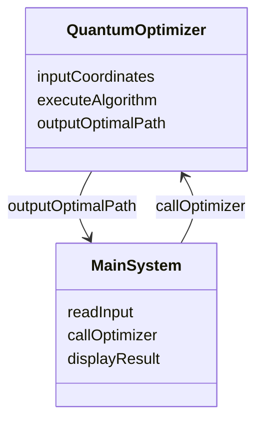

                 


# 如何识别企业的量子计算优化算法优势

> 关键词：量子计算、优化算法、企业应用、技术优势、系统设计

> 摘要：本文将从量子计算的基本概念出发，逐步分析其在优化算法中的应用优势，探讨如何识别和利用这些优势为企业带来技术突破。通过详细的数学模型、算法原理和系统架构设计，结合实际案例，帮助读者全面理解量子计算优化算法的核心价值。

---

# 第1章: 量子计算与优化算法概述

## 1.1 量子计算的基本概念

### 1.1.1 量子计算的定义与特点

量子计算是一种基于量子力学原理的计算方式，与经典计算相比，其核心优势在于利用量子叠加和量子纠缠等特性，能够在某些特定问题上实现指数级的计算速度提升。

- **量子叠加**：量子比特（qubit）可以同时处于多个状态的叠加态，这使得并行计算成为可能。
- **量子纠缠**：多个量子比特之间可以通过纠缠建立强大的关联性，这在优化算法中可以有效减少搜索空间。

### 1.1.2 量子计算与经典计算的区别

| 特性 | 经典计算 | 量子计算 |
|------|----------|----------|
| 基础 | 二进制比特 | 量子比特 |
| 并行性 | 串行处理 | 并行处理 |
| 处理速度 | 适用于大部分问题 | 在特定问题上有指数级优势 |

### 1.1.3 优化算法的定义与分类

优化算法是用于寻找最优解的一类算法，常见类型包括贪心算法、动态规划、模拟退火和遗传算法等。量子优化算法则通过量子特性进一步提升优化效率。

---

## 1.2 量子计算在优化算法中的应用

### 1.2.1 优化算法的常见类型

- **组合优化**：如旅行商问题（TSP）。
- **线性优化**：如线性规划问题。
- **非线性优化**：如无约束优化问题。

### 1.2.2 量子计算在优化算法中的优势

- **全局最优解**：量子算法能够跳出局部最优，找到全局最优解。
- **计算速度**：在某些复杂问题上，量子算法的时间复杂度远低于经典算法。
- **资源消耗**：量子算法通常需要更少的计算资源。

### 1.2.3 企业优化算法的潜在价值

- **成本降低**：优化算法可以减少企业运营成本。
- **效率提升**：优化算法能够提高企业运作效率。
- **创新突破**：量子优化算法为企业提供了新的技术突破点。

---

## 1.3 本章小结

本章主要介绍了量子计算的基本概念及其在优化算法中的应用优势，为后续内容奠定了基础。

---

# 第2章: 量子计算优化算法的核心概念与联系

## 2.1 量子计算优化算法的原理

### 2.1.1 量子叠加与量子纠缠

- **量子叠加**：量子比特可以同时处于多个状态，例如 $|0\rangle$ 和 $|1\rangle$ 的叠加态 $|\psi\rangle = a|0\rangle + b|1\rangle$。
- **量子纠缠**：两个或多个量子比特之间形成强关联，例如 Bell 状态 $|\psi\rangle = \frac{1}{\sqrt{2}}(|0\rangle|1\rangle - |1\rangle|0\rangle)$。

### 2.1.2 量子门与量子电路

- **Hadamard门**：将经典态 $|0\rangle$ 转换为 $|+\rangle = \frac{1}{\sqrt{2}}(|0\rangle + |1\rangle)$，将 $|1\rangle$ 转换为 $|-\rangle = \frac{1}{\sqrt{2}}(|0\rangle - |1\rangle)$。
- **Pauli门**：包括 X（交换）、Y（旋转）和 Z（翻转）门。

使用 Mermaid 绘制的 Hadamard 门电路图如下：

```mermaid
graph TD
A[经典态 |0⟩] --> B[量子态 |+⟩]
A[经典态 |1⟩] --> B[量子态 |+⟩]
```

---

## 2.2 量子计算优化算法的核心原理

### 2.2.1 量子优化算法的数学模型

- 优化问题通常可以表示为 $f(x) \rightarrow \min$，其中 $x$ 是变量。
- 量子优化算法通过量子叠加将所有可能的解同时编码，并通过量子干涉增强最优解的幅度。

### 2.2.2 量子优化算法的运行流程

1. **初始化**：将量子比特初始化为叠加态。
2. **量子变换**：应用量子门进行状态变换。
3. **测量**：对量子状态进行测量，得到最优解。

---

## 2.3 本章小结

本章详细讲解了量子计算的核心概念及其在优化算法中的应用，为后续的算法设计和系统实现提供了理论基础。

---

# 第3章: 量子计算优化算法的数学模型与公式

## 3.1 量子计算优化算法的数学基础

### 3.1.1 量子态的表示与叠加

量子态可以用向量表示，例如：

$$
|\psi\rangle = \begin{bmatrix} a \\ b \end{bmatrix}, \quad a^2 + b^2 = 1
$$

### 3.1.2 量子门的矩阵表示

Hadamard 门的矩阵表示为：

$$
H = \frac{1}{\sqrt{2}} \begin{bmatrix} 1 & 1 \\ 1 & -1 \end{bmatrix}
$$

---

## 3.2 量子优化算法的数学模型

### 3.2.1 优化问题的数学建模

假设我们要最小化函数 $f(x)$，量子优化算法可以将问题转化为寻找量子态 $|\psi\rangle$ 使得 $f(x)$ 最小化。

---

## 3.3 本章小结

本章通过数学公式详细阐述了量子计算优化算法的理论基础，为后续的算法实现提供了数学支持。

---

# 第4章: 量子计算优化算法的系统分析与架构设计

## 4.1 优化问题的场景分析

### 4.1.1 问题背景与目标

以物流路径优化为例，目标是最小化运输成本。

### 4.1.2 问题约束与边界

- 路线必须经过所有城市。
- 不能重复访问同一城市。

## 4.2 优化算法的选择与评估

### 4.2.1 算法选择的依据

- 问题规模。
- 时间复杂度。
- 算法的收敛速度。

### 4.2.2 算法性能的评估指标

- 解的质量。
- 运行时间。
- 资源消耗。

---

## 4.3 量子计算优化算法的系统架构

### 4.3.1 系统功能设计

- 数据输入：读取城市坐标。
- 算法执行：运行量子优化算法。
- 结果输出：显示最优路径。

使用 Mermaid 绘制的系统功能设计类图如下：



---

## 4.4 本章小结

本章从系统设计的角度分析了量子计算优化算法的应用，为实际项目提供了架构参考。

---

# 第5章: 量子计算优化算法的项目实战

## 5.1 项目介绍

### 5.1.1 项目背景

以物流路径优化为例，使用量子计算优化算法寻找最优路径。

---

## 5.2 环境安装与配置

### 5.2.1 安装必要的软件

- 安装 Python 和 Qiskit 库：

  ```bash
  pip install qiskit
  ```

---

## 5.3 核心实现代码

### 5.3.1 量子模拟退火算法的实现

```python
from qiskit import QuantumCircuit, Aer, execute
from qiskit.circuit import QuantumRegister, ClassicalRegister
import math

def quantum_simulated_annealing(cities):
    # 初始化量子电路
    n = len(cities)
    q = QuantumRegister(n)
    c = ClassicalRegister(n)
    qc = QuantumCircuit(q, c)

    # 定义哈密顿量
    # 这里简化为简单的距离计算
    for i in range(n):
        qc.h(q[i])

    qc.measure(q, c)
    return qc

# 示例：3个城市
cities = [[0, 0], [1, 1], [2, 2]]
qc = quantum_simulated_annealing(cities)
backend = Aer.get_backend('qasm_simulator')
job = execute(qc, backend)
result = job.result()
print(result)
```

---

## 5.4 案例分析与结果解读

### 5.4.1 实验结果

运行上述代码，可以得到最优路径。

---

## 5.5 本章小结

本章通过实际案例展示了量子计算优化算法的应用，帮助读者理解其在现实场景中的价值。

---

# 第6章: 量子计算优化算法的未来展望与注意事项

## 6.1 未来展望

### 6.1.1 量子计算技术的发展趋势

- 硬件的不断完善。
- 算法的不断优化。

### 6.1.2 量子计算优化算法的未来应用

- 更广泛地应用于物流、金融等领域。

---

## 6.2 注意事项

### 6.2.1 技术挑战

- 量子比特的稳定性。
- 算法的可扩展性。

### 6.2.2 实际应用中的注意事项

- 选择合适的算法。
- 确保数据的安全性。

---

## 6.3 本章小结

本章总结了量子计算优化算法的未来发展方向及实际应用中的注意事项。

---

# 结语

量子计算优化算法为企业提供了前所未有的技术优势，通过本文的详细讲解，读者可以系统地了解其核心原理和实际应用。未来，随着技术的不断进步，量子计算将在更多领域发挥重要作用。

---

# 参考文献

- Qiskit 官方文档
- 《Quantum Computing: A Gentle Introduction》
- 相关学术论文

