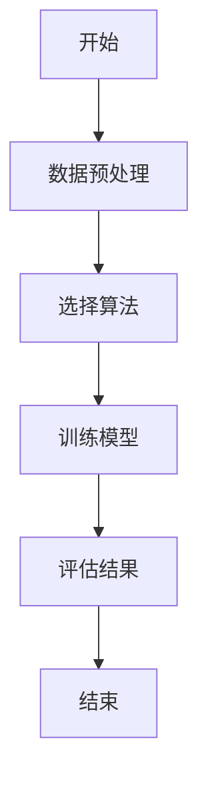
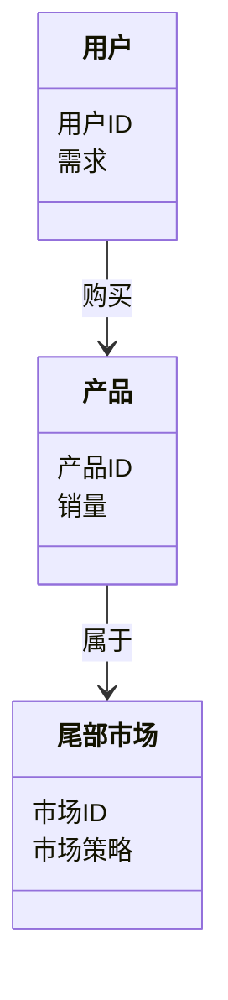
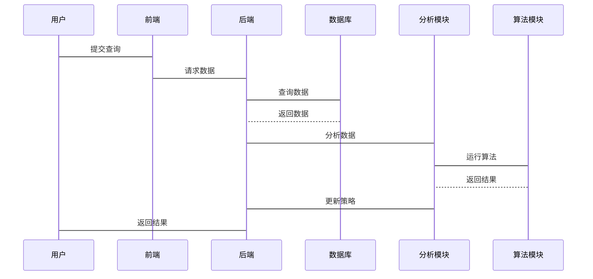

                 


# 如何识别企业的长尾效应优势

> 关键词：长尾效应，市场细分，数据分析，机器学习，商业模式，竞争优势

> 摘要：本文详细探讨了企业如何识别长尾效应优势，从定义、原理、算法、系统设计到项目实战，层层解析，为企业在市场竞争中发现潜在机会提供实用指导。

---

# 第一部分：长尾效应的背景与概念

## 第1章：长尾效应的定义与背景

### 1.1 长尾效应的起源与概念

#### 1.1.1 长尾效应的起源
长尾效应最初由《连线》杂志主编克里斯·安德森在2004年提出，描述了在互联网时代，销量小但种类多的产品或服务通过长尾效应能够带来巨大市场价值的现象。

#### 1.1.2 长尾效应的定义
长尾效应是指在市场中，大量小众、非主流的产品或服务，通过聚焦特定细分市场，利用其多样性和灵活性，形成一种非对称竞争优势。

#### 1.1.3 长尾效应的背景与现状
随着互联网和大数据技术的发展，长尾效应在多个领域（如电商、内容分发、影视等）逐渐显现，成为企业差异化竞争的重要策略。

### 1.2 长尾效应的核心要素

#### 1.2.1 市场细分与小众市场
长尾效应的核心在于市场细分，通过精准定位特定用户群体，提供定制化的产品或服务。

#### 1.2.2 尾部市场的潜力
尾部市场虽然单个产品的销量小，但整体市场规模庞大，通过聚合效应可以创造巨大价值。

#### 1.2.3 长尾效应与传统商业模式的区别
传统商业模式依赖头部效应，而长尾效应则通过细分市场和多样化产品组合来实现优势。

### 1.3 长尾效应的边界与外延

#### 1.3.1 长尾效应的边界
长尾效应的边界在于产品或服务是否能够在特定细分市场中获得足够的市场份额，同时避免陷入“长尾陷阱”。

#### 1.3.2 长尾效应的外延与应用范围
长尾效应不仅适用于电商、媒体行业，还可以扩展到金融、教育、医疗等领域。

#### 1.3.3 长尾效应与其他商业概念的对比
对比头部效应、短尾效应和Zipf定律，明确长尾效应的独特性和适用场景。

---

## 第2章：长尾效应的核心概念与联系

### 2.1 长尾效应的原理与机制

#### 2.1.1 长尾效应的数学模型
长尾效应可以用幂律分布（Zipf分布）来描述，尾部市场的销量与排名呈幂律关系。

#### 2.1.2 长尾效应的经济学解释
长尾效应体现了边际成本递减和网络外部性，通过互联网平台降低交易成本，实现小众市场的聚合。

#### 2.1.3 长尾效应的市场动态分析
分析长尾效应在不同市场周期中的表现，探讨其与市场结构、竞争格局的关系。

### 2.2 长尾效应的核心要素对比

#### 2.2.1 头部市场与尾部市场的对比
| 特性 | 头部市场 | 尾部市场 |
|------|----------|----------|
| 规模 | 大       | 小       |
| 竞争 | 高       | 低       |
| 利润 | 稳定     | 波动     |

#### 2.2.2 长尾效应与短尾效应的对比
长尾效应强调市场细分和多样化，短尾效应则关注单一产品的市场集中度。

#### 2.2.3 长尾效应与Zipf定律的关系
Zipf定律描述了词频分布的幂律关系，与长尾效应的销量分布有相似性，但应用场景不同。

### 2.3 长尾效应的ER实体关系图

```mermaid
er
actor(用户) -[通过特定需求]-> 产品(产品) --[属于]-> 尾部市场
产品 --[聚合]-> 长尾效应
长尾效应 -[通过数据分析]-> 市场策略
```

---

# 第二部分：长尾效应的识别算法与数学模型

## 第3章：长尾效应识别的算法原理

### 3.1 基于数据分析的长尾识别算法

#### 3.1.1 数据预处理与清洗
步骤：
1. 数据收集：获取销售数据、用户行为数据等。
2. 数据清洗：去除异常值、填补缺失值。
3. 数据标准化：统一数据格式，便于后续分析。

#### 3.1.2 数据分布分析
使用直方图或箱线图分析数据分布，识别长尾部分。

#### 3.1.3 长尾识别的数学模型
基于概率密度函数，判断数据点是否属于尾部区域。

### 3.2 基于机器学习的长尾识别算法

#### 3.2.1 无监督学习算法（聚类分析）
- 使用K-means算法将数据分为头部和尾部。
- 通过DBI指标评估聚类效果。

#### 3.2.2 监督学习算法（分类分析）
- 利用训练数据训练分类器，区分头部和尾部数据。
- 使用准确率、召回率等指标评估模型性能。

#### 3.2.3 深度学习算法（神经网络）
- 构建神经网络模型，学习数据的分布特征。
- 使用交叉验证优化模型参数。

### 3.3 算法流程图（Mermaid图）



### 3.4 算法实现代码

```python
import pandas as pd
from sklearn.cluster import KMeans

# 数据预处理
data = pd.read_csv('sales.csv')
data = data.dropna()
data = data.drop_duplicates()

# 选择算法
model = KMeans(n_clusters=2, random_state=0)
model.fit(data[['销量', '用户数']])

# 训练模型
data['预测结果'] = model.labels_
```

---

## 第4章：长尾效应识别的数学模型与公式

### 4.1 长尾效应的数学模型

长尾效应可以用幂律分布描述，其概率密度函数为：
$$ P(r) \propto r^{-\alpha} $$
其中，$r$ 是销量排名，$\alpha$ 是尾部市场的指数参数。

### 4.2 算法数学公式

聚类算法的损失函数：
$$ L = \sum_{i=1}^{n} \sum_{j=1}^{k} w_{ij} \cdot d(c_i, c_j) $$
其中，$w_{ij}$ 是样本i属于簇j的概率，$d(c_i, c_j)$ 是样本i与簇j中心的距离。

---

# 第三部分：长尾效应的系统分析与架构设计

## 第5章：长尾效应识别的系统分析

### 5.1 系统功能设计

#### 5.1.1 领域模型（Mermaid类图）



### 5.2 系统架构设计


### 5.3 系统交互流程



---

## 第6章：长尾效应识别的项目实战

### 6.1 项目环境安装

```bash
pip install pandas scikit-learn mermaid4j
```

### 6.2 核心代码实现

```python
import pandas as pd
from sklearn.cluster import KMeans

# 数据预处理
data = pd.read_csv('sales.csv')
data = data.dropna()
data = data.drop_duplicates()

# 训练模型
model = KMeans(n_clusters=2, random_state=0)
model.fit(data[['销量', '用户数']])

# 分析结果
data['预测结果'] = model.labels_
print(data.head())
```

### 6.3 实际案例分析

以某电商平台为例，分析其长尾产品，优化市场策略，提升销售额。

### 6.4 项目总结与优化

总结项目成果，提出优化建议，如优化算法、改进数据收集方法等。

---

## 第7章：总结与展望

### 7.1 总结
长尾效应通过市场细分和数据分析，帮助企业发现潜在机会，提升竞争力。

### 7.2 未来展望
随着AI和大数据技术的发展，长尾效应的应用将更加广泛，算法也将更加精准。

### 7.3 最佳实践 tips
- 注重数据质量，确保分析结果的准确性。
- 结合业务场景，选择合适的算法和模型。
- 定期优化策略，适应市场变化。

---

通过以上内容，企业可以系统地识别长尾效应优势，制定有效的市场策略，提升竞争力。

