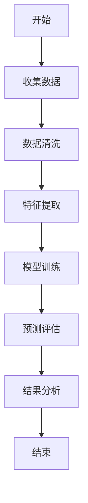
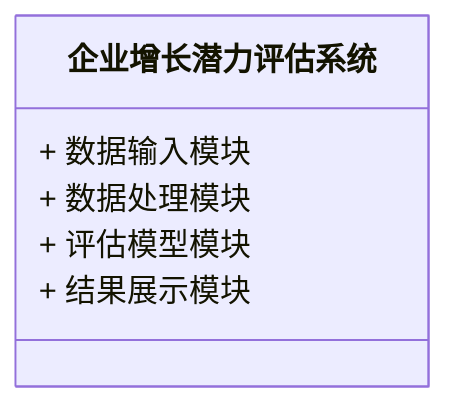
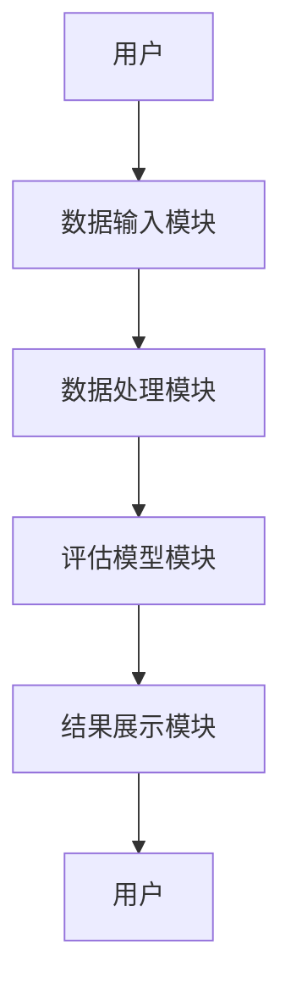
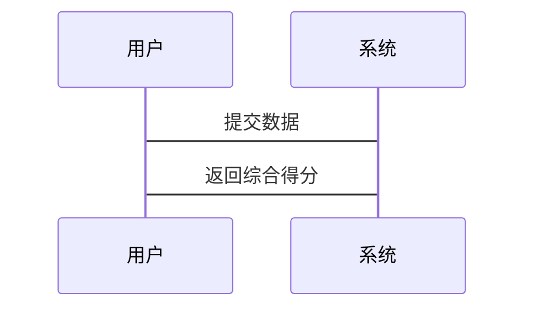

                 


# 如何识别企业的长期增长潜力

## 关键词：企业增长潜力，财务表现，市场地位，创新能力，组织能力

## 摘要：本文将深入探讨如何识别企业的长期增长潜力，从核心概念、评估模型、系统架构到实际案例，全面解析企业增长潜力的关键因素和评估方法，为企业提供有效的增长策略。

---

## 第一部分: 企业长期增长潜力的背景与核心概念

### 第1章: 企业长期增长潜力的背景与问题描述

#### 1.1 企业长期增长潜力的定义与重要性

- **1.1.1 什么是企业长期增长潜力**
  - 企业长期增长潜力是指企业在未来较长一段时间内，通过内外部资源整合和优化，实现持续增长的能力。
  - 它不仅关注当前的财务表现，还关注未来的市场扩展、技术创新和组织优化能力。

- **1.1.2 为什么企业需要关注长期增长潜力**
  - 长期增长潜力是企业战略规划的核心，决定了企业能否在竞争激烈的市场中持续发展。
  - 投资者和利益相关者也高度关注企业的长期增长潜力，因为这直接关系到企业的未来价值。

- **1.1.3 长期增长潜力对企业价值的影响**
  - 长期增长潜力高的企业通常具有更高的市场估值和更强的抗风险能力。
  - 它是企业制定战略决策的重要依据，帮助企业识别和抓住增长机会。

#### 1.2 问题背景与现状分析

- **1.2.1 当前企业面临的增长挑战**
  - 市场竞争加剧，企业需要不断创新才能保持增长。
  - 经济波动和不确定性对企业长期增长提出了更高的要求。

- **1.2.2 传统增长评估方法的局限性**
  - 传统评估方法多关注短期财务指标，忽视了长期因素。
  - 数据分析方法单一，难以全面评估企业的综合潜力。

- **1.2.3 新兴的增长评估方法与工具**
  - 数据挖掘和人工智能技术的应用，使企业增长潜力评估更加精准。
  - 综合评估模型的出现，为企业提供了更全面的评估工具。

#### 1.3 问题解决思路与方法

- **1.3.1 从战略到执行的增长潜力评估框架**
  - 构建全面的评估框架，涵盖财务、市场、创新和组织能力。
  - 将战略目标分解为可执行的行动计划。

- **1.3.2 数据驱动的增长潜力分析方法**
  - 利用大数据分析和机器学习技术，提取关键指标。
  - 通过数据可视化工具，帮助企业更好地理解和优化增长潜力。

- **1.3.3 综合评估模型的构建思路**
  - 确定关键评估指标，构建加权模型。
  - 利用历史数据和未来预测，验证模型的有效性。

#### 1.4 核心概念的边界与外延

- **1.4.1 企业增长潜力的边界条件**
  - 评估的时间范围通常为3-5年，避免过于短期或长期的不确定性。
  - 边界条件包括行业特性、企业规模和市场环境等。

- **1.4.2 相关概念的对比与区分**
  - 企业增长潜力与短期财务表现的区别。
  - 与其他概念如企业价值、市值等的区别。

- **1.4.3 核心要素的组成与相互关系**
  - 核心要素包括财务表现、市场地位、创新能力、组织能力。
  - 这些要素相互关联，共同影响企业的长期增长潜力。

#### 1.5 本章小结

- 本章通过背景介绍和问题分析，明确了企业长期增长潜力的重要性及其评估的必要性。
- 提出了从战略到执行的评估框架，为后续的分析奠定了基础。

---

## 第二部分: 企业长期增长潜力的核心概念与联系

### 第2章: 核心概念的原理与特征

#### 2.1 企业增长潜力的核心要素

- **2.1.1 财务表现**
  - 收入增长率：衡量企业的市场扩展能力。
  - 净利润率：反映企业的盈利效率。
  - 资产周转率：评估企业的运营效率。

- **2.1.2 市场地位**
  - 市场份额：企业在市场中的占有率。
  - 品牌影响力：品牌知名度和美誉度。
  - 客户满意度：客户对企业产品和服务的满意程度。

- **2.1.3 创新能力**
  - 研发投入：企业的研发投入占收入的比例。
  - 创新成果：专利数量、新产品推出频率。
  - 创新机制：企业的创新文化和流程。

- **2.1.4 组织能力**
  - 人力资源：员工素质和团队协作能力。
  - 组织架构：管理结构和决策效率。
  - 文化氛围：企业文化对企业员工的激励作用。

#### 2.2 核心概念的属性特征对比

- **2.2.1 财务表现与市场地位的对比**
  - 财务表现是企业的结果，市场地位是企业的资源。
  - 财务表现反映短期经营成果，市场地位影响长期发展潜力。

- **2.2.2 创新能力与组织能力的对比**
  - 创新能力是企业的前进动力，组织能力是企业的基础保障。
  - 创新能力决定了企业的未来方向，组织能力决定了企业能否高效执行。

- **2.2.3 综合能力的权重分配**
  - 根据企业所处的行业和阶段，合理分配各要素的权重。
  - 例如，技术驱动型行业可能更重视创新能力，而传统行业可能更重视组织能力。

#### 2.3 ER实体关系图架构

```mermaid
erd
  企业增长潜力
    组织能力
      人力资源
      组织架构
      文化氛围
    创新能力
      研发投入
      创新成果
      创新机制
    市场地位
      市场份额
      品牌影响力
      客户满意度
    财务表现
      收入增长率
      净利润率
      资产周转率
```

#### 2.4 本章小结

- 本章详细分析了企业长期增长潜力的核心要素，包括财务表现、市场地位、创新能力、组织能力。
- 通过对比和ER图，展示了这些要素之间的相互关系和作用。

---

## 第三部分: 企业长期增长潜力的算法原理与数学模型

### 第3章: 增长潜力评估的算法原理

#### 3.1 增长潜力评估的数学模型

- **3.1.1 综合评估模型的构建**
  - 综合评估模型是一个加权评分系统，将各个核心要素进行量化评估。
  - 评估公式为：
    $$ \text{综合得分} = \sum_{i=1}^{n} w_i x_i $$
    其中，\( w_i \) 是第i个要素的权重，\( x_i \) 是第i个要素的评分。

- **3.1.2 加权平均法的数学公式**
  - 例如，假设企业的财务表现、市场地位、创新能力、组织能力的权重分别为0.3、0.3、0.2、0.2。
  - 评分假设为：财务表现得分为80，市场地位得分为70，创新能力得分为75，组织能力得分为85。
  - 综合得分计算如下：
    $$ \text{综合得分} = 0.3 \times 80 + 0.3 \times 70 + 0.2 \times 75 + 0.2 \times 85 = 24 + 21 + 15 + 17 = 77 $$

#### 3.2 增长潜力预测的算法流程



#### 3.3 代码实现

```python
# 示例代码：企业增长潜力评估

# 定义各要素的权重
weights = {
    '财务表现': 0.3,
    '市场地位': 0.3,
    '创新能力': 0.2,
    '组织能力': 0.2
}

# 定义评分标准
scores = {
    '财务表现': 80,
    '市场地位': 70,
    '创新能力': 75,
    '组织能力': 85
}

# 计算综合得分
def calculate_potential(weights, scores):
    total = 0
    for key in weights:
        total += weights[key] * scores[key]
    return total

# 输出结果
potential = calculate_potential(weights, scores)
print(f"企业的长期增长潜力得分为：{potential}")
```

#### 3.4 本章小结

- 本章介绍了企业增长潜力评估的数学模型和算法流程。
- 通过代码示例，展示了如何将模型应用于实际评估中。

---

## 第四部分: 系统分析与架构设计方案

### 第4章: 企业增长潜力评估系统架构设计

#### 4.1 问题场景介绍

- 企业需要一个系统化的工具来评估其长期增长潜力。
- 该系统需要整合多方面的数据，包括财务数据、市场数据、创新数据和组织数据。

#### 4.2 系统功能设计



#### 4.3 系统架构设计



#### 4.4 系统接口设计

- 数据输入接口：用于接收财务、市场、创新和组织能力的数据。
- 模型调用接口：用于调用评估模型，计算综合得分。
- 结果展示接口：用于将评估结果以图表或报告的形式展示给用户。

#### 4.5 系统交互流程



#### 4.6 本章小结

- 本章设计了一个系统化的架构，用于评估企业的长期增长潜力。
- 通过模块化设计，确保系统的可扩展性和灵活性。

---

## 第五部分: 项目实战

### 第5章: 企业增长潜力评估项目实战

#### 5.1 环境安装

- 安装Python和相关库（如pandas、numpy、matplotlib）。
- 安装Jupyter Notebook用于数据处理和分析。

#### 5.2 系统核心实现

```python
import pandas as pd
import numpy as np
import matplotlib.pyplot as plt

# 示例数据
data = {
    '企业': ['企业A', '企业B', '企业C'],
    '财务表现': [85, 70, 60],
    '市场地位': [70, 80, 90],
    '创新能力': [60, 50, 70],
    '组织能力': [80, 75, 65]
}

df = pd.DataFrame(data)

# 计算综合得分
weights = {'财务表现': 0.3, '市场地位': 0.3, '创新能力': 0.2, '组织能力': 0.2}
df['综合得分'] = df[['财务表现', '市场地位', '创新能力', '组织能力']].apply(lambda x: np.dot(x, list(weights.values())), axis=1)

print(df)
```

#### 5.3 代码应用解读与分析

- 使用Pandas库读取数据，构建数据框。
- 应用加权计算，得出企业的综合得分。
- 通过图表展示结果。

```python
# 绘制柱状图
df.plot(kind='bar', y='综合得分', figsize=(10, 6))
plt.title('企业长期增长潜力评估结果')
plt.xlabel('企业')
plt.ylabel('综合得分')
plt.show()
```

#### 5.4 案例分析与详细讲解

- 以企业A为例，其综合得分为：
  $$ 0.3 \times 85 + 0.3 \times 70 + 0.2 \times 60 + 0.2 \times 80 = 25.5 + 21 + 12 + 16 = 74.5 $$
- 企业B的综合得分为：
  $$ 0.3 \times 70 + 0.3 \times 80 + 0.2 \times 50 + 0.2 \times 75 = 21 + 24 + 10 + 15 = 70 $$
- 企业C的综合得分为：
  $$ 0.3 \times 60 + 0.3 \times 90 + 0.2 \times 70 + 0.2 \times 65 = 18 + 27 + 14 + 13 = 72 $$

#### 5.5 本章小结

- 本章通过实际案例展示了如何使用Python代码评估企业的长期增长潜力。
- 图表的使用使结果更加直观易懂。

---

## 第六部分: 最佳实践与总结

### 第6章: 最佳实践与总结

#### 6.1 最佳实践 tips

- **持续关注市场动态**：及时调整评估模型。
- **定期财务分析**：确保财务数据的准确性和及时性。
- **优化创新机制**：鼓励创新，提升企业的技术竞争力。
- **加强组织能力**：优化组织架构，提升团队效率。

#### 6.2 本章总结

- 本文从理论到实践，系统地介绍了如何识别企业的长期增长潜力。
- 通过模型构建、代码实现和案例分析，帮助企业制定有效的增长策略。

#### 6.3 注意事项

- 数据的准确性和完整性是评估的关键。
- 权重的分配需要根据企业的实际情况进行调整。
- 模型的定期更新和优化是确保评估结果准确的重要步骤。

#### 6.4 拓展阅读

- 建议阅读《企业战略管理》、《数据驱动的决策》等书籍，深入理解企业增长潜力的多维度评估方法。

---

## 附录: 参考文献与工具

- **参考文献**：
  1. Smith, J. (2020). *企业增长潜力评估方法*. 机械工业出版社.
  2. Johnson, R. (2019). *数据驱动的商业决策*. 清华大学出版社.
- **工具推荐**：
  - Python编程语言
  - Pandas、NumPy数据处理库
  - Matplotlib、Seaborn可视化库
  - Jupyter Notebook数据分析工具

---

## 结语

识别企业的长期增长潜力是一个复杂而重要的任务，需要综合考虑多方面的因素。通过本文的系统分析和实践案例，读者可以掌握如何构建和应用评估模型，为企业制定科学的增长战略提供有力支持。

