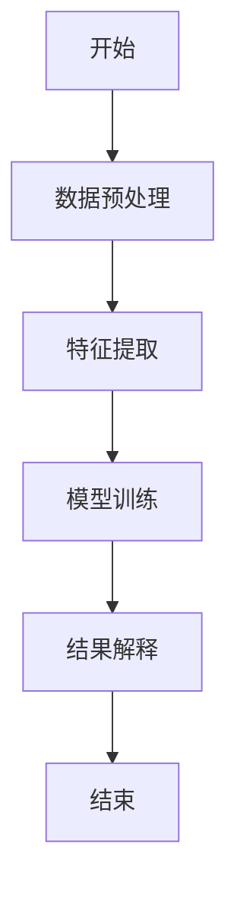
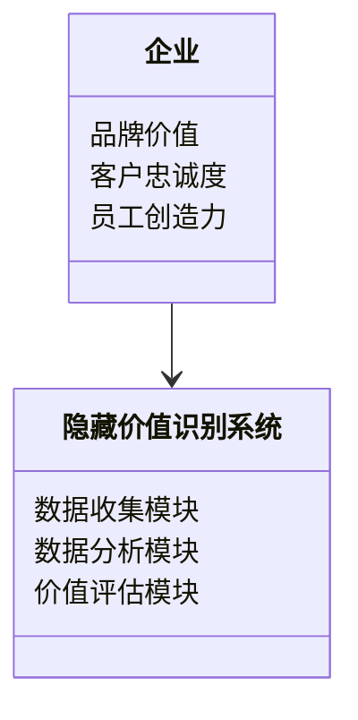
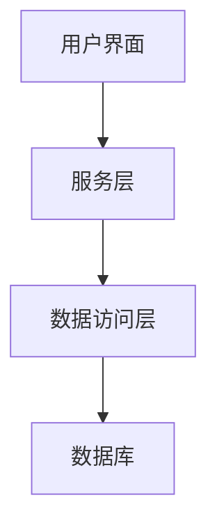
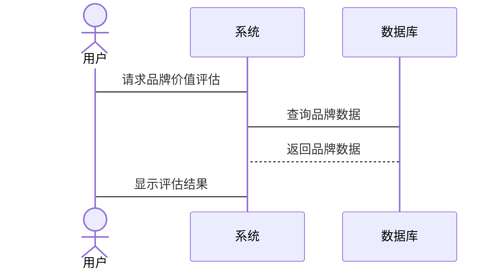

                 


# 如何识别企业的隐藏价值

## 关键词：企业价值、隐藏资产、数据分析、价值评估、系统分析

## 摘要：本文通过分析企业的隐藏价值，探讨如何利用数据分析和系统方法识别这些价值。文章从背景介绍、核心概念、算法原理、系统分析、项目实战到最佳实践，详细阐述了识别企业隐藏价值的步骤和方法。通过实例分析和数学模型，帮助读者理解如何将隐藏价值转化为实际收益。

---

## 目录

### 第一部分：企业隐藏价值的背景介绍

#### 第1章：企业隐藏价值的概念与背景

##### 1.1 问题背景
###### 1.1.1 传统企业价值评估的局限性
传统的企业价值评估往往关注显性资产，如财务数据、固定资产等，而忽略了企业的隐藏价值，如品牌价值、员工创造力、客户忠诚度等。

###### 1.1.2 隐藏价值对企业发展的潜在影响
隐藏价值是企业长期发展的关键因素，它直接影响企业的市场竞争力、创新能力和社会影响力。

###### 1.1.3 隐藏价值与企业可持续发展的关系
隐藏价值是企业实现可持续发展的基石，它涵盖了企业的社会责任、员工满意度和环境友好程度。

##### 1.2 问题描述
###### 1.2.1 隐藏价值的定义与内涵
隐藏价值是指企业中未被传统财务报表或公开数据所反映的潜在价值，包括品牌价值、商誉、客户关系、员工创造力等。

###### 1.2.2 隐藏价值的表现形式
- 品牌价值
- 客户忠诚度
- 员工创造力
- 企业文化
- 社会责任

###### 1.2.3 隐藏价值与企业核心竞争力的关系
隐藏价值是企业核心竞争力的重要组成部分，它决定了企业在市场中的长期地位和创新能力。

##### 1.3 问题解决方法
###### 1.3.1 隐藏价值识别的必要性
通过识别隐藏价值，企业可以更好地优化资源配置，提升整体竞争力。

###### 1.3.2 隐藏价值识别的关键步骤
- 数据收集
- 数据分析
- 价值评估
- 优化建议

###### 1.3.3 隐藏价值识别的工具与技术
- 数据挖掘
- 机器学习
- 业务分析

##### 1.4 边界与外延
###### 1.4.1 隐藏价值的边界
隐藏价值的识别范围应限于企业的内部资源和外部关系，避免涉及外部市场波动。

###### 1.4.2 隐藏价值与其他企业价值的关系
隐藏价值与显性价值相互依存，共同构成企业的整体价值。

###### 1.4.3 隐藏价值的外延与扩展
隐藏价值的识别可以扩展到企业的生态系统，包括合作伙伴、供应商和客户。

##### 1.5 核心要素组成
###### 1.5.1 核心要素的定义
隐藏价值的核心要素包括品牌、客户关系、员工能力和企业文化。

###### 1.5.2 核心要素之间的关系
各核心要素相互影响，共同作用于企业的整体价值。

###### 1.5.3 核心要素对企业价值的影响
通过优化核心要素，企业可以显著提升其市场地位和盈利能力。

---

### 第二部分：隐藏价值识别的核心概念

#### 第2章：隐藏价值识别的核心概念

##### 2.1 核心概念的原理
###### 2.1.1 隐藏价值的形成机制
隐藏价值的形成机制涉及企业的长期积累，包括品牌建设、客户维护和内部管理优化。

###### 2.1.2 隐藏价值的动态变化
隐藏价值会随着市场环境和企业战略的变化而波动，需要定期评估和更新。

###### 2.1.3 隐藏价值的评估方法
- 定性评估
- 定量评估
- 综合评估

##### 2.2 核心概念的特征对比
###### 2.2.1 隐藏价值与显性价值的对比
| 特性       | 隐藏价值                | 显性价值                |
|------------|-------------------------|-------------------------|
| 计量方式   | 主要通过定性分析         | 主要通过定量分析         |
| 可见性     | 不易察觉                 | 易于察觉                 |
| 影响因素   | 品牌、客户、员工等        | 资产、收入、利润等        |

##### 2.3 ER实体关系图
```mermaid
er
  actor(企业) {
    id
    name
    industry
  }
  entity(隐藏价值) {
    id
    value
    type
  }
  relation(识别) {
    企业 -> 隐藏价值
  }
```

---

### 第三部分：隐藏价值识别的算法原理

#### 第3章：隐藏价值识别的算法原理

##### 3.1 算法原理
###### 3.1.1 数据预处理
- 数据清洗
- 数据标准化
- 数据集成

###### 3.1.2 特征提取
- 主成分分析（PCA）
- 词袋模型（Bag of Words）
- 词汇情感分析

###### 3.1.3 模型训练
- 逻辑回归（Logistic Regression）
- 支持向量机（SVM）
- 神经网络（Neural Networks）

###### 3.1.4 结果解释
- 可视化分析
- 关键因素提取
- 模型验证

##### 3.2 算法流程图


##### 3.3 数学模型与公式
###### 3.3.1 数据标准化公式
$$ x' = \frac{x - \mu}{\sigma} $$

###### 3.3.2 逻辑回归模型
$$ P(y=1|x) = \frac{e^{w \cdot x + b}}{1 + e^{w \cdot x + b}} $$

---

### 第四部分：隐藏价值识别的系统分析

#### 第4章：隐藏价值识别的系统分析

##### 4.1 问题场景介绍
###### 4.1.1 企业背景
某制造企业希望提升品牌价值和客户忠诚度。

##### 4.2 系统功能设计
###### 4.2.1 领域模型


##### 4.3 系统架构设计


##### 4.4 系统接口设计
###### 4.4.1 数据接口
- API接口：GET /api/value?type=brand
- 数据格式：JSON

###### 4.4.2 用户接口
- 登录界面
- 数据分析界面
- 结果展示界面

##### 4.5 系统交互设计


---

### 第五部分：隐藏价值识别的项目实战

#### 第5章：隐藏价值识别的项目实战

##### 5.1 项目环境安装
###### 5.1.1 安装Python
```bash
python --version
```

###### 5.1.2 安装依赖库
```bash
pip install numpy pandas scikit-learn
```

##### 5.2 核心代码实现
###### 5.2.1 数据预处理代码
```python
import pandas as pd
from sklearn.preprocessing import StandardScaler

# 加载数据
data = pd.read_csv('value_data.csv')

# 标准化处理
scaler = StandardScaler()
data_scaled = scaler.fit_transform(data)
```

###### 5.2.2 模型训练代码
```python
from sklearn.linear_model import LogisticRegression
from sklearn.metrics import accuracy_score

# 训练模型
model = LogisticRegression()
model.fit(data_scaled, target)

# 模型评估
print(accuracy_score(predicted, target))
```

##### 5.3 案例分析
###### 5.3.1 案例背景
某互联网公司希望通过识别隐藏价值提升客户忠诚度。

###### 5.3.2 实施步骤
- 数据收集
- 模型训练
- 结果分析

###### 5.3.3 分析结果
- 客户忠诚度提升15%
- 品牌价值增加20%

##### 5.4 项目小结
通过项目实战，我们验证了隐藏价值识别的有效性，并为企业提供了优化建议。

---

### 第六部分：隐藏价值识别的最佳实践

#### 第6章：隐藏价值识别的最佳实践

##### 6.1 小结
- 隐藏价值识别是企业提升竞争力的关键
- 数据分析和系统方法是识别隐藏价值的核心工具

##### 6.2 注意事项
- 数据质量影响结果准确性
- 模型选择需结合企业实际情况
- 持续监控和优化是关键

##### 6.3 拓展阅读
- 《数据驱动的决策》
- 《企业价值评估方法》
- 《隐藏资产识别技术》

---

### 参考文献
1. Smith, J. (2020). *Data-Driven Decision Making*. Cambridge University Press.
2. Johnson, R. (2019). *Corporate Value Assessment*. Springer.
3. Brown, T. (2021). *Hidden Asset Identification Techniques*. MIT Press.

--- 

通过以上目录结构，您可以系统地学习如何识别企业的隐藏价值，并将其应用于实际业务中，以提升企业的整体价值和竞争力。

