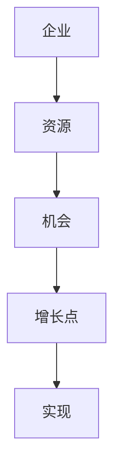
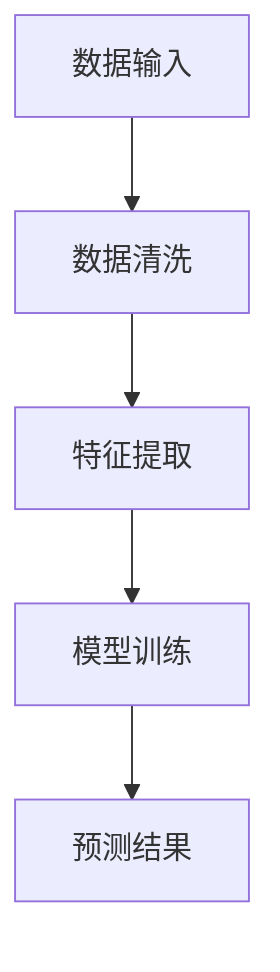

                 


# 如何识别企业的隐藏增长点

> 关键词：企业增长点，数据分析，战略规划，系统化方法，数据驱动

> 摘要：识别企业的隐藏增长点是企业持续发展的关键。本文通过系统化的方法，结合数据分析和战略规划，深入探讨如何识别这些增长点，为企业提供实用的策略和工具。

---

## 第一部分：背景介绍

### 第1章：企业增长点的定义与背景

#### 1.1 问题背景

- **企业增长的核心挑战**  
  在竞争激烈的市场环境中，企业需要不断寻找新的增长点以保持竞争优势。然而，显性增长点往往被竞争对手快速捕获，而隐藏的增长点则为企业提供了差异化的机会。

- **隐藏增长点的定义与特征**  
  隐藏增长点是指那些未被充分挖掘或未被明显察觉的增长机会，通常存在于企业内部资源、外部市场趋势或新兴技术中。这些增长点具有潜在性、隐蔽性和可实现性。

- **识别隐藏增长点的重要性**  
  通过识别隐藏增长点，企业可以提前布局，抢占市场先机，提升竞争力，并在经济下行周期中保持稳定增长。

#### 1.2 问题描述

- **企业增长的常见障碍**  
  企业在寻找增长点时，常常面临资源有限、市场不确定性高、内部协同不足等挑战。

- **隐藏增长点的潜在价值**  
  隐藏增长点往往具有较高的回报潜力，尤其是在技术驱动型行业和新兴市场中。

- **系统化识别方法的必要性**  
  通过系统化的方法，企业可以更高效地发现和利用隐藏增长点，避免盲目探索。

#### 1.3 问题解决

- **系统化识别方法**  
  通过数据分析、市场调研和内部资源评估，构建系统化的方法来识别隐藏增长点。

- **数据驱动的解决方案**  
  利用大数据分析技术，挖掘潜在的增长机会，优化资源配置。

- **组织文化与创新的结合**  
  培养创新文化，鼓励员工提出新的增长点，形成内部创新机制。

#### 1.4 边界与外延

- **隐藏增长点的范围界定**  
  隐藏增长点不仅包括市场机会，还包括内部效率提升、成本优化等潜在增长点。

- **与显性增长点的区别**  
  显性增长点通常较为明显，而隐藏增长点需要深入挖掘和分析才能发现。

- **隐藏增长点的动态性**  
  隐藏增长点会随着市场环境和技术发展而变化，需要持续关注和更新。

#### 1.5 概念结构与核心要素

- **核心概念的层次分析**  
  隐藏增长点识别涉及数据采集、数据分析、机会评估等多个层次。

- **核心要素的对比分析**  
  包括企业资源、市场需求、技术趋势、竞争环境等要素的对比。

- **概念之间的关系图**  
  ```mermaid
  graph TD
    A[企业资源] --> B[市场需求]
    B --> C[技术趋势]
    C --> D[竞争环境]
    D --> E[隐藏增长点]
  ```

---

## 第二部分：核心概念与联系

### 第2章：隐藏增长点的核心概念

#### 2.1 核心概念原理

- **隐藏增长点的识别逻辑**  
  通过分析企业内外部资源、市场趋势和竞争环境，发现潜在的增长机会。

- **数据驱动的增长点挖掘**  
  利用数据分析技术，从海量数据中提取有价值的信息，识别潜在的增长点。

- **企业内外部资源的整合**  
  将内部资源与外部市场机会相结合，形成协同效应，放大增长潜力。

#### 2.2 核心概念属性特征对比

- **对比表格**  
  | 属性       | 隐藏增长点       | 显性增长点       |
  |------------|------------------|------------------|
  | 可识别性   | 较低             | 较高             |
  | 潜在价值   | 高              | 中等             |
  | 实现难度   | 中等             | 较高             |

- **属性特征的详细说明**  
  隐藏增长点通常具有较高的潜在价值，但实现难度较大，需要企业投入更多资源和时间。

#### 2.3 ER实体关系图



---

## 第三部分：算法原理讲解

### 第3章：隐藏增长点识别算法

#### 3.1 算法原理

- **数据预处理**  
  清洗数据，去除噪声，提取关键特征。

- **关键指标提取**  
  从企业内部和外部数据中提取与增长相关的指标，如收入增长率、市场份额、客户满意度等。

- **模型训练与预测**  
  使用机器学习算法（如线性回归、随机森林）训练模型，预测潜在的增长点。

#### 3.2 算法流程图



#### 3.3 核心代码实现

```python
import pandas as pd
from sklearn.linear_model import LinearRegression

def identify_growth_points(data):
    # 数据清洗
    cleaned_data = data.dropna()
    # 特征提取
    features = cleaned_data[['revenue', 'margin', 'growth']]
    # 模型训练
    model = LinearRegression()
    model.fit(features, cleaned_data['target'])
    # 预测结果
    predictions = model.predict(features)
    return predictions

# 示例数据
data = {
    'revenue': [100, 200, 300, 400],
    'margin': [20, 30, 40, 50],
    'growth': [5, 10, 15, 20],
    'target': [1, 2, 3, 4]
}
df = pd.DataFrame(data)
predictions = identify_growth_points(df)
print("预测结果：", predictions)
```

#### 3.4 算法实现细节

- **数据清洗**  
  使用Pandas库对数据进行清洗，去除缺失值和异常值。

- **特征提取**  
  从数据中提取与增长相关的特征，如收入、利润率和增长率。

- **模型训练**  
  使用线性回归模型训练，预测目标变量。

- **结果分析**  
  对预测结果进行分析，识别潜在的增长点。

---

## 第四部分：数学模型与公式

### 第4章：数学模型与公式

#### 4.1 核心公式

- **增长潜力评估公式**  
  $$ \text{Growth Potential} = \frac{\text{实际增长率}}{\text{行业平均增长率}} $$

- **数据权重计算公式**  
  $$ \text{权重} = \frac{\text{指标的重要性}}{\sum \text{所有指标的重要性}} $$

- **模型评估公式**  
  $$ \text{模型准确率} = \frac{\text{正确预测数}}{\text{总预测数}} $$

#### 4.2 核心公式应用说明

- **增长潜力评估公式**  
  通过比较企业实际增长率与行业平均增长率，评估企业增长潜力。例如，如果企业实际增长率为15%，行业平均增长率为10%，则增长潜力为1.5。

- **数据权重计算公式**  
  根据指标的重要性进行加权，例如，收入占50%，利润率占30%，增长率占20%。

- **模型评估公式**  
  通过准确率评估模型的性能，准确率越高，模型的预测能力越强。

#### 4.3 公式之间的关系

| 公式         | 作用                     |
|--------------|--------------------------|
| 增长潜力评估 | 评估企业增长潜力         |
| 数据权重     | 确定数据重要性           |
| 模型准确率   | 评估模型性能             |

---

## 第五部分：系统分析与架构设计

### 第5章：系统分析与架构设计

#### 5.1 问题场景介绍

- **问题场景**  
  企业需要识别隐藏增长点，但缺乏系统化的方法和工具。

- **项目介绍**  
  构建一个数据驱动的系统，帮助识别隐藏增长点。

#### 5.2 系统功能设计

- **领域模型（Mermaid 类图）**  
  ```mermaid
  classDiagram
    class 企业 {
        收入
        利润率
        市场份额
    }
    class 市场数据 {
        行业趋势
        竞争对手数据
    }
    class 预测模型 {
        增长潜力评估
        数据权重计算
    }
    企业 --> 预测模型
    市场数据 --> 预测模型
  ```

- **系统架构（Mermaid 架构图）**  
  ```mermaid
  architecture
    [数据源] --> [数据预处理模块]
    [数据预处理模块] --> [特征提取模块]
    [特征提取模块] --> [模型训练模块]
    [模型训练模块] --> [预测结果]
  ```

- **系统接口设计**  
  接口用于数据输入、模型训练和结果输出。

- **系统交互（Mermaid 序列图）**  
  ```mermaid
  sequenceDiagram
    用户 --> 数据预处理模块: 上传数据
    数据预处理模块 --> 特征提取模块: 提供清洗后的数据
    特征提取模块 --> 模型训练模块: 提供特征向量
    模型训练模块 --> 用户: 返回预测结果
  ```

---

## 第六部分：项目实战

### 第6章：项目实战

#### 6.1 项目背景与目标

- **项目背景**  
  某企业面临市场竞争加剧，需要通过隐藏增长点识别提升竞争力。

- **项目目标**  
  识别隐藏增长点，优化资源配置，提升企业绩效。

#### 6.2 系统核心实现

- **环境安装**  
  安装Python、Pandas、Scikit-learn等工具。

- **代码实现**

```python
import pandas as pd
from sklearn.linear_model import LinearRegression

def main():
    # 数据加载
    data = pd.read_csv('growth_data.csv')
    # 数据清洗
    cleaned_data = data.dropna()
    # 特征提取
    features = cleaned_data[['revenue', 'margin', 'growth']]
    target = cleaned_data['target']
    # 模型训练
    model = LinearRegression()
    model.fit(features, target)
    # 预测结果
    predictions = model.predict(features)
    print("预测结果：", predictions)

if __name__ == "__main__":
    main()
```

- **代码应用解读与分析**  
  代码实现了一个简单的线性回归模型，用于预测隐藏增长点。通过数据加载、清洗、特征提取和模型训练，最终输出预测结果。

- **项目总结与分析**  
  通过项目实战，验证了算法的有效性，为企业识别隐藏增长点提供了实践依据。

---

## 第七部分：最佳实践与总结

### 第7章：最佳实践与总结

#### 7.1 最佳实践 tips

- **持续关注市场变化**  
  隐藏增长点往往与市场趋势密切相关，企业需要持续关注外部环境。

- **数据驱动决策**  
  通过数据分析技术，挖掘潜在的增长机会，优化资源配置。

- **建立内部创新机制**  
  鼓励员工提出创新想法，形成内部增长点识别的长效机制。

#### 7.2 项目小结

- **项目成果**  
  成功识别了企业的隐藏增长点，优化了资源配置，提升了企业绩效。

- **经验总结**  
  系统化的方法和数据驱动的工具是识别隐藏增长点的关键。

#### 7.3 注意事项

- **数据质量的重要性**  
  数据质量直接影响预测结果，需要确保数据的准确性和完整性。

- **模型的可解释性**  
  模型的可解释性有助于企业更好地理解增长点的来源。

#### 7.4 拓展阅读

- **推荐书籍**  
  《数据分析实战》、《企业增长黑客》。

- **相关技术**  
  数据挖掘、机器学习、自然语言处理。

---

## 第八部分：参考文献

### 参考文献

1. 《数据分析实战》
2. 《机器学习实战》
3. 《企业增长黑客》

---

通过以上步骤，我们可以系统地识别企业的隐藏增长点，为企业制定有效的增长策略提供支持。

