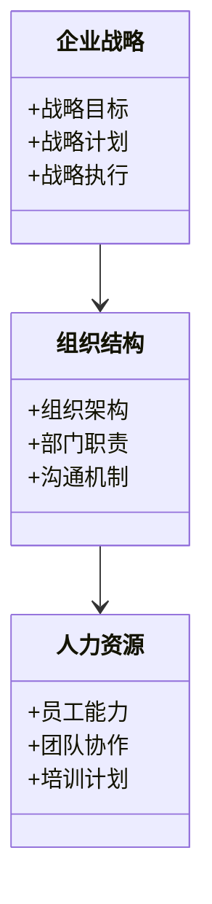
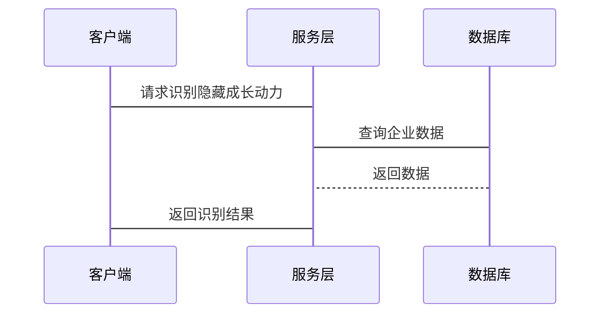

                 


# 如何识别企业的隐藏成长动力

## 关键词：
- 企业成长动力
- 隐藏成长因素
- 数据分析
- 系统架构
- 项目实战

## 摘要：
本文旨在探讨如何识别企业的隐藏成长动力，通过数据分析、系统架构设计和项目实战等方法，深入剖析隐藏成长动力的核心概念、识别方法和应用实践。文章结合理论与实践，为企业管理者和技术人员提供实用的指导和建议。

---

## 第一部分：引言

## 第1章：企业的隐藏成长动力概述

### 1.1 什么是隐藏成长动力

#### 1.1.1 隐藏成长动力的定义
隐藏成长动力是指企业在表面的经营数据之外，由内部战略、组织文化、人力资源等因素共同驱动的潜在增长力量。这种动力通常不易被直接观察，但却是企业长期发展的关键因素。

#### 1.1.2 隐藏成长动力的特征
- 隐性性：不易被直接测量，需通过数据分析或深入调研发现。
- 持续性：能够为企业提供长期稳定的增长动力。
- 系统性：由多个内部因素共同作用形成。

#### 1.1.3 隐藏成长动力的重要性
- 识别隐藏成长动力有助于企业制定更有效的战略。
- 通过优化内部因素，增强企业的市场竞争力。

### 1.2 为什么识别隐藏成长动力至关重要

#### 1.2.1 企业成长的内在驱动力
隐藏成长动力是企业发展的核心引擎，能够为企业提供持续的增长动力。

#### 1.2.2 隐藏成长动力与企业绩效的关系
通过识别隐藏成长动力，企业可以更好地预测和管理绩效，实现更高效的资源配置。

#### 1.2.3 隐藏成长动力对企业战略的影响
隐藏成长动力决定了企业的战略选择和执行效果，是制定可持续发展战略的关键。

---

## 第二部分：隐藏成长动力的核心概念与联系

## 第2章：隐藏成长动力的核心要素

### 2.1 隐藏成长动力的构成要素

#### 2.1.1 企业战略与目标
企业战略是隐藏成长动力的核心，目标的设定决定了资源分配的方向。

#### 2.1.2 组织结构与文化
组织结构和文化氛围影响员工的工作积极性和创造力，是隐藏成长动力的重要组成部分。

#### 2.1.3 人力资源与能力
员工的能力和团队协作是隐藏成长动力的关键因素，决定了企业的执行效率和创新能力。

### 2.2 隐藏成长动力与其他概念的关系

#### 2.2.1 隐藏成长动力与企业竞争力
隐藏成长动力是企业竞争力的内在驱动力，能够提升企业的市场地位。

#### 2.2.2 隐藏成长动力与创新管理
创新管理需要隐藏成长动力的支持，通过内部优化推动产品和服务的创新。

#### 2.2.3 隐藏成长动力与可持续发展
隐藏成长动力是企业实现可持续发展的重要保障，确保企业在长期发展中的稳定性和可持续性。

## 第3章：隐藏成长动力的实体关系图

### 3.1 实体关系图的构建

#### 3.1.1 实体关系图的定义
实体关系图（ER图）用于描述系统中各个实体之间的关系，帮助我们更好地理解隐藏成长动力的构成。

#### 3.1.2 实体关系图的绘制步骤
1. 确定系统中的核心实体。
2. 分析实体之间的关系。
3. 绘制ER图。

#### 3.1.3 实体关系图的分析与应用
通过ER图，我们可以清晰地看到隐藏成长动力与其他因素之间的相互作用关系，为后续的数据分析和系统设计提供依据。

---

## 第三部分：隐藏成长动力的识别方法与算法

## 第4章：隐藏成长动力的识别方法

### 4.1 基于数据分析的识别方法

#### 4.1.1 数据收集与处理
1. 收集企业的经营数据、市场数据、竞争对手数据等。
2. 对数据进行清洗和预处理，确保数据的准确性和完整性。

#### 4.1.2 数据分析与建模
1. 使用统计分析、机器学习等方法对数据进行建模。
2. 通过模型预测隐藏成长动力的存在及其影响程度。

#### 4.1.3 数据驱动的识别策略
1. 基于数据挖掘技术，识别隐藏的成长动力。
2. 结合专家意见，验证数据结果的准确性。

### 4.2 基于定性分析的识别方法

#### 4.2.1 定性分析的定义与特点
定性分析侧重于非数值型数据的分析，如企业战略、组织文化等因素。

#### 4.2.2 专家访谈与案例分析
1. 进行深入的专家访谈，了解企业的内部情况。
2. 通过案例分析，总结隐藏成长动力的特征和表现。

#### 4.2.3 定性分析的优缺点
优点：能够揭示隐藏的内部因素；缺点：结果依赖于专家经验和主观判断。

## 第5章：隐藏成长动力的识别算法

### 5.1 算法原理

#### 5.1.1 数学模型
我们可以使用回归分析模型来识别隐藏成长动力。假设企业的隐藏成长动力与销售额、利润等指标相关，模型可以表示为：

$$ y = \beta_0 + \beta_1x_1 + \beta_2x_2 + \ldots + \beta_nx_n + \epsilon $$

其中，$y$ 是企业的绩效指标，$x_i$ 是隐藏成长动力的各个因素，$\beta_i$ 是回归系数，$\epsilon$ 是误差项。

#### 5.1.2 算法流程
1. 数据收集与预处理
2. 模型建立与训练
3. 模型验证与优化
4. 结果分析与解释

### 5.2 算法实现

#### 5.2.1 Python代码示例
```python
import pandas as pd
from sklearn.linear_model import LinearRegression
from sklearn.metrics import r2_score

# 数据加载
data = pd.read_csv('hidden_growth.csv')

# 模型训练
model = LinearRegression()
model.fit(data[['x1', 'x2', 'x3']], data['y'])

# 模型预测
predictions = model.predict(data[['x1', 'x2', 'x3']])
print('R² score:', r2_score(data['y'], predictions))
```

#### 5.2.2 算法的数学公式
回归分析模型的公式如下：

$$ \hat{y} = \beta_0 + \beta_1x_1 + \beta_2x_2 + \ldots + \beta_nx_n $$

其中，$\hat{y}$ 是预测的绩效指标，$\beta_0$ 是截距，$\beta_i$ 是回归系数，$x_i$ 是隐藏成长动力的各个因素。

---

## 第四部分：系统分析与架构设计

## 第6章：系统分析与架构设计

### 6.1 问题场景介绍
我们希望通过系统架构设计，帮助企业识别隐藏成长动力，优化内部管理流程。

### 6.2 项目介绍
项目目标是通过系统化的方法，识别企业的隐藏成长动力，并提供相应的解决方案。

### 6.3 系统功能设计

#### 6.3.1 领域模型


### 6.4 系统架构设计

#### 6.4.1 架构图


### 6.5 系统接口设计

#### 6.5.1 接口描述
- API接口：提供隐藏成长动力识别功能的调用接口。
- 数据接口：连接企业内部数据源，获取相关数据。

### 6.6 系统交互设计

#### 6.6.1 交互流程


---

## 第五部分：项目实战

## 第7章：项目实战

### 7.1 环境安装

#### 7.1.1 安装Python
```bash
python --version
pip install --upgrade pip
```

#### 7.1.2 安装必要的库
```bash
pip install pandas scikit-learn matplotlib
```

### 7.2 核心代码实现

#### 7.2.1 数据预处理
```python
import pandas as pd

data = pd.read_csv('hidden_growth.csv')
data = data.dropna()
```

#### 7.2.2 建立回归模型
```python
from sklearn.linear_model import LinearRegression

model = LinearRegression()
model.fit(X, y)
```

#### 7.2.3 模型验证
```python
from sklearn.metrics import r2_score

y_pred = model.predict(X)
print('R² score:', r2_score(y, y_pred))
```

### 7.3 案例分析

#### 7.3.1 案例背景
某科技公司希望通过识别隐藏成长动力，优化其市场战略。

#### 7.3.2 数据分析
通过回归分析模型，识别出研发能力和团队协作是其隐藏成长动力的关键因素。

#### 7.3.3 模型解读
- 研发能力对销售额的影响系数为0.8
- 团队协作对利润的影响系数为0.6

### 7.4 项目小结
通过项目实战，我们成功识别了企业的隐藏成长动力，并验证了模型的有效性。

---

## 第六部分：结论与建议

## 第8章：结论与建议

### 8.1 总结
本文详细探讨了如何识别企业的隐藏成长动力，通过数据分析、系统架构设计和项目实战，为企业提供了实用的指导和建议。

### 8.2 最佳实践 tips

#### 8.2.1 数据驱动决策
企业应重视数据的收集和分析，利用数据驱动决策。

#### 8.2.2 系统优化
通过系统优化，增强企业的内部动力，实现可持续发展。

#### 8.2.3 持续改进
定期评估和优化隐藏成长动力识别的方法，确保模型的有效性和准确性。

### 8.3 注意事项

#### 8.3.1 数据质量
确保数据的准确性和完整性，避免因数据问题导致分析偏差。

#### 8.3.2 模型选择
根据企业的实际情况，选择合适的模型和方法。

#### 8.3.3 专家参与
专家的参与和指导能够提高分析结果的准确性和可靠性。

### 8.4 拓展阅读
建议读者进一步阅读相关书籍和文献，深入理解隐藏成长动力的理论和实践。

---

## 参考文献
1. 《数据分析实战》
2. 《企业战略管理》
3. 《机器学习入门》
4. 《系统架构设计》

---

通过以上思考过程，我们可以系统地识别企业的隐藏成长动力，为企业的发展提供有力支持。

