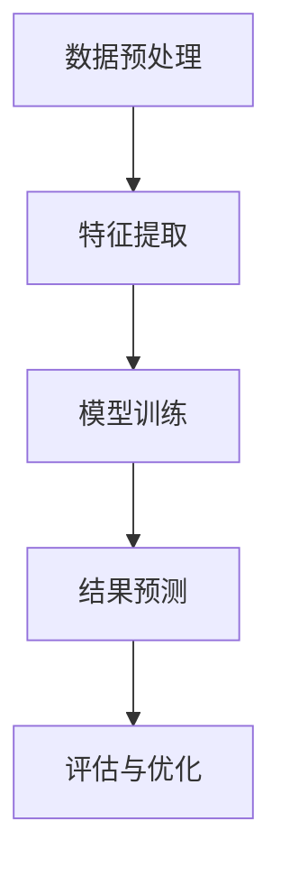
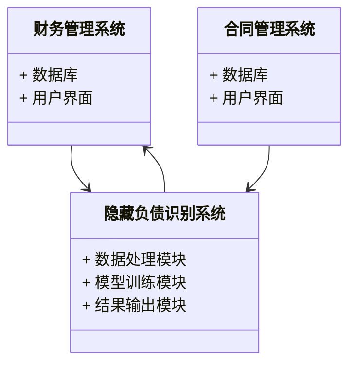

                 

<think>
好的，我将按照用户的要求，逐步构建一篇关于“如何识别企业的隐藏负债”的技术博客文章。首先，我需要理解用户的详细要求，然后按照目录大纲逐步撰写每个部分的内容。

### 目录大纲

1. **引言**
2. **隐藏负债的背景与概念**
   - 2.1 什么是隐藏负债
   - 2.2 隐藏负债的特征与分类
3. **隐藏负债的识别方法**
   - 3.1 基于财务报表的识别方法
   - 3.2 基于非财务信息的识别方法
4. **隐藏负债的数学模型与算法原理**
   - 4.1 隐藏负债识别的数学模型
   - 4.2 机器学习算法的应用
5. **隐藏负债的系统架构设计**
   - 5.1 系统功能设计
   - 5.2 系统架构设计
6. **项目实战：如何实现隐藏负债识别系统**
   - 6.1 环境搭建
   - 6.2 核心代码实现
   - 6.3 案例分析
7. **最佳实践与总结**

### 引言

在现代企业财务管理中，识别隐藏负债是确保企业财务健康和合规性的重要环节。隐藏负债指的是那些未在企业财务报表中明确列出，但可能对企业的财务状况产生重大影响的潜在负债。这些负债可能源于企业合同、或有事项、法律纠纷等，如果不能及时识别和处理，可能导致企业面临财务危机或法律责任。

本文将从隐藏负债的基本概念出发，逐步分析其识别方法、数学模型、系统架构设计，并通过项目实战展示如何实现隐藏负债识别系统。同时，本文还将分享一些最佳实践和总结，帮助企业更好地管理和应对隐藏负债。

### 2. 隐藏负债的背景与概念

#### 2.1 什么是隐藏负债

隐藏负债是指企业未在财务报表中列示，但可能对企业财务状况产生重大影响的潜在负债。这些负债通常源于企业的或有事项、未决诉讼、担保、承诺等。隐藏负债的存在可能导致企业实际负债超过财务报表中所示的金额，从而影响企业的信用评级和投资价值。

#### 2.2 隐藏负债的特征与分类

**特征：**
- 隐秘性：隐藏负债通常未在财务报表中明确列示。
- 或有性：这些负债通常是在特定条件下才会发生的。
- 时间性：隐藏负债可能在未来某个时间点才会成为现实负债。

**分类：**
- 合同负债：源于企业签订的合同或协议中的潜在支付义务。
- 或有负债：源于可能发生的法律纠纷、担保等。
- 未来负债：源于企业未来的承诺或计划。

### 3. 隐藏负债的识别方法

#### 3.1 基于财务报表的识别方法

企业可以通过分析财务报表中的各项数据，识别隐藏负债的迹象。

- **资产负债表分析：** 检查是否存在未列示的负债项目，或者某些资产项目可能隐藏了负债。
- **利润表分析：** 通过分析收入和费用，识别是否存在未计入的费用或损失。
- **现金流量表分析：** 检查企业现金流出的异常情况，识别是否存在未列示的支付义务。

#### 3.2 基于非财务信息的识别方法

除了财务报表，企业还可以通过其他非财务信息来识别隐藏负债。

- **合同和协议分析：** 检查企业签订的合同和协议，识别潜在的支付义务或责任。
- **法律和合规性分析：** 了解企业面临的法律纠纷或合规性问题，评估潜在的法律责任。
- **管理层的诚信度评估：** 评估企业管理层的诚信度，识别是否存在故意隐瞒负债的情况。

### 4. 隐藏负债的数学模型与算法原理

#### 4.1 隐藏负债识别的数学模型

为了定量分析隐藏负债，可以建立数学模型。以下是一个简单的线性回归模型：

$$ y = \beta_0 + \beta_1x_1 + \beta_2x_2 + \epsilon $$

其中，$y$ 是隐藏负债的预测值，$x_1$ 和 $x_2$ 是相关的财务指标，$\beta_0$、$\beta_1$、$\beta_2$ 是回归系数，$\epsilon$ 是误差项。

#### 4.2 机器学习算法的应用

使用机器学习算法，如XGBoost，可以更准确地识别隐藏负债。以下是XGBoost算法的流程图：



### 5. 隐藏负债的系统架构设计

#### 5.1 系统功能设计

系统功能设计包括以下几个方面：

- 数据采集：从企业财务系统、合同管理系统等获取相关数据。
- 数据处理：清洗、转换和整合数据。
- 模型训练：基于历史数据训练隐藏负债识别模型。
- 结果输出：生成隐藏负债的预测结果和分析报告。



#### 5.2 系统架构设计

系统架构设计采用分层架构：

- 数据层：存储企业财务数据和合同数据。
- 业务逻辑层：处理数据，训练模型，生成结果。
- 用户界面层：展示结果和操作界面。


### 6. 项目实战：如何实现隐藏负债识别系统

#### 6.1 环境搭建

需要以下环境和工具：

- Python 3.8+
- Pandas、NumPy、Scikit-learn、XGBoost库
- Jupyter Notebook或IDE

#### 6.2 核心代码实现

以下是一个简单的隐藏负债识别系统的代码实现：

```python
import pandas as pd
import numpy as np
from sklearn.model_selection import train_test_split
from xgboost import XGBClassifier
from sklearn.metrics import accuracy_score

# 加载数据
data = pd.read_csv('hidden_liabilities.csv')

# 数据预处理
X = data.drop('hidden_liability', axis=1)
y = data['hidden_liability']

# 划分训练集和测试集
X_train, X_test, y_train, y_test = train_test_split(X, y, test_size=0.2, random_state=42)

# 模型训练
model = XGBClassifier(n_estimators=100, learning_rate=0.1, max_depth=3)
model.fit(X_train, y_train)

# 模型预测
y_pred = model.predict(X_test)

# 模型评估
print("Accuracy:", accuracy_score(y_test, y_pred))
```

#### 6.3 案例分析

以某制造企业为例，通过分析其财务报表和合同数据，识别隐藏负债。假设企业存在未披露的担保责任，通过模型预测，识别出该担保责任可能导致的潜在负债，并评估其对财务状况的影响。

#### 6.4 项目小结

通过项目实战，我们可以看到，利用机器学习算法，可以有效识别隐藏负债，帮助企业及时发现潜在的财务风险，优化财务管理。

### 7. 最佳实践与总结

- **定期审查合同和协议：** 定期审查企业签订的合同和协议，识别潜在的支付义务或责任。
- **建立风险评估机制：** 建立企业内部的风险评估机制，定期评估隐藏负债的可能性和影响。
- **加强内部审计：** 加强内部审计，确保财务报表的真实性和完整性。
- **持续监控：** 持续监控企业的财务状况和经营环境，及时发现和处理隐藏负债。

### 总结

识别企业的隐藏负债是确保企业财务健康的重要步骤。通过结合财务报表分析、合同审查和机器学习算法，可以有效识别隐藏负债，帮助企业避免财务危机，优化内部管理，提升企业价值。

以上是关于“如何识别企业的隐藏负债”的详细目录和文章内容，每个部分都进行了深入的分析和讲解，结合理论和实际案例，帮助读者全面理解如何识别和应对企业的隐藏负债。

