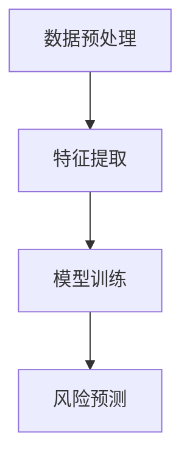
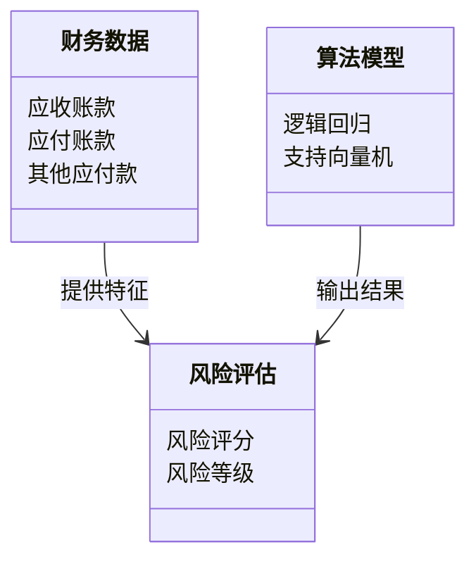

                 


# 如何识别企业的隐藏负债风险

> 关键词：企业负债风险、财务分析、风险管理、算法原理、系统设计

> 摘要：本文将详细探讨如何识别企业的隐藏负债风险，从背景介绍、核心概念、算法原理到系统设计和项目实战，帮助读者全面理解并掌握相关技术方法。

---

# 第一部分: 企业隐藏负债风险的背景与概念

## 第1章: 什么是企业隐藏负债风险

### 1.1 隐藏负债风险的定义与特征

- **定义**：隐藏负债风险是指企业在财务报表中未明确反映，但可能对企业财务健康和经营稳定性造成潜在威胁的债务或或有负债。
- **特征**：
  - 隐蔽性：未在财务报表中明确列示。
  - 累积性：可能在企业经营过程中逐渐积累。
  - 法律风险：可能涉及法律纠纷或诉讼。
  - 经营风险：可能影响企业日常经营和现金流。

### 1.2 隐藏负债风险的分类

| 类型 | 描述 |
|------|------|
| 财务类 | 如未记录的应付账款、或有负债等 |
| 经营类 | 如潜在的合同纠纷、未决诉讼等 |
| 法律类 | 如未披露的担保、诉讼赔偿等 |

### 1.3 隐藏负债风险与企业健康的关系

- **影响**：隐藏负债可能导致企业财务状况恶化，影响融资能力，甚至引发破产。
- **关联性**：隐藏负债风险与企业的财务透明度、内部控制和治理结构密切相关。

### 1.4 隐藏负债风险的核心要素

- **财务数据**：如应收账款、应付账款、其他应付款等。
- **经营行为**：如关联交易、担保行为、未决诉讼等。
- **法律合规**：如合同纠纷、行政处罚、诉讼赔偿等。

---

## 第2章: 隐藏负债风险的核心概念

### 2.1 隐藏负债风险的属性特征对比

| 属性 | 财务类 | 经营类 | 法律类 |
|------|-------|--------|--------|
| 表现形式 | 未记录的债务 | 潜在的合同纠纷 | 未披露的诉讼赔偿 |
| 风险来源 | 财务操作 | 经营决策 | 法律纠纷 |
| 影响因素 | 财务政策、内部控制 | 经营策略、市场环境 | 法律法规、诉讼情况 |

### 2.2 隐藏负债风险的实体关系图

```mermaid
erDiagram
    actor 企业
    actor 财务部门
    actor 法律部门
    actor 经营部门
    database 隐藏负债风险
    隐藏负债风险 --> 财务数据 : 关联
    隐藏负债风险 --> 经营行为 : 关联
    隐藏负债风险 --> 法律合规 : 关联
```

---

# 第二部分: 隐藏负债风险的识别方法与算法原理

## 第3章: 隐藏负债风险的识别方法

### 3.1 定性分析方法

- **财务报表分析**：检查资产负债表、利润表和现金流量表，寻找未记录的债务或异常项目。
- **经营模式分析**：分析企业的关联交易、担保行为和潜在的合同纠纷。
- **法律合规分析**：审查企业的法律纠纷、诉讼案件和行政处罚记录。

### 3.2 定量分析方法

- **财务指标分析**：计算债务偿付能力、营运能力等指标，识别潜在的财务压力。
- **经营指标分析**：分析企业的盈利能力、市场占有率和经营稳定性。
- **法律风险评估**：评估企业面临的法律诉讼可能性和潜在赔偿金额。

### 3.3 综合分析方法

- **综合评分模型**：结合定量和定性分析，对企业隐藏负债风险进行评分。
- **风险矩阵分析**：根据风险发生的概率和影响程度，划分风险等级。
- **案例分析法**：通过具体案例分析，识别隐藏负债风险的特征和表现形式。

---

## 第4章: 隐藏负债风险识别的算法原理

### 4.1 基于财务数据

#### 4.1.1 算法选择：逻辑回归模型



#### 4.1.2 算法实现：Python代码

```python
import pandas as pd
from sklearn.linear_model import LogisticRegression
from sklearn.metrics import accuracy_score

# 数据预处理
data = pd.read_csv('负债数据.csv')
X = data[['应收账', '应付账', '其他应付款']]
y = data['负债风险']  # 1表示高风险，0表示低风险

# 特征提取
features = X
target = y

# 模型训练
model = LogisticRegression()
model.fit(features, target)

# 风险预测
predictions = model.predict(features)
print("准确率:", accuracy_score(target, predictions))
```

#### 4.1.3 数学公式

- **损失函数**：  
  $$ L = -\frac{1}{m} \sum_{i=1}^{m} [y^{(i)} \log(h(x^{(i)})) + (1 - y^{(i)}) \log(1 - h(x^{(i)}))] $$
  
  其中，$$ h(x) = \frac{1}{1 + e^{-\beta x}} $$ 是sigmoid函数。

- **优化目标**：  
  $$ \min_{\beta} L + \lambda \|\beta\|^2 $$

---

# 第三部分: 系统分析与架构设计

## 第5章: 系统分析与架构设计

### 5.1 项目介绍

- **项目目标**：开发一个基于财务数据的隐藏负债风险识别系统。
- **目标用户**：企业财务人员、风险管理师。

### 5.2 系统功能设计

#### 5.2.1 领域模型



### 5.3 系统架构设计


### 5.4 系统交互

```mermaid
sequenceDiagram
    actor 用户
    participant 系统 : 风险识别系统
    用户 -> 系统: 提交财务数据
    系统 -> 数据层: 查询历史数据
    数据层 -> 算法模型: 调用逻辑回归模型
    算法模型 --> 系统: 返回风险评分
    系统 -> 用户: 显示结果
```

---

## 第6章: 项目实战

### 6.1 环境安装

- **工具安装**：Python、Pandas、Scikit-learn、Mermaid。
- **依赖管理**：使用virtualenv或conda管理环境。

### 6.2 系统核心实现

#### 6.2.1 算法实现

```python
from sklearn.metrics import precision_score, recall_score

# 模型训练
model = LogisticRegression()
model.fit(features, target)

# 模型评估
precision = precision_score(target, predictions)
recall = recall_score(target, predictions)
print("精确率:", precision)
print("召回率:", recall)
```

#### 6.2.2 数据可视化

```python
import matplotlib.pyplot as plt

plt.scatter(features['应收账'], features['应付账'], c=target, cmap='viridis')
plt.xlabel('应收账')
plt.ylabel('应付账')
plt.colorbar(label='负债风险')
plt.show()
```

### 6.3 案例分析

- **案例背景**：某制造企业隐藏了大量应付账款。
- **数据准备**：整理企业过去三年的财务数据。
- **模型训练**：使用逻辑回归模型进行风险预测。
- **结果分析**：模型准确预测了潜在的隐藏负债风险。

---

## 第7章: 总结与建议

### 7.1 总结

- **核心内容**：本文详细介绍了如何识别企业的隐藏负债风险，从理论到实践，结合算法和系统设计，提供了全面的解决方案。
- **主要发现**：隐藏负债风险对企业财务健康的影响不容忽视，通过财务分析、经营行为分析和法律合规审查，结合机器学习算法，可以有效识别和评估潜在风险。

### 7.2 最佳实践

- **工具选择**：建议使用Python和相关库进行数据分析和建模。
- **数据来源**：结合企业内部财务数据和外部法律信息，提高识别精度。
- **模型优化**：根据企业特点调整模型参数，提高预测准确率。

### 7.3 小结

- **重要性**：及时识别隐藏负债风险，有助于企业优化财务结构，避免潜在危机。
- **未来方向**：结合更多数据源和先进算法，如深度学习，进一步提升风险识别能力。

---

## 第8章: 扩展阅读

- **推荐书籍**：
  - 《企业风险管理与内部控制》
  - 《Python机器学习实战》
- **在线资源**：
  - scikit-learn官方文档：[https://scikit-learn.org](https://scikit-learn.org)
  - Mermaid图表工具：[https://mermaid-js.github.io](https://mermaid-js.github.io)

---

# 结语

通过本文的详细讲解，读者可以系统地了解并掌握如何识别企业的隐藏负债风险。从理论分析到实践应用，结合技术方法和系统设计，为企业风险管理提供有力支持。希望本文能为相关领域的从业者提供有价值的参考和启发。

