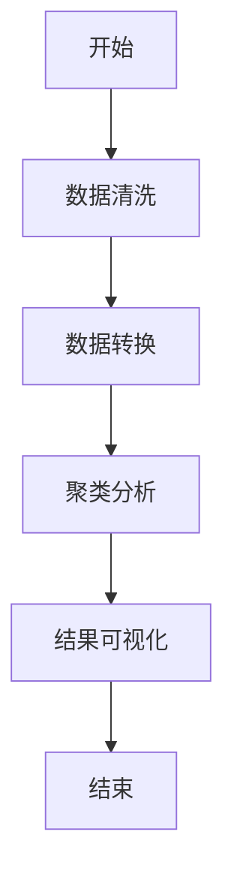
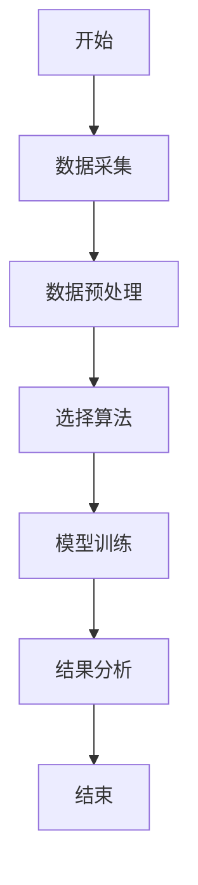
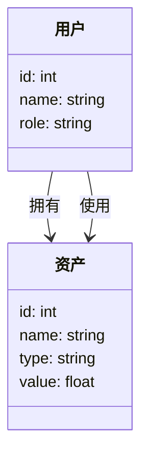
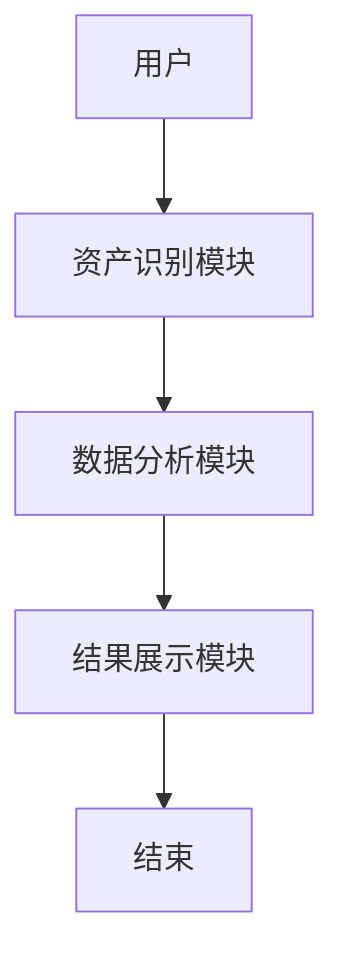

                 


# 如何识别企业的隐藏资产

> 关键词：隐藏资产，资产识别，数据分析，企业价值，风险管理

> 摘要：本文将详细探讨如何识别企业的隐藏资产，包括其定义、分类、识别方法、算法原理、系统设计以及实际应用案例。通过本文，读者将能够掌握识别隐藏资产的关键步骤和实用技巧。

---

## 第一章: 隐藏资产的基本概念

### 1.1 隐藏资产的定义与分类

#### 1.1.1 隐藏资产的定义
隐藏资产是指那些不易被直接观察或测量，但对企业价值、竞争优势和未来发展具有重要影响的资源或能力。与传统资产（如固定资产、流动资产）不同，隐藏资产通常以无形资产或潜在价值的形式存在。

#### 1.1.2 隐藏资产的分类
隐藏资产可以分为以下几类：
1. **数据资产**：包括企业内部数据、客户数据、市场数据等。
2. **知识资产**：包括员工技能、技术诀窍、知识产权等。
3. **客户关系**：包括长期客户关系、客户忠诚度等。
4. **品牌价值**：包括企业品牌、声誉等。
5. **组织能力**：包括团队协作能力、创新能力等。

#### 1.1.3 隐藏资产与传统资产的对比
| 特性        | 隐藏资产                     | 传统资产                     |
|-------------|------------------------------|------------------------------|
| 形态        | 无形，难以量化               | 有形，可量化                 |
| 存在形式     | 数据、知识、关系、品牌等      | 物资、资金、设备等            |
| 价值评估     | 需要专业方法评估             | 直接通过市场价值评估         |
| 变现难度     | 需要特定策略和渠道           | 直接可变现                   |

---

### 1.2 隐藏资产识别的重要性

#### 1.2.1 隐藏资产对企业价值的影响
隐藏资产是企业核心竞争力的重要来源。例如，客户关系的强弱直接影响企业的收入和市场份额，而数据资产的利用效率则决定了企业的创新能力。

#### 1.2.2 隐藏资产对企业风险管理的意义
隐藏资产的保护是企业风险管理的重要部分。例如，数据泄露可能引发巨大的经济损失和声誉损失，而品牌价值的损失也可能影响企业的长期发展。

#### 1.2.3 隐藏资产对企业竞争优势的作用
在竞争激烈的市场中，隐藏资产往往成为企业的差异化优势。例如，独特的技术诀窍或高效的组织能力可以帮助企业在市场上占据领先地位。

---

### 1.3 隐藏资产识别的背景与现状

#### 1.3.1 企业资产管理的演变
随着企业规模的扩大和技术的进步，传统的资产管理方式逐渐暴露出不足。隐藏资产的识别成为现代企业资产管理的重要组成部分。

#### 1.3.2 隐藏资产识别的挑战
- 技术复杂性：隐藏资产的识别需要结合数据分析、人工智能等多种技术。
- 主观性：隐藏资产的价值往往需要结合企业的具体情况进行评估，具有一定的主观性。
- 数据隐私：隐藏资产的识别可能涉及大量敏感数据，数据隐私问题需要妥善处理。

#### 1.3.3 当前隐藏资产识别的技术趋势
随着大数据和人工智能技术的发展，隐藏资产的识别方法也在不断创新。例如，基于机器学习的隐藏资产识别算法正在逐步应用于实际场景。

---

## 第二章: 隐藏资产的核心概念与联系

### 2.1 隐藏资产的核心概念

#### 2.1.1 资产的定义与属性
资产是指企业拥有或控制的资源，能够为企业带来经济利益。资产可以是有形的（如设备、房地产）或无形的（如品牌、专利）。

#### 2.1.2 隐藏资产的特征与属性
- 隐性性：难以直接观察或测量。
- 潜在性：具有未来的经济价值。
- 依附性：依赖于企业的组织结构和运营模式。

#### 2.1.3 隐藏资产与其他资产的关系
隐藏资产与传统资产相辅相成。例如，数据资产可以提升设备的使用效率，而品牌价值可以增加产品的市场售价。

---

### 2.2 隐藏资产的分类与特征对比

#### 2.2.1 隐藏资产的分类
- **数据资产**：包括结构化数据（如数据库）和非结构化数据（如文档、邮件）。
- **知识资产**：包括技术诀窍、员工技能、知识产权等。
- **客户关系**：包括直接客户和间接客户的关系网络。
- **品牌价值**：包括品牌知名度、品牌忠诚度等。
- **组织能力**：包括团队协作能力、创新能力等。

#### 2.2.2 隐藏资产与非隐藏资产的对比
| 特性        | 隐藏资产                     | 非隐藏资产                   |
|-------------|------------------------------|------------------------------|
| 可见性       | 难以直接观察                 | 可以直接观察                 |
| 价值评估     | 需要专业方法评估             | 可直接通过市场价值评估       |
| 管理难度     | 较高，需要特殊策略           | 较低，常规管理即可           |

---

### 2.3 隐藏资产的ER实体关系图

#### 2.3.1 实体关系图的定义
实体关系图（ER图）是一种用于描述数据库结构的工具，可以帮助我们更好地理解数据之间的关系。

#### 2.3.2 隐藏资产的实体关系图设计

```mermaid
erd
    title 隐藏资产实体关系图

    User
        id: int, 唯一标识符
        name: string, 用户名称
        role: string, 用户角色

    Asset
        id: int, 唯一标识符
        name: string, 资产名称
        type: string, 资产类型
        value: float, 资产价值

    Relationship
        id: int, 唯一标识符
        user_id: int, 用户外键
        asset_id: int, 资产外键
        relationship_type: string, 关系类型（如“拥有”、“使用”）

    User -|{拥有}|-> Asset
    User -|{使用}|-> Asset
```

---

#### 2.3.3 实体关系图的应用
通过ER图，我们可以清晰地看到用户与资产之间的关系，从而更好地进行隐藏资产的识别和管理。

---

## 第三章: 隐藏资产识别的算法原理

### 3.1 隐藏资产识别的算法概述

#### 3.1.1 数据分析的基本原理
数据分析是隐藏资产识别的核心方法之一。通过对企业的数据进行分析，我们可以发现隐藏在数据中的潜在价值。

#### 3.1.2 基于聚类分析的隐藏资产识别
聚类分析是一种常用的数据挖掘技术，可以帮助我们发现数据中的隐藏模式。

---

### 3.2 基于数据分析的隐藏资产识别算法

#### 3.2.1 数据分析的基本原理
数据分析的过程通常包括数据清洗、数据转换、数据分析和数据可视化。

#### 3.2.2 基于聚类分析的隐藏资产识别



#### 3.2.3 基于分类算法的隐藏资产识别
分类算法可以帮助我们对隐藏资产进行分类，从而更好地识别和管理。

---

### 3.3 隐藏资产识别算法的流程图



---

## 第四章: 隐藏资产识别的数学模型与公式

### 4.1 隐藏资产识别的数学模型

#### 4.1.1 数据相似性计算公式
$$ 距离 = \sqrt{(x_1 - x_2)^2 + (y_1 - y_2)^2} $$

#### 4.1.2 聚类分析的距离计算公式
$$ 聚类距离 = \frac{1}{n} \sum_{i=1}^{n} distance(x_i, x_j) $$

---

### 4.2 隐藏资产识别的关键公式

#### 4.2.1 分类算法的判别函数
$$ 判别函数 = w_1x_1 + w_2x_2 + \dots + w_nx_n + b $$

---

## 第五章: 隐藏资产识别的系统分析与架构设计

### 5.1 问题场景介绍
我们假设一家企业需要识别其隐藏资产，包括数据资产、客户关系和品牌价值。

---

### 5.2 系统功能设计

#### 5.2.1 领域模型


---

### 5.3 系统架构设计



---

## 第六章: 隐藏资产识别的项目实战

### 6.1 环境安装
需要安装Python、Pandas、Scikit-learn等库。

---

### 6.2 核心代码实现

```python
from sklearn.cluster import KMeans
import pandas as pd

# 数据加载
data = pd.read_csv('assets.csv')

# 数据预处理
data.dropna(inplace=True)

# 模型训练
model = KMeans(n_clusters=3)
model.fit(data)

# 结果分析
print(model.labels_)
```

---

### 6.3 案例分析
以客户关系管理为例，通过数据分析识别出高价值客户，从而优化客户关系管理策略。

---

## 第七章: 最佳实践与小结

### 7.1 最佳实践
1. 在进行隐藏资产识别时，确保数据的准确性和完整性。
2. 使用多种方法结合分析，以提高识别的准确性。

---

### 7.2 小结
通过本文的讲解，我们了解了隐藏资产的定义、分类、识别方法以及实际应用。希望这些内容能够帮助企业更好地识别和管理隐藏资产，提升企业的核心竞争力。

---

### 7.3 注意事项
1. 隐藏资产的识别需要结合企业的实际情况。
2. 注意数据隐私和安全问题。

---

### 7.4 拓展阅读
1. 《数据挖掘导论》
2. 《企业资产管理实战指南》

