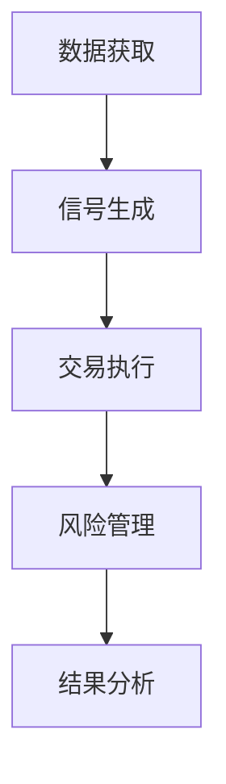

                 

# 如何识别潜在的特价股票机会

> 关键词：股票分析、技术分析、基本面分析、机器学习、股票交易策略、数据挖掘

> 摘要：本文将详细探讨如何识别潜在的特价股票机会。通过结合技术分析和基本面分析，利用机器学习算法和数据分析技术，帮助投资者制定科学的股票交易策略。文章内容涵盖特价股票的基本概念、影响因素、数据收集与处理、特征工程、模型构建与训练、策略制定与回测、风险管理等方面，旨在为投资者提供一套系统化的解决方案。

---

## 第一部分：特价股票识别的基本概念与背景

### 第1章：特价股票的基本概念

#### 1.1 什么是特价股票
特价股票是指在特定市场条件下，价格出现大幅波动或异常变化的股票。这些波动可能由市场供需失衡、公司公告、宏观经济变化等多种因素引发。

#### 1.2 特价股票的类型
- **短期波动型**：短时间内价格急剧上涨或下跌，通常由市场情绪或突发事件引发。
- **价值回归型**：价格因市场误判而偏离其真实价值，随后回归。
- **趋势延续型**：价格在一定趋势下突破关键阻力位，出现持续性上涨或下跌。

#### 1.3 特价股票的特点
- **高波动性**：价格波动剧烈，短期内可能出现较大的涨幅或跌幅。
- **低流动性**：部分特价股票交易量较小，市场深度不足。
- **高风险性**：价格波动带来的收益和风险并存，投资者需谨慎操作。

#### 1.4 投资者的误解与误区
- **误区一**：以为所有波动大的股票都是特价股票。
- **误区二**：忽视基本面因素，仅依赖技术指标进行交易。

### 第2章：影响特价股票价格的因素

#### 2.1 市场供需关系
- **市场情绪**：投资者情绪波动影响股票价格。
- **市场流动性**：流动性不足可能导致价格异常波动。

#### 2.2 公司基本面分析
- **财务状况**：公司盈利能力、资产负债情况等。
- **经营状况**：公司业务模式、市场竞争力等。

#### 2.3 宏观经济环境
- **经济周期**：经济繁荣或衰退对股票价格的影响。
- **政策变化**：政府政策调整对市场的影响。

### 第3章：技术分析与基本面分析的对比

#### 3.1 技术分析
- **定义**：通过分析历史价格和成交量数据，预测未来价格走势。
- **常用指标**：K线图、均线、MACD、RSI等。

#### 3.2 基本面分析
- **定义**：通过分析公司的财务报表、行业地位等基本面因素，评估股票的内在价值。
- **优势**：适合长期投资者，注重公司长期发展潜力。

#### 3.3 对比与结合
- **对比**：技术分析注重短期价格波动，基本面分析注重长期价值。
- **结合**：结合两者可以制定更科学的投资策略。

---

## 第二部分：数据收集与处理

### 第4章：数据来源与清洗

#### 4.1 数据来源
- **股票数据**：包括开盘价、收盘价、最高价、最低价、成交量等。
- **财务数据**：包括收入、利润、资产负债表等。
- **市场数据**：包括市场指数、宏观经济指标等。

#### 4.2 数据清洗
- **缺失值处理**：使用均值、中位数或插值法填补缺失值。
- **异常值处理**：识别并处理异常值，确保数据准确性。

### 第5章：数据预处理与特征工程

#### 5.1 特征提取
- **技术指标**：如RSI、MACD、布林带等。
- **市场情绪指标**：如波动率、市场成交额等。
- **公司基本面指标**：如市盈率、市净率、ROE等。

#### 5.2 特征选择
- **重要性评估**：使用特征重要性评分方法（如随机森林特征重要性）。
- **降维处理**：使用主成分分析（PCA）等方法减少特征维度。

---

## 第三部分：模型构建与训练

### 第6章：机器学习算法简介

#### 6.1 常用算法
- **线性回归**：用于预测连续型变量。
- **随机森林**：用于分类和回归问题。
- **支持向量机（SVM）**：用于分类问题。
- **神经网络**：用于复杂非线性问题。

#### 6.2 算法选择
- **根据问题选择算法**：分类问题选择SVM或随机森林，回归问题选择线性回归或神经网络。
- **数据规模与算法复杂度**：大数据量选择随机森林或神经网络，小数据量选择线性回归或SVM。

### 第7章：模型训练与优化

#### 7.1 数据分割
- **训练集、验证集、测试集**：通常按70%、15%、15%的比例分割。

#### 7.2 模型训练
- **训练过程**：使用训练数据训练模型，调整模型参数。
- **交叉验证**：使用k折交叉验证评估模型性能。

#### 7.3 模型优化
- **超参数调优**：使用网格搜索或随机搜索调整模型参数。
- **正则化方法**：使用L1/L2正则化防止过拟合。

---

## 第四部分：策略制定与回测

### 第8章：交易策略设计

#### 8.1 策略类型
- **均值回归策略**：价格偏离均值时买入或卖出。
- **趋势跟踪策略**：价格突破趋势线时顺势交易。
- **事件驱动策略**：基于公司公告或市场事件制定交易策略。

#### 8.2 策略优化
- **参数优化**：调整策略参数（如止损位、止盈位）以提高收益。
- **风险控制**：设置最大仓位、最大回撤等风险控制指标。

### 第9章：策略回测与评估

#### 9.1 回测框架
- **回测步骤**：数据准备、策略实现、结果分析。
- **回测指标**：夏普比率、最大回撤、年化收益等。

#### 9.2 回测结果分析
- **收益与风险**：评估策略的收益和风险 trade-off。
- **稳定性分析**：评估策略在不同市场条件下的表现。

---

## 第五部分：风险管理与系统设计

### 第10章：风险管理策略

#### 10.1 风险管理的重要性
- **控制风险**：避免因市场波动导致的重大损失。
- **保护本金**：确保投资本金的安全。

#### 10.2 风险管理方法
- **止损策略**：设定止损位，避免亏损扩大。
- **分批建仓**：分散投资，降低风险。
- **仓位管理**：根据账户资金和风险承受能力分配仓位。

### 第11章：交易系统架构设计

#### 11.1 系统功能设计
- **数据获取模块**：实时获取股票数据。
- **信号生成模块**：根据模型生成买入或卖出信号。
- **交易执行模块**：根据信号执行交易。
- **风险管理模块**：监控和管理交易风险。

#### 11.2 系统架构图

---

## 第六部分：实战案例分析

### 第12章：案例分析与策略实现

#### 12.1 案例背景
- **数据来源**：某公司股票的历史数据。
- **策略选择**：基于技术分析的均值回归策略。

#### 12.2 实战步骤
1. 数据清洗与特征提取。
2. 模型训练与优化。
3. 策略制定与回测。
4. 风险管理与系统设计。

#### 12.3 结果分析
- **收益与风险**：评估策略的收益和风险。
- **策略稳定性**：分析策略在不同市场环境下的表现。

---

## 第七部分：总结与展望

### 第13章：总结与反思

#### 13.1 核心内容总结
- 特价股票的定义与类型。
- 影响股票价格的主要因素。
- 数据分析与机器学习在股票交易中的应用。

#### 13.2 投资者的注意事项
- 风险控制是投资成功的关键。
- 理解市场机制，避免盲目跟风。

### 第14章：未来展望

#### 14.1 人工智能在股票交易中的应用前景
- 更复杂的模型（如深度学习）的应用。
- 大数据技术的发展对股票交易的影响。

#### 14.2 新技术与新策略
- 结合NLP技术分析市场情绪。
- 结合区块链技术实现透明化交易。

---

通过以上步骤，您可以系统地识别潜在的特价股票机会，并制定科学的交易策略。希望本文对您有所帮助！

