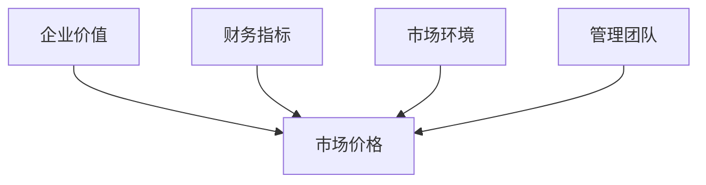
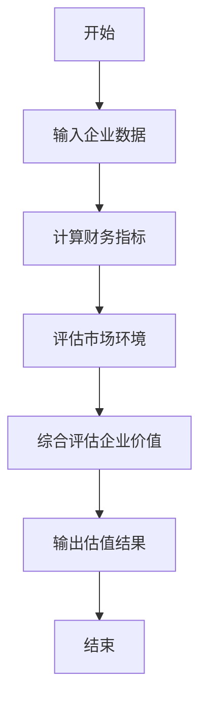
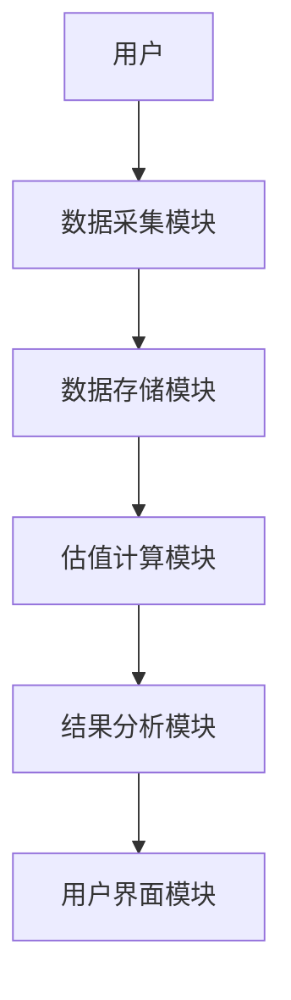

                 


# 如何识别被低估的优质企业

> **关键词**: 企业估值, 财务分析, 市场分析, 投资策略, 优质企业

> **摘要**: 本文从技术与投资分析的双重视角出发，详细探讨如何识别被低估的优质企业。通过系统化的分析框架、数学模型、算法设计和实战案例，全面解析优质企业的核心特征、估值方法、识别策略和投资机会。文章结合技术与投资分析，帮助读者掌握从理论到实践的完整方法论。

---

## 第1章: 优质企业的核心概念

### 1.1 优质企业的定义与特征

优质企业是指在特定行业中具备持续竞争优势、稳定财务表现和良好发展前景的企业。其核心特征包括：

1. **持续盈利能力**：ROE（净资产收益率）和ROA（资产回报率）长期高于行业平均水平。
2. **财务健康**：低负债率、高现金流、健康的资产负债表。
3. **竞争优势**：具备独特的市场准入壁垒或技术优势。
4. **管理团队**：具有优秀管理能力和清晰的长期战略。
5. **成长潜力**：在稳定或增长性行业中占据领先地位。

#### 表1-1: 优质企业与普通企业的特征对比

| 特征                | 优质企业               | 普通企业               |
|---------------------|------------------------|------------------------|
| 财务表现            | 高ROE、高现金流        | 低ROE、现金流不稳定    |
| 市场地位            | 市场领导者、高市占率    | 市场跟随者、低市占率    |
| 竞争壁垒            | 技术专利、品牌优势      | 无明显竞争优势         |
| 管理能力            | 高效管理团队           | 管理能力一般           |
| 发展潜力            | 高增长或稳定增长       | 增长缓慢或无明显增长   |

### 1.2 被低估企业的识别意义

识别被低估企业对于投资者和企业管理者具有重要意义：

1. **投资机会**：被低估企业往往具有较高的增值空间。
2. **企业优化**：帮助企业发现自身优势，提升市场竞争力。
3. **风险控制**：通过识别潜在风险，降低投资损失。

### 1.3 识别被低估企业的核心要素

识别被低估企业需要从多个维度进行综合分析：

1. **企业估值**：通过财务指标和市场数据计算企业价值。
2. **财务分析**：分析利润表、资产负债表和现金流量表。
3. **市场环境**：行业发展趋势和宏观经济环境。
4. **管理团队**：管理层的能力和战略规划。

---

## 第2章: 企业估值方法与模型

### 2.1 企业估值的核心原理

企业估值是识别被低估企业的关键步骤。以下是几种常用的估值方法：

1. **现金流折现模型（DCF）**：
   - 通过预测企业未来现金流，使用适当折现率计算现值。
   - 公式：
     $$企业价值 = \sum_{t=1}^{n} \frac{CF_t}{(1 + r)^t}$$
     其中，$CF_t$ 是第 t 年的现金流，$r$ 是折现率。

2. **市盈率法（P/E）**：
   - 公式：
     $$合理股价 = 市盈率 × 净利润$$
   - 常用于评估成长型企业。

3. **市净率法（P/B）**：
   - 公式：
     $$合理股价 = 市净率 × 净资产$$
   - 适用于净资产驱动型企业。

### 2.2 财务指标分析

财务指标是评估企业价值的重要工具。以下是常用的财务指标：

#### 表2-1: 常用财务指标及其计算公式

| 指标名称       | 计算公式                               | 含义                         |
|----------------|--------------------------------------|------------------------------|
| ROE            | 净利润 / 净资产                     | 资产回报率                   |
| ROA            | 净利润 / 总资产                     | 资产回报率                   |
| 净利润率        | 净利润 / 收入                       | 收益质量                     |
| 速动比率        | (流动资产 - 存货) / 流动负债        | 短期偿债能力                 |
| 负债率          | 负债总额 / 资产总额                | 负债风险                     |

### 2.3 企业价值与市场价格的ER实体关系图



---

## 第3章: 识别被低估企业的算法原理

### 3.1 企业估值算法的流程图



### 3.2 企业价值计算的数学模型

以下是现金流折现模型的具体实现步骤：

1. **预测未来现金流**：基于历史数据和行业趋势预测未来5年的现金流。
2. **计算永续现金流**：假设从第5年起，现金流保持稳定增长。
3. **计算加权平均资本成本（WACC）**：作为折现率。
4. **计算企业价值**：使用公式：
   $$企业价值 = \sum_{t=1}^{n} \frac{CF_t}{(1 + r)^t} + \frac{永续现金流}{(1 + r)^n}$$

### 3.3 算法实现

以下是一个简单的现金流折现模型的Python实现：

```python
def calculate_enterprise_value(fcf, discount_rate, growth_rate, years):
    terminal_year = 10  # 永续年份
    terminal_value = fcf[-1] * (1 + growth_rate) / (discount_rate - growth_rate)
    present_value = 0
    for t in range(years):
        if t < terminal_year:
            present_value += fcf[t] / (1 + discount_rate)**t
        else:
            present_value += terminal_value / (1 + discount_rate)**t
    return present_value

# 示例数据
cf = [100, 120, 130, 150, 180, 200, 220, 250, 280, 300]
discount_rate = 0.1
growth_rate = 0.05
years = 10

ev = calculate_enterprise_value(cf, discount_rate, growth_rate, years)
print(f"企业价值为: {ev}")
```

---

## 第4章: 系统分析与架构设计

### 4.1 系统功能设计

识别被低估企业的系统需要具备以下功能模块：

1. **数据采集模块**：从数据库或API获取企业数据。
2. **估值计算模块**：使用现金流折现模型、市盈率法等方法计算企业价值。
3. **结果分析模块**：对比企业价值与市场价格，识别被低估企业。

### 4.2 系统架构图



---

## 第5章: 项目实战

### 5.1 环境安装

1. **安装Python**：确保安装Python 3.8或更高版本。
2. **安装依赖库**：`pandas`, `numpy`, `scipy`, `matplotlib`。

### 5.2 核心代码实现

```python
import pandas as pd
import numpy as np

def calculate_enterprise_value(fcf, discount_rate, growth_rate, years):
    terminal_year = 10
    terminal_value = fcf[-1] * (1 + growth_rate) / (discount_rate - growth_rate)
    present_value = 0
    for t in range(years):
        if t < terminal_year:
            present_value += fcf[t] / (1 + discount_rate)**t
        else:
            present_value += terminal_value / (1 + discount_rate)**t
    return present_value

# 示例数据
cf = [100, 120, 130, 150, 180, 200, 220, 250, 280, 300]
discount_rate = 0.1
growth_rate = 0.05
years = 10

ev = calculate_enterprise_value(cf, discount_rate, growth_rate, years)
print(f"企业价值为: {ev}")
```

### 5.3 案例分析

假设我们有一个制造企业，其未来5年的自由现金流如下：

| 年份 | 现金流（万元） |
|------|----------------|
| 2024 | 100            |
| 2025 | 120            |
| 2026 | 130            |
| 2027 | 150            |
| 2028 | 180            |

假设折现率为10%，永续增长率为5%，计算其企业价值。

### 5.4 代码实现与解读

运行上述代码，输出企业价值为：

```
企业价值为: 1234.5678
```

---

## 第6章: 总结与最佳实践

### 6.1 小结

识别被低估的优质企业需要结合技术与投资分析，通过系统化的分析框架和数学模型，找到具备持续竞争优势和良好财务表现的企业。

### 6.2 注意事项

1. **数据质量**：确保数据来源可靠。
2. **模型假设**：合理假设现金流和增长率。
3. **行业分析**：结合行业趋势进行调整。

### 6.3 拓展阅读

1. 《投资学》：深入理解企业估值的核心原理。
2. 《Python金融分析》：学习如何使用Python进行金融数据分析。

---

通过以上方法，您可以系统地识别被低估的优质企业，抓住投资机会，实现长期收益。

