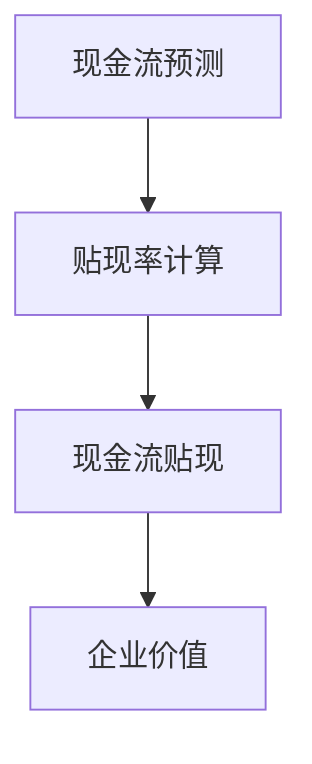
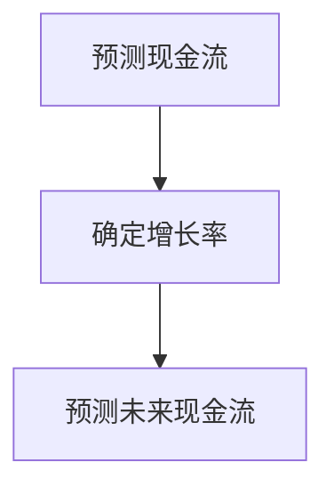
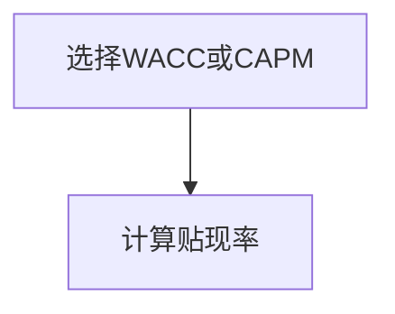
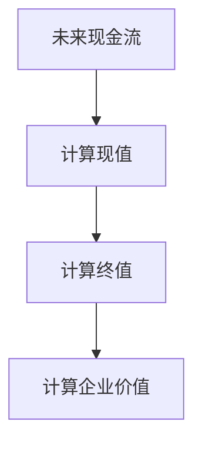

                 


# 如何运用DCF模型进行企业估值

## 关键词：DCF模型, 企业估值, 现金流贴现, 加权平均资本成本, 资本资产定价模型

## 摘要：  
本文将详细介绍如何运用DCF（Discounted Cash Flow，贴现现金流）模型进行企业估值。DCF模型是一种基于未来现金流的贴现方法，广泛应用于企业价值评估。本文将从DCF模型的基本概念出发，逐步讲解其数学基础、系统架构、行业应用及实战案例，帮助读者全面掌握DCF模型的原理和应用方法。文章内容包括背景介绍、核心概念、算法原理、系统架构设计、项目实战和最佳实践等内容，适合对金融分析和企业估值感兴趣的技术人员和投资者阅读。

---

## 第1章: DCF模型概述

### 1.1 DCF模型的基本概念

#### 1.1.1 现金流的概念与重要性  
现金流是企业经营活动中产生的现金流入和流出。现金流分为三类：  
1. **经营活动现金流**：企业日常运营产生的现金流。  
2. **投资活动现金流**：企业投资于资产或处置资产产生的现金流。  
3. **筹资活动现金流**：企业通过融资活动（如贷款、发行股票）产生的现金流。  

现金流是企业价值的核心驱动因素，因为企业价值的本质是未来现金流的现值。

#### 1.1.2 DCF模型的核心思想  
DCF模型的核心思想是：企业价值等于未来自由现金流的现值。公式表示为：  
$$ V = \sum_{t=1}^{n} \frac{CF_t}{(1 + r)^t} + \frac{TV}{(1 + r)^n} $$  
其中：  
- \( V \) 为企业价值  
- \( CF_t \) 为第 \( t \) 年的自由现金流  
- \( r \) 为贴现率  
- \( TV \) 为终值  

DCF模型基于时间价值的原理，将未来现金流折现到当前时点，以反映资金的时间价值。

#### 1.1.3 DCF模型的应用范围与局限性  
- **应用范围**：适用于企业整体估值、项目可行性分析、并购交易定价等场景。  
- **局限性**：  
  - 现金流预测的不确定性较高。  
  - 贴现率的选择具有主观性。  
  - 适用于稳定或增长性明确的企业，对周期性较强的企业效果不佳。  

---

## 第2章: DCF模型的数学基础

### 2.1 现值与终值的计算公式

#### 2.1.1 单笔现金流的现值计算  
单笔现金流的现值公式为：  
$$ PV = \frac{FV}{(1 + r)^t} $$  
其中：  
- \( PV \) 为现值  
- \( FV \) 为终值  
- \( r \) 为贴现率  
- \( t \) 为时间期限  

#### 2.1.2 多笔现金流的现值计算  
多笔现金流的现值公式为：  
$$ PV = \sum_{t=1}^{n} \frac{CF_t}{(1 + r)^t} $$  

#### 2.1.3 终值的计算公式  
终值公式为：  
$$ TV = CF \times (1 + g)^n $$  
其中 \( g \) 为永续增长率为零时的终值。

### 2.2 贴现率的计算方法

#### 2.2.1 WACC（加权平均资本成本）的计算公式  
WACC公式为：  
$$ WACC = w_d \times k_d \times (1 - t) + w_e \times k_e $$  
其中：  
- \( w_d \) 为债务权重  
- \( k_d \) 为债务成本  
- \( t \) 为税率  
- \( w_e \) 为股权权重  
- \( k_e \) 为股权成本  

#### 2.2.2 CAPM（资本资产定价模型）的应用  
CAPM公式为：  
$$ k_e = r_f + \beta \times (r_m - r_f) $$  
其中：  
- \( r_f \) 为无风险利率  
- \( \beta \) 为股票的贝塔系数  
- \( r_m \) 为市场预期回报率  

#### 2.2.3 股权资本成本的估算  
股权资本成本的估算通常基于CAPM或市场法，具体取决于企业的行业特性和数据可得性。

### 2.3 现金流贴现的数学模型

#### 2.3.1 现金流贴现的基本公式  
$$ V = \sum_{t=1}^{n} \frac{CF_t}{(1 + r)^t} + \frac{TV}{(1 + r)^n} $$  

#### 2.3.2 贴现因子的计算  
贴现因子公式为：  
$$ v_t = \frac{1}{(1 + r)^t} $$  

#### 2.3.3 现金流贴现的步骤  
1. 预测未来自由现金流。  
2. 选择合适的贴现率。  
3. 计算未来现金流的现值。  
4. 计算终值的现值。  
5. 将现值和终值现值相加，得到企业价值。  

---

## 第3章: DCF模型的系统架构与流程

### 3.1 DCF模型的系统架构

#### 3.1.1 系统功能模块划分  
- 现金流预测模块：预测企业未来现金流。  
- 贴现率计算模块：计算WACC或CAPM得到贴现率。  
- 现金流贴现模块：计算未来现金流的现值和终值。  
- 输出模块：展示企业价值评估结果。  

#### 3.1.2 模块之间的交互关系  


#### 3.1.3 系统的输入输出设计  
- **输入**：历史财务数据、行业数据、市场数据。  
- **输出**：企业价值、敏感性分析结果、情景分析结果。  

### 3.2 DCF模型的流程图

#### 3.2.1 现金流预测流程  


#### 3.2.2 贴现率计算流程  


#### 3.2.3 现金流贴现流程  


### 3.3 DCF模型的实现步骤

#### 3.3.1 确定企业未来现金流  
- 收入预测：基于历史收入增长率和行业趋势。  
- 成本预测：基于历史成本占比和通胀预期。  
- 自由现金流 = 净收入 - 资本支出。  

#### 3.3.2 估算贴现率  
- 使用WACC：适用于有杠杆的企业。  
- 使用CAPM：适用于无杠杆的企业或单独评估股权价值。  

#### 3.3.3 计算现值  
- 使用公式：$$ PV = \sum_{t=1}^{n} \frac{CF_t}{(1 + r)^t} $$  

#### 3.3.4 确定企业价值  
- $$ V = PV + TV $$  

---

## 第4章: DCF模型的行业应用与案例分析

### 4.1 DCF模型在不同行业的应用

#### 4.1.1 高科技行业的应用特点  
高科技企业通常具有高增长性和高不确定性，DCF模型适合用于长期现金流预测。

#### 4.1.2 制造业的应用特点  
制造业企业通常现金流稳定，适合使用稳定的增长率进行DCF模型分析。

#### 4.1.3 服务业的应用特点  
服务业企业现金流波动较大，DCF模型需要结合情景分析进行调整。

### 4.2 DCF模型的典型案例分析

#### 4.2.1 某公司DCF模型的应用实例  
假设某公司未来5年的自由现金流分别为$100万、$120万、$150万、$180万、$200万，贴现率为8%。  
计算现值：  
$$ PV = \frac{100}{1.08^1} + \frac{120}{1.08^2} + \frac{150}{1.08^3} + \frac{180}{1.08^4} + \frac{200}{1.08^5} $$  
终值假设为$250万，现值为：  
$$ TV_{PV} = \frac{250}{1.08^5} $$  
企业价值为现值和终值现值之和。

#### 4.2.2 案例分析的步骤与结果  
1. 确定现金流预测。  
2. 计算贴现率。  
3. 计算现值和终值现值。  
4. 得出企业价值。  

#### 4.2.3 案例分析的启示  
DCF模型的应用需要结合企业的实际情况，合理预测现金流和选择贴现率。

---

## 第5章: DCF模型的项目实战

### 5.1 环境安装与工具准备

#### 5.1.1 Python环境安装  
安装Python和必要的库（如numpy、pandas、matplotlib）。  

#### 5.1.2 DCF模型实现工具  
- 使用Excel或Python进行现金流贴现计算。  

### 5.2 系统核心实现源代码

#### 5.2.1 现金流预测代码  
```python
import numpy as np

def forecast_cash_flows(revenue, cost, growth_rate, period):
    cash_flows = []
    for i in range(period):
        revenue_i = revenue * (1 + growth_rate)^i
        cost_i = cost * (1 + growth_rate)^i
        cash_flow = revenue_i - cost_i
        cash_flows.append(cash_flow)
    return cash_flows
```

#### 5.2.2 贴现率计算代码  
```python
def calculate_wacc(weights, cost, tax_rate, market_return, beta, risk_free_rate):
    equity_cost = risk_free_rate + beta * (market_return - risk_free_rate)
    wacc = weights * cost * (1 - tax_rate) + weights_equity * equity_cost
    return wacc
```

#### 5.2.3 现金流贴现代码  
```python
def discounted_cash_flows(cash_flows, discount_rate):
    pv = 0
    for t, cf in enumerate(cash_flows):
        pv += cf / (1 + discount_rate)**t
    return pv
```

### 5.3 实际案例分析与解读

#### 5.3.1 案例背景  
某公司未来5年的自由现金流分别为$100万、$120万、$150万、$180万、$200万，贴现率为8%，终值为$250万。  

#### 5.3.2 计算过程  
1. 计算现值：  
$$ PV = \frac{100}{1.08} + \frac{120}{1.08^2} + \frac{150}{1.08^3} + \frac{180}{1.08^4} + \frac{200}{1.08^5} $$  
2. 计算终值现值：  
$$ TV_{PV} = \frac{250}{1.08^5} $$  
3. 企业价值：  
$$ V = PV + TV_{PV} $$  

### 5.4 项目小结  
通过代码实现DCF模型，可以快速计算企业价值，并进行情景分析和敏感性分析。

---

## 第6章: 最佳实践、小结与注意事项

### 6.1 最佳实践  
- 合理预测现金流，避免过度乐观或悲观。  
- 选择合适的贴现率，结合WACC和CAPM进行验证。  
- 进行情景分析，评估企业价值的敏感性。  

### 6.2 小结  
本文详细介绍了DCF模型的原理、数学基础、系统架构和行业应用，并通过实际案例分析展示了模型的应用过程。通过代码实现，读者可以快速掌握DCF模型的核心思想。

### 6.3 注意事项  
- DCF模型的结果依赖于输入假设，需谨慎处理。  
- 在实际应用中，建议结合其他估值方法进行验证。  
- 注意数据的可比性和合理性。  

---

## 总结  
DCF模型是一种强大的企业估值工具，通过合理预测现金流和选择贴现率，可以准确评估企业价值。本文通过理论与实践相结合的方式，帮助读者全面掌握DCF模型的应用方法，为实际工作和研究提供参考。

