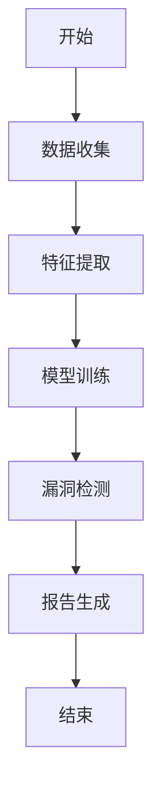
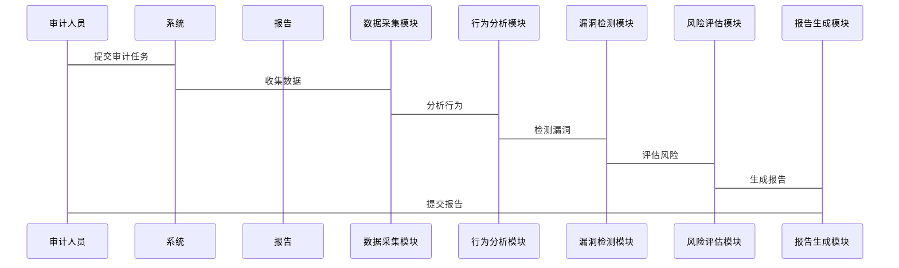

                 


# 安全审计：定期检查AI Agent的安全漏洞

## 关键词：安全审计、AI Agent、漏洞检测、风险评估、系统架构

## 摘要：  
随着AI Agent技术的广泛应用，其潜在的安全漏洞和风险也随之增加。本文从AI Agent的基本概念出发，系统地介绍了安全审计的核心原理、算法模型、系统架构，并通过实际案例分析，深入探讨了AI Agent安全审计的关键步骤和方法。同时，本文还总结了安全审计的最佳实践和未来发展方向，为AI Agent的安全管理和风险控制提供了重要的参考。

---

## 第1章: AI Agent与安全审计概述

### 1.1 AI Agent的基本概念

#### 1.1.1 AI Agent的定义与特点
AI Agent（人工智能代理）是指能够感知环境、执行任务并做出决策的智能实体。它通常具有以下特点：
- **自主性**：能够独立执行任务，无需外部干预。
- **反应性**：能够实时感知环境并做出响应。
- **目标导向性**：以特定目标为导向，优化行为以实现目标。
- **学习能力**：通过数据和经验不断优化自身的决策能力。

#### 1.1.2 安全审计的基本概念
安全审计是对系统或过程的安全性进行全面检查，以发现潜在漏洞、评估风险并提出改进建议。安全审计的核心目标是确保系统的安全性和合规性。

#### 1.1.3 AI Agent与安全审计的核心联系
AI Agent的安全审计旨在检测其潜在的安全漏洞，评估其行为是否符合预期，确保其在运行过程中不会引发安全风险。这种审计不仅是对AI Agent本身的检查，也是对其使用环境和交互对象的全面评估。

---

### 1.2 安全审计的背景与重要性

#### 1.2.1 当前AI Agent的安全风险
随着AI Agent在各个领域的广泛应用，其潜在风险也逐渐显现：
- **数据泄露**：AI Agent可能因为不当配置或漏洞导致敏感数据泄露。
- **模型后门**：恶意训练数据可能导致AI Agent在特定情况下执行恶意操作。
- **对抗攻击**：攻击者可以通过对抗样本欺骗AI Agent，使其做出错误决策。

#### 1.2.2 安全审计的必要性
AI Agent的安全审计是确保其安全运行的关键步骤。通过定期审计，可以及时发现和修复漏洞，降低安全风险，保障系统的稳定性和可靠性。

#### 1.2.3 安全审计的边界与外延
安全审计的边界包括AI Agent的算法、数据、接口和行为。其外延则涉及与AI Agent交互的环境、用户和第三方服务。

---

### 1.3 安全审计的核心要素

#### 1.3.1 安全审计的目标
- 确保AI Agent的行为符合预期。
- 发现并修复潜在的安全漏洞。
- 评估AI Agent的安全性，提出改进建议。

#### 1.3.2 安全审计的流程
1. **规划阶段**：明确审计目标、范围和方法。
2. **实施阶段**：对AI Agent进行全面检查，包括数据、算法、接口和行为。
3. **报告阶段**：总结审计结果，提出改进建议。

#### 1.3.3 安全审计的工具与方法
- **工具**：使用自动化工具进行漏洞扫描和行为分析。
- **方法**：结合人工审查和自动化测试，确保全面覆盖。

---

### 1.4 本章小结
本章介绍了AI Agent的基本概念和安全审计的核心要素，强调了AI Agent安全审计的重要性和必要性。通过明确审计目标和流程，为后续章节的深入分析奠定了基础。

---

## 第2章: 安全审计的核心概念与联系

### 2.1 核心概念原理

#### 2.1.1 AI Agent的行为模型
AI Agent的行为模型描述了其如何感知环境、做出决策并执行操作。常见的行为模型包括基于规则的模型和基于学习的模型。

#### 2.1.2 安全审计的原理
安全审计通过检查AI Agent的行为、数据和算法，评估其安全性并发现潜在漏洞。

#### 2.1.3 两者之间的关系
AI Agent的行为模型是安全审计的基础，而安全审计则是确保行为模型符合安全要求的关键手段。

---

### 2.2 概念属性特征对比

#### 2.2.1 AI Agent的属性
| 属性 | 描述 |
|------|------|
| 自主性 | 独立执行任务的能力 |
| 反应性 | 实时感知环境并做出响应的能力 |
| 学习能力 | 通过数据优化决策的能力 |

#### 2.2.2 安全审计的属性
| 属性 | 描述 |
|------|------|
| 完整性 | 确保数据和行为的完整性 |
| 保密性 | 防止敏感信息泄露 |
| 可用性 | 确保系统的可用性和稳定性 |

#### 2.2.3 属性对比分析
通过对比AI Agent和安全审计的属性，可以发现：AI Agent的行为模型是安全审计的核心内容，而安全审计则是确保AI Agent行为符合安全要求的关键手段。

---

### 2.3 ER实体关系图

```mermaid
erDiagram
    actor 审计人员 {
        <属性> 审计目标
        <属性> 审计范围
    }
    agent AI代理 {
        <属性> 代理行为
        <属性> 代理状态
    }
    审计人员 --> 审计目标 : 定义审计范围
    审计目标 --> AI代理 : 监控代理行为
```

---

### 2.4 本章小结
本章通过对比分析AI Agent和安全审计的核心概念，明确了两者之间的关系，并通过ER图展示了实体之间的关系。这些分析为后续章节的安全审计实施提供了理论基础。

---

## 第3章: 安全审计的算法原理

### 3.1 算法原理概述

#### 3.1.1 基于概率的漏洞检测
基于概率的漏洞检测算法通过分析AI Agent行为的异常性，计算其触发漏洞的概率。

#### 3.1.2 基于规则的漏洞识别
基于规则的漏洞识别算法通过预定义的规则，检查AI Agent的行为是否符合安全规范。

#### 3.1.3 基于机器学习的漏洞预测
基于机器学习的漏洞预测算法通过训练模型，预测AI Agent可能存在的漏洞。

---

### 3.2 算法流程图



---

### 3.3 算法实现细节

#### 3.3.1 基于概率的漏洞检测
公式：$$ P(\text{漏洞}) = \frac{\text{异常行为次数}}{\text{总行为次数}} $$

#### 3.3.2 基于规则的漏洞识别
规则示例：
- 如果AI Agent访问了未经授权的接口，则标记为漏洞。
- 如果AI Agent的响应时间超过阈值，则标记为漏洞。

#### 3.3.3 基于机器学习的漏洞预测
训练模型使用的历史数据包括：
- AI Agent的行为日志
- 系统日志
- 网络流量数据

---

### 3.4 本章小结
本章详细介绍了安全审计的算法原理，包括基于概率、规则和机器学习的漏洞检测方法，并通过流程图展示了算法的整体流程。这些算法为后续的安全审计实施提供了技术支持。

---

## 第4章: AI Agent的漏洞分析与风险评估

### 4.1 漏洞类型分析

#### 4.1.1 数据泄露
- 数据泄露可能导致敏感信息被窃取。

#### 4.1.2 模型后门
- 模型后门可能导致AI Agent在特定情况下执行恶意操作。

#### 4.1.3 对抗攻击
- 对抗攻击可能导致AI Agent做出错误决策。

---

### 4.2 漏洞分析方法

#### 4.2.1 行为分析
通过分析AI Agent的行为日志，发现异常行为。

#### 4.2.2 数据分析
通过分析AI Agent的数据输入和输出，发现潜在漏洞。

#### 4.2.3 模型分析
通过分析AI Agent的模型结构，发现潜在后门。

---

### 4.3 风险评估模型

公式：$$ R = \sum_{i=1}^{n} P_i \times I_i $$  
其中，$$ R $$ 是风险值，$$ P_i $$ 是漏洞出现的概率，$$ I_i $$ 是漏洞的影响程度。

---

### 4.4 本章小结
本章通过分析AI Agent的常见漏洞类型，提出了漏洞分析方法，并通过风险评估模型量化了漏洞的影响。这些分析为后续的安全审计实施提供了理论依据。

---

## 第5章: 安全审计的系统架构与实现

### 5.1 系统架构设计


---

### 5.2 系统实现细节

#### 5.2.1 数据采集模块
- 数据来源：AI Agent的行为日志、系统日志、网络流量数据。
- 数据格式：结构化数据，便于后续处理。

#### 5.2.2 行为分析模块
- 分析方法：基于规则和基于机器学习的分析。
- 工具支持：使用Python的scikit-learn库进行机器学习分析。

#### 5.2.3 漏洞检测模块
- 检测方法：概率模型和规则引擎结合。
- 工具支持：使用开源工具如ELK进行日志分析。

#### 5.2.4 风险评估模块
- 评估方法：基于概率的风险评估模型。
- 工具支持：使用Python的pandas库进行数据分析。

#### 5.2.5 报告生成模块
- 报告内容：漏洞列表、风险评估结果、改进建议。
- 工具支持：使用Markdown生成报告。

---

### 5.3 系统交互流程



---

### 5.4 本章小结
本章详细介绍了安全审计系统的架构设计和实现细节，包括数据采集、行为分析、漏洞检测和风险评估模块的实现。通过系统的交互流程图，展示了整个审计过程的流程。

---

## 第6章: 安全审计的项目实战

### 6.1 项目背景

#### 6.1.1 项目介绍
某AI客服系统，每天处理数百万次用户请求，可能存在数据泄露和对抗攻击的风险。

---

### 6.2 项目实施

#### 6.2.1 环境搭建
- 操作系统：Linux
- 开发工具：Python、Jupyter Notebook
- 数据库：MongoDB
- 三方库：scikit-learn、pandas、ELK

#### 6.2.2 核心代码实现

```python
# 数据采集模块
import logging
import json

def collect_data():
    # 采集AI Agent的行为日志
    with open('agent_log.json', 'r') as f:
        logs = json.load(f)
    return logs

# 行为分析模块
from sklearn.ensemble import RandomForestClassifier

def behavior_analysis(logs):
    # 特征提取
    features = [log['feature'] for log in logs]
    labels = [log['label'] for log in logs]
    # 训练模型
    model = RandomForestClassifier()
    model.fit(features, labels)
    return model

# 漏洞检测模块
from sklearn.metrics import accuracy_score

def vulnerability_detection(model, new_logs):
    # 预测行为
    predictions = model.predict([new_log['feature'] for new_log in new_logs])
    # 计算准确率
    accuracy = accuracy_score([new_log['label'] for new_log in new_logs], predictions)
    return accuracy

# 风险评估模块
def risk_assessment(accuracy):
    if accuracy < 0.8:
        return '高风险'
    elif accuracy < 0.9:
        return '中风险'
    else:
        return '低风险'
```

---

### 6.3 案例分析

#### 6.3.1 案例背景
某次审计中发现，AI Agent在处理特定类型的数据时，准确率显著下降，可能存在数据泄露风险。

#### 6.3.2 案例分析
通过行为分析模块，发现AI Agent在处理敏感数据时，存在异常行为。漏洞检测模块发现，准确率下降可能导致数据泄露。风险评估模块评估为高风险。

---

### 6.4 项目小结
本章通过实际案例分析，展示了安全审计系统的实施过程和效果。通过代码实现和案例分析，验证了系统的可行性和有效性。

---

## 第7章: 安全审计的最佳实践与未来展望

### 7.1 最佳实践

#### 7.1.1 定期审计
建议定期对AI Agent进行安全审计，确保其安全性和合规性。

#### 7.1.2 使用工具
使用自动化工具提高审计效率，同时结合人工审查确保全面覆盖。

#### 7.1.3 建立团队
组建专业的安全审计团队，确保审计工作的专业性和深度。

---

### 7.2 小结

#### 7.2.1 注意事项
- 安全审计的频率和深度应根据AI Agent的使用场景和风险级别动态调整。
- 在审计过程中，应注重隐私保护，避免泄露敏感信息。

#### 7.2.2 拓展阅读
- 《AI安全：从算法到系统》
- 《网络安全审计实战》

---

### 7.3 未来展望

随着AI技术的不断发展，AI Agent的安全审计将更加复杂和挑战性。未来的研究方向包括：
- **智能化审计**：利用AI技术提高审计效率和准确性。
- **实时监控**：实现对AI Agent的实时监控和动态审计。
- **跨领域应用**：将安全审计技术应用到更多领域，如金融、医疗等。

---

## 第8章: 总结

通过本文的详细分析，我们了解了AI Agent安全审计的核心原理、算法模型和系统架构。同时，通过实际案例分析和最佳实践的总结，我们为AI Agent的安全管理和风险控制提供了重要的参考。未来，随着AI技术的不断发展，安全审计将变得更加重要，我们需要持续关注和研究，确保AI Agent的安全性和可靠性。

--- 

感谢您的耐心阅读！如果需要进一步的技术支持或详细解读，请随时联系我。

