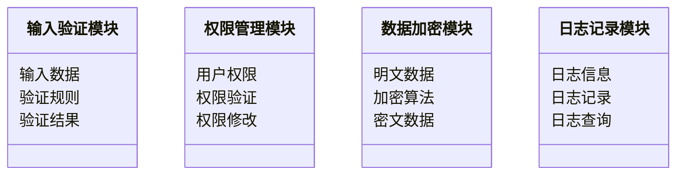
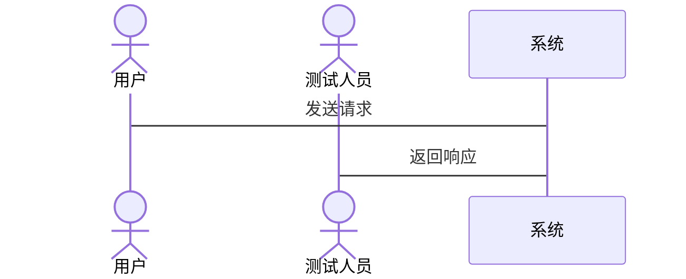

                 


# 安全性测试：防范AI Agent的潜在风险

> 关键词：AI Agent, 安全性测试, 潜在风险, 对抗攻击, 安全防御, 风险建模

> 摘要：本文详细探讨了AI Agent的安全性测试方法，分析了其潜在风险，并提出了防范策略。通过构建测试框架、分析风险模型、讲解算法原理、设计系统架构以及实战案例，全面阐述了如何有效进行AI Agent的安全性测试，确保AI系统的安全性和可靠性。

---

## 第1章: AI Agent的基本概念与安全性测试的必要性

### 1.1 AI Agent的基本概念与核心特征

#### 1.1.1 AI Agent的定义与分类
AI Agent（人工智能代理）是指具有感知环境、自主决策、执行任务能力的智能实体。根据功能和应用场景的不同，AI Agent可以分为以下几类：
- **简单反射型AI Agent**：基于预设规则执行任务，适用于简单的决策场景。
- **基于模型的AI Agent**：利用内部状态和环境模型进行决策，适用于复杂任务。
- **基于学习的AI Agent**：通过机器学习算法不断优化行为策略，适用于动态环境。

#### 1.1.2 AI Agent的核心特征
AI Agent的核心特征包括：
- **自主性**：能够在无外部干预的情况下执行任务。
- **反应性**：能够实时感知环境并做出响应。
- **目标导向性**：具有明确的目标，并根据目标调整行为。
- **学习能力**：能够通过数据和经验不断优化自身性能。

#### 1.1.3 AI Agent的应用场景
AI Agent广泛应用于以下场景：
- 智能客服：提供自动化的客户支持服务。
- 自动驾驶：通过AI Agent实现车辆的自主决策。
- 智能推荐系统：根据用户行为推荐相关内容。

### 1.2 安全性测试的基本概念

#### 1.2.1 安全性测试的定义
安全性测试是指通过各种方法验证系统在面对潜在威胁和攻击时的防护能力，确保系统在异常情况下仍能正常运行。

#### 1.2.2 安全性测试的目标与范围
安全性测试的目标包括：
- 检测系统的安全漏洞。
- 验证系统在异常情况下的稳定性。
- 确保系统数据的机密性、完整性和可用性。

安全性测试的范围涵盖：
- 系统输入验证。
- 权限管理。
- 数据加密与解密。
- 网络通信安全。

#### 1.2.3 安全性测试的流程与方法
安全性测试的流程通常包括：
1. **需求分析**：明确测试目标和范围。
2. **测试用例设计**：根据需求设计测试场景。
3. **测试执行**：按照测试用例执行测试。
4. **结果分析**：分析测试结果，找出潜在问题。
5. **问题修复与验证**：修复问题并进行验证。

### 1.3 AI Agent潜在风险的背景分析

#### 1.3.1 AI Agent的潜在风险概述
AI Agent在实际应用中面临多种潜在风险，包括：
- **模型滥用风险**：恶意用户可能利用AI Agent进行非法活动。
- **数据泄露风险**：敏感数据可能被未经授权的第三方获取。
- **系统漏洞风险**：系统可能存在未被发现的安全漏洞。

#### 1.3.2 AI Agent风险的典型案例分析
典型案例包括：
- 智能客服系统被攻击者利用进行垃圾信息传播。
- 自动驾驶系统因传感器漏洞导致交通事故。
- 智能推荐系统因算法漏洞泄露用户隐私。

#### 1.3.3 安全性测试在AI Agent中的重要性
安全性测试是确保AI Agent系统安全运行的关键步骤。通过安全性测试，可以及时发现和修复系统漏洞，降低潜在风险，保障系统的安全性和可靠性。

---

## 第2章: AI Agent的安全性测试框架

### 2.1 安全性测试框架的构建

#### 2.1.1 测试目标的设定
测试目标包括：
- 检测AI Agent是否存在潜在漏洞。
- 验证AI Agent在异常情况下的稳定性。
- 确保AI Agent的行为符合预期。

#### 2.1.2 测试范围的界定
测试范围涵盖：
- 输入数据的合法性验证。
- 系统接口的安全性测试。
- 数据存储与传输的安全性。

#### 2.1.3 测试方法的选择
测试方法包括：
- **黑盒测试**：不考虑系统内部结构，仅测试系统外部接口。
- **白盒测试**：考虑系统内部结构，测试系统内部逻辑。
- **灰盒测试**：结合黑盒和白盒测试方法。

### 2.2 安全性测试的核心要素

#### 2.2.1 测试用例的设计
测试用例应包括：
- **正常场景测试**：验证系统在正常情况下的行为。
- **异常场景测试**：验证系统在异常情况下的行为。
- **边界条件测试**：验证系统在边界条件下的行为。

#### 2.2.2 测试工具的选择与配置
常用的测试工具包括：
- **Selenium**：用于Web应用的自动化测试。
- **JMeter**：用于性能测试。
- **Burp Suite**：用于Web安全测试。

#### 2.2.3 测试结果的分析与报告
测试结果应包括：
- **漏洞报告**：详细记录发现的漏洞及其影响。
- **测试日志**：记录测试过程中的详细信息。
- **修复建议**：提出漏洞修复的具体建议。

### 2.3 AI Agent安全性测试的流程

#### 2.3.1 测试计划的制定
测试计划应包括：
- **测试目标**：明确测试的目标和范围。
- **测试时间表**：制定测试的时间安排。
- **测试资源**：确定测试所需的资源。

#### 2.3.2 测试执行的过程
测试执行包括：
- **测试用例执行**：按照测试用例执行测试。
- **问题记录**：记录测试过程中发现的问题。
- **状态报告**：定期向上级汇报测试进度和问题。

#### 2.3.3 测试结果的评估与改进
测试结果应包括：
- **问题分析**：分析测试结果，找出潜在问题。
- **问题修复**：修复发现的问题。
- **测试复核**：对修复后的系统进行复核测试。

---

## 第3章: AI Agent潜在风险的分析与建模

### 3.1 AI Agent潜在风险的分类

#### 3.1.1 模型滥用风险
模型滥用风险包括：
- **数据泄露**：恶意用户可能利用AI Agent获取敏感数据。
- **算法滥用**：恶意用户可能利用AI Agent进行非法活动。

#### 3.1.2 数据泄露风险
数据泄露风险包括：
- **未经授权的访问**：未经授权的用户可能访问敏感数据。
- **数据篡改**：恶意用户可能篡改系统中的数据。

#### 3.1.3 系统漏洞风险
系统漏洞风险包括：
- **未授权访问**：系统存在未授权访问的漏洞。
- **拒绝服务攻击**：系统可能遭受拒绝服务攻击。

### 3.2 AI Agent风险的数学模型构建

#### 3.2.1 风险评估模型的构建
风险评估模型的构建步骤如下：
1. **风险识别**：识别系统中存在的潜在风险。
2. **风险量化**：量化每个风险的影响程度和发生概率。
3. **风险评估**：综合考虑风险的影响程度和发生概率，评估系统的整体风险。

#### 3.2.2 风险影响程度的量化
风险影响程度可以通过以下公式计算：
$$
\text{风险影响程度} = \text{影响范围} \times \text{影响严重性}
$$

#### 3.2.3 风险发生概率的计算
风险发生概率可以通过以下公式计算：
$$
\text{风险发生概率} = \text{历史数据} \times \text{当前环境}
$$

### 3.3 AI Agent风险的ER实体关系图

```mermaid
er
actor: 测试人员
action: 测试操作
object: AI Agent系统
```

---

## 第4章: AI Agent安全性测试的算法原理

### 4.1 对抗攻击的算法原理

#### 4.1.1 对抗样本的生成方法
对抗样本的生成方法包括：
- **梯度下降法**：通过优化目标函数生成对抗样本。
- **生成对抗网络（GAN）**：通过生成对抗网络生成对抗样本。

#### 4.1.2 黑盒攻击与白盒攻击的对比
黑盒攻击与白盒攻击的对比如下：
- **黑盒攻击**：攻击者仅知道系统的输入输出关系，无法获取系统内部信息。
- **白盒攻击**：攻击者可以获取系统内部信息，能够更好地利用系统漏洞进行攻击。

#### 4.1.3 梯度下降法在对抗攻击中的应用
梯度下降法在对抗攻击中的应用如下：
1. **初始化**：设置初始参数。
2. **计算损失**：计算对抗样本与目标样本的损失。
3. **更新参数**：通过梯度下降更新参数。
4. **生成对抗样本**：生成对抗样本。

### 4.2 安全性防御的算法原理

#### 4.2.1 基于强化学习的防御策略
基于强化学习的防御策略包括：
- **状态空间**：定义系统的状态空间。
- **动作空间**：定义系统的动作空间。
- **奖励函数**：定义奖励函数，指导模型学习最优策略。

#### 4.2.2 基于生成对抗网络的防御机制
基于生成对抗网络的防御机制包括：
- **生成器**：生成对抗样本。
- **判别器**：区分真实样本和对抗样本。
- **损失函数**：定义生成器和判别器的损失函数。

#### 4.2.3 模型鲁棒性的提升方法
模型鲁棒性的提升方法包括：
- **数据增强**：通过数据增强技术提高模型的鲁棒性。
- **正则化**：通过正则化技术提高模型的鲁棒性。
- **集成学习**：通过集成学习技术提高模型的鲁棒性。

### 4.3 安全性测试的算法实现

#### 4.3.1 对抗攻击的Python代码实现
对抗攻击的Python代码实现如下：
```python
def generate_adversarial_example(image, label, model):
    # 初始化对抗样本
    adversarial_image = image.copy()
    # 设置初始扰动
   扰动 = 0.1
    # 迭代优化
    for _ in range(10):
        # 计算梯度
        prediction = model.predict(adversarial_image)
        # 计算损失
        loss = loss_function(label, prediction)
        # 更新扰动
        扰动 += gradient(loss) * learning_rate
        # 更新对抗样本
        adversarial_image += 扰动
    return adversarial_image
```

#### 4.3.2 安全防御的数学模型
安全防御的数学模型如下：
$$
\text{损失函数} = \text{分类损失} + \text{对抗损失}
$$

---

## 第5章: 系统分析与架构设计

### 5.1 系统分析

#### 5.1.1 问题场景介绍
问题场景包括：
- **数据泄露**：系统存在数据泄露风险。
- **模型滥用**：系统存在模型滥用风险。
- **系统漏洞**：系统存在未授权访问漏洞。

#### 5.1.2 项目介绍
项目介绍包括：
- **项目目标**：构建一个安全的AI Agent系统。
- **项目范围**：涵盖系统设计、开发、测试和部署。
- **项目团队**：包括系统架构师、开发人员、测试人员。

### 5.2 系统功能设计

#### 5.2.1 系统功能模块
系统功能模块包括：
- **输入验证模块**：验证输入数据的合法性。
- **权限管理模块**：管理系统的权限。
- **数据加密模块**：对敏感数据进行加密处理。
- **日志记录模块**：记录系统的运行日志。

#### 5.2.2 系统功能模块的ER类图


### 5.3 系统架构设计

#### 5.3.1 系统架构图
系统架构图如下：
```mermaid
rect
系统架构图
```

#### 5.3.2 系统接口设计
系统接口设计包括：
- **输入接口**：接收输入数据。
- **输出接口**：输出处理结果。
- **日志接口**：记录系统日志。

#### 5.3.3 系统交互的序列图
系统交互的序列图如下：


### 5.4 系统实现与测试

#### 5.4.1 系统实现
系统实现包括：
- **代码实现**：实现系统功能模块。
- **测试用例设计**：设计测试用例。
- **测试执行**：执行测试用例。

#### 5.4.2 测试结果与分析
测试结果包括：
- **测试通过率**：测试通过的用例数量。
- **测试失败率**：测试失败的用例数量。
- **问题清单**：测试过程中发现的问题。

---

## 第6章: 项目实战

### 6.1 环境安装与配置

#### 6.1.1 环境需求
环境需求包括：
- **操作系统**：Linux/Windows/MacOS。
- **开发工具**：PyCharm/VS Code。
- **依赖库**：TensorFlow、Keras、Scikit-learn。

#### 6.1.2 安装步骤
安装步骤包括：
1. 安装Python。
2. 安装必要的依赖库。
3. 配置开发环境。

### 6.2 系统核心实现

#### 6.2.1 核心代码实现
核心代码实现包括：
```python
def test_security():
    # 初始化系统
    system = AISystem()
    # 初始化测试用例
    test_cases = generate_test_cases()
    # 执行测试
    for case in test_cases:
        # 执行测试
        result = system.execute_case(case)
        # 验证结果
        assert result == expected_result, f"测试用例 {case} 失败"
    print("所有测试用例通过")
```

#### 6.2.2 代码解读与分析
代码解读与分析包括：
- **系统初始化**：初始化AI Agent系统。
- **测试用例生成**：生成测试用例。
- **测试执行**：执行测试用例。
- **结果验证**：验证测试结果。

### 6.3 测试结果与分析

#### 6.3.1 测试结果
测试结果包括：
- **测试通过率**：测试通过的用例数量。
- **测试失败率**：测试失败的用例数量。
- **问题清单**：测试过程中发现的问题。

#### 6.3.2 问题修复与验证
问题修复与验证包括：
- **问题定位**：定位问题的根本原因。
- **问题修复**：修复发现的问题。
- **测试复核**：对修复后的系统进行复核测试。

### 6.4 小结
通过项目实战，我们可以更好地理解AI Agent安全性测试的实施过程。从环境配置到代码实现，再到测试执行和结果分析，每一步都需要仔细操作和认真对待。

---

## 第7章: 最佳实践与总结

### 7.1 最佳实践

#### 7.1.1 测试工具推荐
推荐的测试工具包括：
- **Selenium**：用于Web应用的自动化测试。
- **JMeter**：用于性能测试。
- **Burp Suite**：用于Web安全测试。

#### 7.1.2 测试策略制定
测试策略包括：
- **持续集成**：将安全性测试集成到开发流程中。
- **自动化测试**：通过自动化测试提高测试效率。
- **定期复测**：定期对系统进行复测，确保系统的安全性。

### 7.2 小结

#### 7.2.1 项目总结
通过本项目的实施，我们掌握了AI Agent安全性测试的实施方法，了解了系统的潜在风险，并提出了有效的防范策略。

#### 7.2.2 注意事项
在实施安全性测试时，需要注意以下几点：
- **测试用例的全面性**：确保测试用例覆盖所有可能的场景。
- **测试工具的选择**：选择合适的测试工具，提高测试效率。
- **测试结果的分析**：认真分析测试结果，找出潜在问题。

### 7.3 拓展阅读

#### 7.3.1 相关书籍
推荐的书籍包括：
- 《人工智能：一种现代的方法》
- 《软件测试的艺术》
- 《安全测试：原理与实践》

#### 7.3.2 技术博客与资源
推荐的技术博客和资源包括：
- [Tech Blog](https://techblog.example.com)
- [GitHub资源](https://github.com/author/repo)

---

通过以上步骤，我们可以系统地进行AI Agent的安全性测试，确保系统的安全性和可靠性。希望本文能为读者提供有价值的参考和指导。

