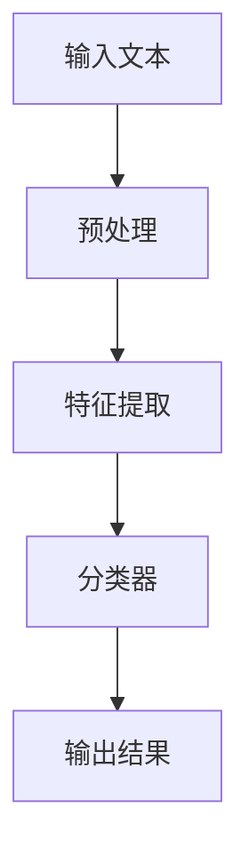
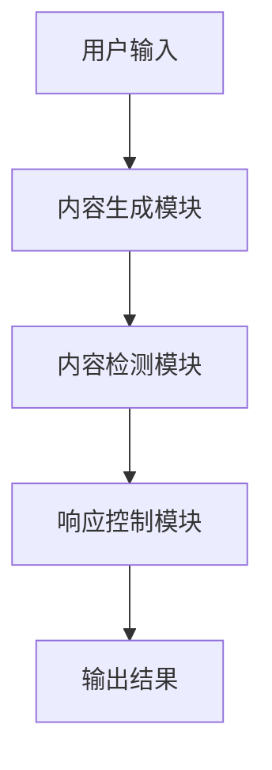

                 


# 安全性考虑：防止AI Agent产生有害内容

> 关键词：AI Agent, 有害内容, 内容审核, 安全设计, 伦理对齐, 系统架构

> 摘要：AI Agent在现代应用中扮演着越来越重要的角色，但它们也可能生成有害内容，带来严重的伦理和安全风险。本文从AI Agent的内容生成机制入手，详细分析了有害内容的检测与控制方法，探讨了模型安全设计和系统架构优化的策略，并通过实际案例展示了如何构建一个安全的内容审核系统。文章内容涵盖技术背景、算法原理、系统设计、项目实战等多个方面，为读者提供全面的解决方案。

---

## 第一部分: 安全性考虑背景与核心概念

### 第1章: AI Agent与有害内容的背景介绍

#### 1.1 问题背景

##### 1.1.1 AI Agent的定义与核心功能
AI Agent（人工智能代理）是指能够感知环境、执行任务并做出决策的智能实体。它通过自然语言处理（NLP）、机器学习（ML）等技术，能够理解和生成人类语言，广泛应用于聊天机器人、智能助手、内容生成等领域。

##### 1.1.2 有害内容的定义与分类
有害内容是指那些可能对个人或社会造成负面影响的信息，包括但不限于诽谤、色情、暴力、仇恨言论、虚假信息等。根据内容的性质和目标，有害内容可以分为直接伤害型、误导型和煽动型。

##### 1.1.3 AI Agent生成有害内容的潜在风险
AI Agent生成有害内容可能导致以下问题：
- **伦理风险**：传播虚假信息，破坏社会稳定。
- **法律风险**：触犯相关法律法规，导致企业责任。
- **用户体验风险**：影响用户信任，损害品牌形象。

#### 1.2 核心概念

##### 1.2.1 AI Agent的内容生成机制
AI Agent的内容生成基于大模型的训练，通常采用循环神经网络（RNN）或Transformer架构。模型通过学习海量数据，生成与上下文相关的文本。

##### 1.2.2 有害内容的判定标准
判定有害内容的标准包括：
- **语义分析**：内容是否具有攻击性、歧视性或误导性。
- **意图识别**：内容是否旨在造成伤害或引起负面反应。
- **上下文关联**：内容是否在特定场景下可能引发不良后果。

##### 1.2.3 安全性考虑的核心要素
安全性考虑的核心要素包括：
- **内容生成的约束机制**：限制模型生成有害内容的能力。
- **内容审核的技术手段**：通过算法检测和人工审核双重保障。
- **系统的容错与恢复机制**：确保系统在出现有害内容时能够快速响应和修复。

#### 1.3 技术挑战与解决方案

##### 1.3.1 当前AI Agent技术的局限性
AI Agent在内容生成时可能存在以下问题：
- **模型偏见**：训练数据中的偏见可能导致生成有害内容。
- **生成不可控性**：模型可能生成不符合预期的内容。
- **计算资源限制**：实时检测和控制需要大量计算资源。

##### 1.3.2 安全性考虑的必要性
随着AI Agent的广泛应用，确保其生成内容的安全性变得尤为重要。安全性考虑能够有效降低风险，保护用户和企业的利益。

##### 1.3.3 问题解决的初步思路
初步解决思路包括：
- **强化模型伦理对齐**：在训练过程中加入伦理约束。
- **部署多层内容审核机制**：结合算法检测和人工审核。
- **建立快速响应机制**：及时发现并处理有害内容。

---

## 第二部分: AI Agent的内容生成机制分析

### 第2章: AI Agent的内容生成机制分析

#### 2.1 AI Agent的内容生成原理

##### 2.1.1 大模型的训练机制
大模型通常采用监督学习和无监督学习相结合的方式进行训练。监督学习通过标记数据优化模型性能，无监督学习通过海量未标记数据提升模型泛化能力。

##### 2.1.2 内容生成的算法流程
内容生成的流程包括：
1. 输入处理：将输入文本转换为模型可处理的形式。
2. 模型推理：通过生成模型输出候选文本。
3. 后处理：对生成内容进行格式化和优化。

##### 2.1.3 模型的输出特点
AI Agent生成的内容通常具有以下特点：
- **相关性**：内容与输入上下文高度相关。
- **多样性**：能够生成多种表达方式。
- **可解释性**：部分模型生成过程可追溯。

#### 2.2 内容生成的关键技术

##### 2.2.1 自然语言处理技术
NLP技术是AI Agent内容生成的核心，包括文本分割、词向量表示、句法分析等。

##### 2.2.2 文本生成模型的优化方法
文本生成模型的优化方法包括：
- **损失函数优化**：采用交叉熵损失函数。
- **生成策略优化**：采用贪心策略或随机采样策略。
- **模型调优**：通过超参数调整提升生成质量。

##### 2.2.3 内容生成的多样性与一致性
为了平衡生成内容的多样性和一致性，可以采用以下方法：
- **温度参数调节**：通过调整温度参数控制生成的多样性和平滑度。
- **重复检测**：防止生成重复内容。

#### 2.3 内容生成的潜在风险

##### 2.3.1 有害内容的生成场景
有害内容的生成场景包括：
- **恶意输入**：用户故意输入引导生成有害内容。
- **模型误判**：模型误将中性内容判定为有害。
- **数据偏差**：训练数据中的偏差导致生成有害内容。

##### 2.3.2 内容生成的不可控性
内容生成的不可控性主要体现在：
- **模型的黑箱特性**：难以完全理解模型的决策过程。
- **训练数据的影响**：训练数据中的有害信息可能被模型学习。

##### 2.3.3 模型的偏见与误导性
模型的偏见可能导致生成的内容带有主观性和误导性，例如在某些领域生成具有偏见的观点。

---

## 第三部分: AI Agent有害内容的检测与控制

### 第3章: AI Agent内容检测的算法原理

#### 3.1 内容检测的核心算法

##### 3.1.1 基于监督学习的检测方法
监督学习通过标记数据训练分类器，能够准确检测有害内容。常用算法包括支持向量机（SVM）、随机森林和深度学习模型（如CNN、RNN）。

##### 3.1.2 基于无监督学习的检测方法
无监督学习适用于检测未知类型的有害内容。常用算法包括聚类分析和异常检测。

##### 3.1.3 基于强化学习的检测方法
强化学习通过奖励机制训练检测模型，能够动态适应有害内容的变化。

##### 3.1.4 基于生成对抗网络的检测方法
生成对抗网络（GAN）可以用于检测有害内容，通过生成对抗样本提高检测器的鲁棒性。

#### 3.2 算法实现的流程图

##### 3.2.1 监督学习检测流程图


##### 3.2.2 随机森林分类器实现
```python
from sklearn.ensemble import RandomForestClassifier
from sklearn.feature_extraction.text import TfidfVectorizer

# 数据准备
X = [...]  # 文本数据
y = [...]  # 标签（0：正常，1：有害）

# 特征提取
vectorizer = TfidfVectorizer()
X_features = vectorizer.fit_transform(X)

# 模型训练
clf = RandomForestClassifier()
clf.fit(X_features, y)

# 预测
new_text = [...]  # 新文本
new_features = vectorizer.transform([new_text])
predicted = clf.predict(new_features)
```

#### 3.3 检测算法的数学模型

##### 3.3.1 逻辑回归模型
$$ P(y=1|x) = \frac{e^{w \cdot x + b}}{1 + e^{w \cdot x + b}} $$

##### 3.3.2 支持向量机模型
$$ \text{目标函数} = \frac{1}{2}||w||^2 + C \sum_{i=1}^{n} \max(0, 1 - y_i(w \cdot x_i + b)) $$

---

## 第四部分: AI Agent有害内容的安全性设计与实现

### 第4章: AI Agent有害内容的安全性设计

#### 4.1 模型层面的安全性考虑

##### 4.1.1 内容生成的约束机制
通过设置生成规则，例如：
- 禁止生成包含特定关键词的内容。
- 限制生成内容的长度和复杂度。

##### 4.1.2 模型的伦理对齐
在模型训练中加入伦理对齐的约束，例如：
- 在损失函数中加入伦理对齐项。
- 使用对抗训练优化模型的伦理表现。

#### 4.2 系统层面的安全性保障

##### 4.2.1 系统架构的安全设计
系统架构采用分层设计，包括：
- **前端层**：接收用户输入并进行初步过滤。
- **中间层**：负责内容生成和检测。
- **后端层**：存储数据并处理结果。

##### 4.2.2 数据安全与隐私保护
采用数据脱敏技术，确保用户数据的安全性。例如：
- 使用哈希函数对敏感信息进行处理。
- 采用加密技术保护数据传输。

##### 4.2.3 系统的容错与恢复机制
建立容错机制，如：
- 实时监控系统状态，发现异常立即报警。
- 设计备份机制，确保系统能够快速恢复。

---

## 第五部分: 项目实战

### 第5章: 构建一个AI内容安全系统

#### 5.1 项目介绍

##### 5.1.1 项目目标
构建一个能够实时检测和控制AI Agent生成有害内容的系统。

##### 5.1.2 项目需求
- 实时内容生成。
- 高效内容检测。
- 快速响应机制。

#### 5.2 系统设计

##### 5.2.1 系统功能设计
- **内容生成模块**：负责生成候选内容。
- **内容检测模块**：负责检测有害内容。
- **响应控制模块**：负责处理检测结果。

##### 5.2.2 系统架构设计


#### 5.3 核心代码实现

##### 5.3.1 环境配置
```python
# 安装依赖
pip install transformers scikit-learn
```

##### 5.3.2 内容生成模块
```python
from transformers import AutoTokenizer, AutoModelForCausalLM

model_name = "gpt2"
tokenizer = AutoTokenizer.from_pretrained(model_name)
model = AutoModelForCausalLM.from_pretrained(model_name)

def generate_content(prompt):
    inputs = tokenizer.encode(prompt, return_tensors="pt")
    outputs = model.generate(inputs, max_length=50)
    return tokenizer.decode(outputs[0], skip_special_tokens=True)
```

##### 5.3.3 内容检测模块
```python
from sklearn.feature_extraction.text import TfidfVectorizer
from sklearn.svm import SVC

# 数据准备
X_train = [...]  # 训练文本
y_train = [...]  # 标签

# 特征提取
vectorizer = TfidfVectorizer()
X_train_features = vectorizer.fit_transform(X_train)

# 模型训练
clf = SVC()
clf.fit(X_train_features, y_train)

# 预测
def detect有害内容(text):
    features = vectorizer.transform([text])
    return clf.predict(features)[0]
```

#### 5.4 项目总结与优化

##### 5.4.1 测试与优化
- **测试覆盖率**：确保所有可能的有害内容都被检测到。
- **性能优化**：提升检测速度和准确率。

##### 5.4.2 实际案例分析
通过具体案例分析，验证系统的有效性和鲁棒性。

---

## 第六部分: 总结与展望

### 第6章: 总结与展望

#### 6.1 总结
本文详细探讨了AI Agent生成有害内容的检测与控制方法，从技术背景、算法原理到系统设计和项目实战，为读者提供了全面的解决方案。

#### 6.2 未来的技术方向
未来的技术方向包括：
- **更强大的内容生成模型**：如GPT-4和PaLM。
- **更智能的内容检测算法**：如基于深度学习的实时检测。
- **更高效的伦理对齐方法**：如使用强化学习优化模型的伦理表现。

#### 6.3 最佳实践 tips
- **多层防御机制**：结合算法检测和人工审核。
- **实时监控**：确保系统能够快速响应。
- **持续优化**：根据反馈不断优化模型和检测算法。

---

通过以上内容，我们全面探讨了AI Agent生成有害内容的检测与控制方法，希望为相关领域的研究和实践提供有价值的参考。

